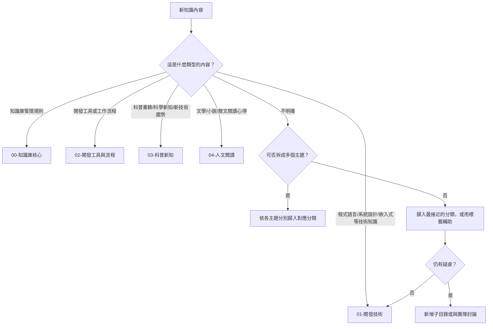

# 目錄結構與分類標準

本文件定義 `doc/` 目錄下的完整分類架構，作為知識歸檔的依據。

---

## 目錄總覽

```
doc/
├── 00-知識庫核心/                 # 管理規則、分類標準等元文件
├── 01-開發技術/                   # 程式語言、嵌入式開發、系統設計等
│   ├── 程式語言/                  # Python、Bash 等語言技巧
│   │   ├── Python/
│   │   └── Bash/
│   ├── 嵌入式開發/                # MCU、RTOS、韌體、Linux 核心
│   │   ├── Linux核心/
│   │   ├── Build系統/
│   │   │   ├── BuildRoot/
│   │   │   └── Yocto/
│   │   └── 平台/
│   │       ├── NVIDIA/
│   │       ├── Rockchip/
│   │       ├── MediaTek/
│   │       ├── OpenWRT/
│   │       └── Android/
│   ├── 系統設計/
│   ├── 作業系統與網路/
│   └── AI與LLM/                   # AI/ML 技術與應用
├── 02-開發工具與流程/             # Git、Docker、編輯器、CI/CD
│   ├── Git/
│   ├── Docker/
│   ├── 編輯器與IDE/
│   ├── AI工具/                    # AI 輔助開發工具
│   ├── 通用工具/
│   └── 環境設定/
│       ├── Ubuntu/
│       └── 音訊/
├── 03-科普新知/                   # 科學普及、新技術趨勢
├── 04-人文閱讀/                   # 文學、小說、散文閱讀筆記
├── assets/                        # 圖片、附件等靜態資源
└── .obsidian/                     # Obsidian 設定檔
```

---

## 各分類詳述

### 00-知識庫核心

管理知識庫本身運作的文件集中區，非知識內容。

| 文件 | 說明 |
|------|------|
| `知識管理規則.md` | 知識管理規範、撰寫規則 |
| `目錄結構與分類標準.md` | 分類架構說明（本文件） |

適用時機：定義或修改知識庫的管理方式、分類標準、檔案命名規範等。

---

### 01-開發技術

所有與軟體開發直接相關的技術知識，是知識庫的主體。

建議子目錄（按需新增）：

| 子目錄 | 適用內容 |
|--------|----------|
| `嵌入式開發/` | Linux 核心、Build 系統（Yocto/BuildRoot）、平台特定（NVIDIA/Rockchip/MediaTek/OpenWRT/Android） |
| `程式語言/` | C/C++、Python、Bash 等語言學習與技巧 |
| `系統設計/` | 架構模式、設計原則、技術選型分析 |
| `作業系統與網路/` | Linux、TCP/IP、網路協定等底層知識 |
| `AI與LLM/` | AI/ML 技術、LLM 應用、模型部署與服務架設 |
| `演算法與資料結構/` | 演算法筆記、LeetCode、效能分析 |
| `資料庫/` | SQLite、紀錄儲存、資料庫設計（若有需要） |

適用時機：學習程式語言、閱讀技術文章、解決開發問題、整理嵌入式開發經驗。
閱讀筆記直接依主題放入對應子目錄，不另立分類。

---

### 02-開發工具與流程

輔助開發的工具與工作流程，非程式邏輯本身，但與日常開發息息相關。

| 子目錄 / 文件 | 說明 |
|---------------|------|
| `Git/` | Git 指令、工作流、疑難排解 |
| `Docker/` | 容器化、Dockerfile、docker-compose、硬體裝置存取 |
| `編輯器與IDE/` | 編輯器設定、快捷鍵、外掛 |
| `AI工具/` | GitNexus、opencode 等 AI 輔助開發工具操作指南 |
| `通用工具/` | Graphviz、Visualizer 等跨領域通用工具 |
| `CI-CD/` | 持續整合與部署流程 |
| `環境設定/` | 開發環境安裝、Ubuntu 設定、音訊設定、shell 設定 |

適用時機：設定或排解開發工具問題、建立自動化流程。

---

### 03-科普新知

程式以外的廣義科學與新知識，滿足好奇心的領域。

| 內容類型 | 範例 |
|----------|------|
| 科普書籍筆記 | 《萬物簡史》《基因編輯大革命》等讀書摘要 |
| 新技術趨勢 | AI 發展、量子運算、太空科技等新興領域 |
| 跨領域知識 | 物理、數學、生物、經濟等基礎科普 |
| 優質文章整理 | 網路或期刊上值得記錄的科普內容 |

適用時機：閱讀科普書籍或文章、關注新技術發展趨勢、跨領域學習。

---

### 04-人文閱讀

文學與人文領域的閱讀記錄。

| 內容類型 | 範例 |
|----------|------|
| 小說閱讀筆記 | 推理小說、科幻小說、文學小說心得 |
| 散文隨筆 | 喜歡的散文作品摘錄與感想 |
| 其他文學 | 詩詞、歷史、哲學等閱讀記錄 |

適用時機：閱讀文學作品後記錄心得、摘錄喜歡的段落。

---

### assets/

存放文件中引用的圖片、圖表、PDF 等靜態資源。內部文件使用相對路徑引用：

```markdown

```

---

## 分類決策流程

當有新知識要歸檔時，請依以下流程決定放置位置：



---

## 分類新增流程

若現有分類不適用：

1. 確認是否可拆分內容歸入現有分類。
2. 若確定需要新增，在合適的父層級下建立目錄。
3. 更新本文件的目錄表格。
4. 更新 [[知識管理規則#2.1 知識分類目錄]] 中的分類表格。

---

## 檔案命名建議

| 分類 | 命名格式 | 範例 |
|------|----------|------|
| 開發技術 | `主題-說明.md` | `C語言-記憶體管理.md`、`STM32-UART通訊.md` |
| 開發工具 | `工具名-說明.md` | `Git-Rebase使用時機.md` |
| 科普新知 | `主題-副標題.md` | `量子運算-入門介紹.md` |
| 人文閱讀 | `書名-作者.md` | `百年孤寂-馬奎斯.md` |

---

## 變更歷程

| 日期 | 變更說明 |
|------|----------|
| 2026-07-04 | 初始版本建立 |
| 2026-07-10 | 全面改版：移除專案導向分類，改為個人知識庫架構（開發技術、開發工具與流程、科普新知、人文閱讀） |
| 2026-07-10 | 新增子目錄：嵌入式開發內部結構（Linux核心、Build系統、平台）、AI與LLM、AI工具、通用工具、環境設定子分類（Ubuntu、音訊） |
