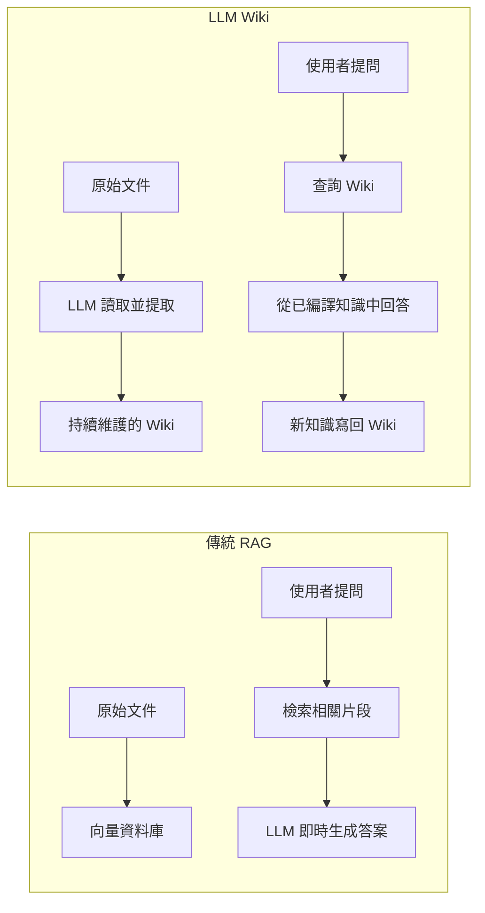
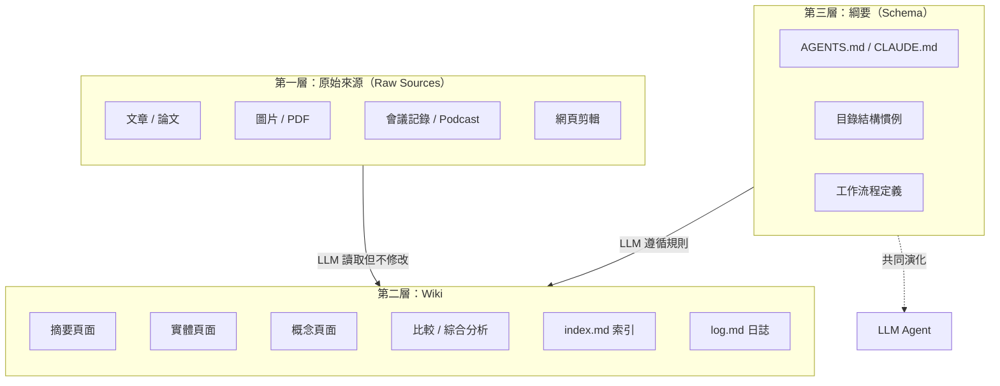
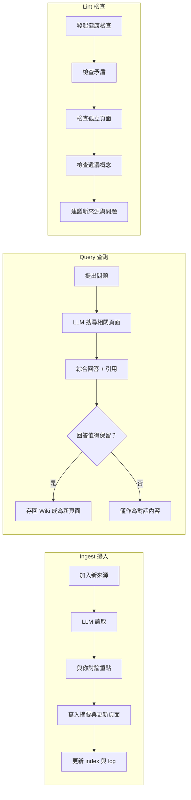
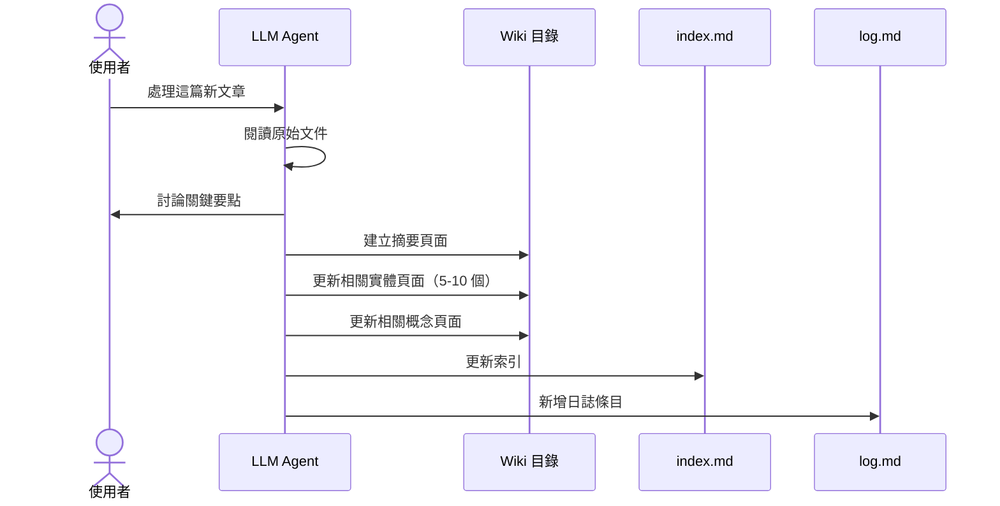

## 目錄

1. [核心概念](#1-核心概念)
2. [三層架構](#2-三層架構)
3. [三大操作流程](#3-三大操作流程)
4. [索引與日誌](#4-索引與日誌)
5. [Schema 綱要文件](#5-schema-綱要文件)
6. [工具與技巧](#6-工具與技巧)
7. [完整實戰演練](#7-完整實戰演練)
8. [注意事項與常見問題](#8-注意事項與常見問題)

---

## 1 核心概念

### 1.1 什麼是 LLM Wiki

LLM Wiki 是一種利用大型語言模型（LLM）來**增量式建立並維護持久化 Wiki** 的模式。有別於傳統 RAG 每次從頭檢索的做法，LLM 會讀取原始來源，提取關鍵資訊，**整合進現有的 Wiki 結構中**——知識只被編譯一次，然後持續保持最新。

### 1.2 與傳統 RAG 的差異



傳統 RAG 的問題在於**每次查詢都需要從頭重新發現知識**，沒有累積效應。LLM Wiki 則截然不同：

- 知識被編譯一次，然後持續更新
- Wiki 中的交叉引用已經存在
- 矛盾點已經被標記
- 綜合分析已經反映所有已讀內容

### 1.3 適用場景

- **個人成長**：追蹤目標、健康、心理、日記、文章與 Podcast 筆記
- **研究專案**：花數週或數月深入研究某個主題，逐步建立全面的 Wiki
- **讀書筆記**：逐章整理，建立角色、主題、情節線的頁面
- **團隊協作**：內部 Wiki 由 LLM 維護，餵入 Slack 討論、會議記錄、專案文件
- **競品分析、盡職調查、旅行規劃、課程筆記、興趣愛好深耕**

---

## 2 三層架構



### 2.1 第一層：原始來源（Raw Sources）

你精選收集的原始文件集合——文章、論文、圖片、會議記錄。這些是**不可變的**，LLM 只能讀取，永遠不會修改它們。這是你的**真相來源（Source of Truth）**。

### 2.2 第二層：Wiki

由 LLM 生成的 Markdown 檔案目錄，包含：
- 摘要頁面（Summaries）
- 實體頁面（Entity Pages）——人物、地點、組織等
- 概念頁面（Concept Pages）——主題、理論、術語
- 比較與綜合分析
- 總覽頁面

**LLM 完全擁有這一層**：它建立頁面、在收到新來源時更新、維護交叉引用、保持一致性。**你讀取，LLM 寫入。**

### 2.3 第三層：Schema（綱要）

一份關鍵的設定文件（例如 `CLAUDE.md` 或 `AGENTS.md`），告訴 LLM：
- Wiki 的目錄結構
- 頁面慣例與格式
- 接收新來源時的工作流程
- 如何回答問題與維護 Wiki

> 此文件是讓 LLM 成為有紀律的 Wiki 維護者（而非普通的聊天機器人）的關鍵。你和 LLM 會隨時間共同演化這份規範。

---

## 3 三大操作流程



### 3.1 攝入（Ingest）

當你放入一個新來源並告訴 LLM 處理時，典型的流程如下：



推薦做法是**逐個攝入**，保持參與——閱讀摘要、檢查更新、引導 LLM 決定重點。一份來源可能觸及 10–15 個 Wiki 頁面。

### 3.2 查詢（Query）

1. LLM 搜尋相關頁面（透過 `index.md` 快速定位）
2. 讀取相關頁面的完整內容
3. 綜合分析並給出附有引用的答案

**重要洞察：好的答案可以作為新頁面存回 Wiki。** 你的探索也會像攝入的來源一樣，持續累積到知識庫中。

答案可以有多種形式：
- Markdown 頁面
- 比較表格
- 簡報（Marp 格式）
- 圖表（matplotlib）
- Canvas

### 3.3 檢查（Lint）

定期請 LLM 對 Wiki 進行健康檢查：

- **矛盾檢測**：頁面之間是否存在不一致的陳述
- **過時論述**：是否有被新來源取代的舊主張
- **孤兒頁面**：沒有入站連結（Inbound Links）的頁面
- **遺漏概念**：被提及但缺乏獨立頁面的重要概念
- **缺失交叉引用**
- **資料缺口**：可以透過網路搜尋填補的空白

LLM 很擅長建議新的調查問題和尋找新的來源。

---

## 4 索引與日誌

兩個特殊檔案幫助 LLM 和你隨著 Wiki 成長而導航：

### 4.1 index.md（內容導向）

內容目錄，列出 Wiki 中每個頁面及其連結、一行摘要和可選的後設資料（日期、來源數量等）。按類別組織（實體、概念、來源等）。

```markdown
## 實體

- [[Albert Einstein]] — 物理學家，相對論提出者（3 個來源）
- [[Marie Curie]] — 化學家，放射性研究先驅（2 個來源）

## 概念

- [[相對論]] — 愛因斯坦提出的時空理論（4 個來源）
- [[放射性]] — 不穩定原子核自發釋放能量（2 個來源）

## 來源

- [[2026-04-01 相對論論文]] — 原始論文摘要
```

LLM 在每次攝入時更新此檔案。查詢時先讀取索引找到相關頁面，再深入查看。在中等規模（約 100 個來源、數百個頁面）下效果出奇地好，無需依賴基於嵌入向量的 RAG 基礎設施。

### 4.2 log.md（時間導向）

僅附加（Append-only）的記錄，記載發生的事件及時間——攝入、查詢、檢查。

```markdown
## [2026-04-02] ingest | 相對論論文
- 新增頁面：[[相對論]]、[[愛因斯坦]]
- 更新頁面：[[時空]]、[[物理學史]]

## [2026-04-03] query | 狹義與廣義相對論的差異
- 產生比較頁面：[[狹義 vs 廣義相對論]]

## [2026-04-05] lint
- 發現矛盾：頁面 A 與頁面 B 對光速的描述不一致
```

**實用技巧**：如果每個條目以一致的前綴開頭，日誌就可以用簡單的 Unix 工具解析：

```bash
# 查看最近 5 筆操作
grep "^## \[" wiki/log.md | tail -5

# 查看所有攝入操作
grep "ingest" wiki/log.md

# 統計各類操作的次數
grep -c "ingest" wiki/log.md
grep -c "lint" wiki/log.md
```

---

## 5 Schema 綱要文件

以下是一份完整的 Schema 文件範例，放在 Obsidian Vault 根目錄（如 `AGENTS.md` 或 `CLAUDE.md`）：

```markdown
# LLM Wiki Schema

## 目錄結構

- `wiki/` — LLM 維護的 Wiki 頁面
- `raw/` — 原始來源（LLM 只讀不寫）

## 頁面慣例

- 所有 Wiki 頁面使用繁體中文 Markdown
- 每個頁面開頭必須有 YAML frontmatter：
  ```yaml
  ---
  tags: [wiki, 主題標籤]
  created: YYYY-MM-DD
  updated: YYYY-MM-DD
  sources: N   # 引用來源數量
  ---
  ```
- 使用 `[[Wiki Link]]` 格式進行內部交叉引用
- 首次出現的專有名詞附上英文原文，如「知識蒸餾（Knowledge Distillation）」

## 攝入工作流程

1. 閱讀 `raw/` 中的原始文件
2. 與我討論 2-3 個關鍵要點
3. 在 `wiki/sources/` 下建立摘要頁面
4. 更新或建立相關的實體頁面與概念頁面
5. 若有對比價值，建立比較頁面
6. 更新 `wiki/index.md`
7. 在 `wiki/log.md` 新增條目

## 查詢工作流程

1. 先讀取 `wiki/index.md` 找出相關頁面
2. 讀取相關頁面內容
3. 綜合分析並給出附引用的回答
4. 若回答有長期價值，存回 Wiki 作為新頁面

## 檢查工作流程

每週執行一次：
1. 檢測頁面之間的矛盾
2. 標記孤兒頁面（無入站連結）
3. 識別應有獨立頁面但尚未建立的概念
4. 建議下一步可探索的方向
```

---

## 6 工具與技巧

### 6.1 推薦工具

| 工具 | 用途 |
|------|------|
| **Obsidian Web Clipper** | 瀏覽器擴充功能，將網頁文章轉為 Markdown |
| **Obsidian Graph View** | 視覺化 Wiki 的連結結構 |
| **Marp** | Markdown 格式的簡報工具，Obsidian 有對應插件 |
| **Dataview（Obsidian 插件）** | 對頁面 Frontmatter 執行查詢，產生動態表格 |
| **qmd** | 本機 Markdown 搜尋引擎，支援 BM25/混合向量搜尋與 LLM 重新排序 |
| **Git** | Wiki 本身就是 Git 倉庫，免費獲得版本歷史與協作 |

### 6.2 圖片處理技巧

1. 在 Obsidian 設定中將「Attachment folder path」設為固定目錄（如 `raw/assets/`）
2. 設定快捷鍵下載附件（Ctrl+Shift+D）
3. 注意：LLM 無法一次讀取包含行內圖片的 Markdown。解決方法是讓 LLM 先讀取文字，再分別查看部分或全部圖片以獲取額外上下文。

### 6.3 Dataview 查詢範例

若 LLM 在 Wiki 頁面中加入了 YAML frontmatter，Dataview 可以產生動態報表：

```markdown
```dataview
TABLE created AS "建立日期", sources AS "來源數"
FROM "wiki"
SORT sources DESC
```
```

輸出範例：

| 檔案 | 建立日期 | 來源數 |
|------|---------|-------|
| MobileNet | 2026-05-01 | 3 |
| 模型量化 | 2026-05-01 | 3 |
| TinyML | 2026-05-05 | 2 |

### 6.4 Marp 簡報範例

```markdown
---
marp: true
theme: uncover
---

# 邊緣運算上的小型語言模型

從 MobileNet 到知識蒸餾的技術演進

---

## MobileNet 系列對比

| 版本 | 參數量 | Top-1 準確率 |
|------|--------|-------------|
| V1   | 4.2M   | 70.6%       |
| V2   | 3.4M   | 72.0%       |
| V3   | 5.4M   | 75.2%       |
```

---

## 7 完整實戰演練

以下從頭到尾演示如何用 LLM Wiki 模式建立一個小型知識庫。

### 7.1 初始化

```bash
mkdir -p raw/slm-on-edge
mkdir -p wiki/entities wiki/concepts wiki/comparisons wiki/sources
```

將 Schema 存為 `AGENTS.md`。初始目錄結構：

```
my-wiki/
├── raw/
│   ├── articles/
│   ├── papers/
│   └── assets/
├── wiki/
│   ├── index.md
│   ├── log.md
│   ├── concepts/
│   ├── entities/
│   └── sources/
└── AGENTS.md
```

### 7.2 攝入第一篇來源

**你：**
> 請處理 `raw/slm-on-edge/2026-05-01-mobilenet-overview.md` 這篇關於 MobileNet 的文章。

**LLM：**
> 我已經讀完這篇文章，以下是兩個關鍵要點：
> 1. MobileNet 使用深度可分離卷積，參數量僅為標準卷積的 1/8 到 1/9
> 2. 寬度乘數和解析度乘數兩個超參數讓模型可靈活適應不同邊緣裝置
>
> 你希望我在 Wiki 中重點強調什麼？

**你：**
> 著重效能數據和架構細節。另外檢查 Wiki 中是否有 Qualcomm AI Hub 的頁面，如果沒有就一併建立。

**LLM 執行結果：**
> - ✅ 建立 `wiki/sources/2026-05-01-mobilenet-overview.md`
> - ✅ 建立 `wiki/entities/mobilenet.md`
> - ✅ 建立 `wiki/entities/qualcomm-ai-hub.md`
> - ✅ 建立 `wiki/concepts/depthwise-separable-convolution.md`
> - ✅ 建立 `wiki/concepts/model-quantization.md`
> - ✅ 更新 `wiki/index.md`
> - ✅ 新增日誌到 `wiki/log.md`

### 7.3 查詢與探索

**你：**
> 比較 MobileNet V1、V2、V3 在邊緣裝置上的推論延遲與準確率 trade-off，產生一個比較頁面存到 wiki/comparisons/。

**LLM：**
> | 模型 | 參數量 | Top-1 準確率 | 樹莓派 4 延遲 | 關鍵技術 |
> |------|--------|-------------|--------------|---------|
> | MobileNet V1 | 4.2M | 70.6% | 62ms | 深度可分離卷積 |
> | MobileNet V2 | 3.4M | 72.0% | 54ms | 反向殘差 + 線性瓶頸 |
> | MobileNet V3 | 5.4M | 75.2% | 68ms | NAS + 硬開關激活 |

### 7.4 每週維護：Lint

**你：**
> 對 Wiki 執行一次完整的 Lint 健康檢查。

**LLM：**
> ## Lint 報告
> ### 矛盾（1 處）
> - **entities/mobilenet.md vs entities/efficientnet.md**：測試條件不同導致準確率數據不一致
> ### 孤兒頁面（3 處）
> - entities/qualcomm-ai-hub.md、concepts/hardware-acceleration.md、sources/2026-05-01-mobilenet-overview.md
> ### 遺漏概念（2 處）
> - 「ONNX Runtime」被多個頁面提及但無獨立頁面
> - 「TensorRT」同上

### 7.5 兩週後的成果

經過 6 次攝入、3 次查詢、2 次 Lint 後：

```
wiki/
├── index.md
├── log.md
├── overview.md
├── entities/
│   ├── mobilenet.md
│   ├── squeezenet.md
│   ├── efficientnet-lite.md
│   ├── tinyml.md
│   ├── qualcomm-ai-hub.md
│   └── onnx-runtime.md
├── concepts/
│   ├── depthwise-separable-convolution.md
│   ├── model-quantization.md
│   ├── knowledge-distillation.md
│   ├── edge-inference.md
│   └── hardware-acceleration.md
├── comparisons/
│   ├── mobilenet-v1-v2-v3.md
│   └── mobilenet-vs-squeezenet.md
└── sources/
    ├── 2026-05-01-mobilenet-overview.md
    ├── 2026-05-05-tinyml-whitepaper.md
    ├── 2026-05-08-knowledge-distillation-survey.md
    ├── 2026-05-10-qualcomm-ai-hub-launch.md
    ├── 2026-05-12-squeezenet-paper.md
    └── 2026-05-14-onnx-runtime-guide.md
```

此時你的知識庫已累積了 20+ 頁面、6 篇來源、2 份比較分析——全部由你引導、LLM 維護，無需手動處理任何文書工作。

---

## 8 注意事項與常見問題

### 8.1 這不是一個具體的實作

此文件描述的是概念，而非具體實作。確切的目錄結構、綱要慣例、頁面格式、工具選擇——這些都取決於你的領域、偏好和選擇的 LLM。一切均可選且模組化。

### 8.2 矛盾檢測

隨著 Wiki 增長，不同頁面之間可能出現矛盾。建議在 Lint 階段由 LLM 來檢測，社群中也出現了專門的工具（如基於層叢同調的矛盾檢測工具）可以作為輔助驗證層。

### 8.3 規模限制

- 索引檔案模式在約 100 個來源、數百個頁面的規模下表現良好
- 超過此規模建議引入專用搜尋工具（如 `qmd`）
- 若使用 Embedding 替代方案，需注意向量資料庫的額外基礎設施成本

### 8.4 為什麼這套模式有效

維護知識庫最繁瑣的部分不是閱讀或思考，而是**文書工作（Bookkeeping）**：
- 更新交叉引用
- 保持摘要最新
- 標記新資料與舊資料的矛盾
- 維護數十個頁面的一致性

人類之所以放棄 Wiki，是因為維護成本的增長速度超過了價值的增長速度。

**LLM 不會感到厭倦，不會忘記更新交叉引用，可以在一次操作中觸及 15 個檔案。** 因為維護成本趨近於零，Wiki 得以持續維護。

人類的任務是：
- 策展來源
- 引導分析方向
- 提出好問題
- 思考這一切意味著什麼

LLM 的任務是其餘所有事。

### 8.5 歷史連結

此概念的精神可追溯到 Vannevar Bush 在 1945 年提出的 **Memex**——一種個人精選知識儲存裝置，具備文件之間的關聯軌跡。Bush 的願景比後來的網路更接近此處描述的 Wiki：私有的、主動策展的、文件之間的連結與文件本身同樣有價值。他唯一無法解決的問題是「誰來做維護」。而 LLM 正好解決了這個問題。

### 8.6 與 Obsidian 搭配使用

Karpathy 本人的做法是 LLM Agent 開在螢幕一側，Obsidian 開在另一側，即時瀏覽 LLM 的更新結果。Obsidian 是 IDE，LLM 是程式設計師，Wiki 是程式碼庫。

### 8.7 實作建議

- 將此概念文件提供給你的 LLM Agent（OpenAI Codex、Claude Code、OpenCode 等）
- 與 LLM 協作，實例化一個符合你需求的版本
- 將工作流程記錄在 Schema 檔案（AGENTS.md / CLAUDE.md）中
- 隨時間迭代演進你的慣例與設定
- Wiki 本質上是 Markdown 檔案的 Git 倉庫，善用版本歷史與分支
