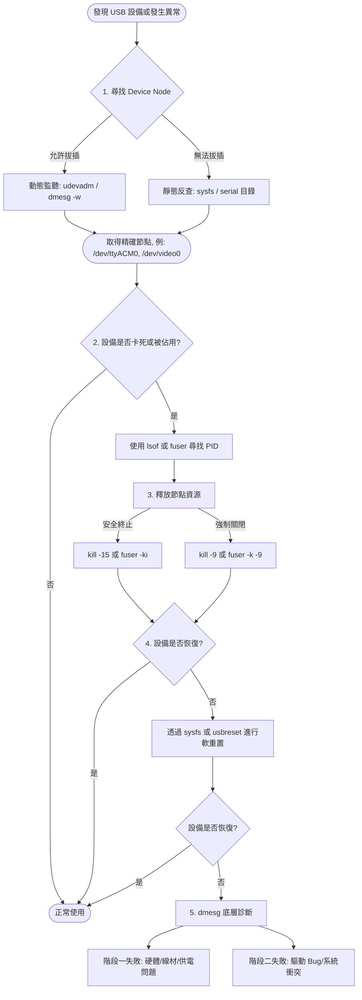

# Linux USB 設備管理與故障排除完整指南

本文件說明 Linux 系統上 USB 設備從「尋找節點」、「解除佔用」、「指令重置」到「錯誤診斷」的完整標準作業流程（SOP），保留所有操作步驟、指令範例與輸出解讀方法。

> [!NOTE] 適用情境
> 當 USB 設備（視訊鏡頭、序列埠、隨身碟等）無法存取、被程式佔用卡死，或需要在不拔除實體線路的情況下重置時，可依本流程逐階段排除問題。

---

## 總覽：USB 設備管理與故障排除流程圖



---

## 步驟一：找出 USB 建立的 Device Node

一個實體 USB 可能同時建立多個 Device Node（例如視訊鏡頭會同時產生 `/dev/video0` 與 `/dev/snd/...`）。請依當下**是否可以拔插設備**，選擇最適合的方法。

### 情況 A：允許重新拔插設備（動態監聽）

**方法 1：使用 `udevadm` 監聽（最精準、適用「所有類型」設備）**

這能捕捉系統底層為該設備建立的所有節點。

1. **拔掉**該 USB 設備。
2. 開啟終端機，啟動 `udev` 監聽模式：

```bash
udevadm monitor --property
```

3. **插入**設備。
4. 觀察終端機噴出的日誌，尋找 **`ACTION=add`** 且帶有 **`DEVNAME=`** 的屬性，例如：
   - `DEVNAME=/dev/sdb1`（隨身碟）
   - `DEVNAME=/dev/video0`（視訊鏡頭）
5. 找到節點名稱後，按 `Ctrl + C` 結束監聽。

**方法 2：透過 `dmesg -w` 監看日誌（最直觀）**

1. **拔掉**設備。
2. 啟動持續監看：

```bash
sudo dmesg -w
```

3. **插入**設備，尋找最後幾行綁定訊息（例如 `ttyACM0: USB ACM device`）。按 `Ctrl + C` 結束。

### 情況 B：無法拔插或只能遠端操作（靜態反查）

**方法 3：透過 `sysfs` 底層檔案系統反查（適用所有設備，最強大）**

已知 Vendor ID（例 `1fc9`），直接從核心層挖出 Node。

1. **找出總線路徑：**

```bash
grep -i "1fc9" /sys/bus/usb/devices/*/idVendor
```

> 輸出範例：`/sys/bus/usb/devices/1-1.2/idVendor:1fc9`（代號為 `1-1.2`）

2. **尋找該路徑下建立的所有 Device Node：**

請將 `1-1.2` 替換為您的代號：

```bash
find /sys/bus/usb/devices/1-1.2/ -name "dev" -print
```

> 輸出範例：`/sys/bus/usb/devices/1-1.2/1-1.2:1.0/tty/ttyACM0/dev`

3. **解讀：** 倒數第二層的目錄名稱（`ttyACM0`）就是它在 `/dev/` 下的名稱。

**方法 4：查看 `/dev/serial/by-id/`（僅限 Serial 設備）**

1. 輸入以下指令查看靜態軟連結：

```bash
ls -l /dev/serial/by-id/
```

2. 尋找帶有 NXP 或設備名稱的項目，看它箭頭指向哪裡（例如 `-> ../../ttyACM0`）。

> [!TIP] 方法選擇建議
> - 能拔插時，優先用 **`udevadm monitor --property`**，資訊最完整。
> - 只能遠端或設備已固定安裝時，用 **`sysfs` 反查**，不需動到硬體。

---

## 步驟二：查詢是哪個 Process 正在佔用設備

若設備無法存取，需先找出佔用的行程（PID）。以下以 `/dev/video0` 為例。

**方法 1：使用 `lsof`（資訊最詳細）**

```bash
sudo lsof /dev/video0
```

- **輸出解讀：** 尋找 `COMMAND`（程式名）與 `PID`（行程代碼）欄位。
- （註：若是儲存裝置，需先用 `lsblk` 查出掛載目錄，再對目錄執行 `sudo lsof /掛載點`。）

**方法 2：使用 `fuser`（簡潔直觀）**

```bash
sudo fuser -v /dev/video0
```

- **輸出解讀：** 清楚列出正在存取的 `USER`、`PID` 與 `COMMAND`。

---

## 步驟三：終止佔用程式，釋放 Device Node

取得 PID 後，請依照「先溫和、後強制」的原則關閉程式。

1. **安全終止（推薦）：** 給程式時間儲存狀態並正確關閉連線。

```bash
sudo kill <PID>
```

2. **強制關閉（若軟體當機）：** 不給反應時間，直接由系統抹除行程。

```bash
sudo kill -9 <PID>
```

### 捷徑：直接用 `fuser` 殺死所有佔用程式

- **互動式安全關閉：** 逐一詢問是否關閉佔用該節點的程式（輸入 y 確認）。

```bash
sudo fuser -ki /dev/video0
```

- **一鍵強制關閉：**

```bash
sudo fuser -k -9 /dev/video0
```

> [!WARNING] 強制關閉的風險
> `kill -9` 或 `fuser -k -9` 不給程式存檔或正常釋放資源的機會，可能導致資料遺失或設備狀態不一致。請先嘗試安全終止。

---

## 步驟四：指令列軟重置（Soft Reset）

若程式已終止，但設備本身內部狀態機卡死，可在不拔除實體線路的情況下重啟硬體。

**方法 1：透過 `sysfs` 模擬實體拔插（無需額外套件）**

利用先前找到的 USB 總線路徑（如 `1-1.2`），切斷邏輯電源再重啟：

```bash
# 模擬拔除設備 (Disable)
echo 0 | sudo tee /sys/bus/usb/devices/1-1.2/authorized

# 模擬重新插入設備 (Enable)
echo 1 | sudo tee /sys/bus/usb/devices/1-1.2/authorized
```

**方法 2：使用 `usbreset` 工具**

若系統有安裝 `usbutils`，可直接針對 Vendor/Product ID 發送重置訊號：

```bash
sudo usbreset 1fc9:0094
```

---

## 步驟五：透過 dmesg 診斷硬體或軟體問題

如果經過軟重置，設備依舊無效，請拔除並重新插入設備，同時執行 `sudo dmesg -w`，透過報錯發生的**階段**來釐清問題。

### 情況 1：硬體損壞、線材不良、供電不足（發生在第一階段 Enumeration）

系統嘗試讀取設備基本資訊時就失敗，**完全沒有印出 Vendor ID 與 Product ID**。

- **關鍵字：** `error -71`（通訊協議錯誤）、`error -110`（超時）、`unable to enumerate`。
- **結論：** 物理層面故障。請更換 USB 線材、更換 USB 埠，或確認設備是否已燒毀。

### 情況 2：驅動程式 Bug 或系統衝突（發生在第二階段 Probing）

系統**成功印出了 Vendor ID 與 Product ID**，代表硬體供電與底層通訊皆正常，但無法被系統使用。

- **關鍵字：** `probe failed with error...`、`Call Trace:`（核心崩潰）、設備每隔幾秒就不斷 `Disconnect` 又 `Connect`。
- **結論：** 軟體層面問題。通常是驅動程式有 Bug、Linux Kernel 版本問題，或是被其他背景服務（如 `modemmanager`）錯誤接管。

> [!IMPORTANT] 階段判讀是關鍵
> 診斷時，先確認 `dmesg` 輸出中**是否出現 Vendor ID / Product ID**：
> - **沒有出現** → 屬於 Enumeration 階段失敗，往硬體、線材、供電方向排查。
> - **有出現** → 屬於 Probing 階段失敗，往驅動程式、Kernel 版本、背景服務衝突方向排查。

---

## 相關文件

- [[Linux 系統 Serial Port (UART) 命名與綁定指南]] — 設備節點命名與綁定機制的延伸閱讀。
- [[CAN 協定與 SocketCAN 完整指南]] — 使用 USB-CAN 轉接器時的驅動載入與節點確認。
