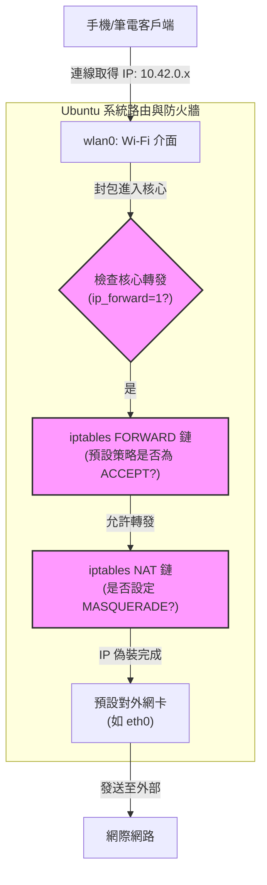

## 📝 簡介

本文件記錄如何在 Ubuntu/Linux 環境中，將 Wi-Fi 網卡設定為 AP（Access Point）模式，並將有線網路（Ethernet）或 5G 網卡的連線分享給其他設備。包含基礎設定、無頭 (Headless) 伺服器方案、底層運作原理，以及常見的「連得上 Wi-Fi 卻無法上網（特別是有安裝 Docker 時）」的除錯與自動化腳本。

## 🔧 硬體與先決條件

- **網卡限制**：絕大多數內建 Wi-Fi 網卡為單天線模組（Single Radio），無法同時「接收 Wi-Fi」又「發射熱點」。建議架構為：**Ethernet / 5G 網卡（接收） + 獨立 Wi-Fi 網卡（發射）**。
    
- **AP 模式支援檢查**：確認網卡支援 AP 模式。執行下方指令，在 `Supported interface modes:` 區塊若包含 `* AP`，即代表硬體與驅動支援。
     
    ```bash
    iw list
    ```
    
- **WPA3/SAE 支援檢查**：若要使用 WPA3 加密，需確認網卡支援 SAE。詳細檢查方法與支援條件，請參閱 → [[Wi-Fi 安全協議與加密設定完整指南#如何檢查裝置是否支援 WPA3]]
    

## 🏗️ 網路架構與封包流向

當客戶端連接到熱點時，封包的流向如下圖。若設定後無法連外，通常是卡在「系統防火牆」階段。



## 🚀 建立與啟用熱點的三種方法

Ubuntu 預設使用 `NetworkManager` 管理網路，它會在背景自動配置 DHCP 伺服器（預設發放 `10.42.0.x` 網段）與 NAT 路由。

### 方法一：圖形介面 (GUI) - 適合桌面版

1. 確認電腦已透過 Ethernet 連上網路，且 Wi-Fi 未連線至其他基地台。
    
2. 開啟 **「設定 (Settings)」** > **「Wi-Fi」**。
    
3. 點擊右上角選單，選擇 **「開啟 Wi-Fi 熱點 (Turn On Wi-Fi Hotspot)」**。
    
4. 設定對外廣播的網路名稱 (SSID) 與密碼，點擊開啟。
    

### 方法二：終端機指令 (CLI) - 適合無 UI 伺服器

若無圖形介面，可使用 `nmcli` 一鍵建立：

```bash
# 1. 查詢 Wi-Fi 網卡代號 (例如 wlan0)
ip -br link

# 2. 確保網卡未連線
sudo nmcli device disconnect wlan0

# 3. 建立並啟動熱點
sudo nmcli device wifi hotspot ifname wlan0 ssid "您的Wi-Fi名稱" password "您的密碼"
```

### 方法三：RaspAP 網頁後台 - 適合提供給一般用戶操作

如果是無螢幕的邊緣運算裝置，需讓非技術人員輕鬆開關熱點，可安裝開源的 RaspAP 提供 Web 介面。

```bash
# 一鍵安裝腳本
curl -sL https://install.raspap.com | bash
```

安裝重開機後，即可透過瀏覽器輸入該主機 IP 進入圖形化後台進行所有設定。

## 🔍 核心觀念：如何確認熱點的「內部名稱」與「出口網卡」

### 1. 檢查連線的「內部名稱 (Connection Name)」

Ubuntu 內部辨識連線用的名稱，與對外廣播的 Wi-Fi 名稱 (SSID) **不一樣**。這在編寫自動化腳本時非常關鍵。

在熱點開啟的狀態下，執行：

```bash
nmcli connection show --active
```

**輸出範例：**

```
NAME                UUID                                  TYPE      DEVICE 
Wired connection 1  12345678-abcd-1234-abcd-1234567890ab  ethernet  eth0   
Hotspot             87654321-dcba-4321-dcba-0987654321dc  wifi      wlan0  
```

- 最左邊的 `NAME` 欄位即為內部名稱，Ubuntu UI 建立的熱點預設固定叫 **`Hotspot`**。
    

### 2. 熱點是如何決定要分享哪張網卡的網路？

預設情況下，NetworkManager 會自動抓取系統當下優先權最高的「預設路由 (Default Route)」。

如果您有多張網卡 (如 Ethernet + 5G)，且想強制熱點流量只走 5G，需修改該網卡的 Metric 值 (數值越小優先權越高)：

```bash
# 調整連線優先權 (將 5G 網卡 Metric 設為 50)
nmcli connection modify "您的5G連線名稱" ipv4.route-metric 50
nmcli connection up "您的5G連線名稱"
```

## ⚠️ 故障排除：連上熱點卻無法上網 (Ping 8.8.8.8 失敗)

客戶端取得 `10.42.0.x` 的 IP，但無法連外。這是因為封包進入 Ubuntu 後，在轉發過程中被丟棄。**若主機有安裝 Docker，由於 Docker 會修改 iptables 規則，這幾乎是必發生的問題。**

請依序打通以下三關：

### 第一關：開啟核心 IP 轉發 (IP Forwarding)

```bash
# 檢查狀態 (0 代表未開啟)
cat /proc/sys/net/ipv4/ip_forward

# 手動開啟
sudo sysctl -w net.ipv4.ip_forward=1
```

### 第二關：放行 iptables FORWARD 鏈 (Docker 衝突主因)

Docker 會強制將系統 FORWARD 預設策略改為 `DROP`。

```bash
# 檢查 FORWARD 策略，若第一行顯示 -P FORWARD DROP 則代表被阻擋
sudo iptables -S FORWARD

# 強制將預設策略改為允許轉發
sudo iptables -P FORWARD ACCEPT
```

### 第三關：補上 NAT (網路位址轉換) 規則

外網路由器不認識 `10.42.0.x`，需將封包偽裝 (MASQUERADE) 成對外 Ethernet 的 IP。

```bash
# 1. 確認負責上網的網卡代號 (如 eth0)
ip -br link

# 2. 加入 NAT 偽裝規則 (將 eth0 替換為實際代號)
sudo iptables -t nat -A POSTROUTING -s 10.42.0.0/24 -o eth0 -j MASQUERADE
```

## 🔐 安全加密設定與裝置相容性

建立熱點後，您可能會發現某些裝置（特別是 iPhone）無法連線。這通常與加密協議、頻段設定、或 wpa_supplicant 版本有關。

**完整的安全設定參數說明、WPA3 設定方法、以及 Ubuntu GUI 重置問題的解決方案，請參閱：**
→ [[Wi-Fi 安全協議與加密設定完整指南]]

### 快速設定指南

**查看目前加密設定**：

```bash
# 查看連線名稱
nmcli connection show --active

# 查看安全設定（將 "您的連線名稱" 替換為實際名稱）
nmcli connection show "您的連線名稱" | grep -A 15 "wifi-security"
```

**設定 WPA2-PSK（最相容）**：

```bash
sudo nmcli connection modify "您的連線名稱" wifi-sec.key-mgmt wpa-psk
sudo nmcli connection modify "您的連線名稱" wifi-sec.proto rsn
sudo nmcli connection modify "您的連線名稱" wifi-sec.pairwise ccmp
sudo nmcli connection modify "您的連線名稱" wifi-sec.group ccmp

# 重啟熱點
sudo nmcli connection down "您的連線名稱"
sudo nmcli connection up "您的連線名稱"
```

**設定 WPA3/SAE（最安全）**：

```bash
sudo nmcli connection modify "您的連線名稱" wifi-sec.key-mgmt sae
sudo nmcli connection modify "您的連線名稱" wifi-sec.proto rsn
sudo nmcli connection modify "您的連線名稱" wifi-sec.pairwise ccmp
sudo nmcli connection modify "您的連線名稱" wifi-sec.group ccmp
sudo nmcli connection modify "您的連線名稱" wifi-sec.pmf required

# 重啟熱點
sudo nmcli connection down "您的連線名稱"
sudo nmcli connection up "您的連線名稱"
```

### 頻段與頻道設定

若裝置連線不穩定，可能是頻段或頻道問題。建議明確指定：

```bash
# 設定使用 2.4GHz 頻段（相容性最佳）
sudo nmcli connection modify "您的連線名稱" 802-11-wireless.band bg

# 設定使用頻道 6（避開 DFS 和邊緣頻道）
sudo nmcli connection modify "您的連線名稱" 802-11-wireless.channel 6

# 重啟熱點
sudo nmcli connection down "您的連線名稱"
sudo nmcli connection up "您的連線名稱"
```

**頻段選擇建議：**

| 頻段 | 優點 | 缺點 | 適用場景 |
|------|------|------|----------|
| **2.4GHz (bg)** | 相容性最佳、穿透力強 | 速度較慢、易受干擾 | 一般家用、需要連接舊裝置 |
| **5GHz (a)** | 速度較快、干擾少 | 穿透力弱、相容性略低 | 近距離、需要高速傳輸 |

### iPhone / Apple 裝置連線問題

**問題現象**：iPhone 無法連線到 Ubuntu 熱點，但 Ubuntu、Windows、Android 裝置可以正常連線。

**根本原因**：`wpa_supplicant 2.10` 的已知問題，自動啟用 WPA3/SAE 支援導致相容性問題。

**快速解決方案**：

```bash
# 禁用 Protected Management Frames
sudo nmcli connection modify "您的連線名稱" wifi-sec.pmf disable

# 重啟熱點
sudo nmcli connection down "您的連線名稱"
sudo nmcli connection up "您的連線名稱"
```

**詳細技術分析與受影響裝置**：
完整的技術細節、各 iOS 版本的 AKM 選擇 Bug、SHA256 cipher suite 問題、以及受影響的 iPhone/iPad/Mac 機型清單，請參閱：
→ [[iPhone 與 Apple 裝置連線 Linux Wi-Fi 熱點問題完整指南]]

### Ubuntu GUI 重置設定問題

使用 Ubuntu 設定 UI 啟動熱點時，會重置網路安全設定。詳細問題分析與 4 種解決方案，請參閱：
→ [[Wi-Fi 安全協議與加密設定完整指南#Ubuntu GUI 重置設定問題]]

### 安全性評估與風險說明

禁用 PMF 並使用 WPA2-PSK 的安全性評估與風險說明，請參閱：
→ [[Wi-Fi 安全協議與加密設定完整指南#PMF 風險與限制評估]]

**簡要結論**：對於家庭或小型辦公環境，WPA2-PSK + AES/CCMP 加密已足夠安全。

---

## 🤖 自動化修復腳本 (NetworkManager Dispatcher)

### 為什麼需要 Dispatcher 腳本？

`.nmconnection` 設定檔**無法執行系統命令**，只能設定網路參數（IP、DNS、安全設定等）。因此，NAT、防火牆、IP 轉發等系統層級的設定，必須透過 NetworkManager 的 Dispatcher 機制來達成。

### 什麼是 Dispatcher 腳本？

NetworkManager Dispatcher 是一個 D-Bus 啟動的服務，會在網路連線狀態變更時（up、down、pre-up 等），自動執行 `/etc/NetworkManager/dispatcher.d/` 目錄下的腳本。

### 建立自動化修復腳本

為了避免每次開啟熱點、重啟 Docker 或網路變動後，NAT 規則又失效，可建立 NetworkManager 觸發腳本，讓系統在啟動熱點時全自動打通網路。

1. **建立腳本檔案**：
        
    ```bash
    sudo nano /etc/NetworkManager/dispatcher.d/99-hotspot-nat
    ```
    
2. **填入以下內容**：
   
    ```bash
    #!/bin/bash
    
    INTERFACE=$1
    ACTION=$2
    
    # 確認啟動的連線設定檔名稱包含 "Hotspot"
    if [[ "$CONNECTION_ID" == *"Hotspot"* ]]; then
        # 動態抓取目前系統的預設連外網卡 (例如 eth0)
        DEFAULT_IFACE=$(ip route | grep default | awk '{print $5}')
    
        if [ "$ACTION" = "up" ]; then
            # 啟動時：開啟核心轉發、允許 FORWARD 鏈、加入 NAT
            sysctl -w net.ipv4.ip_forward=1
            iptables -P FORWARD ACCEPT
            iptables -t nat -A POSTROUTING -s 10.42.0.0/24 -o "$DEFAULT_IFACE" -j MASQUERADE
        elif [ "$ACTION" = "down" ]; then
            # 關閉時：清除 NAT 規則
            iptables -t nat -D POSTROUTING -s 10.42.0.0/24 -o "$DEFAULT_IFACE" -j MASQUERADE
        fi
    fi
    ```
    
3. **賦予執行權限**：
    
    ```bash
    sudo chmod +x /etc/NetworkManager/dispatcher.d/99-hotspot-nat
    ```
    

設定完成後，未來不管網卡 IP 如何變動，只要開啟熱點，系統就會自動套用正確的防火牆與 NAT 規則。

---

## 🔗 相關文件

- [[Wi-Fi 安全協議與加密設定完整指南]] - Wi-Fi 安全協議、WPA3 技術、加密設定參數完整說明
- [[iPhone 與 Apple 裝置連線 Linux Wi-Fi 熱點問題完整指南]] - iPhone/Apple 裝置連線問題的詳細技術分析
- [[Ubuntu 平台 WireGuard 驗證方案說明]] - VPN 連線設定
- [[建立本地端的 IP 與 hostname 對應]] - 本地 DNS 設定

## 📚 參考資料

- NetworkManager 官方文件 - https://networkmanager.dev/docs/
- nmcli 手冊頁 - `man nmcli`