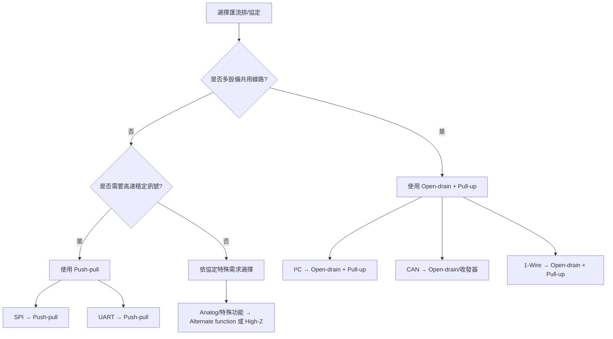

### 📑 GPIO 狀態/模式差異總表

|模式/狀態|類型|功能/特性|是否需要外部電阻|常見用途|
|---|---|---|---|---|
|**Pull-up 上拉輸入**|輸入|預設高電位，避免浮空|可內建或外接|按鍵、開關、I²C 線路|
|**Pull-down 下拉輸入**|輸入|預設低電位，避免浮空|可內建或外接|按鍵、開關|
|**Floating 浮空輸入**|輸入|無電阻，高阻態，易受雜訊影響|不需要|測試、暫時未用的腳位|
|**Analog 類比輸入**|輸入|腳位接 ADC，讀取電壓|不需要|感測器、電壓監測|
|**Open-drain 開漏輸出**|輸出|只能拉低到 GND，需外部上拉才能輸出高電位|需要|I²C、共用訊號線|
|**Push-pull 推挽輸出**|輸出|可主動輸出高/低電位，驅動能力強|不需要|LED、SPI、UART|
|**Alternate function 複用功能**|特殊|腳位切換成外設功能（UART/SPI/PWM 等）|視情況|匯流排、外設控制|
|**High-Z 高阻態**|特殊|腳位完全斷開，不輸入也不輸出|不需要|釋放總線、避免干擾|
### 🔍 簡單理解

- **輸入模式**：Pull-up、Pull-down、Floating、Analog
- **輸出模式**：Push-pull、Open-drain
- **特殊模式**：Alternate function、High-Z

### 🖧 GPIO 常見模式與狀態

- **Pull-up（上拉輸入）**
    
    - 內部或外部電阻將腳位拉到 **高電位 (VDD)**。
    - 避免輸入腳位浮空，常用於按鍵或開關電路。
- **Pull-down（下拉輸入）**
    
    - 內部或外部電阻將腳位拉到 **低電位 (GND)**。
    - 同樣用來避免浮空，但預設狀態是低電平。
- **Floating（浮空輸入）**
    
    - 腳位不接任何上拉或下拉電阻，處於高阻抗狀態。
    - 容易受雜訊影響，通常不建議長時間使用。
- **Analog input（類比輸入）**
    
    - 腳位直接接入 ADC（類比數位轉換器）。
    - 用於感測器或需要讀取電壓的場合。
- **Open-drain（開漏輸出）**
    
    - 由 NMOS 控制，只能拉低到 GND，無法主動輸出高電位。
    - 必須搭配外部上拉電阻才能輸出高電平。
    - 常用於 **I²C 匯流排** 或多設備共用訊號線。
- **Push-pull（推挽輸出）**
    
    - 由 PMOS 與 NMOS 組成，可主動輸出高電位或低電位。
    - 驅動能力強，常用於一般數位輸出。
- **Alternate function（複用功能）**
    
    - 腳位不僅是 GPIO，還能切換成其他外設功能（如 UART、SPI、PWM）。
    - 分為 **複用推挽輸出** 與 **複用開漏輸出**。
- **High-Z（高阻態）**
    
    - 腳位完全斷開，既不輸入也不輸出。
    - 常用於釋放總線或避免干擾。

👉 簡單來說，
**輸入模式有：上拉、下拉、浮空、類比**；
**輸出模式有：推挽、開漏**；
**特殊模式有：複用功能、高阻態**。

---

## 📑 匯流排設計對應表

|匯流排 / 協定|GPIO 模式建議|原因 / 特性|
|---|---|---|
|**I²C**|**Open-drain + Pull-up**|I²C 是多主多從匯流排，必須讓多個裝置能共用線路。開漏輸出避免衝突，外部上拉電阻確保線路能回到高電位。|
|**SPI**|**Push-pull**|SPI 是單主多從，訊號線需要高速切換且驅動能力強，推挽輸出能提供明確高低電位。|
|**UART**|**Push-pull**|UART 為點對點通訊，訊號線需要穩定的高低電位，推挽輸出最合適。|
|**CAN**|**Open-drain / Open-collector + 專用收發器**|CAN 匯流排需要多節點共用，通常搭配收發器，腳位表現為開漏型態。|
|**1-Wire**|**Open-drain + Pull-up**|單線通訊，必須靠上拉電阻維持高電位，裝置以開漏方式拉低。|
|**GPIO 控制訊號 (一般數位輸出)**|**Push-pull**|單一訊號控制，推挽輸出能提供明確驅動能力。|
|**多設備共用訊號線**|**Open-drain + Pull-up**|避免多設備同時輸出高電位造成衝突。|
### 🎯 總結

- **多設備共用匯流排**（如 I²C、CAN、1-Wire） → **Open-drain + Pull-up**
- **高速、單主匯流排**（如 SPI、UART） → **Push-pull**
- **一般控制訊號** → **Push-pull**

---

## 📊 匯流排設計流程圖 (Mermaid)

---

## 📑 匯流排設計對應表

|匯流排 / 協定|GPIO 模式建議|原因 / 特性|
|---|---|---|
|**I²C**|**Open-drain + Pull-up**|多主多從，避免衝突，需外部上拉電阻。|
|**SPI**|**Push-pull**|單主多從，高速驅動能力強。|
|**UART**|**Push-pull**|點對點通訊，需穩定高低電位。|
|**CAN**|**Open-drain / 收發器**|多節點共用，通常搭配專用收發器。|
|**1-Wire**|**Open-drain + Pull-up**|單線通訊，靠上拉維持高電位。|
|**一般 GPIO 控制訊號**|**Push-pull**|單一輸出控制，驅動能力強。|
|**特殊功能腳位**|**Alternate function / High-Z**|視外設需求切換或釋放總線。|

---

### 🎯 最後總結

- **多設備共用匯流排** → Open-drain + Pull-up（I²C、CAN、1-Wire）
- **高速單主匯流排** → Push-pull（SPI、UART）
- **一般控制訊號** → Push-pull
- **特殊用途** → Alternate function 或 High-Z

---

## ⚠️ 模式設定錯誤的風險

> [!WARNING] 易錯情境
> 電路設計要求 **Open-drain + 外部 Pull-high**，韌體卻誤設成 **Push-pull output high** 是最常見的錯誤之一。開漏設計的核心是「任一設備都可把線拉低，高電位由外部上拉電阻提供」；推挽輸出高則代表設備**主動強制輸出高電位**，與共用線路的設計邏輯直接衝突。

### 常見誤設情境與風險

| 誤設情境 | 風險 |
|---|---|
| 要求 Open-drain，誤設成 Push-pull output high | 匯流排衝突、貫穿電流、可能燒毀晶片或對端設備 |
| 需要 High-Z，卻開啟內部 Pull-up/Pull-down | 改變總線電位，影響其他設備運作 |
| Push-pull 誤設成 Open-drain | 高電位無力驅動，波形爬升變慢、位準不足 |
| 開機預設輸出位準錯誤 | 上電瞬間誤觸發電源使能、重置信號等負載 |
| Active-high / Active-low 反相 | 控制對象（繼電器、馬達、開關）動作相反 |
| 輸入腳位誤設成輸出 | 與外部驅動源短路衝突 |
| 類比腳位誤設成數位輸出 | 影響 ADC 測量精度，甚至損壞感測電路 |

### 案例：Open-drain 誤設為 Push-pull output high

| 風險 | 說明 |
|---|---|
| **匯流排衝突（Bus Contention）** | 當其他設備（如 I²C slave 的 ACK/NACK）試圖把線拉低時，本端主動輸出高電位，兩邊對抗，線路電位落在不確定的中間值，通訊位準失真。 |
| **貫穿電流 / 過熱 / 燒毀** | 衝突瞬間產生從本端 PMOS 流經對端設備 NMOS 的貫穿（Shoot-through）電流，遠超額定驅動值，可能造成晶片過熱、閂鎖（Latch-up）甚至永久損壞。 |
| **總線死鎖（Bus Stuck High）** | 一方持續強制輸出高，另一方永遠無法成功拉低，整個匯流排被卡死，所有設備通訊失效。 |
| **電源突波與雜訊** | 衝突電流在 VDD/GND 軌上造成突波，干擾同一供電域的類比或感測電路。 |
| **偶發性失效、難以除錯** | 錯誤只在特定時序或對端設備恰好發送時才發生，屬偶發問題，最難複現與定位。 |

### 除錯建議

1. 先確認**電路圖**上該腳位的電阻配置（上拉/下拉）與開漏設計意圖，再對照韌體設定。
2. 用示波器量測腳位**閒置時的電位**：開漏＋外部上拉的線路應被拉至高電位；若量到不明中間值或兩端設備輸出對抗的跡象，多半是模式誤設。
3. 檢查 `GPIO 開機預設狀態`（boot 期間的暫存器初始值），避免上電瞬間就輸出錯誤位準。
4. 交叉驗證 **Active-high / Active-low** 極性定義，避免邏輯反轉。
