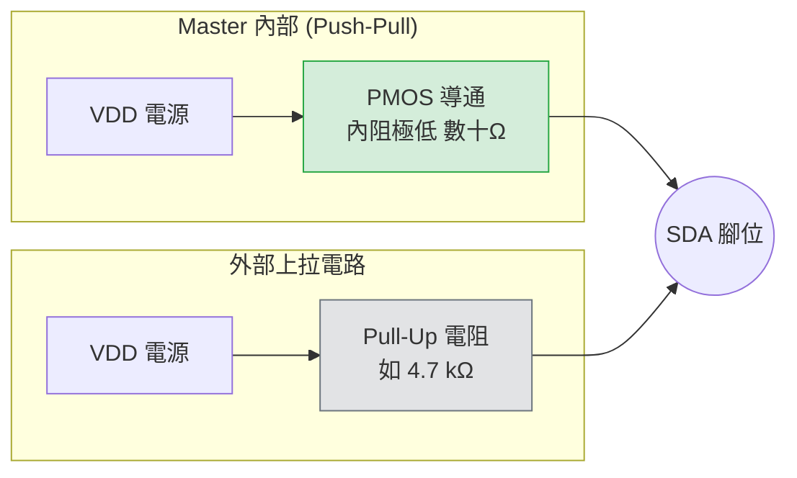
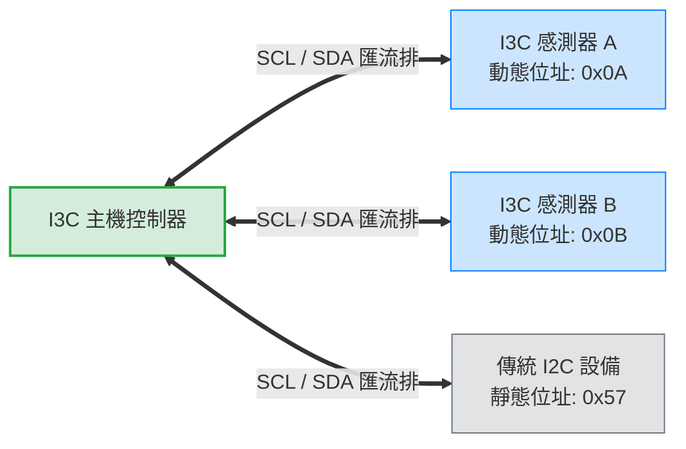
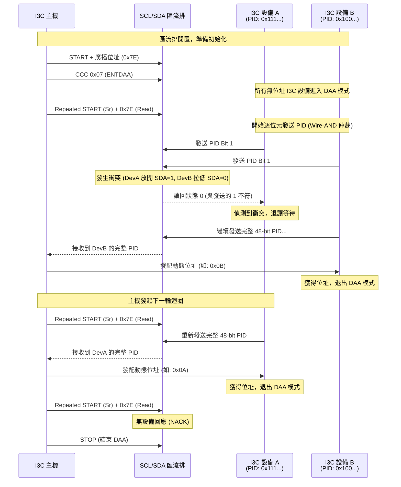
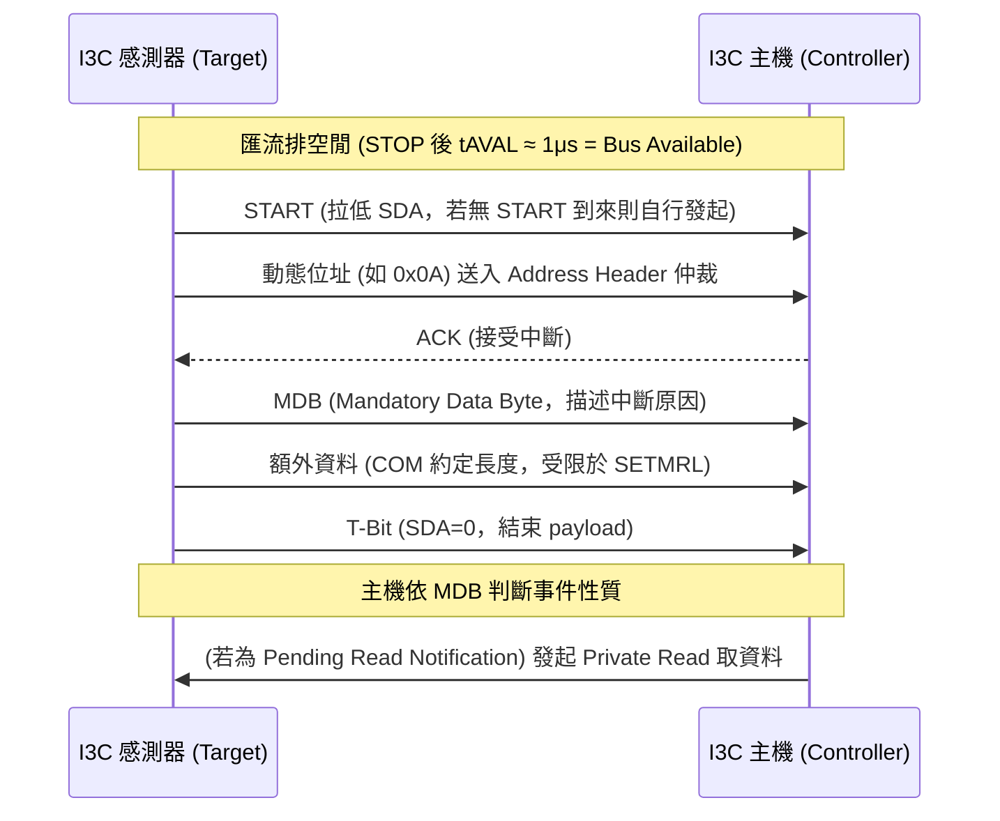
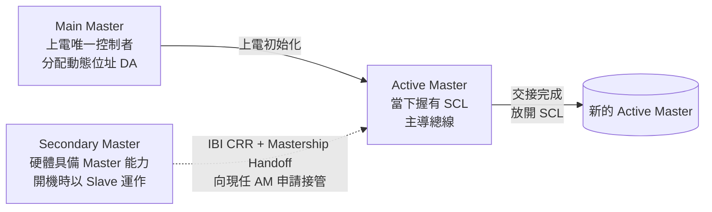
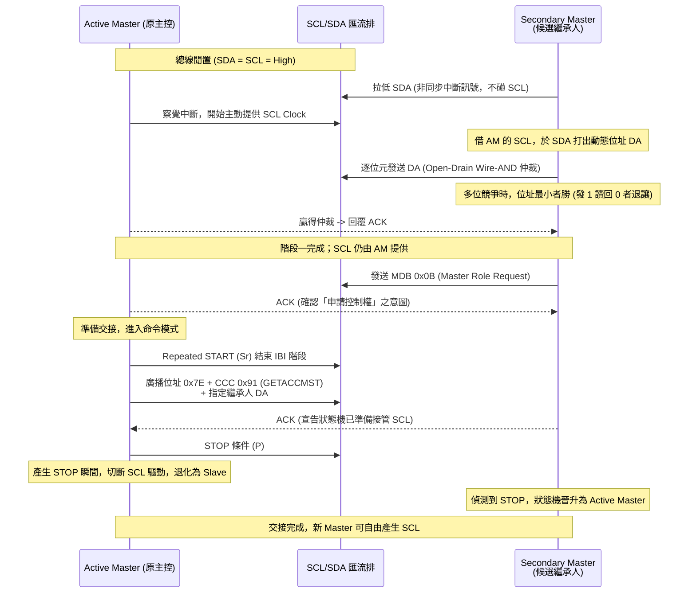

# MIPI I3C 匯流排技術整合說明書

> 本文件整理 **MIPI I3C 匯流排技術與 Linux 驅動架構**，涵蓋硬體設計差異、向下相容機制、動態分配仲裁，以及軟體層的設備樹（DTS）配置。

相關文件：
- [[GPIO 狀態與模式]] — 匯流排設計與 GPIO 模式（Open-Drain / Push-Pull）基礎
- [[Device Tree Override 完整指南]] — DTS 節點與 Linux Bus 子系統綁定機制

---

## 1. 技術概述與核心差異

MIPI I3C (Improved Inter-Integrated Circuit) 是專為解決傳統 I2C 與 SPI 在頻寬、功耗及接腳數量上的瓶頸而設計的新一代序列匯流排。它在維持與 I2C 相同的兩線式（SCL/SDA）實體拓樸下，大幅提升了傳輸速率，並加入了動態定址與頻內中斷等智慧化機制。

### I2C 與 I3C 綜合比較表

| 規格與特性 | I2C (傳統) | I3C (新一代) |
| --- | --- | --- |
| **實體線路** | 2根 (SCL, SDA) + 需額外中斷線 (INT) | 2根 (SCL, SDA)，無須額外中斷線 |
| **最高速率** | 1 Mbps (Fast Mode+) | 12.5 Mbps (SDR) / 33 Mbps+ (HDR) |
| **硬體驅動** | 全程開汲極 (Open-Drain) | 開汲極 (仲裁) + 推挽 (Push-Pull, 資料傳輸) |
| **上拉電阻** | 必須配置外部上拉電阻 | 主機內建微弱上拉，通常無需外部電阻 |
| **中斷機制** | 依賴額外的實體 GPIO 線路 | **IBI (頻內中斷)** 透過 SDA 傳輸 |
| **定址方式** | 靜態硬體寫死 (7-bit / 10-bit) | **DAA** (開機時動態分配) |
| **功耗表現** | 較高 (上拉電阻導致靜態功耗) | 極低 (Push-Pull 高速傳輸後快速休眠) |

> [!NOTE] IBI 與 GPIO 中斷的關聯
> I3C 的頻內中斷（IBI）取代了傳統 I2C 依賴的額外實體中斷 GPIO 腳位。硬體觸發格式、衝突仲裁與 Linux API 詳見 [[I3C-匯流排技術與Linux驅動架構#4. IBI 頻內中斷機制]]。

---

## 2. 硬體架構與相容性設計

I3C 能夠在相同的 SCL/SDA 線路上完美向下相容 I2C 設備，同時實現高速傳輸，仰賴以下三大硬體機制：

### 2.1 混合驅動模式切換

* **Open-Drain (開汲極)：** 用於通訊初期、位址仲裁 (DAA) 或與傳統 I2C 設備溝通。
* **Push-Pull (推挽)：** 當主機確認通訊對象是 I3C 設備並進入純資料傳輸階段時，硬體瞬間切換為推挽模式，將時脈推升至 12.5MHz，徹底消除上拉電阻帶來的電容延遲與靜態功耗。

#### 2.1.1 Push-Pull 驅動與外部 Pull-Up 共存的原則

> [!IMPORTANT] 常見疑慮：Push-Pull 驅動 High 遇到外部 Pull-Up 會短路嗎？
> **答案是完全不會。**

在 I3C 匯流排中，為了兼顧向後相容 I2C 以及實現高速傳輸，訊號腳位 (SDA/SCL) 會在兩種驅動模式之間動態切換。當 Push-Pull 輸出 High 時與外部 Pull-Up 電阻並存，不會產生短路，原因有二：

- **物理原理 (電位相等)**：當 Push-Pull 電路輸出 High 時，內部的 PMOS 導通，將腳位連接至系統的 VDD；而外部的 Pull-Up 電阻同樣連接至同一個 VDD。兩端電位相等（$\Delta V = 0$），不會產生電流。
- **阻抗優勢**：PMOS 導通時的內阻極低（幾十歐姆），而 Pull-Up 電阻通常較大（如 $4.7 k\Omega$）。電流會優先通過低阻抗路徑，因此腳位電位完全由 Master 主導，Pull-Up 電阻形同虛設，沒有負面影響。



> 兩端皆接同一個 VDD，電位相等（$\Delta V = 0$），故無電流；且 PMOS 內阻遠小於 Pull-Up，腳位電位由 Master 主導。

> [!WARNING] Bus Contention (匯流排衝突) — 真正的硬體風險
> 若一個裝置用 Push-Pull 驅動 High (連 VDD)，同時另一個裝置驅動 Low (連 GND)，會產生低阻抗的直接短路 (Shoot-through current)，這會產生極大電流，可能燒毀 IC。
>
> **I3C 協議如何避免衝突？** I3C 強制規定，在可能有多個裝置同時嘗試控制總線的**仲裁階段（如 START 條件、發送位址、ACK/NACK、IBI）**，所有裝置**只能使用 Open-Drain 模式**。在 Open-Drain 模式下，大家只能「拉低電位」或「放開不拉」，物理上不可能發生 VDD 直接對地短路的情況。只有當 Master 確認總線上沒有競爭者時，才會切換到 Push-Pull 模式進行高速傳輸。

### 2.2 廣播位址與突波濾波 (Spike Filter) 隔離法

* **保留位址 `0x7E`：** I3C 將 I2C 規範中的保留位址 `0x7E` 定義為廣播位址。所有傳統 I2C 設備收到此位址皆會忽略並保持安靜。
* **物理層降維打擊：** 當匯流排進入 12.5MHz 高速 Push-Pull 模式時，時脈週期極短（約 80ns）。傳統 I2C 設備內建的突波濾波器（Spike Filter，通常濾除 50ns 以下脈衝）會將這些高速訊號視為「雜訊」直接濾除。因此，高速 I3C 通訊對 I2C 設備而言形同隱形，防止了狀態機崩潰。

### 2.3 混合匯流排 (Mixed Bus) 拓樸



---

## 3. 動態位址分配 (DAA) 與硬體仲裁

為解決同型號感測器位址衝突，I3C 設備在上電時預設沒有位址，必須透過 **ENTDAA (Enter DAA)** 流程動態獲取。

> [!IMPORTANT] 動態位址特性
> I3C 的動態位址是暫時性的（斷電即消失），因此軟體層必須透過固定機制（如 Linux 的 DTS 綁定，見第 5 章）確保每次開機設備位址一致。

### 3.1 仲裁機制 (Wire-AND)

多個設備同時回應時，使用 I2C 固有的「線與」特性進行硬體拔河：

1. 設備各自輸出其內建的 **48-bit 唯一識別碼 (PID)**。
2. 輸出 `0` (拉低 SDA) 者優先級高於輸出 `1` (放開 SDA) 者。
3. 若設備輸出 `1` 卻讀回 `0`，代表有其他 PID 更小的設備在發送，該設備會**立刻退讓 (Drop out)**。
4. 最終 **PID 數值最小的設備** 會贏得仲裁，率先獲得動態位址。

### 3.2 ENTDAA 通訊流程圖



---

## 4. IBI 頻內中斷機制

傳統 I2C 依賴額外的實體 GPIO 中斷線通知主機，I3C 則透過 **IBI (In-Band Interrupt, 頻內中斷)** 直接在 SCL/SDA 線路上主動告知主機，省去中斷腳位與對應的電路設計。設備是否支援 IBI、是否帶資料，由 DAA 階段回報的 **BCR (Bus Characteristic Register)** 宣告：BCR Bit[2] = 1 表示會使用 MDB 描述中斷原因。

### 4.1 裝置何時可以發送中斷（等待規則）

已取得動態位址的設備，發送 IBI 前**必須**滿足以下條件，不得任意打斷匯流排：

1. **看到 STOP 且匯流排進入 Bus Available**：即 STOP 後維持 tAVAL（約 1μs）的閒置，才可動作。
2. **只能跟隨真正的 START**：可在 START 之後發送 IBI，但**不得在 Repeated START (Sr) 之後**發送。
3. **避開 Target Reset Pattern**：若看到 Controller 將 SCL 拉低（準備發送 Target Reset Pattern），不得拉低 SDA 發 IBI。
4. **被禁能期間不得發送**：Controller 可透過 DISEC CCC 禁能（見 4.5），禁能期間設備只能暫停（中斷可掛起等待）。

> [!NOTE] 若沒有 START 到來怎麼辦？
> 若 Bus Available 期間 Controller 一直沒有發 START，Target 可自己**拉低 SDA 發起 START 請求**，Controller 會接著拉低 SCL 完成 START 並接管 SDA。因此 IBI 有「跟隨別人的 START」與「自己製造 START」兩種發起方式。

### 4.2 中斷訊號的內容與格式

IBI 請求本質上是一個以 **SDR 格式**、由 Target 驅動的位址階段，接著視能力帶資料：

```text
START | 7-bit 動態位址 (仲裁) | ACK | [MDB] | [額外資料...] | T-Bit
```

1. **START + 動態位址**：Target 將自己的動態位址打入 Address Header，等同於「寫入自己的位址」。多個設備同時發送時在此階段仲裁（見 4.3）。
2. **ACK/NACK**：Controller 對位址階段回應。ACK = 接受此中斷；NACK = 拒絕（例如未註冊此設備的 IBI，或目前忙碌）。對 Hot-Join，NACK 後通常接著 DISEC 禁能。
3. **MDB (Mandatory Data Byte)**：若 BCR 宣告支援 payload，至少送 1 個 MDB 描述中斷原因。I3C v1.1 起 MDB 有標準編碼規則；內容協議（如 MIPI Debug Over I3C、感測器內容協議）可定義特定 MDB 值。例如 **Pending Read Notification**：MDB 表示「有資料等我來讀」，Controller 收到後**必須隨後發起 Private Read** 讀取資料。
4. **額外資料**：MDB 之後的資料位元組數由 Controller 與 Target 雙方約定（契約式），總長度受 **SETMRL CCC** 第三個位元組限制（未設定時用預設上限）。
5. **T-Bit 結束**：最後一個資料位元組後，Target 驅動 T-Bit (SDA=0) 表示 payload 結束，如同 Private Read 的結束方式。Controller 亦可提前將 SDA 拉低終止 payload。

> [!WARNING] T-Bit 不合規的設備
> 若 Target 不送 T-Bit，Controller 會誤以為還有資料而持續讀取 0xFF，可能阻塞後續所有匯流排傳輸，最終需要 Reset Controller 並執行復原程序。

### 4.3 多個裝置同時觸發的衝突處理

IBI 沿用匯流排既有仲裁能力，規則如下：

1. **位址仲裁 (Target Address Arbitration)**：多位 Target 同時發 IBI 時，與 DAA 相同的 Wire-AND 仲裁邏輯套用在 Address Header——**動態位址最小者獲勝**（發 1 讀回 0 者退讓）。
2. **餓死風險 (Starvation)**：低位址設備可能長期獨占 IBI，使高位址設備無法送出中斷。Controller 的策略：
   - 用 **DISEC Direct CCC** 暫時暫停特定設備的 IBI，改放行被餓死的設備，之後再用 **ENEC Direct CCC** 恢復。
   - 用 **SETNEWDA CCC** 重新分配動態位址，重新平衡優先權。
   - I3C HCI v1.2 控制器可用硬體的 **credit counting** 機制自動執行上述 ENEC/DISEC。
3. **設備側自律**：Target 可實作內部中斷佇列（依優先權或先後順序），或 IBI rate-limiting 機制抑制連續請求；規格不限制 IBI 的類型與頻率。
4. **Hot-Join 特例**：多台設備可同時對保留位址 `7'h02` 發出無 payload 的 Hot-Join 請求（皆以同一位址仲裁），Controller ACK 後承諾執行 ENTDAA 逐一分配位址。

### 4.4 IBI 觸發時序圖



### 4.5 主機的控制能力（ENEC / DISEC）

| CCC | 範圍 | 作用 |
| --- | --- | --- |
| **ENEC (0x35)** | 廣播或定向 | 使能 IBI / Hot-Join / CRR（ENIB、ENHJ、ENCRR 位元） |
| **DISEC (0x36)** | 廣播或定向 | 禁能對應機制（DISIB、DISHJ、DISCRR 位元） |

有動態位址的 Target **預設 IBI 即為使能**，無須特別設定；Controller 可視負載廣播禁能全部、或定向暫停單一設備（也常用於 IBI 種類的開關，如暫停 Hot-Join 後只保留一般 IBI）。

### 4.6 IBI / Hot-Join / CRR 比較

| 機制 | 用途 | 說明 |
| --- | --- | --- |
| **IBI** | 事件/狀態通知 | 設備主動告知主機新狀態或事件，可帶 MDB + payload |
| **Hot-Join (HJ)** | 動態加入匯流排 | 對保留位址 `7'h02` 發無 payload 的 IBI；ACK 後 Controller 承諾發 ENTDAA；支援 HJ 者必須支援 ENTDAA |
| **Controller Role Request (CRR)** | 主控權移交 | 具備主控能力的設備請求接管匯流排主控權 |

三者皆為頻內通知，取代傳統額外 GPIO 中斷線路，但用途不同，也用不同 CCC 分別開關。

### 4.7 Linux 驅動 API 流程

IBI 在 Linux 中的角色等同於 GPIO 中斷的替代方案，驅動流程如下：

```text
i3c_device_request_ibi(dev, &setup)   ← 註冊 handler 並預分配 slot
i3c_device_enable_ibi(dev)            ← 使能 (此後設備可發 IBI)
   ↓ IBI 到來 → 核心以 workqueue 呼叫 handler (允許 sleep)
i3c_device_disable_ibi(dev)           ← 禁能並等待排隊中 IBI 處理完
i3c_device_free_ibi(dev)              ← 釋放資源
```

`struct i3c_ibi_setup` 欄位：

| 欄位 | 說明 |
| --- | --- |
| `max_payload_len` | IBI payload 最大長度（對應硬體端 SETMRL 的限制），超過則拒收 |
| `num_slots` | 預分配的 IBI slot 數，需估算中斷尖峰，不足會遺失中斷 |
| `handler` | 中斷回呼，於 workqueue 上下文執行，可 sleep 並發送新傳輸（例如回應 Pending Read Notification 的 Private Read），但建議盡快返回 |

> [!TIP] IBI 與 GPIO 中斷的選擇
> 設備若同時支援兩者，IBI 可省去中斷腳位與拉線成本；但 GPIO 中斷在附載極高或需即時性的場景仍較直接。依系統功耗與接腳預算取捨。

---

## 5. Linux Kernel 架構與 Device Tree (DTS) 實作

雖然 I3C 的位址是動態且暫時性的（斷電即消失），但 Linux Kernel 透過 Device Tree (DTS) 將 **硬體 PID 與固定的動態位址** 進行綁定，確保上層驅動程式每次開機都能掛載到固定的設備節點。DTS 綁定與 Bus 子系統掃描的整體機制，可參考 [[Device Tree Override 完整指南]]。

### 5.1 核心機制：SETDASA 與 PID 比對

1. **SETDASA 快速分配：** 若設備具有靜態 I2C 位址，Kernel 會跳過仲裁，直接發送 SETDASA (CCC 0x87) 將靜態位址映射為 I3C 動態位址，加速開機。
2. **PID 查表綁定：** 在 ENTDAA 階段，Kernel 取得獲勝設備的 PID 後，會查詢 DTS，並發配 `assigned-address` 中指定的固定位址。

### 5.2 DTS 配置範例參考

```dts
i3c-master@4000000 {
    compatible = "snps,dw-i3c-master-1.00a";
    reg = <0x04000000 0x1000>;
    
    /* 必須宣告 3，分別代表：<I2C_靜態位址  PID_高16位元  PID_低32位元> */
    #address-cells = <3>;
    #size-cells = <0>;

    /* [情境 A] 純 I3C 設備：無靜態位址，依賴 PID 綁定動態位址 */
    sensor_a@a {
        compatible = "vendor,i3c-sensor-a";
        /* reg = <0x0 (無靜態位址)  0x0123 (PID 高段)  0x456789ab (PID 低段)> */
        reg = <0x0 0x0123 0x456789ab>;
        assigned-address = <0x0a>; /* Kernel 保證每次分配此位址 */
    };

    /* [情境 B] 混合 I3C 設備：具備靜態 I2C 位址，使用 SETDASA 快速升級 */
    sensor_b@b {
        compatible = "vendor,i3c-sensor-b";
        /* reg = <0x50 (靜態位址)  0x02ca (PID 高段)  0x00112233 (PID 低段)> */
        reg = <0x50 0x02ca 0x00112233>;
        assigned-address = <0x0b>;
    };

    /* [情境 C] 傳統 I2C 設備：強制主機以相容 (降速) 模式溝通 */
    legacy_eeprom@57 {
        compatible = "atmel,24c32";
        /* reg = <0x57 (靜態位址)  0x0 (無 PID)  0x0 (無 PID)> */
        reg = <0x57 0x0 0x0>;
    };
};

```

> [!TIP] `#address-cells = <3>` 的意義
> I3C 設備的 `reg` 由三段組成：`<I2C 靜態位址, PID 高 16 位元, PID 低 32 位元>`。純 I3C 設備靜態位址填 `0x0`；混合設備填其 I2C 靜態位址（如 `0x50`）以觸發 SETDASA 快速分配；傳統 I2C 設備 PID 兩段填 `0x0`。

---

## 6. Multi-Master 多控制器與控制權交接 (Mastership Handoff)

> 前文中 IBI 機制主要扮演「從屬端對主機的中斷通知」，但 I3C 同時支援**多控制器**架構：一個具備 Master 能力的 Secondary Master 可藉由 IBI（Controller Role Request, CRR）向現任 Active Master 申請接管總線。本章深入此權力交接的完整流程。

### 6.1 多控制器架構 (Multi-Master) 與角色定義

不同於 I2C 允許多個 Master 隨時競爭，I3C 在「同一個時間點」只允許**一個**正在產生時脈 (Clock) 並主導總線的 **Active Master**。I3C 定義了以下不同的 Master 角色：

| 角色 | 說明 |
| --- | --- |
| **Main Master** | 系統上電時唯一的控制者，負責分配動態位址 (DA)。 |
| **Secondary Master (SM)** | 硬體具備 Master 能力，但開機時以 Slave 身分運作。 |
| **Active Master (AM)** | 當下真正握有 SCL 控制權、主導總線的裝置。 |

當 Secondary Master 想要主動發起通訊時，必須透過一套名為 **Mastership Handoff (控制權交接)** 的機制，向當前的 Active Master 申請接管總線。就 IBI 分類而言，這對應 [[I3C-匯流排技術與Linux驅動架構#4.6 IBI / Hot-Join / CRR 比較|4.6 中的 CRR (Controller Role Request)]]。



### 6.2 權力交接完整流程 (Mastership Handoff)

這個交接過程精妙地結合了「非同步中斷」、「硬體位元仲裁」以及「嚴格的狀態機指令」。

#### 階段一：發起請求與硬體仲裁 (IBI - In-Band Interrupt)

此階段 SM 的身分是 Slave，無權發出 SCL，必須「借用」AM 的 SCL 來表達訴求。

1. **等待總線閒置**：當總線處於閒置 (Bus Idle)，SDA 和 SCL 皆為 High。
2. **非同步觸發 (拉低 SDA)**：SM 主動將 SDA 拉低（不碰 SCL）。這相當於一個非同步的中斷訊號。
3. **提供 Clock**：AM 察覺 SDA 突然變低，判斷有設備要發起 IBI 中斷，於是開始主動發出 SCL Clock。
4. **發送位址與位元仲裁 (Bit-by-Bit Arbitration)**：
   * SM 藉著 AM 提供的 SCL，在 SDA 上打出自己的**動態位址 (DA)**。
   * **衝突解決**：如果同時有多個 SM（或 Slave）發起中斷，大家會同時輸出位址。由於此階段強制為 Open-Drain，具備「線與 (Wired-AND)」特性，即 `0` (拉低) 贏過 `1` (放開)。
   * 在逐位元發送位址的過程中，只要裝置發現自己輸出了 `1`，但從 SDA 讀回來的電位卻是 `0`，該裝置的硬體就會判定自己**優先權較低 (位址數值較大)**，並立即停止傳送 (認輸)。
   * 最終，位址最小 (擁有最多 `0`) 的設備贏得仲裁。

#### 階段二：驗明意圖與交出權杖

假設 SM 贏得了仲裁，成功傳送完自己的 DA，接下來進入交接確認階段。此時 **SCL 依然由原本的 AM 提供**。

1. **傳送 Mandatory Data Byte (MDB)**：
   SM 緊接著 DA 之後，必須發送一個特定的 MDB（例如 `0x0B` 代表 Master Role Request）。這明確告訴 AM：「我是來申請控制權的，不是要傳遞感測器數據」。AM 收到後回覆 ACK。
2. **重啟命令模式 (Repeated START)**：
   AM 決定交出控制權後，不會直接放開總線，而是發出 Repeated START (Sr) 條件，結束 IBI 中斷階段，準備發布系統指令。
3. **發送交接指令 (GETACCMST)**：
   AM 在總線上發出廣播位址 (`0x7E`)，接著發出特定指令碼 `0x91` (**GETACCMST**)，最後加上指定繼承人 (SM) 的動態位址 (DA)。這是一道具名的權力移交指令。
4. **繼承人接旨 (ACK)**：
   SM 聽到針對自己的 `GETACCMST` 指令，必須回覆一個 ACK，宣示硬體狀態機已準備好接管 SCL。
5. **權力轉移的瞬間 (STOP Condition)**：
   AM 收到 SM 的 ACK 後，發出 **STOP 條件 (P)**。就在產生 STOP 的瞬間，AM 徹底切斷自己對 SCL 的驅動，退化為 Slave。而 SM 偵測到 STOP 後，狀態機立刻晉升為 Active Master。交接完成，新的 Master 現在可以自由產生 SCL 展開新任務了。



> [!TIP] 為何交接發生在 STOP 的瞬間？
> I3C 規定同時間只允許一個 Active Master。若主動 Master 仍在握有 SCL 的同時直接讓位，會造成過渡期驅動不明。透過在 **STOP 條件**的那一刻「同步」切換——原 AM 放開 SCL、候選 SM 則以硬體狀態機捕捉 STOP 後立即升格——得以在不產生 Bus Contention 的前提下完成無縫交接。