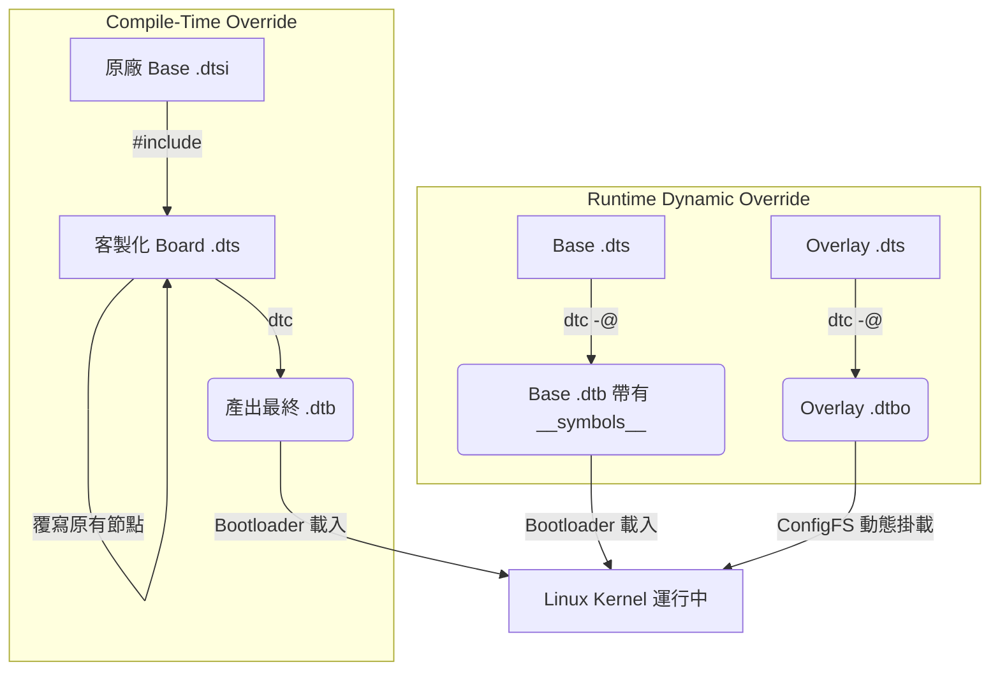
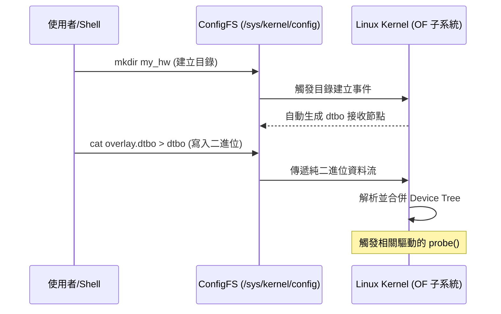
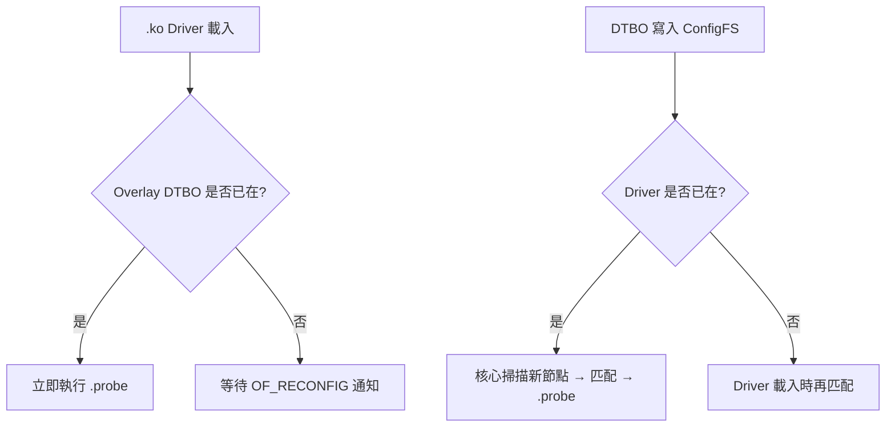
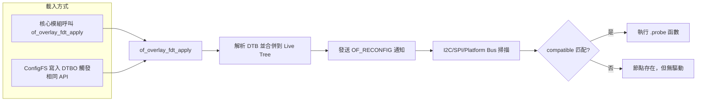
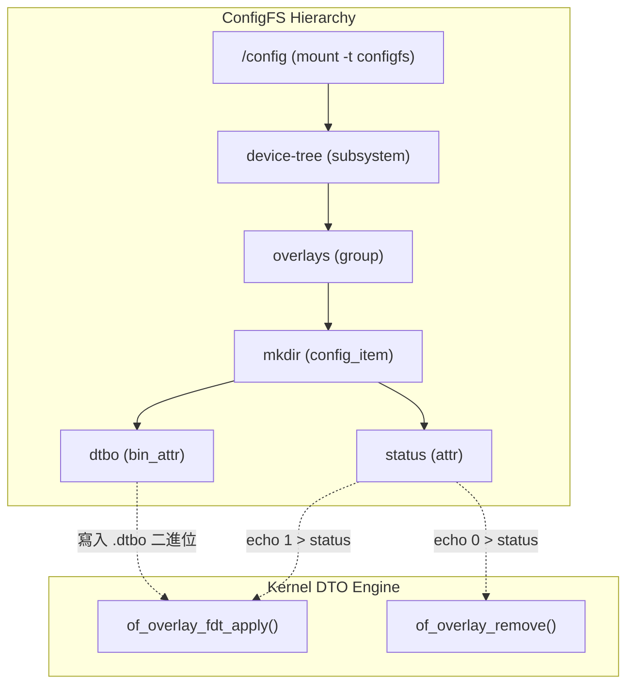
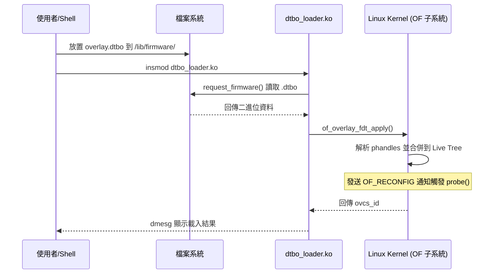

# Linux Device Tree Override 與 Overlay 機制完整指南

## 1. 什麼是 Device Tree？

**Device Tree (DT)** 是一種描述硬體拓撲結構的資料結構，廣泛用於 ARM、RISC-V 等非 x86 架構的 Linux 系統。它是一份「硬體說明書」，告訴核心在哪個位址有什麼裝置、使用哪些中斷、時脈頻率為何。

| 術語 | 全名 | 說明 |
|---|---|---|
| **DTS** | Device Tree Source | 人類可讀的文字檔（`.dts` / `.dtsi`），語法類似 C 的結構體 |
| **DTB** | Device Tree Blob | 二進位檔（`.dtb`），是 DTC 編譯後的結果，由 Bootloader 載入 |
| **DTBO** | Device Tree Blob Overlay | 二進位疊加檔（`.dtbo`），執行階段動態合併到主 DTB 中 |
| **DTC** | Device Tree Compiler | 編譯工具，將 DTS 編譯為 DTB/DTBO |
| **Binding** | — | 描述某類裝置應有哪些屬性的規範文件 |

核心運作原則：**後定義的屬性覆蓋先前的屬性，或動態合併新的硬體描述。**

### 一個簡單的 DTS 範例

```dts
/dts-v1/;

/ {
    compatible = "my_board,device";
    #address-cells = <1>;
    #size-cells = <1>;

    uart0: serial@10000000 {
        compatible = "ns16550";
        reg = <0x10000000 0x1000>;
        interrupts = <0>;
    };

    i2c1: i2c@10001000 {
        compatible = "snps,designware-i2c";
        reg = <0x10001000 0x1000>;
        #address-cells = <1>;
        #size-cells = <0>;
    };
};
```

> `uart0:` 和 `i2c1:` 是 **label（標籤）**，後續可以透過 `&uart0` 來參照這個節點並修改其屬性。

---

## 2. 為什麼需要 Override / Overlay？

在開發過程中，你可能會遇到以下場景：

| 場景 | 傳統做法 | 更好的做法 |
|---|---|---|
| 客製化開發板 | 複製原廠 DTS 並修改 | 使用 `#include` + Label 覆寫 |
| FPGA 動態重配置 | 重新編譯核心 DTB 並重開機 | Runtime 動態載入 DTBO |
| 偵錯新裝置 | 反覆修改 DTS → 重編核心 → 重開機 | 透過 ConfigFS 即時載入測試 |
| Raspberry Pi HAT | 手動編輯 config.txt | HAT EEPROM 自動載入 Overlay |

Override 機制分為兩大類：**編譯期覆寫 (Compile-Time)** 與 **執行階段動態覆寫 (Runtime DTO)**。

---

## 3. 基礎架構總覽



---

## 4. 編譯期覆寫 (Compile-Time Override)

適用於 **硬體固定不變** 的客製化開發板設計，是最基礎且最穩定的作法。

### 4.1 運作原理：Last Write Wins

DTC 由上往下解析原始碼，若同一節點的同一屬性被定義兩次，後方的值會覆蓋前方。

### 4.2 實作方式：Label 參照 (`&`)

假設原廠提供 `soc.dtsi`：

```dts
// soc.dtsi
uart1: serial@10001000 {
    compatible = "ns16550";
    reg = <0x10001000 0x1000>;
    status = "disabled";
};
```

客製化 `.dts` 中這樣覆寫：

```dts
#include "soc.dtsi"

&uart1 {
    status = "okay";      // 將 uart1 從 disabled 改為 okay
    clock-frequency = <50000000>;  // 新增屬性
};
```

編譯指令：

```bash
dtc -I dts -O dtb -o my_board.dtb my_board.dts
```

> 不需要 `-@` 參數，因為編譯期覆寫在編譯當下就已解析完成，不須動態符號解析。

---

## 5. 執行階段動態覆寫 (Device Tree Overlay, DTO)

DTO 允許在 **Linux 核心運行期間**，將局部的硬體描述動態疊加到現有的 Device Tree 中。適用於模組化擴充板、FPGA 熱插拔、HAT 裝置等場景。

### 5.1 運作流程

> **注意：** 下圖中的 ConfigFS 操作介面**並非 Linux mainline 核心的標準功能**。Mainline 核心僅提供 `of_overlay_fdt_apply()` 這類 Kernel-space API，必須撰寫核心模組才能呼叫（詳見 §14）。若要透過 Shell 指令操作，需依賴 BSP Patch（如 Xilinx linux-xlnx）或外掛 `dtbocfg.ko` 模組（詳見 §8）。



### 5.2 核心編譯需求

DTO 要在執行階段運作，核心編譯時必須具備以下條件：

| 核心選項 | 說明 | 必要性 |
|---|---|---|
| `CONFIG_OF` | 啟用 Device Tree 支援 | 必要（ARM 平台通常預設開啟） |
| `CONFIG_OF_OVERLAY` | 啟用 Device Tree Overlay 引擎 | **必要** |
| `CONFIG_OF_DYNAMIC` | 允許動態修改 Device Tree 節點 | **必要** |
| `CONFIG_OF_RESOLVE` | 允許 Overlay 解析 phandles 連結 | **必要** |
| `CONFIG_CONFIGFS_FS` | ConfigFS 虛擬檔案系統 | 使用 ConfigFS 介面時必要 |

透過 `make menuconfig` 設定路徑：

```
Device Drivers → Device Tree and Open Firmware support → Device Tree overlays
```

### 5.3 Base DTB 必須保留符號表

Base DTB 編譯時必須加上 `-@` 參數，保留 `__symbols__` 節點：

```bash
dtc -@ -I dts -O dtb -o my_board.dtb my_board.dts
```

`__symbols__` 包含所有 label 與完整路徑的對應表，讓 Overlay 可以透過 `&i2c1` 找到目標節點。

### 5.4 Overlay DTS 的撰寫規則

Overlay 原始檔有三個關鍵要點：

1. **`/plugin/;`**：告訴編譯器這是一個 Overlay
2. **`fragment`** 結構：每個 fragment 包含 `target` / `target-path` 與 `__overlay__`
3. **`&label` 語法**：編譯器會自動展開成 fragment 結構

**完整範例：**

```dts
/dts-v1/;
/plugin/;

&i2c1 {
    status = "okay";
    #address-cells = <1>;
    #size-cells = <0>;

    touchscreen@5d {
        compatible = "goodix,gt911";
        reg = <0x5d>;
        interrupt-parent = <&gpio>;
        interrupts = <17 2>;        // GPIO 17, falling edge
        irq-gpios = <&gpio 17 0>;
        reset-gpios = <&gpio 18 0>;
    };
};
```

編譯指令：

```bash
dtc -@ -I dts -O dtb -o touch.dtbo touch.dts
```

> 編譯 Overlay 時也建議加上 `-@`，讓後續可以再次被其他 Overlay 參照。

### 5.5 ConfigFS 載入步驟

> **⚠️ Mainline 核心無此介面**
>
> 下列步驟需要核心已內建 ConfigFS Overlay 支援（如 Xilinx linux-xlnx BSP）或已載入 `dtbocfg.ko` 的環境才能執行。標準 Linux mainline 核心**不提供** `/sys/kernel/config/device-tree/overlays/` 路徑。若你運行的是 mainline 核心，請見 §14。

```bash
# 1. 掛載 ConfigFS（若未掛載）
mount -t configfs none /sys/kernel/config

# 2. 確認目錄存在
ls /sys/kernel/config/device-tree/overlays/

# 3. 建立 Overlay 插槽
mkdir /sys/kernel/config/device-tree/overlays/touch

# 4. 寫入 DTBO（必須使用 cat，不可用 cp）
cat touch.dtbo > /sys/kernel/config/device-tree/overlays/touch/dtbo

# 5. 檢查 dmesg 確認是否成功
dmesg | tail

# 6. 驗證節點已加入系統樹
ls /proc/device-tree/ | grep touch

# 7. 卸載 Overlay
rmdir /sys/kernel/config/device-tree/overlays/touch
```

> **重要：為何使用 `cat` 而非 `cp`？**
>
> ConfigFS 是存在於 RAM 中的虛擬檔案系統，`dtbo` 節點只是一個資料接收介面。`cp` 會嘗試複製檔案權限、時間戳等中繼資料，甚至執行 `unlink/rename`，但 ConfigFS 不支援這些操作，會回傳 `Operation not permitted`。`cat >` 僅執行純粹的 `write()` 系統呼叫，逐 byte 將資料灌入核心介面。

---

## 6. 撰寫 Overlay 的兩種語法

撰寫 Overlay DTS 有兩種等價的語法，建議初學者直接使用 `&label` 簡潔寫法：

### 6.1 簡潔寫法（Label 參照）

```dts
/dts-v1/;
/plugin/;

&uart1 {
    status = "okay";
};

&i2c1 {
    status = "okay";
    mydevice@42 {
        compatible = "my,device";
        reg = <0x42>;
    };
};
```

### 6.2 完整寫法（Fragment 結構）

```dts
/dts-v1/;
/plugin/;

/ {
    fragment@0 {
        target = <&uart1>;
        __overlay__ {
            status = "okay";
        };
    };

    fragment@1 {
        target = <&i2c1>;
        __overlay__ {
            status = "okay";
            mydevice@42 {
                compatible = "my,device";
                reg = <0x42>;
            };
        };
    };
};
```

兩種方式編譯出的 DTBO 完全等價。`&label` 寫法會在編譯時自動擴展為 fragment 結構。

---

## 7. 驅動程式 (Driver) 與 Overlay 的互動

### 7.1 載入順序不受限制

Overlay 和 Driver 的載入順序**不影響最終結果**，因為核心支援 **延遲綁定 (Deferred Probing)**：



**情境一：先載入 Driver，再載入 Overlay**

1. `insmod goodix.ko` → 核心記錄此驅動支援 `goodix,gt911`
2. `cat touch.dtbo > .../dtbo` → 核心合併 Overlay
3. I2C 子系統發現新節點 → 比對 `compatible` → 匹配 `goodix,gt911`
4. 核心自動呼叫 `goodix_probe()`

**情境二：先載入 Overlay，再載入 Driver**

1. `cat touch.dtbo > .../dtbo` → 節點已加入系統樹，但無對應驅動
2. `modprobe goodix` → 核心掃描現有節點 → 匹配成功 → 立即 `probe()`

### 7.2 核心內部運作機制



---

## 8. dtbocfg.ko — 外掛 ConfigFS 方案

### 8.1 背景：為何需要 dtbocfg？

Linux 核心自 v3.19 起引入 DTO 引擎（`CONFIG_OF_OVERLAY`），但僅提供 **Kernel-space API**（如 `of_overlay_fdt_apply()`），**從未將 Userspace ConfigFS 介面合入 Mainline 核心**。Linux Foundation 雖曾在 2014 年 ELCE 提案，但始終未被採納。

`dtbocfg`（Device Tree Blob Overlay Configuration File System）由 **Ichiro Kawazome (ikwzm)** 於 2016 年以 **BSD 2-Clause** 授權釋出，以 Out-of-tree 核心模組形式填補了這個空缺。

- **專案位址：** https://github.com/ikwzm/dtbocfg
- **支援核心範圍：** Linux v4.4 ～ v6.6+

### 8.2 與 Mainline DTO 的對照

| 項目 | Mainline 核心 | dtbocfg.ko |
|---|---|---|
| Overlay 引擎 | `CONFIG_OF_OVERLAY=y`（內建） | 依賴 `CONFIG_OF_OVERLAY=y` |
| Userspace 介面 | **無**（僅 Kernel API） | ConfigFS 子系統自建 |
| ConfigFS 掛載點 | 無 | `/config/device-tree/overlays/<name>/` |
| 控制介面 | 無 | `dtbo`（二進位）+ `status`（0/1） |
| 佈署方式 | 核心編譯時靜態決定 | `insmod dtbocfg.ko` 動態載入 |

### 8.3 編譯與安裝

```bash
# 前置確認：核心已開啟 CONFIG_OF_OVERLAY
grep CONFIG_OF_OVERLAY /boot/config-$(uname -r) || grep CONFIG_OF_OVERLAY /lib/modules/$(uname -r)/config

# 安裝核心頭檔
apt-get install linux-headers-$(uname -r)

# 取得原始碼並編譯
git clone https://github.com/ikwzm/dtbocfg.git
cd dtbocfg
make

# 交叉編譯範例（ARM64）
make ARCH=arm64 CROSS_COMPILE=aarch64-linux-gnu-

# 載入模組
insmod dtbocfg.ko
# dmesg: dtbocfg: 0.1.1
# dmesg: dtbocfg: OK

# 掛載 ConfigFS
mount -t configfs none /config

# 確認介面就緒
ls -la /config/device-tree/overlays/
# drwxr-xr-x 2 root root 0 ... .
# drwxr-xr-x 3 root root 0 ... ..
```

### 8.4 內部架構



**核心資料結構：**

```c
struct dtbocfg_overlay_item {
    struct config_item  item;       // ConfigFS 節點
    int                 id;         // Overlay ID（-1 表示未載入）
    void*               dtbo;       // 暫存的 DTB 二進位資料
    int                 dtbo_size;  // DTB 資料長度
};
```

### 8.5 完整生命週期

| 步驟 | 使用者操作 | 核心行為 |
|---|---|---|
| 建立節點 | `mkdir /config/device-tree/overlays/mydev` | 配置 `dtbocfg_overlay_item`，`id = -1` |
| 寫入 DTB | `cat mydev.dtbo > .../mydev/dtbo` | `kmemdup()` 複製二進位資料到核心空間 |
| 啟用 Overlay | `echo 1 > .../mydev/status` | 呼叫 `of_overlay_fdt_apply()` |
| 停用 Overlay | `echo 0 > .../mydev/status` | 呼叫 `of_overlay_remove()`，`id` 恢復為 -1 |
| 刪除節點 | `rmdir .../mydev` | 自動釋放 Overlay 再釋放記憶體 |

### 8.6 跨核心版本相容性

| 核心版本 | 使用的 Kernel API |
|---|---|
| v4.4 ～ v4.6 | `of_fdt_unflatten_tree()` + `of_resolve_phandles()` + `of_overlay_create()` |
| v4.7 ～ v4.14 | `of_fdt_unflatten_tree()`（新版簽名）+ `of_resolve_phandles()` + `of_overlay_create()` |
| v4.15 ～ v4.16 | `of_fdt_unflatten_tree()` + `of_overlay_apply()`（附 `ovcs_id`） |
| v4.17 ～ v6.5 | **`of_overlay_fdt_apply()`**（直接傳入 flat DTB，免手動 unflatten） |
| v6.6 以上 | `of_overlay_fdt_apply()`（新版簽名，多一個 `NULL` 結尾參數） |

### 8.7 dtbocfg 的操作範例

```bash
# 建立 Overlay 節點
mkdir /config/device-tree/overlays/uio0

# 撰寫 Overlay DTS
cat > uio0.dts << 'EOF'
/dts-v1/;
/plugin/;
/ {
    fragment@0 {
        target-path = "/amba";
        __overlay__ {
            #address-cells = <0x1>;
            #size-cells = <0x1>;
            uio0@43c10000 {
                compatible = "generic-uio";
                reg = <0x43c10000 0x1000>;
                interrupts = <0x0 0x1d 0x4>;
            };
        };
    };
};
EOF

# 編譯 DTBO
dtc -I dts -O dtb -o uio0.dtbo uio0.dts

# 寫入 DTBO
cat uio0.dtbo > /config/device-tree/overlays/uio0/dtbo

# 啟用 Overlay
echo 1 > /config/device-tree/overlays/uio0/status
ls -la /dev/uio*       # 應出現 /dev/uio0

# 停用 Overlay
echo 0 > /config/device-tree/overlays/uio0/status

# 或直接刪除目錄（等同於停用 + 釋放）
rmdir /config/device-tree/overlays/uio0
```

### 8.8 dtbocfg 的限制

1. **非 Mainline 模組**：無法透過套件管理器更新，每次核心升級後需手動重新編譯
2. **核心 API 變動風險**：內部 API 無穩定 ABI 保證，新版核心可能出現編譯錯誤
3. **與 BSP ConfigFS 衝突**：若核心已內建 ConfigFS Overlay（如 Xilinx linux-xlnx），可能與 dtbocfg 衝突
4. **SELinux / AppArmor**：ConfigFS 操作受 LSM 管控，需確認政策允許寫入

---

## 9. 真實範例：I2C 觸控螢幕 (GT911)

以下以一個完整的 I2C 觸控螢幕為例，展示從 DTS 撰寫到裝置運作的全部流程。

### 9.1 撰寫 Overlay DTS

```dts
// gt911_overlay.dts
/dts-v1/;
/plugin/;

&i2c1 {
    status = "okay";
    #address-cells = <1>;
    #size-cells = <0>;

    touchscreen@5d {
        compatible = "goodix,gt911";
        reg = <0x5d>;
        interrupt-parent = <&gpio>;
        interrupts = <17 2>;          // GPIO 17, IRQ_TYPE_EDGE_FALLING
        irq-gpios = <&gpio 17 0>;     // GPIO_ACTIVE_HIGH
        reset-gpios = <&gpio 18 0>;   // GPIO_ACTIVE_HIGH
    };
};
```

### 9.2 編譯 DTBO

```bash
dtc -@ -I dts -O dtb -o gt911.dtbo gt911_overlay.dts
```

### 9.3 載入流程

```bash
# 載入驅動模組（可先可後）
modprobe goodix

# 掛載 ConfigFS
mount -t configfs none /sys/kernel/config 2>/dev/null

# 建立 Overlay 插槽
mkdir -p /sys/kernel/config/device-tree/overlays/gt911

# 注入 DTBO
cat gt911.dtbo > /sys/kernel/config/device-tree/overlays/gt911/dtbo

# 檢查結果
dmesg | tail -5
ls /dev/input/event*
```

### 9.4 確認裝置狀態

```bash
# 檢查 I2C 位址是否被驅動佔用（UU 表示有驅動）
i2cdetect -y 1

# 檢查 GPIO 狀態
cat /sys/kernel/debug/gpio | grep 17

# 檢查 Overlay 狀態
cat /sys/kernel/config/device-tree/overlays/gt911/status
```

### 9.5 卸載

```bash
rmdir /sys/kernel/config/device-tree/overlays/gt911
```

---

## 10. 自動化腳本

以下腳本整合完整流程，包含錯誤檢查與狀態回饋：

```bash
#!/bin/bash
# load_touch_overlay.sh — 自動編譯載入 GT911 Overlay

DTS_SOURCE="gt911_overlay.dts"
DTBO_OUTPUT="gt911.dtbo"
MODULE_NAME="goodix"
OVERLAY_NAME="gt911"
CONFIGFS_PATH="/sys/kernel/config/device-tree/overlays"

GREEN='\033[0;32m'; RED='\033[0;31m'; NC='\033[0m'
log_info() { echo -e "${GREEN}[INFO]${NC} $1"; }
log_err() { echo -e "${RED}[ERROR]${NC} $1"; exit 1; }

[ "$EUID" -ne 0 ] && log_err "請使用 root 權限執行"
[ ! -f "$DTS_SOURCE" ] && log_err "找不到 $DTS_SOURCE"

log_info "編譯 Device Tree Overlay..."
dtc -@ -I dts -O dtb -o "$DTBO_OUTPUT" "$DTS_SOURCE" || log_err "DTC 編譯失敗"

[ ! -d "/sys/kernel/config" ] && { mount -t configfs none /sys/kernel/config; }
[ ! -d "$CONFIGFS_PATH" ] && log_err "核心不支援 CONFIG_OF_OVERLAY"

if ! lsmod | grep -q "$MODULE_NAME"; then
    log_info "載入驅動模組 $MODULE_NAME..."
    modprobe "$MODULE_NAME" || log_err "無法載入 $MODULE_NAME"
fi

[ -d "$CONFIGFS_PATH/$OVERLAY_NAME" ] && rmdir "$CONFIGFS_PATH/$OVERLAY_NAME"
mkdir -p "$CONFIGFS_PATH/$OVERLAY_NAME" || log_err "無法建立 ConfigFS 目錄"

log_info "注入 DTBO..."
cat "$DTBO_OUTPUT" > "$CONFIGFS_PATH/$OVERLAY_NAME/dtbo" || log_err "寫入失敗"

sleep 1
STATUS=$(cat "$CONFIGFS_PATH/$OVERLAY_NAME/status")
log_info "Overlay 狀態: $STATUS"
dmesg | grep -i "$MODULE_NAME" | tail -n 1
log_info "完成！執行 ls /dev/input/event* 確認裝置"
```

---

## 11. 執行階段 Override 的限制與挑戰

儘管 DTO 提供了極大的彈性，在實務上仍面臨以下挑戰：

### 11.1 Mainline 態度保守

主線核心對 Userspace 動態載入支援有限，ConfigFS 介面始終未被合入。開發者需依賴晶片商 BSP Patch（如 Xilinx linux-xlnx）、自行編譯 `dtbocfg.ko`，或遵循 mainline 原生做法撰寫核心模組透過 API 載入（詳見 §14）。

### 11.2 Pinmux 衝突

若 Base DTB 已將某接腳分配給特定功能（如 LED），動態 Overlay 嘗試將其改為另一功能（如 SPI）極易失敗或導致 Kernel Panic，因為資源已被原有驅動鎖定。

### 11.3 卸載不穩定

刪除 ConfigFS 目錄來卸載硬體時，若相關驅動的 `remove()` 函數未正確釋放記憶體或中斷，系統很容易崩潰。

### 11.4 電源與時鐘依賴

Linux 在開機晚期會關閉未使用的 Clock/Regulator 以省電。若 Overlay 延遲載入且依賴已關閉的時鐘，硬體將無法啟動。解決方案是在 Base DTB 中將相關時鐘設為 `clock-critical`。

### 11.5 唯加不減 (Additive Mostly)

DTO 的設計邏輯為新增或覆寫屬性，**極難且不支援**將龐大的現有硬體節點徹底刪除。

---

## 12. 常見問題 (FAQ)

### Q1: 為什麼用 `cat` 而不是 `cp`？

`cp` 會嘗試獲取來源檔案的權限與時間戳並套用到目標。但在 ConfigFS 這種虛擬檔案系統中，這些屬性是唯讀的，`cp` 會報 `Operation not permitted`。`cat >` 只單純傳遞資料流，最為穩定可靠。

### Q2: 先載入 `.ko` 還是先載入 Overlay？

**都可以。** 核心支援延遲綁定。無論哪個先到，核心都會在兩者都就緒時自動觸發 `probe()`。

### Q3: 如何卸載 Overlay？

兩種方式：
```bash
# 方式一：刪除目錄（涵蓋停用 + 釋放）
rmdir /sys/kernel/config/device-tree/overlays/touch

# 方式二（dtbocfg 限定）：寫入 0 到 status
echo 0 > /config/device-tree/overlays/touch/status
```

核心會自動撤銷該 DT 片段，並觸發 Driver 的 `remove()` 函式。

### Q4: 為什麼不需要對 Driver 做特別處理？

因為 Linux 核心的 Bus 子系統（I2C、SPI、Platform）具有監聽機制。當 Overlay 合併後：
1. `of_overlay_fdt_apply()` 被調用
2. 核心發送 `OF_RECONFIG` 通知
3. Bus 子系統為新節點建立裝置（如 `i2c_client`）
4. 核心自動比對 `compatible` 字串，找到已註冊的驅動
5. 自動觸發 `probe()`

### Q5: 快速排錯檢查表

| 症狀 | 可能原因 | 解決方式 |
|---|---|---|
| 寫入 DTBO 沒反應 | 核心沒編 `CONFIG_OF_OVERLAY` | 重新編譯核心 |
| `dmesg` 報 `build_phandle_data` 錯誤 | Base DTB 沒加 `-@` 編譯 | 重新用 `dtc -@` 編譯 Base DTB |
| Probe 失敗 | GPIO 被其他功能佔用 | 檢查 `/sys/kernel/debug/gpio` |
| 找不到 ConfigFS 路徑 | ConfigFS 未掛載 | `mount -t configfs none /sys/kernel/config` |
| `rmdir` 時系統崩潰 | Driver 的 `remove()` 有問題 | 檢查驅動程式碼 |

### Q6: 我的 mainline 核心沒有 ConfigFS 路徑，如何使用 DTO？

撰寫一個核心模組呼叫 `of_overlay_fdt_apply()`，如 §14 的 `dtbo_loader.ko` 範例。流程：

1. 編譯 `.dtbo` 檔案放到 `/lib/firmware/`
2. `insmod dtbo_loader.ko` — 模組自動讀取 DTBO 並注入核心
3. `rmmod dtbo_loader` — 自動呼叫 `of_overlay_remove()` 卸載

不需要 ConfigFS，也不需要任何 BSP Patch，完全依賴 mainline 核心內建 API。

---

## 13. 機制比較總表

| 比較項目 | 編譯期覆寫 | 執行階段 DTO (Mainline Kernel API) | dtbocfg.ko 外掛方案 |
|---|---|---|---|
| **套用時機** | 系統編譯階段 | 開機後（僅 Kernel API） | 開機後 (Userspace ConfigFS) |
| **目標檔案** | `dts` / `dtsi` | Kernel 內部 DTB | `.dtbo`（寫入 ConfigFS dtbo）|
| **使用者介面** | DTS 原始碼編輯 | 無（需撰寫核心模組） | `mkdir` + `cat` + `echo` |
| **適用情境** | 硬體固定、主機板客製化 | 核心模組動態硬體 | 模組化擴充板、FPGA 熱插拔 |
| **穩定度** | 極高 | 中（與核心版本綁定） | 中～低（Out-of-tree 模組） |
| **修改彈性** | 低（需重編譯核心） | 中（需撰寫核心程式碼） | 高（Shell 指令即可操作） |
| **核心依賴** | 標準 DTC | `CONFIG_OF_OVERLAY=y` | `CONFIG_OF_OVERLAY=y` + 載入 dtbocfg.ko |
| **Mainline 狀態** | ✅ 標準流程 | ✅ 已合入（僅 Kernel API） | ❌ 未合入，需自行編譯 |

---

## 14. Mainline 原生做法：直接使用 Kernel API

### 14.1 背景

Linux mainline 核心自 v3.19 起提供完整的 DTO 引擎（`CONFIG_OF_OVERLAY`），但 **ConfigFS Userspace 介面從未合入主線**。核心開發社群基於以下原因對此保持保守態度：

- **穩定性風險**：動態修改已運行的 Device Tree 可能影響周邊驅動的正常運作
- **ABI 承諾問題**：一旦 ConfigFS 介面合入主線，就必須永久向後相容
- **替代方案存在**：可透過核心模組呼叫內部 API 達到同等效果

因此，標準 mainline 的做法是 **撰寫一個核心模組來呼叫 `of_overlay_fdt_apply()`**，將 DTBO 二進位資料從檔案系統（透過 `request_firmware()`）讀取後注入核心。

### 14.2 Kernel API 原型

自 v4.17 起，API 簽名穩定如下：

```c
int of_overlay_fdt_apply(const void *overlay_fdt, u32 overlay_fdt_size, int *ovcs_id);
```

| 參數 | 說明 |
|------|------|
| `overlay_fdt` | 指向 flat DTB 資料，即 `.dtbo` 檔案的完整二進位內容 |
| `overlay_fdt_size` | 資料長度（bytes） |
| `ovcs_id` | 輸出參數，記錄本次 Overlay 的唯一 ID，供後續卸載使用 |

回傳值：`0` 表示成功，負值為標準 errno 錯誤碼。

卸載 API：

```c
int of_overlay_remove(int *ovcs_id);
```

> **v6.6 以上注意：** 新版簽名多一個 `NULL` 結尾參數，詳見 §8.6 核心版本相容性表格。

### 14.3 運作流程



### 14.4 完整範例：dtbo_loader.ko

支援載入與卸載的完整核心模組：

```c
// dtbo_loader.c
#include <linux/module.h>
#include <linux/of.h>
#include <linux/firmware.h>

static char *dtbo_path = "/lib/firmware/overlay.dtbo";
module_param(dtbo_path, charp, 0444);
MODULE_PARM_DESC(dtbo_path, "Path to .dtbo file");

static int ovcs_id = -1;

static int __init dtbo_loader_init(void)
{
    const struct firmware *fw;
    int ret;

    ret = request_firmware(&fw, dtbo_path, NULL);
    if (ret) {
        pr_err("Failed to load %s: %d\n", dtbo_path, ret);
        return ret;
    }

    ret = of_overlay_fdt_apply(fw->data, fw->size, &ovcs_id);
    if (ret)
        pr_err("of_overlay_fdt_apply failed: %d\n", ret);
    else
        pr_info("Overlay loaded (ovcs_id=%d)\n", ovcs_id);

    release_firmware(fw);
    return ret;
}

static void __exit dtbo_loader_exit(void)
{
    int ret;

    if (ovcs_id < 0)
        return;

    ret = of_overlay_remove(&ovcs_id);
    if (ret)
        pr_err("of_overlay_remove failed: %d\n", ret);
    else
        pr_info("Overlay removed (ovcs_id=%d)\n", ovcs_id);
}

module_init(dtbo_loader_init);
module_exit(dtbo_loader_exit);
MODULE_LICENSE("GPL");
MODULE_DESCRIPTION("Load DTBO via mainline kernel API");
```

### 14.5 Makefile

```makefile
obj-m += dtbo_loader.o
KDIR := /lib/modules/$(shell uname -r)/build
all:
	$(MAKE) -C $(KDIR) M=$(PWD) modules
clean:
	$(MAKE) -C $(KDIR) M=$(PWD) clean
```

### 14.6 操作步驟

```bash
# 1. 確認核心支援 DTO
zgrep CONFIG_OF_OVERLAY /proc/config.gz

# 2. 確認 Base DTB 包含 __symbols__（必須以 dtc -@ 編譯）
dtc -I dtb -O dts /sys/firmware/fdt | head -5
# 應看到 / { ...; __symbols__ { ... }; };

# 3. 撰寫 Overlay DTS
cat > overlay.dts << 'EOF'
/dts-v1/;
/plugin/;
&{/amba} {
    uio0@43c10000 {
        compatible = "generic-uio";
        reg = <0x43c10000 0x1000>;
        interrupts = <0 29 4>;
    };
};
EOF

# 4. 編譯 DTBO
dtc -@ -I dts -O dtb -o overlay.dtbo overlay.dts

# 5. 放到 firmware 搜尋路徑
cp overlay.dtbo /lib/firmware/

# 6. 編譯核心模組
make

# 7. 載入（會自動呼叫 request_firmware + of_overlay_fdt_apply）
insmod dtbo_loader.ko

# 8. 確認結果
dmesg | tail -5
ls /dev/uio*

# 9. 卸載（自動呼叫 of_overlay_remove）
rmmod dtbo_loader
```

### 14.7 Mainline 原生 vs dtbocfg 對照

| 項目 | Mainline 原生 | dtbocfg.ko |
|------|--------------|------------|
| **Userspace 操作** | **無**，需自行撰寫核心模組 | `mkdir` + `cat` + `echo` |
| **載入 API** | `of_overlay_fdt_apply()` | 上層包裝為 ConfigFS 操作 |
| **卸載 API** | `of_overlay_remove()` | `rmdir` 或 `echo 0 > status` |
| **核心依賴** | `CONFIG_OF_OVERLAY=y` | `CONFIG_OF_OVERLAY=y` |
| **維護狀態** | 隨 mainline 核心自動更新 | Out-of-tree，核心升級需手動修改 |
| **動態切換** | 需重新載入模組或修改模組參數 | Shell 指令即可即時切換 |
| **適合場景** | 開機階段固定載入特定 Overlay | 開發偵錯、FPGA 熱插拔 |

### 14.8 管理多個 Overlay 的擴充框架

若需同時管理多個 Overlay，可擴充模組來支援：

```c
// 多 Overlay 管理框架（簡化範例）
#define MAX_OVERLAYS 8
static int ovcs_ids[MAX_OVERLAYS];
static int overlay_count;

int load_overlay(const char *path)
{
    const struct firmware *fw;
    int ret;

    if (overlay_count >= MAX_OVERLAYS)
        return -ENOSPC;

    ret = request_firmware(&fw, path, NULL);
    if (ret)
        return ret;

    ret = of_overlay_fdt_apply(fw->data, fw->size,
                               &ovcs_ids[overlay_count]);
    release_firmware(fw);
    return ret == 0 ? overlay_count++ : ret;
}

void unload_all(void)
{
    while (overlay_count > 0) {
        overlay_count--;
        of_overlay_remove(&ovcs_ids[overlay_count]);
    }
}
```

### 14.9 適用情境與建議

| 情境 | 推薦做法 | 原因 |
|------|---------|------|
| 產品量產，硬體固定 | 編譯期覆寫（§4） | 最穩定，無動態風險 |
| 開機初期需載入 Overlay | Mainline 原生模組（§14） | 搭配 initramfs，開機即載 |
| 開發階段頻繁測試 | dtbocfg.ko（§8）或 BSP ConfigFS | Shell 操作快速迭代 |
| FPGA 動態重配置 | dtbocfg.ko（§8） | 執行階段動態切換 |
| 核心模組無法載入的環境 | Buildroot/Yocto 預先編譯進核心 | 無需模組載入機制 |

---

## 附錄：名詞對照表

| 英文 | 中文 | 說明 |
|---|---|---|
| Device Tree | 裝置樹 / 設備樹 | 描述硬體的資料結構 |
| Overlay | 疊加 / 覆寫 | 動態合併到主樹的硬體片段 |
| Fragment | 片段 | Overlay 中的一個修改單元 |
| Label | 標籤 | DTS 中用 `name:` 語法定義的參照點 |
| Phandle | 指向代碼 | DTB 二進位中指向特定節點的數值 ID |
| Compatible | 相容性字串 | 核心用來匹配驅動與裝置的字串 |
| ConfigFS | 配置檔案系統 | 虛擬檔案系統，用於核心參數的 Userspace 操作 |
| Symbol | 符號 | DTB 中 label 與路徑的對應表 |
| Probe | 探測 (驅動載入) | 核心呼叫驅動初始化函式的程序 |
| Deferred Probing | 延遲探測 | 驅動等待必要資源就緒後再載入的機制 |
