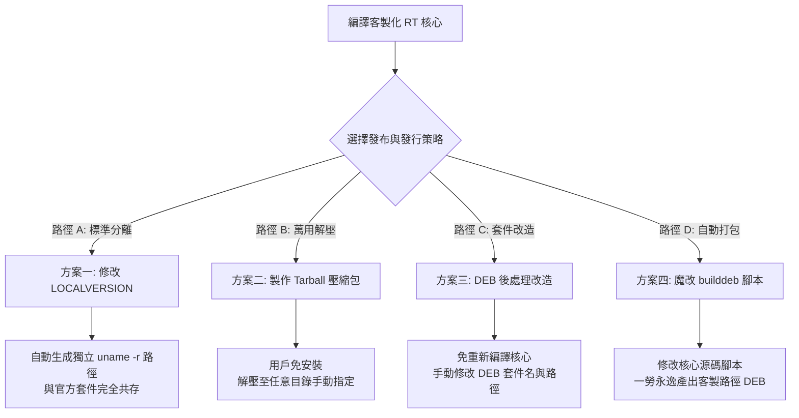

## 以 Jetson AGX 平台為範例
 Jetson AGX 客製化核心 (PREEMPT_RT) 標頭檔套件衝突解決方案與自訂安裝路徑指南


在 NVIDIA Jetson 的 L4T (Linux for Tegra) 環境中，官方預設的 `nvidia-l4t-kernel` 與 `nvidia-l4t-kernel-headers` 套件已佔用了系統標準的內核路徑（例如 `/lib/modules/$(uname -r)/build` 與 `/usr/src/linux-headers-...`）。

當編譯客製化的 **PREEMPT_RT（即時核心）** 並使用 `make bindeb-pkg` 產生標頭檔時，若直接安裝會發生嚴重的檔案路徑衝突。由於 RT 核心與 Non-RT 核心的底層鎖定機制不同，**兩者的標頭檔絕對不能混用**，否則會導致外掛模組（Out-of-tree modules）編譯失敗或核心恐慌（Kernel Panic）。

本文件提供完整且詳細的解決方案，協助開發團隊解決套件衝突，並實現讓用戶自訂安裝路徑的需求。

## 流程與架構總覽

下列流程圖展示了從客製化核心編譯完成後，根據不同的部署需求可以選擇的四種處理路徑：

程式碼片段



## 解決方案對比

|**方案**|**適用情境**|**優點**|**缺點**|**靈活性**|
|---|---|---|---|---|
|**方案一：LOCALVERSION**|標準發布，不介意改變核心版本後綴。|最乾淨、完全符合標準 Debian 規範，不影響系統。|會改變 `uname -r` 的輸出名稱。|高|
|**方案二：Tarball 壓縮包**|用戶需要完全自由指定目錄，不想安裝系統套件。|不需透過 `dpkg` 安裝、不污染系統、靈活度最高。|用戶編譯外掛模組時需手動指定路徑。|極高|
|**方案三：DEB 後處理改造**|核心名稱必須與官方一致，但想以 `.deb` 發布。|不需要重新編譯核心，可直接修正現有的衝突 deb。|需要手動或透過指令碼進行解包與再打包。|中|
|**方案四：魔改 builddeb**|需要頻繁、自動化編譯並產出客製化路徑的 DEB。|設定一次後一勞永逸，編譯完直接輸出自訂路徑套件。|需要修改核心源碼包內部的打包腳本。|中高|

## 方案詳細實作步驟

### 方案一：修改 `LOCALVERSION`（最標準的核心分離法）

這是 Linux 核心開發中最正統的做法。透過改變核心版本的識別名稱，讓 RT 核心與官方 Non-RT 核心的路徑完全錯開。

1. 進入核心配置介面：       
    ```bash
    make menuconfig
    ```
    
2. 導航至 **General setup** -> **Local version - append to kernel release**。
    
3. 輸入客製化的後綴（必須帶有 `-rt` 以資識別），例如：    
    ```
    -tegra-rt
    ```
    
    _(或直接在 `.config` 修改 `CONFIG_LOCALVERSION="-tegra-rt"`)_
    
4. 執行編譯與打包：    
    ```bash
    make bindeb-pkg
    ```
    

- **結果**：產生的標頭檔套件名稱將變更為 `linux-headers-5.10.120-tegra-rt`，檔案會自動安裝至 `/usr/src/linux-headers-5.10.120-tegra-rt/`，與 NVIDIA 官方路徑完全錯開，`dpkg -i` **絕不衝突**。
    

### 方案二：萬用標頭檔壓縮包（最靈活、免安裝）

如果用戶不希望使用 `dpkg` 安裝套件，而是想把標頭檔放在各自的專案目錄（如 `~/projects/rt-headers/`），可將標頭檔打包成 Tarball。

> ⚠️ **重要提示**：外掛模組編譯不僅需要 `.h` 檔，還需要編譯過程中產生的工具鏈與符號表。

在開發主機編譯完核心後，執行以下指令碼來篩選並製作萬用壓縮包：

```bash
# 1. 建立暫存目錄
mkdir -p ./jetson_rt_headers

# 2. 複製核心原始碼中的基本結構與設定
cp --parents .config Module.symvers Makefile ./jetson_rt_headers/
cp -a --parents include/ ./jetson_rt_headers/
cp -a --parents arch/arm64/include/ ./jetson_rt_headers/

# 3. 複製編譯工具鏈所需的必要腳本（此步驟對 OOT 模組編譯至關重要）
cp -a --parents scripts/ ./jetson_rt_headers/
cp -a --parents tools/ ./jetson_rt_headers/

# 4. 打包成 Tarball
tar -czvf jetson-agx-rt-headers.tar.gz -C jetson_rt_headers .
```

- **交付成果**：直接提供 `jetson-agx-rt-headers.tar.gz` 給用戶。用戶可以將其解壓至**任何路徑**使用。
    

### 方案三：DEB 套件後處理改造（不需重新編譯核心）

如果已經用 `make bindeb-pkg` 產出了 `linux-headers-*.deb`，且不想要重新花時間編譯核心，可以直接「解剖」該 deb 檔，更換其名稱與安裝路徑。

1. **建立解包暫存目錄並提取內容**：    
    ```bash
    mkdir -p unpacked
    dpkg-deb -x linux-headers-xxx.deb unpacked
    dpkg-deb -e linux-headers-xxx.deb unpacked/DEBIAN
    ```
    
2. **修改套件元數據**：
    
    編輯 `unpacked/DEBIAN/control`，將 `Package:` 欄位修改為自訂名稱，避免與系統原有套件打架：    
    ```
    Package: jetson-custom-rt-headers
    ```
    
3. **移除衝突的軟連結並移動路徑**：    
    ```bash
    # 移除會導致 dpkg 報錯的 modules 軟連結
    rm -rf unpacked/lib/modules/
    
    # 將預設的 usr/src 路徑移到自訂位置 (例如 /opt/custom-rt/)
    mkdir -p unpacked/opt/custom-rt/
    mv unpacked/usr/src/linux-headers-* unpacked/opt/custom-rt/linux-headers-rt
    ```
    
1. **重新打包成新的 DEB**：    
    ```bash
    dpkg-deb -b unpacked jetson-custom-rt-headers.deb
    ```
    

### 方案四：直接魔改核心內建打包腳本（自動化客製）

若需要頻繁編譯核心，並希望 `make bindeb-pkg` 直接輸出符合自訂路徑、不衝突的核心套件，可以直接修改 Linux 核心原始碼內的打包腳本。

1. 開啟核心原始碼中的 Debian 打包腳本：
    
    - 檔案路徑：`scripts/package/builddeb`
        
2. 搜尋 `linux-headers` 關鍵字，定位到處理標頭檔封裝的區塊（通常會有 `destdir=$objtree/debian/linux-headers...`）。
    
3. **修改安裝路徑**：將原本寫入 `/usr/src/` 的設定，修改為目標自訂路徑。
    
    ```bash
    # 修改前：
    # destdir="$tmpdir/usr/src/linux-headers-$version"
    
    # 修改後：（改成您希望用戶存放的位置，例如 /opt/jetson-rt/）
    destdir="$tmpdir/opt/jetson-rt/linux-headers-$version"
    ```
    
4. **關閉軟連結建立**：在該腳本下方，找到建立 `/lib/modules/$version/build` 軟連結的指令（通常是 `ln -sf`），將其**註解掉**或**刪除**，以防止其與系統環境衝突。
    
5. 重新執行 `make bindeb-pkg` 即可。
    

## 用戶端使用指南（如何指定位置編编译模組）

不論採用上述哪一種方案，用戶在拿到客製化標頭檔後，編譯自己的外掛驅動程式（Out-of-tree 模組）時，皆須在 `Makefile` 或編譯指令中明確指向該標頭檔路徑。

### 示範：手動指定標頭檔路徑進行編譯

假設用戶將標頭檔存放在 `/opt/jetson-rt/linux-headers-rt/` 或專案目錄 `~/my-headers/` 下，編譯指令如下：

```bash
# 語法：make -C <標頭檔絕對路徑> M=$PWD modules
make -C /opt/jetson-rt/linux-headers-rt/ M=$PWD modules
```

### 標準外掛模組 `Makefile` 撰寫範例

為了讓用戶既能支援系統預設路徑，又能彈性自訂位置，建議提供如下結構的 `Makefile` 給用戶：

```Makefile
# 如果用戶沒有在環境變數或命令列指定 KDIR，則預設指向當前系統的核心建置路徑
KDIR ?= /lib/modules/$(shell uname -r)/build

obj-m += my_driver.o

all:
	$(MAKE) -C $(KDIR) M=$(PWD) modules

clean:
	$(MAKE) -C $(KDIR) M=$(PWD) clean
```

**用戶自訂路徑編編方式：**

```bash
make KDIR=/opt/jetson-rt/linux-headers-rt/
```

## ⚠️ 開發注意事項

1. **`vermagic` 與 `module_layout` 檢查**：
    
    編譯外掛模組時使用的標頭檔，其內部的 `.config`（特別是 `CONFIG_PREEMPT_RT`、`CONFIG_MODULES` 等核心配置）必須與 Jetson 當前運行中的核心完全一致。否則模組在執行 `insmod` 時會跳出 `Invalid module format` 錯誤。
    
2. **NVIDIA 官方 Out-of-tree 驅動（如 nvgpu）**：
    
    Jetson 的 GPU 驅動（nvgpu）通常也是以外掛模組形式存在。如果將系統切換為 PREEMPT_RT 核心，NVIDIA 官方原本自帶的 GPU 模組將無法載入。必須使用此份產出的 **RT 標頭檔**，重新編譯 NVIDIA 官方釋出的 `nvgpu` 核心源碼，GPU 才能在 RT 環境下正常運作。