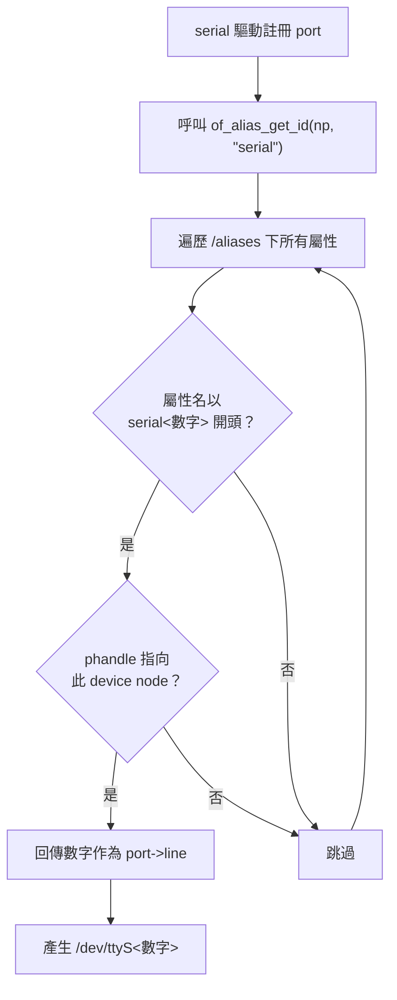

## 1. 背景與核心觀念

在 Linux 系統中，當系統載入 8250 系列（或其他 UART）驅動程式時，核心 (Kernel) 會依據硬體偵測的順序，自動分配字元裝置節點，預設名稱為 `/dev/ttyS0`、`/dev/ttyS1` 以此類推。

**核心法則：**

- **Kernel 擁有命名權：** 核心分配的 `ttyS*` 是硬體的「真實名稱」，與主/次裝置代碼 (Major/Minor Number) 綁定。
    
- **使用者空間 (Userspace) 只能做別名：** 若不修改底層核心設定，我們無法、也不應該竄改已生成的 `ttyS*` 名稱，僅能透過建立軟連結 (Symbolic Link) 來給予硬體「別名」。
    

要達成跳躍式命名或固定綁定硬體，需依據您的**硬體架構**選擇以下兩種標準方案。

## 2. 方案 A：使用 Device Tree (適用於 ARM / RISC-V 嵌入式系統)

如果您的硬體平台（如 NXP i.MX, Rockchip, Raspberry Pi 等）依賴 Device Tree (DTS) 來描述硬體，這是最根本且原生的作法。此方法會直接改變 Kernel 生成的 `ttyS*` 序號。

### 設定方式

修改設備樹原始檔（`.dts` 或 `.dtsi`），在根節點下的 `aliases` 區塊中，將底層的 UART 硬體節點對應到您期望的編號：

```d
/ {
    aliases {
        /* 將特定的硬體節點強制對應到 ttyS1, ttyS4, ttyS5, ttyS6 */
        serial1 = &uart0;  
        serial4 = &uart1;  
        serial5 = &uart2;  
        serial6 = &uart3;  
    };
};
```

> **注意：** `&uart0` 等標籤必須符合您平台 DTS 中定義的硬體實體。修改完畢後需重新編譯 `.dtb` 檔案並替換，重開機即生效。

### 機制原理：為何是 `serialN` 而不是 `uartN`？

初次看到 `serial1 = &uart0` 的寫法，你可能會疑惑：為什麼別名前綴必須是 `serial`？寫 `uart1 = &uart0` 可以嗎？

**答案是不行。** 這不是 Device Tree 的通用規則，而是 kernel 各子系統主動查詢 aliases 的結果。

#### 查詢流程

Kernel 提供一個通用 API — `of_alias_get_id()`，讓各子系統從 `/aliases` 中查找屬於自己的編號。serial 子系統傳入的參數是 `"serial"`：



#### 核心 API：`of_alias_get_id()`

定義於 `drivers/of/base.c`：

```c
int of_alias_get_id(struct device_node *np, const char *stem);
```

- `np`：要查詢的硬體節點（如 `uart0`）
- `stem`：Alias 前綴字串（如 `"serial"`）
- 回傳值：比對成功回傳編號，否則回傳負數

serial 子系統在 `drivers/tty/serial/serial_core.c` 中實際呼叫：

```c
id = of_alias_get_id(np, "serial");
if (id >= 0)
    port->line = id;  /* 強制指定 ttyS 編號 */
```

#### 各子系統的 alias 約定

這不是 serial 的專利。每個 kernel 子系統都會用不同的 `stem` 查詢 aliases：

| 子系統 | Alias 格式 | Kernel 查詢呼叫 | 產生的名稱 |
|--------|-----------|----------------|-----------|
| Serial | `serial0`, `serial1`... | `of_alias_get_id(np, "serial")` | `/dev/ttyS0` |
| Ethernet | `ethernet0`, `ethernet1`... | `of_alias_get_id(np, "ethernet")` | `eth0` |
| I2C | `i2c0`, `i2c1`... | `of_alias_get_id(np, "i2c")` | `/dev/i2c-0` |
| SPI | `spi0`, `spi1`... | `of_alias_get_id(np, "spi")` | `spi0` |
| GPIO | `gpio0`, `gpio1`... | `of_alias_get_id(np, "gpio")` | `gpiochip0` |
| MMC | `mmc0`, `mmc1`... | `of_alias_get_id(np, "mmc")` | `/dev/mmcblk0` |

#### 重點整理

- **只認 `serialN`**：serial core 寫死查詢 `of_alias_get_id(np, "serial")`，只有 `serial` 前綴的 alias 會生效
- **`uartN` 完全無效**：serial core 根本不會去看 `uart` 開頭的 alias，寫了也不起作用
- **想知道其他子系統的 alias 前綴？** 直接查該子系統源碼中 `of_alias_get_id()` 的第一個參數即可

## 3. 方案 B：使用 Udev 規則 (適用於 x86 / PCIe / USB 擴充卡)

如果系統架構無法修改 Device Tree，或者使用的是外接擴充卡，請使用 `udev` 規則來綁定硬體。

**核心精神：不要改名，而是建立安全的捷徑。**

### 步驟說明

1. **取得硬體特徵：** 使用 `udevadm info -a -n /dev/ttyS0` 找出各個 UART 的實體路徑（如 PCI address 或 USB Vendor/Product ID）。
    
2. **撰寫規則：** 建立或編輯 `/etc/udev/rules.d/99-custom-serial.rules`。
    
3. **安全命名：** 絕對**不可**將 SYMLINK 命名為 `ttyS*`，應使用自訂前綴，如 `ttyUART*`。 

```bash
# 根據硬體特徵，給予對應的別名 (指向底層真實的 ttyS 節點)
ACTION=="add", KERNEL=="ttyS*", KERNELS=="<硬體A的路徑>", SYMLINK+="ttyUART1"
ACTION=="add", KERNEL=="ttyS*", KERNELS=="<硬體B的路徑>", SYMLINK+="ttyUART4"
ACTION=="add", KERNEL=="ttyS*", KERNELS=="<硬體C的路徑>", SYMLINK+="ttyUART5"
ACTION=="add", KERNEL=="ttyS*", KERNELS=="<硬體D的路徑>", SYMLINK+="ttyUART6"
```

套用規則 (`sudo udevadm control --reload-rules && sudo udevadm trigger`) 後，應用程式只需去 open `/dev/ttyUART4` 即可，行為與直接操作實體 port 無異。

## 4. 關鍵避坑指南 (Troubleshooting)

在進行上述設定時，請務必留意以下兩個極易引發系統異常的陷阱：

### 陷阱一：Udev 命名空間衝突 (Namespace Collision)

- **錯誤作法：** 在 udev 中寫入 `SYMLINK+="ttyS4"`。
    
- **原因：** `/dev/ttyS*` 是 Kernel 專屬的命名空間。如果 Kernel 已經建立了 `/dev/ttyS4`，udev 又試圖在同一個位置建立一個名為 `ttyS4` 的軟連結，會導致嚴重衝突，造成該裝置節點毀損或讀寫異常。
    
- **解法：** Udev 綁定必須避開核心保留名稱，改用如 `ttyAPP*`、`ttyCOM*` 或 `ttyUART*`。
    

### 陷阱二：Kernel 的預設最大 UART 數量限制

- **現象：** 即使 udev 或 DTS 設對了，系統死活生不出 `ttyS4` 之後的裝置。
    
- **原因：** Linux 原生的 8250 驅動預設通常只分配 **4 個** UART 記憶體空間（對應 `ttyS0` ~ `ttyS3`）。若要使用到編號 6，空間會不夠。
    
- **解法：** 在 Bootloader (如 GRUB 或 U-Boot) 的 Kernel 開機參數 (Boot parameters) 中加入以下設定，擴展 UART 支援數量：

    ```
    8250.nr_uarts=8
    ```
    
    _(將最大數量擴增至 8 個，允許生成 ttyS0 ~ ttyS7)_
    

### 總結對照表

|**需求場景**|**推薦解決方案**|**應用程式開啟的檔案路徑**|**是否有命名空間衝突風險？**|
|---|---|---|---|
|**ARM / 嵌入式主板**|修改 Device Tree (`aliases`)|`/dev/ttyS4`|無 (由 Kernel 原生生成)|
|**x86 / USB / PCIe**|設定 Udev rules (`SYMLINK`)|`/dev/ttyUART4` (建議)|**高** (若硬寫 ttyS4 必衝突)|

### 延伸思考

這個 `ttyS` 的前綴字樣，並不是在什麼設定檔裡設定的，而是**直接寫死 (Hardcoded) 在 Linux Kernel 的序列埠驅動程式原始碼 (Source Code) 當中**。

以下帶您潛入 Linux 核心原始碼來看它到底藏在哪裡。

### 1. 原始碼位置：8250 UART 驅動

在 Linux 中，最傳統、最常見的序列埠控制器是 8250/16550 相容晶片。負責驅動這類晶片的程式碼，通常位於核心源碼樹的這個路徑下：

👉 `drivers/tty/serial/8250/8250_core.c`

### 2. 關鍵的 C 語言結構體 (`struct uart_driver`)

打開這個 C 語言檔案，您會找到一個名為 `serial8250_reg` 的結構體 (Struct)。這就是定義序列埠名稱的地方：
```C
static struct uart_driver serial8250_reg = {
    .owner       = THIS_MODULE,
    .driver_name = "serial",
    .dev_name    = "ttyS",         /* <--- 關鍵在這裡！定義了前綴名稱 */
    .major       = TTY_MAJOR,      /* 主要裝置代碼，通常是 4 */
    .minor       = 64,             /* 次要裝置代碼的起始值 */
    .nr          = UART_NR,        /* 支援的最大 UART 數量 */
    .cons        = SERIAL8250_CONSOLE,
};
```

### 3. Kernel 是怎麼把它變成 `ttyS0` 的？

運作的流程如下：

1. 當系統開機，載入 8250 驅動程式時，驅動會呼叫核心提供的 `uart_register_driver(&serial8250_reg)` 函數來註冊自己。
    
2. 接著，當驅動程式在硬體上實際掃描到一個實體的 UART 埠口時（例如掃到了第 0 個），它會呼叫 `uart_add_one_port()`。
    
3. 核心的 TTY 子系統 (TTY Core) 會拿出剛剛註冊的 `.dev_name` (`"ttyS"`)，加上流水號，組合成 `"ttyS0"`。

> **關鍵細節：** 步驟 3 中的「流水號」並非總是從 0 開始遞增。在 Device Tree 平台中，`uart_add_one_port()` 內部會呼叫 `of_alias_get_id(np, "serial")` 查詢 `/aliases`。若有設定 `serial1 = &uart0`，則 uart0 的流水號會被強制指定為 `1`，最終產生 `ttyS1`。詳見前文 [2.1 機制原理](#機制原理為何是-serialn-而不是-uartn)。

4. 最後，核心將這個名稱與事件丟給使用者空間的 `udev`，您的 `/dev/` 目錄下就誕生了 `/dev/ttyS0`。
    

### 💡 延伸發現：為什麼別的主機不叫 `ttyS`？

因為這個名稱完全是由**驅動程式的作者**決定的！這也解釋了為什麼您在不同的開發板或使用不同的擴充設備時，會看到千奇百怪的 UART 名稱。

其他廠商在寫自己的 UART 驅動時，會在他們自己的源碼裡定義不同的 `.dev_name`。例如：

- **USB 轉序列埠 (如 FTDI, CP2102)：** 驅動定義 `.dev_name = "ttyUSB"`，所以產生 `ttyUSB0`。
    
- **樹莓派的硬體 UART (ARM PL011)：** 驅動定義 `.dev_name = "ttyAMA"`，所以產生 `ttyAMA0`。
    
- **NXP i.MX 系列處理器：** 驅動定義 `.dev_name = "ttymxc"`，所以產生 `ttymxc0`。
    
- **德州儀器 OMAP 系列：** 驅動定義 `.dev_name = "ttyO"`，所以產生 `ttyO0`。
    

總結來說，`ttyS` 就是 Linux 老牌 8250 驅動程式的「出廠預設姓名標籤」，除非您重新編譯 Linux Kernel 修改原始碼，否則這個原生的本名是無法改變的。