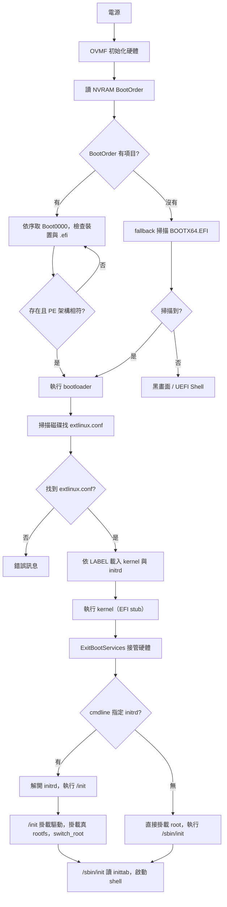

# UEFI 開機實作復刻指南

> 本文提供一份**可直接執行、可自行復刻**的完整 UEFI 開機實作：在 QEMU（OVMF 韌體）上，從建立虛擬磁碟開始，逐步做出 `bootloader.efi`、kernel、initrd、rootfs，最後開機進入 busybox shell。
>
> 本文為**動手實作手冊**；開機鏈的運作原理（NVRAM、EFI_LOAD_OPTION、PE/COFF、EFI stub 等）見 [[UEFI 開機流程完整指南]]。

---

## 1. 目標與開機鏈

```
UEFI(OVMF) → extlinux.efi → kernel(EFI stub) → initrd → rootfs → busybox shell
```

完整開機鏈中只有 8 個檔案在流動，各自被不同「執行者」讀取：

| 執行者 | 讀取的檔案 | 檔案實際位置 | 靠什麼能力讀 |
|---|---|---|---|
| UEFI 韌體 | `BOOTX64.EFI` | ESP（FAT32） | 韌體內建 FAT 驅動 |
| bootloader（extlinux） | `extlinux.conf`、`bzImage`、`initrd.img` | **rootfs**（ext4）`/boot/` | extlinux 內建 FAT + ext4 驅動 |
| kernel | cmdline、initrd | 記憶體（bootloader 已載入） | kernel 內建 initramfs 機制 |
| initrd 的 `/init` | 真 rootfs | `/dev/vda2`（ext4） | initrd 內建驅動 + `mount` |
| rootfs 的 `/sbin/init` | `/etc/inittab` | rootfs | busybox init |

> [!IMPORTANT] 關鍵領悟
> **UEFI 只讀得動 FAT（ESP），它只載入一個 `.efi`；其後所有讀 rootfs 的動作都是 bootloader 與 kernel/initrd 自己幹的。** 這是整個機制最常被誤解的地方。

### 1.1 開機決策流程



決策精髓：**每一步都在問「我要找的檔案在不在、合不合規格」，在就往下跳，不在就換來源或報錯。**

---

## 2. `esp/` 從哪來（動手前必懂）

`esp/` 只是主機上一個**普通資料夾**，透過 `mount` 變成「磁碟分割區的窗口」：

```
你主機的資料夾 esp/  ←──mount──→  磁碟上的 ESP 分割區 (FAT32)
   │  你寫進去的任何檔案               │  開機時 UEFI 讀的就是這裡
   └── EFI/BOOT/BOOTX64.EFI  ────────▶  \EFI\BOOT\BOOTX64.EFI
```

- `mount /dev/loop0p1 esp`：把磁碟分割區接到資料夾，之後寫入 `esp/` = 寫進磁碟分割區。
- 開機時 UEFI 掃描磁碟，找的是 FAT 檔案系統裡的 `\EFI\BOOT\BOOTX64.EFI`（UEFI/FAT 習慣用 `\`）。
- `umount` 後內容已保存在磁碟裡，磁碟（`disk.img`）就是最後交給 QEMU 的東西。

---

## 3. 完整腳本：`uefi-boot.sh`（函數化版本）

```bash
#!/bin/bash
# =============================================================================
# uefi-boot.sh — 從零復刻完整 UEFI 開機（x86_64 + QEMU + OVMF + extlinux）
#
# 開機鏈: UEFI(OVMF) -> extlinux.efi -> kernel(EFI stub) -> initrd -> rootfs -> busybox shell
#
# 用法:
#   sudo bash uefi-boot.sh                    # 完整執行（建立磁碟->製作->開機）
#   BASE=/path sudo bash uefi-boot.sh         # 指定工作目錄（預設 $HOME/uefi-lab）
#   sudo bash uefi-boot.sh --boot-only        # 磁碟已就緒，只執行開機
#
# 說明:
#   所有路徑 / loop 裝置 / OVMF 位置皆自動偵測，不需手動修改任何變數。
#   需以 root 執行（mount / losetup 需要權限）。
# =============================================================================
set -euo pipefail

# ---------------- 全域變數 ----------------
BASE="${BASE:-$HOME/uefi-lab}"    # 工作目錄（可用環境變數 BASE 覆寫）
ESP_MNT="$BASE/esp"               # ESP 分割區在 host 的掛載點資料夾
ROOT_MNT="$BASE/root"             # rootfs 分割區在 host 的掛載點資料夾
DISK="$BASE/disk.img"             # 虛擬磁碟檔（最後交給 QEMU）
KSRC="$BASE/linux-6.6"            # Linux 原始碼目錄
LOOP=""                           # 由 attach_loop 填寫，例如 /dev/loop0

# =============================================================================
# 函數 1: check_tools
# 用途: 確認所有外部工具已安裝；缺任一項立即中止，避免跑到一半才失敗。
# 用法: check_tools
# 需要: qemu-img sgdisk losetup mkfs.fat mkfs.ext4 cpio wget qemu-system-x86_64
#       busybox-static（檢查 /bin/busybox 是否為 static）
# 產物: 無（純檢查）
# =============================================================================
check_tools() {
    echo "==> 前置檢查"
    local t
    for t in qemu-img sgdisk losetup mkfs.fat mkfs.ext4 cpio wget qemu-system-x86_64; do
        command -v "$t" >/dev/null || { echo "缺少工具: $t"; exit 1; }
    done
    file /bin/busybox | grep -qi static || { echo "/bin/busybox 非 static，請安裝 busybox-static"; exit 1; }
}

# =============================================================================
# 函數 2: create_disk
# 用途: 建立 1G 的 raw 虛擬磁碟並寫入 GPT 分割表：
#        p1 = 2048~264191 扇區，型別 ef00（ESP，約 128MB）
#        p2 = 264192~磁碟尾，型別 8304（Linux rootfs）
# 用法: create_disk
# 需要: qemu-img sgdisk
# 產物: $DISK（含兩個空分割區，尚未格式化）
# =============================================================================
create_disk() {
    echo "==> Step 1: 建立虛擬磁碟與 GPT 分割"
    umount "$ESP_MNT" "$ROOT_MNT" 2>/dev/null || true   # 清理上次殘留掛載
    mkdir -p "$BASE" "$ESP_MNT" "$ROOT_MNT"
    qemu-img create -f raw "$DISK" 1G
    sgdisk -Z "$DISK"
    sgdisk -n 1:2048:264191 -t 1:ef00 "$DISK"
    sgdisk -n 2:264192:0    -t 2:8304 "$DISK"
}

# =============================================================================
# 函數 3: attach_loop
# 用途: 把虛擬磁碟掛到主機的 loop 裝置，取得可格式化的裝置節點。
#       自動偵測實際的 loop 編號，不假設一定是 loop0。
# 用法: attach_loop
# 需要: losetup（需 root）
# 產物: 全域變數 LOOP（例如 /dev/loop0）；子分割為 ${LOOP}p1 / ${LOOP}p2
# =============================================================================
attach_loop() {
    echo "==> Step 2: 掛載到 loop 裝置"
    losetup -fP "$DISK"
    LOOP=$(losetup -j "$DISK" -o NAME -n | head -1)
    echo "    loop 裝置 = $LOOP"
}

# =============================================================================
# 函數 4: format_partitions
# 用途: 格式化兩個分割區：p1 為 FAT32（ESP 規定），p2 為 ext4（rootfs）。
# 用法: format_partitions
# 需要: mkfs.fat mkfs.ext4；前置為 attach_loop
# 產物: 兩個已格式化、可掛載的分割區
# =============================================================================
format_partitions() {
    echo "==> Step 3: 格式化 ESP(FAT32) 與 rootfs(ext4)"
    mkfs.fat -F 32 "${LOOP}p1"
    mkfs.ext4 -L rootfs "${LOOP}p2"
}

# =============================================================================
# 函數 5: mount_partitions
# 用途: 把兩個分割區 mount 到工作目錄下的 esp/ 與 root/ 資料夾。
#       重點: 之後對這兩個資料夾寫入的內容 = 寫入磁碟分割區。
# 用法: mount_partitions
# 需要: mount（需 root）；前置為 attach_loop + format_partitions
# 產物: $ESP_MNT / $ROOT_MNT 成為可寫入的視窗
# =============================================================================
mount_partitions() {
    echo "==> Step 4: mount 分割區到工作目錄"
    mount "${LOOP}p1" "$ESP_MNT"
    mount "${LOOP}p2" "$ROOT_MNT"
}

# =============================================================================
# 函數 6: build_bootloader
# 用途: 產生 bootloader 並放入 ESP 的 fallback 路徑 \EFI\BOOT\BOOTX64.EFI。
#       來源為發行版提供的 extlinux.efi（syslinux EFI 版）。
#       注意: ldlinux.e64 必須與 extlinux.efi 同目錄，否則載入失敗。
# 用法: build_bootloader
# 需要: apt install extlinux syslinux-efi（提供 /usr/lib/SYSLINUX.EFI/efi64/）
# 產物: $ESP_MNT/EFI/BOOT/BOOTX64.EFI 與 *.e64 模組
# =============================================================================
build_bootloader() {
    echo "==> Step 5: 產生 bootloader 並放入 ESP"
    mkdir -p "$ESP_MNT/EFI/BOOT"
    local SRC
    if [ -f /usr/lib/SYSLINUX.EFI/efi64/extlinux.efi ]; then
        SRC=/usr/lib/SYSLINUX.EFI/efi64
    elif [ -f /usr/lib/syslinux/efi64/extlinux.efi ]; then
        SRC=/usr/lib/syslinux/efi64
    else
        echo "找不到 extlinux.efi，請先: apt install extlinux syslinux-efi"; exit 1
    fi
    cp "$SRC/extlinux.efi" "$ESP_MNT/EFI/BOOT/BOOTX64.EFI"
    local d
    for d in /usr/lib/SYSLINUX.EFI/efi64 /usr/lib/syslinux/modules/efi64 /usr/lib/syslinux/efi64; do
        [ -d "$d" ] && cp -f "$d"/*.e64 "$ESP_MNT/EFI/BOOT/" || true
    done
    echo "    ESP 內容:" && ls -la "$ESP_MNT/EFI/BOOT/"
}

# =============================================================================
# 函數 7: build_kernel
# 用途: 下載並編譯 Linux kernel，開啟 EFI stub 與本範例所需驅動。
#       bzImage 已存在時自動略過（可重跑）。
# 用法: build_kernel
# 需要: make gcc flex bison libelf-dev libssl-dev（編譯 kernel 的依賴）
# 產物: $KSRC/arch/x86/boot/bzImage（同時是 PE/COFF，可被 UEFI 載入）
# =============================================================================
build_kernel() {
    echo "==> Step 6: 編譯 kernel（含 EFI stub）"
    if [ ! -f "$KSRC/arch/x86/boot/bzImage" ]; then
        if [ ! -d "$KSRC" ]; then
            wget -P "$BASE" https://cdn.kernel.org/pub/linux/kernel/v6.x/linux-6.6.tar.xz
            tar xf "$BASE/linux-6.6.tar.xz" -C "$BASE"
        fi
        cd "$KSRC"
        make defconfig
        scripts/config -e CONFIG_EFI -e CONFIG_EFI_STUB \
            -e CONFIG_VIRTIO -e CONFIG_VIRTIO_PCI -e CONFIG_VIRTIO_BLK \
            -e CONFIG_EXT4_FS -e CONFIG_DEVTMPFS -e CONFIG_BLK_DEV_INITRD
        make -j"$(nproc)"
    else
        echo "    bzImage 已存在，略過編譯"
    fi
}

# =============================================================================
# 函數 8: build_initrd
# 用途: 製作 initramfs：busybox + /init 腳本，用 cpio 打包成 initrd.img。
#       /init 的職責: 掛載 /proc /sys /dev -> 掛載真 rootfs -> switch_root。
# 用法: build_initrd
# 需要: busybox-static cpio gzip
# 產物: $BASE/initrd.img
# =============================================================================
build_initrd() {
    echo "==> Step 7: 製作 initrd"
    local STAGE="$BASE/initrd_stage"
    rm -rf "$STAGE"; mkdir -p "$STAGE"/{bin,sbin,dev,proc,sys,etc,newroot}
    cp /bin/busybox "$STAGE/bin/busybox"
    local f
    for f in sh mount umount mkdir switch_root; do
        ln -sf busybox "$STAGE/bin/$f"
    done
    cat > "$STAGE/init" <<'EOF'
#!/bin/sh
mount -t proc proc /proc
mount -t sysfs sysfs /sys
mount -t devtmpfs devtmpfs /dev
mkdir -p /newroot
mount /dev/vda2 /newroot
exec switch_root /newroot /sbin/init
EOF
    chmod +x "$STAGE/init"
    ( cd "$STAGE" && find . | cpio --create -H newc | gzip > "$BASE/initrd.img" )
}

# =============================================================================
# 函數 9: build_rootfs
# 用途: 建立 rootfs 內容：busybox（含 /sbin/init）+ /etc/inittab。
#       inittab 的 askfirst 會在開機後給出 shell。
# 用法: build_rootfs
# 需要: busybox-static；前置為 mount_partitions
# 產物: 寫入 $ROOT_MNT（rootfs 分割區）
# =============================================================================
build_rootfs() {
    echo "==> Step 8: 填 rootfs"
    mkdir -p "$ROOT_MNT"/{bin,sbin,dev,proc,sys,etc}
    cp /bin/busybox "$ROOT_MNT/bin/busybox"
    ln -sf busybox "$ROOT_MNT/bin/sh"
    ln -sf /bin/busybox "$ROOT_MNT/sbin/init"
    cat > "$ROOT_MNT/etc/inittab" <<'EOF'
::sysinit:/bin/mount -t proc proc /proc
::sysinit:/bin/mount -t sysfs sysfs /sys
::askfirst:-/bin/sh
EOF
}

# =============================================================================
# 函數 10: deploy_boot_files
# 用途: 把 kernel / initrd / extlinux.conf 放到 rootfs 的 /boot。
#       extlinux.conf 的 LINUX/INITRD 是「相對於 rootfs」的路徑；
#       APPEND 的 root=PARTUUID 由 blkid 自動取得。
# 用法: deploy_boot_files
# 需要: blkid（util-linux）；前置為 build_kernel/build_initrd/mount_partitions
# 產物: $ROOT_MNT/boot/{bzImage,initrd.img,extlinux/extlinux.conf}
# =============================================================================
deploy_boot_files() {
    echo "==> Step 9: 佈署 kernel / initrd / extlinux.conf"
    mkdir -p "$ROOT_MNT/boot/extlinux"
    cp "$KSRC/arch/x86/boot/bzImage" "$ROOT_MNT/boot/bzImage"
    cp "$BASE/initrd.img" "$ROOT_MNT/boot/initrd.img"
    local PARTUUID
    PARTUUID=$(blkid -s PARTUUID -o value "${LOOP}p2")
    cat > "$ROOT_MNT/boot/extlinux/extlinux.conf" <<EOF
TIMEOUT 30
DEFAULT primary
LABEL primary
    LINUX /boot/bzImage
    INITRD /boot/initrd.img
    APPEND root=PARTUUID=$PARTUUID rw rootwait console=ttyS0,115200
EOF
    echo "    PARTUUID = $PARTUUID"
}

# =============================================================================
# 函數 11: cleanup
# 用途: 卸載分割區並解離 loop 裝置，讓磁碟內容安全保存於 disk.img。
# 用法: cleanup
# 需要: umount losetup（需 root）
# 產物: 磁碟就緒，可交給 QEMU
# =============================================================================
cleanup() {
    echo "==> Step 10: 卸載分割區"
    umount "$ESP_MNT" "$ROOT_MNT"
    losetup -d "$LOOP"
}

# =============================================================================
# 函數 12: boot_qemu
# 用途: 啟動 QEMU 開機。自動偵測 OVMF 韌體:
#        - 有 OVMF_VARS*.fd 時用 pflash（NVRAM 可保存）
#        - 只有 code 時用 -bios（NVRAM 每次空白 -> 自動 fallback 到 BOOTX64.EFI）
# 用法: boot_qemu  或  uefi-boot.sh --boot-only
# 需要: qemu-system-x86_64 ovmf
# 產物: QEMU 開機視窗/序列輸出
# =============================================================================
boot_qemu() {
    echo "==> Step 11: 開機"
    local CODE VARS
    CODE=$(ls /usr/share/OVMF/OVMF_CODE*.fd 2>/dev/null | head -1 || true)
    VARS=$(ls /usr/share/OVMF/OVMF_VARS*.fd 2>/dev/null | head -1 || true)
    [ -n "$CODE" ] || { echo "請先: apt install ovmf"; exit 1; }
    if [ -n "$VARS" ]; then
        cp "$VARS" "$BASE/OVMF_VARS.fd"
        exec qemu-system-x86_64 -machine q35 \
            -drive if=pflash,format=raw,readonly=on,file="$CODE" \
            -drive if=pflash,format=raw,file="$BASE/OVMF_VARS.fd" \
            -m 512M -drive file="$DISK",format=raw,if=virtio -nographic
    else
        echo "以 -bios 開機（NVRAM 空白 -> fallback 到 BOOTX64.EFI）"
        exec qemu-system-x86_64 -machine q35 \
            -bios "$CODE" -m 512M -drive file="$DISK",format=raw,if=virtio -nographic
    fi
}

# =============================================================================
# 函數 13: main
# 用途: 依序執行所有階段。--boot-only 只開機（磁碟已就緒時）。
# 用法: main [--boot-only]
# =============================================================================
main() {
    check_tools
    if [ "${1:-}" = "--boot-only" ]; then
        boot_qemu
    else
        create_disk
        attach_loop
        format_partitions
        mount_partitions
        build_bootloader
        build_kernel
        build_initrd
        build_rootfs
        deploy_boot_files
        cleanup
        boot_qemu
    fi
}
main "$@"
```

---

## 4. 函數用途一覽

| 函數 | 對應 Step | 用途 | 產物 | 前置條件 |
|---|---|---|---|---|
| `check_tools` | 前置 | 檢查工具與 busybox-static | 無（純檢查） | — |
| `create_disk` | 1 | 建 1G raw 磁碟 + GPT（p1=ESP, p2=rootfs） | `disk.img` | qemu-img, sgdisk |
| `attach_loop` | 2 | 掛到 loop 裝置、偵測節點 | 變數 `LOOP` | losetup |
| `format_partitions` | 3 | FAT32(ESP) + ext4(rootfs) | 已格式化分割區 | `attach_loop` |
| `mount_partitions` | 4 | mount 到 `esp/` `root/` 資料夾 | 可寫入窗口 | 前兩者 |
| `build_bootloader` | 5 | extlinux.efi → `\EFI\BOOT\BOOTX64.EFI` | ESP 內 bootloader | syslinux-efi |
| `build_kernel` | 6 | 編譯 kernel（含 EFI stub） | `bzImage` | kernel 依賴 |
| `build_initrd` | 7 | busybox + `/init` 打成 cpio | `initrd.img` | busybox-static |
| `build_rootfs` | 8 | busybox + inittab 寫入 rootfs | rootfs 內容 | `mount_partitions` |
| `deploy_boot_files` | 9 | kernel/initrd/extlinux.conf 佈署到 `/boot` | rootfs 開機檔 | 6/7/8 |
| `cleanup` | 10 | umount + detach loop | 磁碟就緒 | 全部製作 |
| `boot_qemu` | 11 | 啟動 QEMU 開機 | 開機畫面 | ovmf |

> [!NOTE] 函數設計原則
> 每個函數只做一件事，依 `main` 的順序串接；因此可單獨抽出重跑（例如 kernel 編壞了，只重跑 `build_kernel`），也方便對照錯誤訊息定位階段。

---

## 5. 前置準備（一次性）

```bash
sudo apt install qemu-system-x86 ovmf syslinux-efi extlinux \
  dosfstools e2fsprogs gdisk busybox-static \
  build-essential flex bison libelf-dev libssl-dev cpio wget
```

> [!CAUTION] busybox 必須是 static
> 腳本會檢查 `/bin/busybox` 是否為 static。若動態連結，initrd/rootfs 內沒有動態函式庫會直接失敗。

---

## 6. 執行與驗證

```bash
# 完整流程（約需數十分鐘，主要是 kernel 編譯）
sudo bash uefi-boot.sh

# 磁碟已就緒、只想重開
sudo bash uefi-boot.sh --boot-only
```

開機時依序可觀察到：

| 看到的畫面/訊息 | 代表 |
|---|---|
| TianoCore logo / UEFI 初始化 | 韌體啟動 |
| extlinux 的 `TIMEOUT 30` 選單 | bootloader.efi 已被 fallback 載入 |
| kernel boot log（含 `Booting Linux`） | kernel 被 LoadImage 成功 |
| kernel 解開 initrd → 執行 `/init` | initramfs 生效 |
| `switch_root` 無錯誤 | 真 rootfs 掛載成功 |
| `Please press Enter to activate this console` | busybox init 正常 → 按 Enter 進 shell |

---

## 7. 常見排錯

| 現象 | 可能原因 | 檢查 |
|---|---|---|
| 黑畫面 / 進 UEFI Shell | ESP 無 `BOOTX64.EFI` 或路徑錯 | `build_bootloader` 後看 `esp/EFI/BOOT/` |
| extlinux 報找不到 kernel | `extlinux.conf` 路徑不在 rootfs `/boot/extlinux/` | 確認檔案位置與 `LINUX` 行的檔名 |
| `VFS: Unable to mount root fs` | `root=` 錯、initrd 未掛載 rootfs | `deploy_boot_files` 的 PARTUUID、`/init` 的 `mount` |
| `switch_root: No such file` | rootfs 缺 `/sbin/init` | busybox symlink 未建立 |
| 卡在 `Please press Enter` 後無反應 | console 設定不符 | `-nographic` 搭配 `console=ttyS0,115200` |

---

## 8. 延伸方向

- **ARM64 版本**：把 `build_kernel` 改交叉編譯（`ARCH=arm64 CROSS_COMPILE=aarch64-linux-gnu-`），kernel 產物為 `Image`；bootloader 改為 `BOOTAA64.EFI`（`build_bootloader` 的來源換成 ARM64 版），並在 `extlinux.conf` 增加 `FDT /boot/xxx.dtb`。原理與本文件完全一致。
- **自己寫 bootloader.efi**：使用 gnu-efi 編譯一個自製 EFI 應用程式，見 [[UEFI 開機流程完整指南]] 中 EFI stub 與 PE/COFF 章節。
- **initrd 內容深入**：unpack/repack 與各工具鏈，見 [[Linux核心/Initrd 與核心映像檔提取指南]]、[[Build系統/BuildRoot/initrd 製作]]。

## 9. 相關連結

- [[UEFI 開機流程完整指南]]（開機鏈原理：NVRAM、EFI_LOAD_OPTION、PE/COFF、EFI stub）
- [[Jetson AGX Orin 開機流程與客製化指南]]（ARM64 平台上的相同骨架）
- [[Build系統/BuildRoot/建立 rootfs 映像檔]]（rootfs 製作相關）
