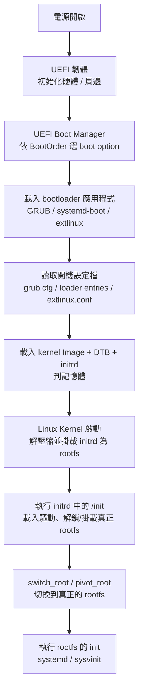
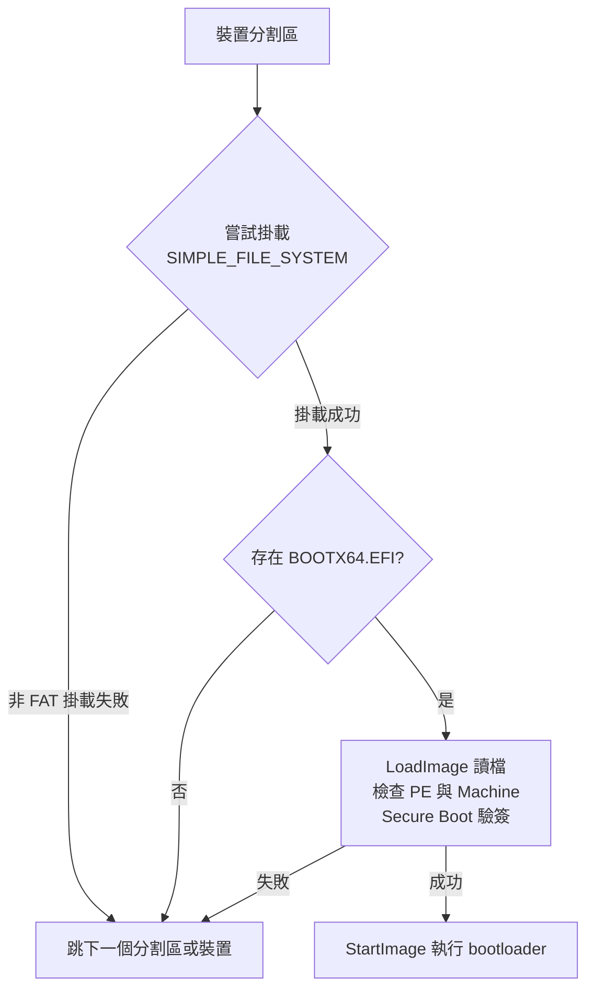
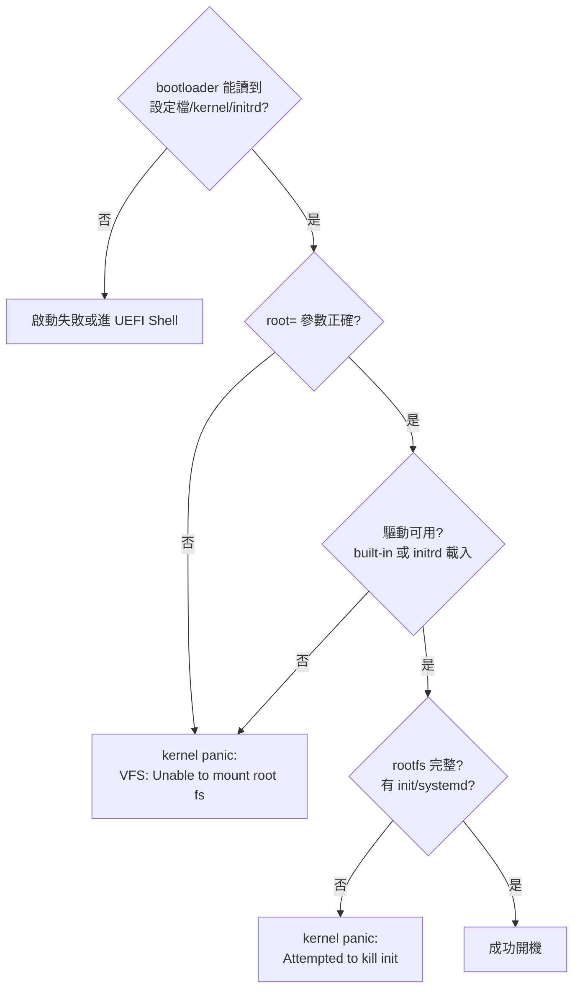
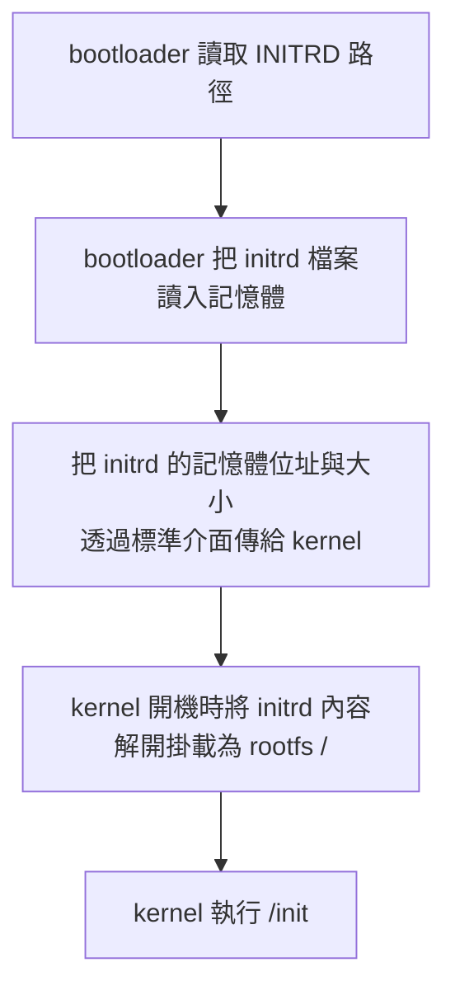

# UEFI 開機流程完整指南

> 本文件說明 **一般 Embedded Linux / ARM / x86** 平台上「UEFI → Kernel → initrd → rootfs」的完整開機運作機制，包括 UEFI 如何辨認可開機的 rootfs、initrd 需要具備哪些內容、initrd 是如何被載入的，以及各主流工具鏈製作 initrd 的方式。
>
> 本文件是**平台無關**的通用知識；Jetson 等平台特有的差異（NVIDIA boot chain、L4T initrd、`cbootargs` 等）見 [[Jetson AGX Orin 開機流程與客製化指南]]。

---

## 1. 整體開機鏈路

無論是 x86 還是 ARM，現代的 Linux 開機流程幾乎都是同一套骨架：



> [!TIP] 一句話版本
> `UEFI（韌體）→ bootloader（設定檔）→ Kernel + initrd（記憶體）→ /init（橋樑）→ 真正 rootfs → systemd`

---

## 2. UEFI 開機運作機制

### 2.1 UEFI 的角色：只負責「載入 bootloader」，不負責 rootfs

UEFI（Unified Extensible Firmware Interface）本質上是一個**規範**，描述韌體與作業系統之間的標準介面。在開機流程中，**UEFI 本身不認識、也不直接載入 Linux 的核心或 rootfs**，它的職責只有兩個：

1. 初始化硬體（CPU、記憶體、週邊、儲存控制器）。
2. 依 **Boot Manager** 邏輯找到並載入一個 **bootloader**（UEFI 應用程式），把控制權交給它。

真正「決定開哪個 kernel、rootfs 在哪裡」的，是 bootloader。

### 2.2 UEFI Boot Manager 與 boot option

UEFI 韌體啟動後，會執行 **BDS（Boot Device Selection）** 階段，依 NVRAM 中保存的 `BootOrder` 依序嘗試每個 `Boot####`（boot option）：

| UEFI 變數 | 說明 |
|---|---|
| `BootOrder` | boot option 的嘗試順序 |
| `Boot####` | 每個 boot option，指向某個裝置上的 bootloader 路徑 |
| `OsIndications` | 作業系統通知韌體的指示（如觸發 capsule update） |
| `SecureBoot` | 是否啟用 Secure Boot（見 [[Jetson AGX Orin Secure Boot 完整指南]]） |

每個 boot option 通常指向 **ESP（EFI System Partition，FAT32）** 中的一個 EFI 應用程式，例如：

- `\EFI\BOOT\BOOTAA64.efi`（ARM64 標準 fallback 路徑）
- `\EFI\BOOT\BOOTX64.EFI`（x86_64 標準 fallback 路徑）
- `\EFI\GRUB\grubaa64.efi`（GRUB）
- `\EFI\systemd\systemd-bootaa64.efi`（systemd-boot）

> [!NOTE] Removable Media Fallback
> 若 NVRAM 中沒有任何有效 boot option，UEFI 會 fallback 到 `\EFI\BOOT\BOOT<ARCH>.EFI`（所謂 removable media path），這就是 USB 安裝碟「插上就能開機」的原理。

#### 2.2.1 Removable Media Fallback 的實際掃描機制

Fallback 不是「掃描整顆硬碟找檔案」，而是對每個 FAT 分割區，到**固定的路徑**問「這裡有 bootloader 嗎」，輪流嘗試、第一個成功就開機。

**固定路徑（`EFI_REMOVABLE_MEDIA_FILE_NAME`，由 UEFI 規範定義，依架構而異）：**

| 架構 | fallback 路徑 |
|---|---|
| x86_64 | `\EFI\BOOT\BOOTX64.EFI` |
| ARM64 | `\EFI\BOOT\BOOTAA64.EFI` |
| IA32（32-bit x86） | `\EFI\BOOT\BOOTIA32.EFI` |

**掃描的對象（來源）：** 韌體開機時已列舉出所有裝置（Handle Database），fallback 遍歷其中所有具備 Block I/O 的儲存裝置（USB 碟、SATA、NVMe、SD/eMMC、光碟 El Torito）。

**每個裝置的每個分割區依序執行：**



- **只有 FAT 能掛載**：規格保證 UEFI 韌體可掛載的檔案系統只有 FAT，因此 ext4 等分割區在 fallback 掃描時會被跳過。
- **掃描順序**：依韌體列舉順序（大致為 PCI 匯流排 → 控制器 → 分割區），各廠實作可能微調，但都是「輪流試，第一個成功就開」。
- **全部失敗**：進 UEFI Shell 或顯示 `No bootable device`。

**在 UEFI Shell 中親眼觀察：**

```shell
map          # 列出可掛載的檔案系統，如 fs0:（即一個 FAT 分割區）
fs0:
ls \EFI\BOOT  # 手動查看 fallback 路徑裡有誰
```

> 每個 `fsN:` 對應一個「SIMPLE_FILE_SYSTEM 可掛載分割區」；fallback 就是對這些 `fsN:` 逐一查詢 `\EFI\BOOT\BOOT<ARCH>.EFI`。

### 2.3 Bootloader 的三種主要流派

載入 kernel/initrd 的 bootloader 常見有三種，都遵從「讀設定檔 → 載入 kernel/initrd → 跳轉」的邏輯：

| Bootloader | 設定檔 | 常見平台 |
|---|---|---|
| GRUB2 | `/boot/grub/grub.cfg` | x86 主流、部分 ARM |
| systemd-boot | `/boot/loader/entries/*.conf` | 現代 ARM（Fedora、systemd 生態） |
| extlinux / syslinux | `/boot/extlinux/extlinux.conf` | ARM、U-Boot 相容生態（**Jetson 使用此語法**） |

以 extlinux.conf 為例（與 Jetson 相同格式）：

```
TIMEOUT 30
DEFAULT primary

LABEL primary
    LINUX /boot/Image
    INITRD /boot/initrd
    APPEND root=PARTUUID=xxxxxxxx-xxxx-xxxx-xxxx-xxxxxxxxxxxx rw rootwait console=ttyAMA0,115200
```

- `LINUX`：kernel 映像在**rootfs**（或 ESP）中的路徑。
- `INITRD`：initrd 映像的路徑。
- `APPEND`：傳給 kernel 的 command line，其中 **`root=` 指定真正 rootfs 的位置**。

> [!IMPORTANT] bootloader 讀檔的「雞生蛋」之謎
> bootloader（GRUB/extlinux）能讀取 rootfs 上的設定檔與 kernel，是因為 bootloader 內建了 FAT/ext4 等檔案系統驅動與儲存控制器驅動。這跟 UEFI 韌體能讀檔是同一原理——它們都是「有自己的驅動」的程式，不是 Linux kernel。

---

## 3. UEFI / Bootloader 如何「辨認可開機的 rootfs」

嚴格來說，**UEFI 本身不辨認 rootfs**。真正決定 rootfs 的是 kernel + initrd。要成功掛載 rootfs，必須依序滿足以下條件：

### 3.1 條件 1：bootloader 能讀到設定檔與 kernel/initrd

- 設定檔、kernel、initrd 所在的檔案系統必須是 bootloader 支援的（FAT32 最保險，ext4 通常也支援）。
- 路徑需正確（`LINUX` / `INITRD`）。

### 3.2 條件 2：kernel command line 有正確的 `root=` 參數

`root=` 指定 rootfs 裝置，支援多種語法：

| 語法 | 範例 | 說明 |
|---|---|---|
| 裝置節點 | `root=/dev/mmcblk0p1` | 直接指定（開機時裝置節點可能尚未穩定存在，較不推薦） |
| PARTUUID | `root=PARTUUID=xxxx-xxxx` | GPT 分割區 UUID，**最穩定** |
| UUID | `root=UUID=xxxx` | 檔案系統 UUID |
| LABEL | `root=LABEL=rootfs` | 檔案系統 label |

常見搭配：

- `rw` / `ro`：rootfs 掛載為可讀寫 / 唯讀。
- `rootwait`：等待 root 裝置出現（特別重要，因為 NVMe/eMMC/USB 裝置列舉非同步）。
- `rootfstype=ext4`：指定檔案系統類型（通常可省略，讓 kernel 自動偵測）。

### 3.3 條件 3：kernel 或 initrd 有存取該 rootfs 的驅動

這是 initrd 存在意義的核心（詳見第 4 節）：

- 若 rootfs 裝置所需的驅動（eMMC/NVMe/SD/USB）已 **built-in 進 kernel**，則可不用 initrd。
- 若驅動是**模組（.ko）**，則必須靠 initrd 先載入這些驅動，才能掛載 rootfs。

### 3.4 條件 4：rootfs 內容完整

- rootfs 上必須有第一個 init 程式（`/sbin/init` 或 `systemd`）。
- 加密 rootfs（LUKS）時，必須能在 initrd 內解密（見 4.3）。



---

## 4. initrd / initramfs：完整運作機制

### 4.1 initrd 是什麼？為何需要？

- **initrd**（Initial RAM Disk）與 **initramfs**（Initial RAM Filesystem）概念幾乎相同，現代系統多為 **initramfs**（直接以 cpio 解包成 tmpfs rootfs）。
- 需要的根本原因：**「要掛載 rootfs 需要驅動，驅動卻在 rootfs 裡」的雞生蛋問題**（詳見 4.5.1 於 Jetson 文章的對照）。

### 4.2 initrd 是如何被載入的？（完整機制）



載入與傳遞的技術細節依架構而異：

| 架構 | 傳遞機制 |
|---|---|
| x86（bzImage） | bootloader 用 **boot protocol**（`boot_params` 中的 `ramdisk_image` / `ramdisk_size` 欄位）傳遞 initrd 位址與大小 |
| ARM64（EFI stub） | kernel 編譯時使用 EFI stub；bootloader（GRUB/systemd-boot）透過 **UEFI Configuration Table / LoadFile2 protocol** 或直接作為 UEFI 的 `efi/initrd` 傳遞。舊式也支援 DTB 的 `linux,initrd-start/end` 屬性 |

> [!NOTE] EFI stub
> ARM64 的 Linux kernel 本身編譯成一個 EFI 應用程式（PE/COFF），UEFI 可以直接載入它，不需要 GRUB 那層「跳板」。kernel 會自己呼叫 `ExitBootServices` 接管硬體。這是「UEFI 直啟 kernel」的基礎。

### 4.3 initrd 需要具備哪些內容？

一個「能正確開機並掛載 rootfs」的 initrd，至少必須包含：

| 內容 | 用途 |
|---|---|
| **`/init`（或 `/linuxrc`）** | 開機入口腳本：掛載 `/proc`、`/sys`、`/dev`，載入驅動，掛載 rootfs，最後 `switch_root` |
| **busybox 或必要工具** | `mount`、`mkdir`、`switch_root`、`sleep`、`sh` 等 |
| **必要的 kernel 模組（.ko）** | rootfs 裝置的驅動、檔案系統驅動（放在 `/lib/modules/<version>/`） |
| **裝置節點 `/dev`** | 至少 console/null（現代多依賴 `devtmpfs` 或 `mdev`/`udev`） |
| **（選用）cryptsetup + 金鑰** | LUKS 加密 rootfs 時解密 |
| **（選用）LVM / mdadm / nfs 工具** | LVM、RAID、NFS root 時 |

一個最簡 `init` 腳本範例：

```sh
#!/bin/sh
mount -t proc proc /proc
mount -t sysfs sysfs /sys
mount -t devtmpfs devtmpfs /dev

# 載入 rootfs 所需驅動（若為模組）
insmod /lib/modules/.../nvme.ko
insmod /lib/modules/.../ext4.ko

# 掛載真正 rootfs
mount -t ext4 -o rw /dev/nvme0n1p1 /newroot

# 切換 root 並啟動真實 init
exec switch_root /newroot /sbin/init
```

### 4.4 switch_root vs pivot_root

- **`switch_root`**：由 klibc/busybox 提供，執行前會清空 initrd 的 rootfs 內容，換掛新的 rootfs 後 `exec` 真實 init。是 initramfs 的標準收尾方式。
- **`pivot_root`**：較舊的機制，把舊 root 移到某個掛載點後切換（不刪除舊內容）。initramfs-tools 等現代實作多用 `switch_root`。

> [!IMPORTANT] 兩者共同目的
> 無論何者，最後都是把 rootfs 的控制權交棒給 rootfs 內的第一個 process（systemd）。此後 initrd 完全消失，不再佔用資源。

---

## 5. 製作 initrd：各主流工具鏈

### 5.1 總覽

| 工具鏈 | 適用發行版 | 設定 | 特性 |
|---|---|---|---|
| `update-initramfs` / `mkinitramfs` | Debian / Ubuntu | `/etc/initramfs-tools/` | 最常見，hook 機制可擴充 |
| `dracut` | Fedora / RHEL | `/etc/dracut.conf.d/` | 可生成完整或最小 initramfs |
| `mkinitcpio` | Arch Linux | `/etc/mkinitcpio.conf` | 以 hooks 串接 |
| 手動 `cpio` | 任何 | 無 | 完全可控，最小化 |
| Buildroot / Yocto | 嵌入式 Build 系統 | menuconfig / recipe | 產出整包 rootfs + initramfs |

### 5.2 Debian / Ubuntu：initramfs-tools

```bash
# 更新目前使用的 kernel 的 initrd
sudo update-initramfs -u

# 為特定 kernel 版本建立
sudo update-initramfs -c -k 5.15.0-xxx-generic

# 或直接使用 mkinitramfs 指定輸出
sudo mkinitramfs -o /boot/initrd.img 5.15.0-xxx-generic
```

自訂內容：放入 `/etc/initramfs-tools/`（`modules`、`hooks`、`scripts/local-premount/` 等）。

### 5.3 Fedora / RHEL：dracut

```bash
# 生成目前 kernel 的 initramfs
sudo dracut --force

# 生成最小化 initramfs（只含必要驅動）
sudo dracut --hostonly /boot/initramfs-$(uname -r).img
```

### 5.4 Arch：mkinitcpio

```bash
sudo mkinitcpio -P                    # 生成所有 kernel
sudo mkinitcpio -g /boot/initramfs.img  # 指定輸出
```

### 5.5 手動 cpio（完全可控、最小化）

```bash
# 1. 建立根目錄
mkdir -p initrd_root/{bin,dev,proc,sys,lib/modules,newroot}

# 2. 複製 busybox 與必要檔案
cp /bin/busybox initrd_root/bin/
ln -sf busybox initrd_root/bin/sh
cp initrd_root_build/init initrd_root/init   # 自製 init 腳本

# 3. 打包成 cpio + gzip
cd initrd_root
find . | cpio --create -H newc | gzip -9 > ../initrd.img
```

> 詳細的 unpack / repack 操作可參見 [[Linux核心/Initrd 與核心映像檔提取指南]] 與 [[Build系統/BuildRoot/initrd 製作]]。

### 5.6 Buildroot / Yocto

- **Buildroot**：選 `BR2_TARGET_ROOTFS_CPIO` 或 `BR2_TARGET_ROOTFS_INITRAMFS`，產生 rootfs.cpio.gz。
- **Yocto**：`IMAGE_FSTYPES += "cpio.gz"`，或透過 `INITRAMFS_IMAGE` 產生 initramfs 映像。

---

## 6. 平台特有差異（以 Jetson 為例）

Jetson 的開機流程基本上就是「UEFI + extlinux + kernel + initrd + rootfs」這個通用骨架，但有以下**平台特有**的差異：

| 項目 | 一般平台 | Jetson |
|---|---|---|
| UEFI 韌體 | 各家 EDK2（NVIDIA 是 EDK2 fork） | `uefi_jetson.bin`，含 Tegra 專屬驅動 |
| Bootloader 設定 | grub.cfg / loader entries / extlinux.conf | **extlinux.conf**，`APPEND ${cbootargs}`（由 UEFI 注入 boot 參數） |
| 開機 media 掃描 | UEFI BootOrder | NVIDIA UEFI 變數 / `L4TConfiguration` |
| initrd | 各工具鏈製作 | **`l4t_initrd.img`**，由 NVIDIA 提供，內含掛載 rootfs 專屬邏輯 |
| initrd 更新方式 | `update-initramfs` 等 | `tools/l4t_update_initrd.sh`（chroot 內執行 `nv-update-initrd`） |
| rootfs 掛載 | 一般 `root=` | 支援 A/B、LUKS、overlayfs（`L4TOverlayFsMode`）等 |
| 開機鏈上游 | UEFI 即起點 | UEFI 之前還有 BootROM/BCT/MB1/MB2（NVIDIA 私有） |

> 完整 Jetson 專屬 boot chain 與 initrd 細節見 [[Jetson AGX Orin 開機流程與客製化指南]]。

---

## 7. 除錯與驗證

| 症狀 | 可能原因 | 檢查方式 |
|---|---|---|
| `No bootable device` / 進 UEFI Shell | BootOrder 無效、ESP 無 bootloader | UEFI Menu 檢查 boot option、`efibootmgr -v` |
| `VFS: Unable to mount root fs` | `root=` 錯誤、驅動未載入 | 檢查 kernel cmdline、initrd 是否含驅動 |
| `Failed to execute /init` | initrd 內缺 `/init` 或損壞 | `lsinitramfs` / `dracut --list-modules` 檢查內容 |
| `switch_root: No such file` | rootfs 不完整 | 檢查 `/sbin/init` 是否存在 |

常用指令：

```bash
# 主機端檢視 initrd 內容
lsinitramfs /boot/initrd.img-$(uname -r)
unmkinitramfs /boot/initrd.img-$(uname -r) /tmp/initrd_check

# 執行期查看 kernel cmdline
cat /proc/cmdline

# 查看開機 kernel 訊息
dmesg | grep -i "kernel command line\|rootfs\|initrd"
```

---

## 8. 參考與相關連結

- 相關知識庫文章：
  - [[Jetson AGX Orin 開機流程與客製化指南]]（Jetson 平台特有 boot chain 與 initrd）
  - [[Jetson AGX Orin Secure Boot 完整指南]]（UEFI Secure Boot 金鑰機制）
  - [[Linux核心/Initrd 與核心映像檔提取指南]]（initrd 提取/解包操作）
  - [[Build系統/BuildRoot/initrd 製作]]（手動 cpio 製作細節）
  - [[Jetson 系統映像客製化與燒錄完整指南]]
  - [[UEFI 開機實作復刻指南]]（從零到開機的函數化腳本實作，QEMU + OVMF + extlinux）
