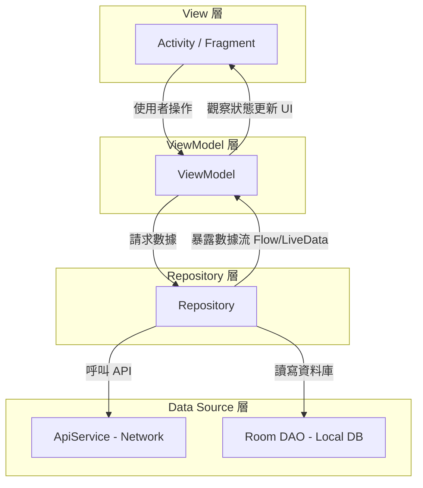

這是一份針對 **Android MVVM + Repository 架構**的技術說明文件。你可以將其保存在專案的 `README.md` 或團隊的技術文檔（Wiki）中。

---

# Android 架構規範文檔：MVVM + Repository Pattern

本文件旨在說明 Android 應用程式開發中推薦的架構設計，確保代碼具備**可測試性 (Testability)**、**可維護性 (Maintainability)** 與**關注點分離 (Separation of Concerns)**。

## 1. 架構總覽

本架構採用 Google 官方推薦的 **MVVM (Model-View-ViewModel)** 模式，並引入 **Repository 層** 作為數據調度中心。

### 數據流向圖 (Data Flow)

程式碼片段



---

## 2. 元件職責說明

### 🟢 View (視圖層)

- **元件**：Activity, Fragment, Jetpack Compose 頁面。
    
- **目的**：處理 UI 渲染與使用者互動。
    
- **規範**：
    
    - **不處理業務邏輯**：嚴禁在 View 中進行數據過濾或計算。
        
    - **被動觀察**：僅透過觀察 ViewModel 暴露的數據流來更新畫面。
        
    - **生命週期**：負責生命週期內部的元件初始化（如 RecyclerView 設置）。
        

### 🔵 ViewModel (視圖模型)

- **目的**：承載 UI 狀態 (UI State) 並處理視圖邏輯。
    
- **規範**：
    
    - **生命週期感知**：在配置變更（如螢幕旋轉）時保留數據。
        
    - **禁止持有 View 引用**：絕對不可引用 Activity、Fragment 或任何 Context（若需 Context，請使用 `AndroidViewModel` 存取 Application Context），以防記憶體洩漏。
        
    - **狀態封裝**：使用 `StateFlow` 或 `LiveData` 封裝數據，確保 View 只能讀取不可修改。
        

### 🟡 Repository (倉庫層)

- **目的**：作為「單一數據源」，封裝底層數據細節。
    
- **規範**：
    
    - **中介調度**：判斷數據應從網路 (ApiService) 獲取還是本地快取 (Room) 讀取。
        
    - **邏輯中心**：處理與數據相關的「業務規則」（如：數據過濾、合併多個接口數據）。
        
    - **不感知 UI**：Repository 不應該知道數據最後會顯示在哪個畫面上。
        

### 🔴 ApiService / Local Data Source (數據源)

- **元件**：Retrofit Interface, Room DAO。
    
- **目的**：執行最底層的 I/O 操作（網路請求、SQL 查詢）。
    

---

## 3. 邏輯分配指南

為了避免代碼臃腫，請遵循以下原則分配你的代碼：

|**邏輯類型**|**說明**|**歸屬地**|
|---|---|---|
|**UI 邏輯**|例如：點擊按鈕後隱藏鍵盤、跳轉頁面。|**View**|
|**視圖邏輯**|例如：將日期字串格式化、決定 Loading 圈圈何時顯示。|**ViewModel**|
|**業務邏輯**|例如：判斷用戶積分是否達標、對 API 回傳的清單進行排序。|**Repository**|
|**數據存取**|例如：執行 SQL 語句、定義 API URL。|**Data Source**|

---

## 4. 必要補充知識點

### 1. 單一向數據流 (Unidirectional Data Flow)

在 MVVM 中，狀態始終「向下」流動，事件始終「向上」傳遞。View 觸發事件給 ViewModel，ViewModel 請求數據後更新狀態，最後 View 反應狀態。這能大幅降低偵錯難度。

### 2. 依賴注入 (Dependency Injection)

為了讓各層級能解耦且方便測試，通常會搭配 **Hilt** 或 **Koin**。例如：ViewModel 不需要知道如何 `new` 出一個 Repository，而是由 DI 框架自動注入。

### 3. 協程 (Coroutines) 與 Flow

- **Coroutines**：用於異步處理（如網路請求），避免阻塞主線程。
    
- **Flow/StateFlow**：一種冷/熱數據流，適合用來在層級之間傳遞異步獲取的數據。
    

---

## 5. 範例代碼片段 (Kotlin)

Kotlin

```
// ViewModel 範例
class ProductViewModel(private val repository: ProductRepository) : ViewModel() {
    private val _products = MutableStateFlow<List<Product>>(emptyList())
    val products: StateFlow<List<Product>> = _products

    fun fetchProducts() {
        viewModelScope.launch {
            // 從 Repository 獲取處理後的數據
            val result = repository.getAvailableProducts()
            _products.value = result
        }
    }
}
```

---

## 6. 錯誤處理策略 (Error Handling)

在分層架構中，錯誤不應該只是簡單地拋出（throw），而應該根據層級進行轉換。

### 錯誤流向原則

1. **Data Source (ApiService)**：拋出原始異常（如 `IOException`, `HttpException`）。
    
2. **Repository**：捕獲原始異常，轉換為 App 內定義的「領域錯誤」（例如 `NetworkError`, `AuthError`），或使用封裝類（如 `Result<T>`）。
    
3. **ViewModel**：接收 Result，根據錯誤類型更新 UI 狀態（例如 `isError = true`）。
    
4. **View**：觀察到錯誤狀態，彈出 Toast 或 Dialog 提醒用戶。
    

### 範例：使用 Result 封裝

Kotlin

```
// Repository 層
suspend fun getUserProfile(): Result<User> {
    return try {
        val response = apiService.getUser()
        Result.success(response)
    } catch (e: Exception) {
        Result.failure(e) // 可以在這裡根據 e 的類型做轉換
    }
}
```

---

## 7. 單元測試指南 (Unit Testing)

採用這種架構的最大好處在於：**你可以在不啟動手機或模擬器的情況下，測試所有的核心邏輯。**

### 各層測試重點

|**層級**|**測試工具**|**測試目標**|
|---|---|---|
|**ViewModel**|JUnit + MockK|測試「輸入事件」後，「UI 狀態」是否如預期變更。|
|**Repository**|JUnit + MockK|測試「數據處理邏輯」與「數據來源調度」是否正確。|
|**ApiService**|MockWebServer|測試「JSON 解析」是否正確對應到實體類。|

### 範例：ViewModel 測試邏輯

Kotlin

```
@Test
fun `當獲取數據成功時，UI 狀態應轉為 Success`() = runTest {
    // 1. Setup: 模擬 Repository 回傳成功數據
    coEvery { repository.getUsers() } returns listOf(User("Gemini"))
    
    // 2. Action: 執行獲取動作
    viewModel.loadUsers()
    
    // 3. Assertion: 確認狀態確實變成了 Success
    assert(viewModel.uiState.value is UiState.Success)
}
```

---

## 8. 專案開發檢查表 (Checklist)

在開發新功能時，請快速對照以下清單，確保架構沒有走偏：

- [ ] **View 是否太胖？** (檢查 Activity 是否有超過 10 行以上的計算邏輯)
    
- [ ] **ViewModel 是否引用了 UI 元件？** (絕對不能有 `import android.widget.*` 或 `Button` 變數)
    
- [ ] **Repository 是否具備「單一數據源」？** (ViewModel 應該只跟 Repo 要資料，不該同時呼叫 Repo 和 ApiService)
    
- [ ] **異步操作是否有生命週期管理？** (檢查是否都寫在 `viewModelScope` 中)
    
- [ ] **數據傳遞是否為唯讀？** (ViewModel 暴露的是 `StateFlow` 而非 `MutableStateFlow`)
    

---

以上涵蓋了從架構設計、元件職責到穩定性保障的全方位說明。

下面一份專業的 **Android 開發起手式模板**。它整合了當前最主流的技術棧：**Kotlin Coroutines**, **Hilt (DI)**, **Retrofit**, 以及 **StateFlow**。

你可以參考這個結構來建立你的專案基礎。

---

## 1. 核心 Gradle 配置 (Version Catalog / Build.gradle)

在 `build.gradle.kts` 中，你需要以下關鍵依賴，這保證了架構各元件能正常運作：

Kotlin

```
dependencies {
    // 架構元件 (Lifecycle, ViewModel, StateFlow)
    implementation("androidx.lifecycle:lifecycle-viewmodel-ktx:2.7.0")
    implementation("androidx.lifecycle:lifecycle-runtime-compose:2.7.0")

    // 依賴注入 (Hilt)
    implementation("com.google.dagger:hilt-android:2.50")
    kapt("com.google.dagger:hilt-compiler:2.50")

    // 網路請求 (Retrofit)
    implementation("com.squareup.retrofit2:retrofit:2.9.0")
    implementation("com.squareup.retrofit2:converter-gson:2.9.0")
}
```

---

## 2. 基礎類別與介面實作

這部分的代碼展示了如何將「錯誤處理」與「數據流」結合進架構中。

### A. 統一的資源封裝 (Resource Wrapper)

我們定義一個 `UiState` 來規範 View 接收到的狀態。

Kotlin

```
sealed class UiState<out T> {
    object Loading : UiState<Nothing>()
    data class Success<T>(val data: T) : UiState<T>()
    data class Error(val message: String) : UiState<Nothing>()
}
```

### B. 基礎 ApiService

Kotlin

```
interface ApiService {
    @GET("v1/products")
    suspend fun fetchProducts(): List<Product>
}
```

### C. 基礎 Repository (處理異常)

Kotlin

```
class ProductRepository @Inject constructor(
    private val apiService: ApiService
) {
    // 將邏輯封裝在 Repository，回傳 Result 確保安全性
    suspend fun getProducts(): Result<List<Product>> {
        return try {
            val response = apiService.fetchProducts()
            Result.success(response)
        } catch (e: Exception) {
            Result.failure(e)
        }
    }
}
```

### D. 基礎 ViewModel (狀態管理)

Kotlin

```
@HiltViewModel
class ProductViewModel @Inject constructor(
    private val repository: ProductRepository
) : ViewModel() {

    private val _uiState = MutableStateFlow<UiState<List<Product>>>(UiState.Loading)
    val uiState: StateFlow<UiState<List<Product>>> = _uiState.asStateFlow()

    fun loadData() {
        viewModelScope.launch {
            _uiState.value = UiState.Loading
            repository.getProducts()
                .onSuccess { data -> _uiState.value = UiState.Success(data) }
                .onFailure { error -> _uiState.value = UiState.Error(error.message ?: "Unknown Error") }
        }
    }
}
```

---

## 3. 專案目錄結構建議 (Project Structure)

建議按照「功能 (Feature)」或是「層級 (Layer)」來分包。對於中大型專案，推薦 **Feature-based** 分包法：

Plaintext

```
com.yourpackge.app
├── data
│   ├── remote (ApiService, DTOs)
│   ├── local (Room DB, DAOs)
│   └── repository (實作類)
├── di (Hilt Modules)
├── ui
│   ├── components (通用 UI 元件)
│   └── features
│       └── product_list
│           ├── ProductActivity.kt
│           ├── ProductViewModel.kt
│           └── ProductUiState.kt
└── util (工具類)
```

---

## 4. 接下來的學習建議

掌握了這個架構後，你可以嘗試挑戰以下進階主題：

1. **Paging 3**：當數據量很大（如無限捲動清單）時，如何在 Repository 層處理分頁。
    
2. **Room Database**：實作「離線瀏覽」功能，讓 Repository 優先讀取本地數據。
    
3. **Hilt Testing**：學習如何使用 `@HiltAndroidTest` 來寫整合測試。
    

