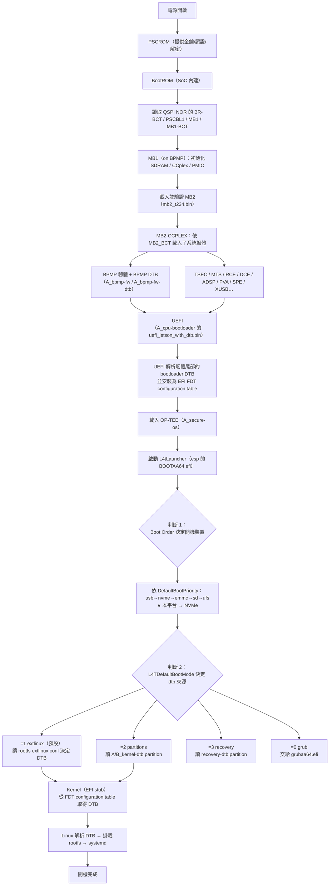
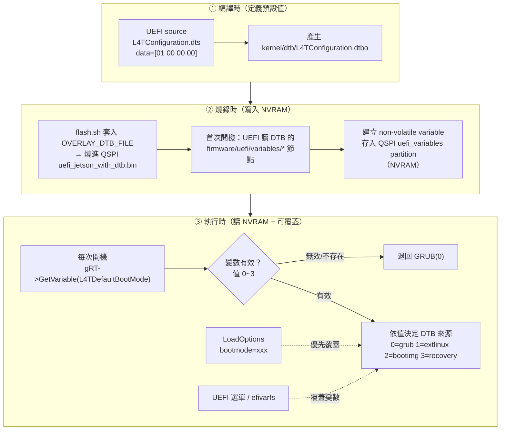
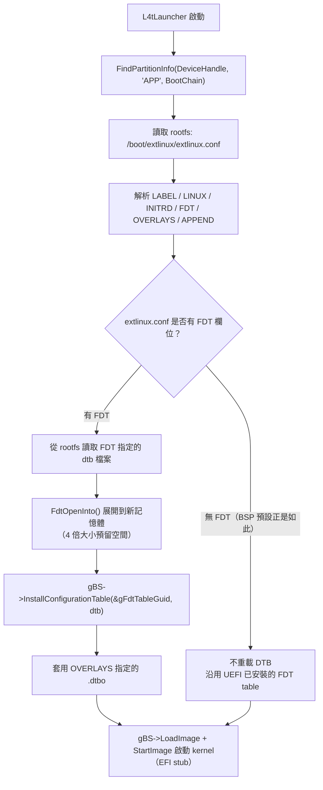
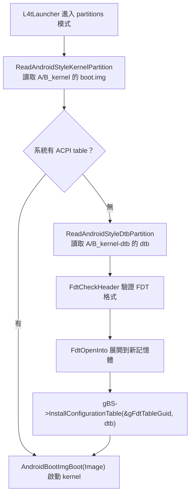
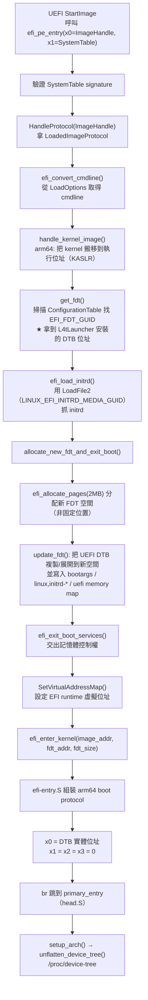
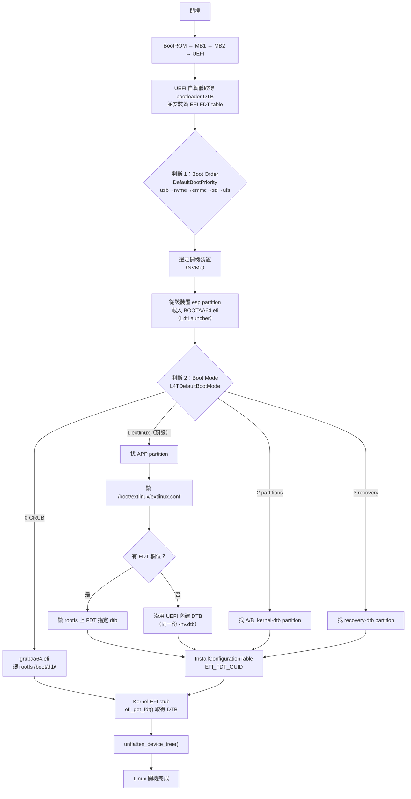

# Jetson AGX Orin DTB 載入機制與判斷邏輯

> 本文件深入探討 **Jetson AGX Orin（Tegra234）** 在開機過程中「哪一份 Device Tree（DTB）會被載入、從哪裡讀取、以及由什麼條件判斷」的完整機制。
> 平台設定：**AGX Orin 64GB（module P3701-0005，carrier P3737-0000）**，同時具備 **eMMC 與 NVMe** 兩顆儲存裝置，**UEFI 設定由 NVMe 開機**。BSP 為 L4T（Linux for Tegra）**R36.5.2**（`Linux_for_Tegra/`）。
>
> 資料來源：NVIDIA 官方《Boot Architecture》《UEFI Adaptation》文件、本機 BSP 分析、edk2-nvidia 的 `L4TLauncher.c` 原始碼。
>
> 開機流程總覽（各 bootloader 模組的角色）請見 **[[Jetson AGX Orin 開機流程與客製化指南]]**；本文件聚焦 **DTB**。

---

## 1. 先釐清：系統裡到底有幾份 DTB？

Tegra234 開機過程會用到 **三種不同用途的 DTB**，角色完全不同，容易混淆：

| 種類 | 對應 BSP 檔案（64GB / SKU 0005） | 使用者 | 存放位置 |
|---|---|---|---|
| **BPMP DTB** | `kernel/dtb/tegra234-bpmp-3701-0005-3737-0000.dtb` | BPMP 韌體（電源/時脈） | **QSPI NOR** 的 `A_bpmp-fw-dtb` partition |
| **Bootloader / UEFI DTB** | `tegra234-p3737-0000+p3701-0005-nv.dtb` | UEFI 韌體自身 | **串接進 `uefi_jetson_with_dtb.bin`**，寫入 QSPI NOR 的 `A_cpu-bootloader` partition |
| **Kernel DTB** | `tegra234-p3737-0000+p3701-0005-nv.dtb` | Linux kernel | **eMMC/NVMe 的 `A_kernel-dtb`/`B_kernel-dtb` partition** 與 **rootfs 的 `/boot/dtb/`** |

> [!IMPORTANT] T234 上 bootloader DTB 與 kernel DTB 是**同一份檔案**
> 在 `p3737-0000-p3701-0000.conf` 中 `TBCDTB_FILE="${DTB_FILE}"`（第 90、116 行）。也就是說，UEFI 韌體串接用的 DTB 與 kernel 使用的 DTB **檔名完全相同**（`-nv.dtb`）。
> 這與 T19x 不同（T19x 有獨立的 `bootloader-dtb` partition），T234 直接把 bootloader DTB 串接在 UEFI 韌體之後。

> [!NOTE] `-nv` 檔名代表什麼？
> `tegra234-p3737-0000+p3701-0005-nv.dtb` 是「NVIDIA 私有節點（non-upstream）版本」，內含 UEFI/Kernel 需要的 NVIDIA 專屬節點（如 `nvidia,bpmp`、carveout、DCE 等）。相對地 `tegra234-p3737-0000+p3701-0005.dtb`（無 `-nv`）是較乾淨的版本。BSP 預設採用 `-nv` 版本。

---

## 2. DTB 檔案究竟存放在哪些地方？

以「eMMC 與 NVMe 都有完整 OS 分割區、NVMe 開機」的典型配置為例：

### 2.1 QSPI NOR（on-module bootloader 儲存體）

```
QSPI NOR（device type="spi"，flash_t234_qspi_nvme.xml / flash_t234_qspi_sdmmc.xml 第一個 <device>）
├── BCT / A_mb1 / A_MB1_BCT / A_MEM_BCT / A_mb2 ...
├── A_bpmp-fw-dtb            ← BPMP DTB
├── A_cpu-bootloader         ← uefi_jetson_with_dtb.bin = UEFI 韌體 + bootloader DTB（串接）
├── A_secure-os              ← OP-TEE
└── ...（A/B 冗餘）
```

### 2.2 eMMC 與 NVMe 的 GPT（OS 分割區）

兩顆儲存裝置的 GPT 佈局相同（`flash_t234_qspi_sdmmc.xml` 的 sdmmc_user device vs `flash_t234_qspi_nvme.xml` 的 nvme device）：

```
GPT（eMMC 的 mmcblk0 / NVMe 的 nvme0n1）
├── master_boot_record / primary_gpt
├── A_kernel（boot.img，內含 kernel Image + initrd，無 dtb）
├── A_kernel-dtb            ← ★ kernel DTB（786432 bytes，flash 時寫入 DTB_FILE）
├── A_reserved_on_user
├── B_kernel / B_kernel-dtb / B_reserved_on_user   ← A/B 冗餘
├── RECNAME / RECDTB-NAME / esp / esp_alt          ← esp 放 BOOTAA64.efi
├── UDA / reserved
├── APP                     ← rootfs（含 /boot/extlinux/extlinux.conf 與 /boot/dtb/）
└── secondary_gpt
```

> [!NOTE] `mkbootimg` 產生的 boot.img **不內嵌 DTB**
> BSP 的 `make_boot_image()`（`flash.sh:1305`）呼叫 `./mkbootimg --kernel --ramdisk --cmdline`，**沒有 dtb 參數**。所以 kernel DTB 一定來自獨立的 `kernel-dtb` partition 或 rootfs，不會從 boot.img 內取出。

### 2.3 rootfs（APP partition）內的 DTB

flash 流程會把 kernel DTB 複製進 rootfs（`flash.sh`）：

```bash
# flash.sh:590-596 — 建立 /boot/dtb 並複製 dtb（簽章啟用時另產生 .sig）
mkdir -p mnt/boot/dtb
cp -f "${__rootfs_dir}/boot/${dtbfilename}" "mnt/boot/dtb/${dtbfilename}"

# flash.sh:4180-4181 — 也複製一份到 /boot/
cp -f "${dtbfilename}" "${rootfs_dir}/boot"
```

因此 rootfs 開機後會有：

```
rootfs（APP）
├── /boot/extlinux/extlinux.conf    ← UEFI 讀取的開機設定
├── /boot/<dtb 檔名>.dtb            ← kernel DTB 副本
└── /boot/dtb/<dtb 檔名>.dtb        ← kernel DTB 副本（Ubuntu/GRUB 慣用目錄）
```

---

## 3. 開機流程總覽（含 UEFI 之後的判斷點）



> [!TIP] 一句話版本（聚焦 DTB）
> 「**bootloader DTB 來自 QSPI 的 UEFI 韌體尾部**；**kernel DTB 由 L4tLauncher 依『開機裝置』+『Boot Mode』決定來源**，最後放入記憶體並以 **EFI FDT configuration table** 交棒給 kernel，**kernel 自己不會去儲存裝置讀 dtb**。」

---

## 4. 「怎麼知道去哪裡讀 DTB」的判斷機制（逐步拆解）

這節是核心。以 NVMe 開機為例，逐步說明每個判斷。

### 4.1 判斷 1：Boot Order 決定「從哪顆儲存裝置開機」

UEFI Boot Manager 依序嘗試 boot 裝置。順序來自 `DefaultBootPriority` UEFI variable（NVIDIA 專屬）：

- **預設值**（`kernel/dtb/L4TConfiguration.dtbo` 內定義）：
  ```
  DefaultBootPriority = "usb,nvme,emmc,sd,ufs"
  ```
  → **NVMe 優先於 eMMC**，符合「UEFI 設定 NVMe 開機」。
- **強制指定**：`flash.sh` 可用 `ADDITIONAL_DTB_OVERLAY` 套用預先做好的 dtbo：
  ```bash
  # 鎖定 NVMe 開機（BootOrderNvme.dtbo 內容：DefaultBootPriority = "nvme" + locked）
  sudo ADDITIONAL_DTB_OVERLAY="BootOrderNvme.dtbo" ./flash.sh jetson-agx-orin-devkit nvme0n1p1
  # 鎖定 eMMC 開機
  sudo ADDITIONAL_DTB_OVERLAY="BootOrderEmmc.dtbo" ./flash.sh jetson-agx-orin-devkit internal
  ```
- 也可在 UEFI 選單（Boot Manager / Boot Maintenance Manager）調整。

> [!IMPORTANT] 「開機裝置」決定了「之後所有東西從哪顆碟讀」
> UEFI 從選定裝置的 **`esp` partition** 載入 `BOOTAA64.efi`（L4tLauncher）。L4tLauncher 記錄這個裝置 handle，**之後找 APP、kernel、kernel-dtb 都只在同一顆裝置上找**。NVMe 開機 → 讀 NVMe 上的 kernel-dtb / rootfs；不會跑去 eMMC 混讀。

### 4.2 L4tLauncher 如何「記住」開機裝置

`L4TLauncher.c` 的 `L4TLauncher()`：

```c
DeviceHandle = GetDeviceHandleForFvBoot (LoadedImage->DeviceHandle, BootParams.BootChain);
```

- `LoadedImage->DeviceHandle` 就是 UEFI 載入 `BOOTAA64.efi` 的那個 partition（即 boot 裝置的 esp）的 handle。
- `GetDeviceHandleForFvBoot()` 依此還原出 boot 裝置的 handle，之後所有 `FindPartitionInfo(DeviceHandle, ...)` 都以它為根。

### 4.3 判斷 2：Boot Mode 決定「DTB 從哪種來源拿」

`L4TDefaultBootMode` UEFI variable（BSP 預設值 = **1**，定義於 `L4TConfiguration.dtbo`）：

| 值 | 模式 | DTB 來源 | 對應流程 |
|---|---|---|---|
| `0` | GRUB | 交給 `grubaa64.efi` | 由 GRUB 讀 rootfs `/boot/dtb/` |
| **`1`**（預設） | extlinux / filesystem | rootfs `APP` partition 的 `/boot/extlinux/extlinux.conf` 之 **FDT** 欄位 | `ProcessExtLinuxConfig()` + `ExtLinuxBoot()` |
| `2` | partitions | **`A_kernel-dtb` / `B_kernel-dtb` partition** | `BootAndroidStylePartition("kernel","kernel-dtb")` |
| `3` | recovery | `recovery-dtb` partition | `BootAndroidStylePartition("recovery","recovery-dtb")` |

實作（`L4TLauncher.c` `ProcessBootParams()`）：先讀 `L4TDefaultBootMode` variable；若 LoadOptions 帶 `bootmode=xxx` 則覆蓋；L4tLauncher 主流程依序 fallback：GRUB → Direct(extlinux) → BOOTIMG → RECOVERY。

#### 判斷的實際程式碼（`ProcessBootParams()`）

```c
// ① 從 NVRAM 讀非揮發變數 L4TDefaultBootMode（GUID: 781e084c-a330-417c-b678-38e696380cb9）
DataSize = sizeof (BootMode);
Status   = gRT->GetVariable (L4T_BOOTMODE_VARIABLE_NAME /*"L4TDefaultBootMode"*/,
                             &gNVIDIAPublicVariableGuid, NULL, &DataSize, &BootMode);
// ② 變數不存在或數值無效（>3）→ 退回 GRUB(0)
if (EFI_ERROR (Status) || (BootMode > NVIDIA_L4T_BOOTMODE_RECOVERY))
    BootMode = NVIDIA_L4T_BOOTMODE_GRUB;        // 0
// ③ LoadOptions（開機選項字串）帶 bootmode=xxx 時覆蓋變數值
if (StrStr (LoadOptions, L"bootmode=direct"))    BootMode = NVIDIA_L4T_BOOTMODE_DIRECT;    // 1
if (StrStr (LoadOptions, L"bootmode=grub"))      BootMode = NVIDIA_L4T_BOOTMODE_GRUB;      // 0
if (StrStr (LoadOptions, L"bootmode=bootimg"))   BootMode = NVIDIA_L4T_BOOTMODE_BOOTIMG;   // 2
if (StrStr (LoadOptions, L"bootmode=recovery"))  BootMode = NVIDIA_L4T_BOOTMODE_RECOVERY;  // 3
```

#### 設定「來自哪裡」？答案是三層都有，且彼此是「預設值 → NVRAM → 覆蓋」的關係

| 層級 | 發生點 | 內容 | 結果 |
|---|---|---|---|
| **① 編譯時** | UEFI source 的 `Silicon/NVIDIA/Tegra/DeviceTree/L4TConfiguration.dts` | `L4TDefaultBootMode { data = [01 00 00 00]; runtime; non-volatile; };` | 產生 `L4TConfiguration.dtbo` |
| **② 燒錄時** | `flash.sh` 把 `kernel/dtb/L4TConfiguration.dtbo` 透過 `OVERLAY_DTB_FILE` 套進 bootloader DTB，隨 `uefi_jetson_with_dtb.bin` 燒進 QSPI | 首次開機時 UEFI 讀 DTB 的 `firmware/uefi/variables/*` 節點，**把變數寫成 non-volatile variable** | 變數存入 **QSPI NOR 的 `uefi_variables` partition（NVRAM）** |
| **③ 執行時** | 每次開機 L4tLauncher 從 **NVRAM** 讀變數（不再看 DTB） | 可被 UEFI 選單 / efivarfs / LoadOptions `bootmode=` 修改 | 決定當次 DTB 來源 |

**優先順序（高→低）**：`LoadOptions bootmode=` > NVRAM 變數 > （變數無效/不存在時）退回 GRUB。

> [!IMPORTANT] 燒錄 ≠ 每次開機都讀 DTB
> 燒錄只是「設定首次開機的預設值」。一旦變數寫進 NVRAM，之後每次開機都是**讀 NVRAM**，除非 UEFI 選單或工具把變數改掉。

#### 怎麼「檢查」當前設定

- **UEFI 選單**：`Device Manager → NVIDIA Configuration → L4T Configuration → L4T Boot Mode`。
- **Linux 下用 efivarfs**（檔案格式：前 4 bytes = attributes，後 4 bytes = 值，little-endian）：
  ```bash
  sudo mount -t efivarfs none /sys/firmware/efi/efivars
  sudo xxd /sys/firmware/efi/efivars/L4TDefaultBootMode-781e084c-a330-417c-b678-38e696380cb9
  # 值：00000000=grub  00000001=extlinux  00000002=bootimg  00000003=recovery
  ```

#### 怎麼「調整」

| 方式 | 作法 | 生效 |
|---|---|---|
| **A. LoadOptions 單次覆蓋** | UEFI 選單 boot 選項追加 `bootmode=bootimg` 等 | 當次開機 |
| **B. Linux efivarfs（永久）** | ```sudo mount -t efivarfs none /sys/firmware/efi/efivars; V=.../L4TDefaultBootMode-781e084c-a330-417c-b678-38e696380cb9; sudo chattr -i $V; printf '\x07\x00\x00\x00\x01\x00\x00\x00' \| sudo dd of=$V bs=8 count=1; sudo chattr +i $V```（`\x07...`=attributes，`\x01 00 00 00`=值 1=extlinux） | 立即、永久 |
| **C. UEFI 選單** | `Device Manager → NVIDIA Configuration → L4T Configuration → L4T Boot Mode` | 立即、永久 |
| **D. 改燒錄預設值** | 改 BSP `kernel/dtb/L4TConfiguration.dtbo`（dtc 轉 dts 修改後轉回），或 `ADDITIONAL_DTB_OVERLAY` 加自訂 dtbo，或改 UEFI source 重編 | 下次重新 flash |

#### 三層來源與調整入口（mermaid 總覽）



> [!NOTE] 讀圖重點
> 「編譯時」決定預設值 →「燒錄時」把它寫進 NVRAM →「執行時」每次讀 NVRAM 決定 DTB 來源。調整入口有兩個：開機選項 `bootmode=`（當次覆蓋）與 UEFI 選單 / efivarfs（永久覆蓋）。

### 4.4 如何找 partition：靠「GPT 分割區名稱」，不是固定編號

L4tLauncher 並**不知道** kernel-dtb 在第幾個 partition，而是掃描 GPT 用 **partition name** 比對（`L4TLauncher.c` `FindPartitionInfo()`）：

- 用 `EFI_PARTITION_INFO_PROTOCOL` 取得每個 GPT partition 的 `PartitionName`。
- 依 `PartitionBasename`（`"kernel-dtb"`、`"kernel"`、`"APP"` 等）比對，並支援 **A/B 前綴**：
  - `A_kernel-dtb` / `B_kernel-dtb` 由 `BootChain` 決定取 `A` 還是 `B`。
  - 找不到該 slot 時，fallback 到另一個 slot（印 `Falling back to alternative boot path`）。
- 最後用 `LocatePartitionIndex()` 從 device path 的 `HARDDRIVE_DEVICE_PATH->PartitionNumber` 取得實際編號。

```c
// L4TLauncher.h 定義的 base name
#define ROOTFS_BASE_NAME        L"APP"
#define BOOTIMG_BASE_NAME       L"kernel"
#define BOOTIMG_DTB_BASE_NAME   L"kernel-dtb"
#define RECOVERY_BASE_NAME      L"recovery"
#define RECOVERY_DTB_BASE_NAME  L"recovery-dtb"
#define EXTLINUX_CONF_PATH      L"boot\\extlinux\\extlinux.conf"
```

> [!WARNING] 不要只靠 partition number
> 因為 A/B 與多裝置存在，L4tLauncher **不寫死 partition 編號**，而是動態掃描 GPT 名稱。這也代表「改 GPT 順序」不會破壞開機，但「改 partition 名稱」會。

### 4.5 模式 1（extlinux，預設）的完整流程

`ProcessExtLinuxConfig()` + `ExtLinuxBoot()`：



> [!NOTE] BSP 預設 extlinux.conf 沒有 FDT
> `bootloader/extlinux.conf`（會被安裝到 rootfs）內容只有 `LINUX /boot/Image`、`INITRD /boot/initrd`、`APPEND ${cbootargs}`，**沒有 FDT 欄位**。
> 因此預設狀況下，kernel 拿到的是「UEFI 內建 DTB」——即開機時從 `uefi_jetson_with_dtb.bin` 解析出來、T234 上與 kernel DTB 同一份的那個 `-nv.dtb`。
> 若想改，在 rootfs 的 `/boot/extlinux/extlinux.conf` 加入 `FDT /boot/<你的>.dtb` 即可（見第 7 節）。

### 4.6 模式 2（partitions）的完整流程

`BootAndroidStylePartition()`：



- 此模式以 Android Boot Image 協定解析 boot.img 後啟動 kernel（**內部仍走 EFI `LoadImage`/`StartImage`，kernel 依然進入 EFI stub**，差異只在 kernel/initrd 來源是記憶體而非檔案；詳見第 5.2 節）。
- 當 extlinux 模式失敗（例如 rootfs 損毀）時，L4tLauncher 會 **fallback 到 partitions 模式**（`L4TLauncher.c`：`BootParams.BootMode = NVIDIA_L4T_BOOTMODE_BOOTIMG`）。

### 4.7 UEFI 內建（bootloader）DTB 的來源

前面多次提到「UEFI 內建 DTB」，它是怎麼進到韌體裡的？

- T234 上沒有獨立的 `bootloader-dtb` partition；而是在 **燒錄時**把 UEFI 韌體與 DTB 串接成單一檔案（`tegraflash_impl_t234.py` 的 `tegraflash_concat_partition()`）：

```python
# 概念邏輯（tegraflash_impl_t234.py）
if partition_name in ['A_cpu-bootloader', 'B_cpu-bootloader']:
    if '_with_dtb' in filename:      # 已串接過則跳過
        return filename
    cpubl_with_dtb = '<basename>_with_dtb.bin'
    shutil.copyfile(cpubl_bin_file, cpubl_with_dtb)
    concat_file(cpubl_with_dtb, bl_dtb_file)   # UEFI + bootloader DTB 串接
```

- 串接前，bootloader DTB 還會先套用 `OVERLAY_DTB_FILE`（如 `L4TConfiguration.dtbo`、`tegra234-p3737-0000+p3701-0000-dynamic.dtbo`、`tegra-optee.dtbo` 等，見 `p3737-0000-p3701-0000.conf:117`）。
- 產生的 `uefi_jetson_with_dtb.bin` 寫入 QSPI 的 `A_cpu-bootloader`。
- 開機時 MB2 載入該檔案，UEFI 自韌體尾端解析出 DTB，並呼叫 `InstallConfigurationTable(&gFdtTableGuid, dtb)` 安裝成 EFI FDT table。**之後若 extlinux 沒指定 FDT，kernel 拿到的就是這份。**

---

## 5. UEFI ↔ Kernel 交棒機制：UEFI 怎麼「呼叫」kernel、怎麼把 DTB 交給它

這節回答最容易被混淆的問題：**UEFI 不是「跳轉」到 kernel，而是把 kernel 當成一個 EFI 應用程式「呼叫」進去**，而且資料交棒完全不靠函數參數。

### 5.1 三個關鍵事實

1. **kernel 是被「呼叫」而非「跳轉」**：UEFI 透過 `gBS->LoadImage()` 把 kernel `Image`（帶 EFI stub 的 PE/COFF 可執行檔）載入，再用 `gBS->StartImage()` 當成 EFI application 啟動。
2. **StartImage 的「函數參數」只有兩個**：`(EFI_HANDLE ImageHandle, EFI_SYSTEM_TABLE *SystemTable)`，在 arm64 上就是 **x0、x1** 兩個暫存器。kernel 的 EFI stub 入口 `efi_pe_entry(handle, sys_table)` 就是這兩個參數。
3. **DTB / cmdline / initrd 不透過函數參數**：全部透過 UEFI 標準「共享資料結構」交棒（見 5.4），kernel stub 再去這些結構裡「自己找」。

### 5.2 載入並啟動 kernel（LoadImage + StartImage）

**extlinux 模式**（`L4TLauncher.c` `ExtLinuxBoot()`）：

```c
// 1. 從 rootfs 讀取 kernel Image，建出檔案 device path
KernelDevicePath = FileDevicePath(DeviceHandle, BootOption->LinuxPath);  // \boot\Image
gBS->LoadImage(FALSE, ImageHandle, KernelDevicePath, NULL, 0, &KernelHandle);

// 2. 把 cmdline 塞進 LoadedImageProtocol 的 LoadOptions（這就是「傳參數」）
ImageInfo->LoadOptions     = NewArgs;                       // 例如 root=... console=...
ImageInfo->LoadOptionsSize = StrLen(NewArgs) * sizeof(CHAR16);

// 3. 啟動 kernel（如同啟動一個 UEFI 應用程式）
gBS->StartImage(KernelHandle, NULL, NULL);
```

**partitions（bootimg）模式**：`AndroidBootImgBoot()`（edk2 `EmbeddedPkg/Library/AndroidBootImgLib/AndroidBootImgLib.c`，NVIDIA L4tLauncher 直接採用）**同樣用 LoadImage/StartImage**，差異只在 kernel 來源是「記憶體中的 boot.img」而非檔案：

```c
// 用 MEMMAP_DEVICE_PATH 指向 boot.img 中的 kernel 記憶體區段
KernelDevicePath.Node1.StartingAddress = (UINTN)Kernel;
KernelDevicePath.Node1.EndingAddress   = (UINTN)Kernel + KernelSize;
gBS->LoadImage(TRUE, gImageHandle, (EFI_DEVICE_PATH*)&KernelDevicePath,
               (VOID*)Kernel, KernelSize, &ImageHandle);

ImageInfo->LoadOptions     = NewKernelArg;    // boot.img header 的 KernelArgs
gBS->StartImage(ImageHandle, NULL, NULL);
```

> [!IMPORTANT] 修正
> 兩個模式最後**都會進入 EFI stub**，kernel 都用同一套方式拿 DTB（config table）。差別只在 kernel/initrd 的「來源」：rootfs 檔案 vs boot.img partition。

### 5.3 EFI System Table 到底是什麼：誰建立、放在哪、kernel 怎麼拿到它的指標

前面一直出現「kernel 掃描 SystemTable 的 ConfigurationTable 陣列」，這裡把這個 table 的**具體運作**講清楚。

#### 5.3.1 它是「存在於記憶體的一個 C 結構」

**EFI System Table 不是概念，是 UEFI 韌體開機早期在記憶體裡建立並常駐的一個 struct**。所有「UEFI 世界的服務」都掛在它下面（boot 服務、runtime 服務、console、ConfigurationTable…）。

**誰建立、放哪：** EDK2 的 DXE Core 初始化時呼叫 `CoreConstructSystemTable()` 建立 `gDxeCoreSystemTable`，用記憶體分配函數配置 buffer 並填好內容；它在 UEFI memory map 中標記為 `EfiRuntimeServicesData`（或 `EfiBootServicesData`）。**位址由韌體動態決定，不固定。**

**它的記憶體結構（關鍵欄位）：**

```c
typedef struct {
    EFI_TABLE_HEADER            Hdr;                  // 含 signature/revision，用來驗證「這是真的 System Table」
    CHAR16                     *FirmwareVendor;
    UINT32                      FirmwareRevision;
    EFI_HANDLE                  ConsoleInHandle;
    EFI_SIMPLE_TEXT_INPUT_PROTOCOL  *ConIn;
    EFI_HANDLE                  ConsoleOutHandle;
    EFI_SIMPLE_TEXT_OUTPUT_PROTOCOL *ConOut;
    ...
    EFI_RUNTIME_SERVICES       *RuntimeServices;      // 指標 → runtime 服務表
    EFI_BOOT_SERVICES          *BootServices;         // 指標 → boot 服務表（LoadImage/StartImage/...）
    UINTN                       NumberOfTableEntries; // ConfigurationTable 陣列有幾列
    EFI_CONFIGURATION_TABLE    *ConfigurationTable;   // ★ 指標 → 指向「(GUID, 資料指標)」陣列開頭
} EFI_SYSTEM_TABLE;
```

而 `ConfigurationTable` 指向的陣列，每一列是：

```c
typedef struct {
    EFI_GUID    VendorGuid;    // 16 bytes 識別號
    VOID       *VendorTable;   // 指向實際資料（例如 DTB）的指標
} EFI_CONFIGURATION_TABLE;
```

#### 5.3.2 kernel 怎麼拿到 SystemTable 的指標？（「怎麼告訴 kernel」）

**不是 kernel 自己找，而是 UEFI 在「啟動 kernel 的那一刻」把指標當成函數參數交給它。** 具體：

1. L4tLauncher 呼叫 `gBS->StartImage(KernelHandle, NULL, NULL)`。
2. EDK2 的 `CoreStartImage()`（`MdeModulePkg/Core/Dxe/Image/Image.c`）最終執行：
   ```c
   Status = Image->EntryPoint(Image->Handle, gDxeCoreSystemTable);
   ```
   也就是「以函數呼叫方式進入 kernel 的入口點，傳兩個參數：(ImageHandle, gDxeCoreSystemTable)」。
3. 在 arm64 上這是普通 C 呼叫，依 AAPCS64 慣例參數放暫存器：
   - `x0 = ImageHandle`
   - `x1 = gDxeCoreSystemTable`（SystemTable 指標）
4. kernel 的入口點 `efi_pe_entry` 收下：
   ```c
   efi_status_t __efiapi efi_pe_entry(efi_handle_t handle,          // = x0
                                      efi_system_table_t *sys_table_arg)  // = x1
   ```
5. stub 第一行就把它存成全域，之後所有查表都從這裡出發：
   ```c
   efi_system_table = sys_table_arg;
   ```

#### 5.3.3 從 SystemTable 走到 DTB 的「指標鏈」

```
efi_system_table（全域指標，值來自 StartImage 呼叫時的 x1）
  └─> 讀 efi_system_table->ConfigurationTable 這個欄位
      （欄位的「值」就是「(GUID, 指標) 陣列」的開頭位址）
        ├─ ConfigurationTable[0] = { GUID_A, 資料A }
        ├─ ConfigurationTable[1] = { GUID_B, 資料B }
        └─ ... 共 NumberOfTableEntries 列
get_fdt() = 逐列比對 GUID == b1b621d5-... → 命中 → 回傳該列的 VendorTable 欄位（DTB 指標）
```

```c
// kernel stub：drivers/firmware/efi/libstub/fdt.c
void *get_fdt(unsigned long *fdt_size)
{
    fdt = get_efi_config_table(DEVICE_TREE_GUID);   // 掃描上述陣列
    if (fdt_check_header(fdt) != 0) return NULL;    // 驗證 DTB 格式（magic）
    *fdt_size = fdt_totalsize(fdt);
    return fdt;
}

// Linux 查表實作（include/linux/efi.h）：就是「逐列比 GUID」的迴圈
static inline void *get_efi_config_table(efi_guid_t guid)
{
    efi_config_table_t *t = efi_system_table->tables;   // 陣列開頭
    int i;
    for (i = 0; i < efi_system_table->nr_tables; i++, t++)
        if (efi_guidcmp(guid, t->guid) == 0)            // GUID 逐一比對
            return t->tables;                           // 回傳該列資料指標 = DTB
    return NULL;                                        // 找不到
}
```

> 所以「kernel 怎麼知道 table 在哪裡？」的答案：
> ① **table 存在記憶體**，位址由韌體決定；
> ② kernel 並不需要自己找——**UEFI 呼叫 kernel 時把指標作為函數參數（arm64 的 x1）交給它**；
> ③ 拿到 SystemTable 指標後，讀結構內 `ConfigurationTable` 欄位（該欄位的值就是陣列位址）；
> ④ 逐列比 GUID，命中就拿那一列的資料指標（就是 DTB）。

### 5.4 四條「資料交棒」通道（UEFI → kernel stub）

| 資料 | 交棒通道 | 標的 / GUID | kernel stub 端讀取 |
|---|---|---|---|
| **DTB** | **ConfigurationTable** | `EFI_FDT_GUID` = `b1b621d5-f19c-41a5-830b-d9152c69aae7` | `get_fdt()`：`get_efi_config_table(DEVICE_TREE_GUID)` |
| **cmdline** | **LoadedImageProtocol.LoadOptions** | 指向 kernel 的 image handle | `efi_convert_cmdline(image, ...)` |
| **initrd** | **LoadFile2Protocol + 特定 device path** | `LINUX_EFI_INITRD_MEDIA_GUID` = `5568e427-68fc-4f3d-ac1c-eb55e22b3f6d` | `efi_load_initrd(image, ...)` 用 LoadFile2 抓取 |
| **EFI System Table** | StartImage 函數參數 | x1 | stub 全域指標 `efi_system_table` |

> [!NOTE] config table 是什麼？
> 它是 EFI System Table 內的一個陣列：`{ GUID, 記憶體位址 }` 配對。任何 UEFI 元件可 `InstallConfigurationTable(GUID, ptr)` 登記，任何元件可依 GUID 查詢。**kernel stub 完全不在乎這個位址怎麼來的、是不是固定位置**——它只掃描陣列找 GUID。

### 5.5 kernel EFI stub 收到呼叫後做了什麼（`efi_pe_entry`）



### 5.6 最後一跳：`efi_enter_kernel`（`arch/arm64/kernel/efi-entry.S`）

```asm
// 進來時：x0 = relocated kernel entry, x1 = DTB 位址（efi_pe_entry 傳入）
add  x19, x0, x2          // x19 = primary_entry 位址
mov  x20, x1              // x20 = DTB 位址
...關閉 MMU / D-cache...
mov  x0, x20              // arm64 boot protocol: x0 = DTB physical address
mov  x1, xzr              // x1 = 0
mov  x2, xzr
mov  x3, xzr
br   x19                  // 跳進真正的 kernel entry (primary_entry)
```

kernel 收到後，`setup_arch()` 用 x0 指向的 FDT 呼叫 `unflatten_device_tree()`。**注意：這份 DTB 是 stub 在 5.5 節自己重建（relocate）的那份，不是 L4tLauncher 那塊原始 buffer。**

#### kernel 拿到位置後：複製一份，不是沿用

關鍵問題：「kernel 拿到 DTB 位置後，是複製一份，還是就一直用那個位置？kernel 重新規劃記憶體時不會破壞它嗎？」

答案：**DTB 是複製一份到自己新分配的位置，之後用新的；SystemTable 那類則是一直沿用。**

- **DTB 為什麼要複製？** UEFI 那塊 DTB 記憶體是「boot services 階段」分配的，類型為 `EfiBootServicesData` / `EfiLoaderData`。kernel 一接管（`efi_exit_boot_services()` 之後）就會把這類記憶體收進自己的分頁分配器當「一般可用記憶體」，隨時可能被覆寫。所以 stub 必須**搶在退出 boot services 之前**把 DTB 複製到 `efi_allocate_pages()` 自己分的新空間（見 5.5 節 `allocate_new_fdt_and_exit_boot()`）。
- **SystemTable / ConfigurationTable 為什麼不用搬？** 它們所在記憶體的類型是 `EfiRuntimeServicesData` / `EfiRuntimeServicesCode`。kernel 接管記憶體時會「尊重 memory map 的類型標記」：

  | memory map 類型 | kernel 處理 | 後果 |
  |---|---|---|
  | `EfiBootServicesData` / `EfiLoaderData`（DTB 原本所在） | 視為**可回收**，納入一般可用池 | DTB 必須複製走 |
  | `EfiRuntimeServicesData` / `EfiRuntimeServicesCode`（SystemTable、ConfigurationTable 所在） | **保留**，不當一般記憶體用，留給 EFI runtime services | 開機後持續有效 |

- 因此 Linux 開機後仍保有全域 `efi_system_table` 指標，並繼續透過它呼叫 `RuntimeServices->GetVariable()` 等（例如 `efivarfs` 讀 UEFI 變數）。
- DTB 最終那份（stub 複製的）在 `setup_arch()` 的 `unflatten_device_tree()` **解析成內部樹之後**，其原始 buffer 才允許被回收——因為硬體資訊已拷貝成 device node 樹，之後驅動都從樹上讀，不再碰 FDT buffer。

### 5.7 所以 kernel「根據什麼」知道去哪裡讀 DTB？

依優先序：

1. **EFI ConfigurationTable 中的 `EFI_FDT_GUID`**（主要路徑）：L4tLauncher 安裝的位址 → stub `get_fdt()` 查得 → 複製到自己的 2MB 分配 → 放 x0。
2. **cmdline 的 `dtb=<path>`**：僅在 **UEFI Secure Boot 關閉** 時才允許（`CONFIG_EFI_ARMSTUB_DTB_LOADER` 且 secure_boot != enabled），開機階段由 stub 讀檔案。
3. 兩者皆無 → stub 產生空 DTB（`fdt_create_empty_tree`），實務上 arm64 無法正常啟動。

> [!NOTE] 為什麼不是「固定 RAM 位置」？
> 全程沒有一格是固定位址：L4tLauncher 的 `AllocatePages`、stub 的 `efi_allocate_pages` 都是**動態分配**，每次開機都可能不同。kernel 之所以找得到，靠的是 **GUID 索引的 config table**，而非記住某個位址。這正是 UEFI 設計上要打破「bootloader 與 OS 之間共用固定位址」的耦合。

---

## 6. 完整判斷決策樹（總整理）



---

## 7. 實務：想換 DTB 該改哪裡？

| 情境 | 做法 |
|---|---|
| **改 kernel 開機用的 DTB** | 1) 替換 `kernel/dtb/` 下對應 `.dtb` 並重新 flash；2) 或在 rootfs `/boot/extlinux/extlinux.conf` 加入 `FDT /boot/<你的>.dtb`（優先於 partition 內建 DTB）；3) 直接覆蓋 rootfs 的 `/boot/dtb/<檔名>`（dtc 工具轉換步驟見 [[修改 dtb]]） |
| **改 UEFI 內建 DTB** | 修改 `OVERLAY_DTB_FILE` 對應的 dtbo，或替換 bootloader DTB 後重新 flash（會重新串接 `uefi_jetson_with_dtb.bin`） |
| **用 overlay 疊加** | 參考 [[NVIDIA Jetson Device Tree Overlay (DTBO) 完整指南]]，UEFI 開機時依 `ids`/`odm-data`/`fuse-info`/`sw-modules` 條件自動套用 |
| **確認目前用哪份** | 見第 8 節驗證方法 |

> [!CAUTION] 換 DTB 前注意
> 換成錯誤的 DTB（如記憶體容量不符）可能導致開機失敗。改動前建議以 `--no-flash` 先產生映像，並保留可進入 Recovery Mode 的重刷能力。

---

## 8. 驗證方法（實機）

```bash
# 1. 確認 rootfs 掛在哪顆裝置（反推 UEFI 選了哪顆開機）
cat /proc/cmdline                       # root=PARTUUID=... 指向 NVMe 或 eMMC
lsblk -o NAME,PARTLABEL,TYPE /dev/nvme0n1 /dev/mmcblk0

# 2. 確認 kernel 真正解析的 model / compatible（= 用哪份 dtb）
cat /proc/device-tree/model
tr '\0' '\n' < /proc/device-tree/compatible
#   AGX Orin 64GB 應看到 nvidia,p3737-0000+p3701-0005

# 3. 確認 UEFI 變數（Boot Order / Boot Mode）
sudo mount -t efivarfs none /sys/firmware/efi/efivars
ls /sys/firmware/efi/efivars/ | grep -iE "L4TDefaultBootMode|DefaultBootPriority"

# 4. 比對 eMMC / NVMe / rootfs 上的 dtb 是否一致
sudo dd if=/dev/nvme0n1p<kernel-dtb> of=/tmp/nvme.dtb bs=512 count=<大小>
sudo dd if=/dev/mmcblk0p<kernel-dtb> of=/tmp/emmc.dtb bs=512 count=<大小>
sha256sum /tmp/nvme.dtb /tmp/emmc.dtb /boot/dtb/*.dtb
```

---

## 9. 參考資料

- NVIDIA 官方文件：《Boot Architecture → Jetson AGX Orin Boot Flow》《UEFI Adaptation（Boot Order Selection / Boot Mode Selection / DTB Support）》
- edk2-nvidia 原始碼：`Silicon/NVIDIA/Application/L4TLauncher/L4TLauncher.c`、`L4TLauncher.h`
- 本機 BSP（R36.5.2）：
  - `p3737-0000-p3701-0000.conf`（DTB_FILE / TBCDTB_FILE / OVERLAY_DTB_FILE）
  - `p3701.conf.common`（process_board_version：SKU 0005 = 64GB）
  - `flash.sh`（make_boot_image / DTB_TAG / TBCDTB_TAG / rootfs dtb 複製）
  - `bootloader/tegraflash_impl_t234.py`（uefi_jetson_with_dtb.bin 串接）
  - `bootloader/generic/cfg/flash_t234_qspi_sdmmc.xml`、`flash_t234_qspi_nvme.xml`（partition 佈局）
  - `kernel/dtb/L4TConfiguration.dtbo`（L4TDefaultBootMode=1、DefaultBootPriority）、`BootOrderNvme.dtbo`
- 相關知識庫文章：
  - [[Jetson AGX Orin 開機流程與客製化指南]]（boot chain 各模組總覽）
  - [[NVIDIA Jetson Device Tree Overlay (DTBO) 完整指南]]
  - [[Nvidia Jetson AB Partition 切換]]
  - [[UEFI 開機流程完整指南]]
  - [[Jetson AGX Orin Secure Boot 完整指南]]
