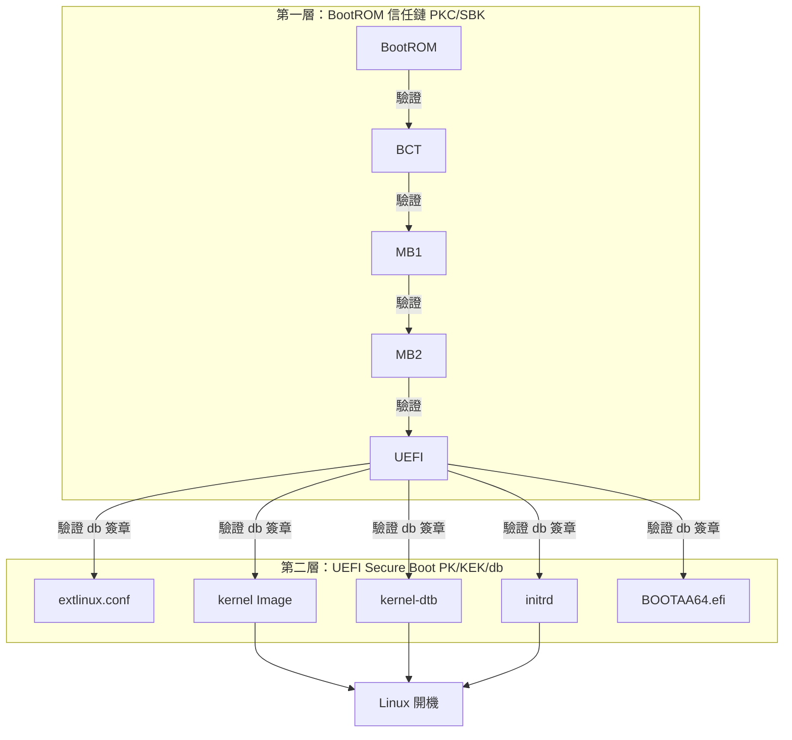
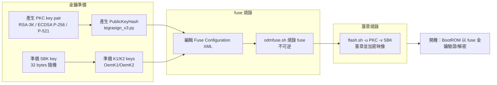
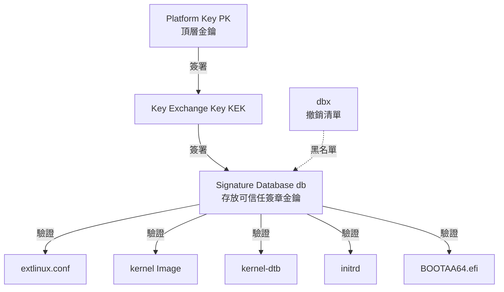
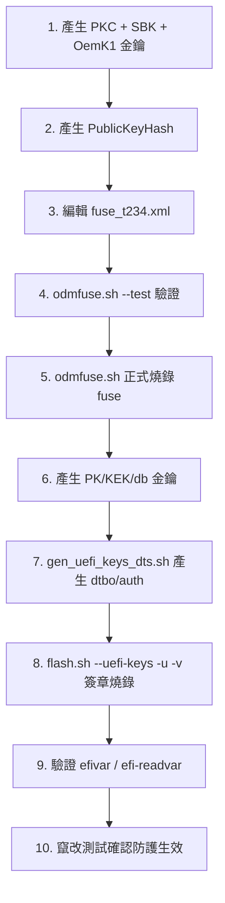

# Jetson AGX Orin Secure Boot 完整指南

> 本文件說明 Jetson AGX Orin（Tegra234）如何啟用 **Secure Boot**，包含具體可執行的步驟、所需金鑰、工具與注意事項。適用版本為 L4T（Linux for Tegra）R36.x，對應本機 `Linux_for_Tegra/` 目錄。

---

## 1. 概述：Jetson 有兩層 Secure Boot

Jetson 的安全開機不是單一機制，而是**兩層獨立的信任鏈**疊加而成：

| 層級 | 名稱 | 保護對象 | 信任根 | 金鑰 |
|---|---|---|---|---|
| 第一層 | BootROM 信任鏈（PKC/SBK） | BCT、MB1、MB2、UEFI 等 **bootloader 映像** | SoC 內 BootROM + fuse | PKC 公開金鑰 hash、SBK |
| 第二層 | UEFI Secure Boot | **kernel、kernel-dtb、initrd、extlinux.conf、BOOTAA64.efi** | UEFI 韌體 + UEFI 變數 | PK、KEK、db |



> [!IMPORTANT] 兩層都要啟用
> 只燒 fuse（第一層）能防止竄改 bootloader，但 kernel 等 UEFI payload 仍可被替換；只開 UEFI Secure Boot（第二層）則無法保護更底層的 bootloader。完整安全需要**兩層都啟用**。

---

## 2. 前置需求

### 2.1 主機環境

- **x86 Ubuntu 主機**（官方建議 18.04 / 20.04；本機範例使用 R36.5.2 BSP）。
- 已解壓的完整 L4T BSP（本機 `Linux_for_Tegra/`）。
- 目標 Jetson AGX Orin 與 USB-C Recovery 線、電源線。

### 2.2 必備工具（第二層 UEFI Secure Boot 需要）

```bash
sudo apt update
sudo apt install openssl device-tree-compiler efitools uuid-runtime
```

> 第一層（PKC/SBK）所需的 `tegrasign_v3.py`、`odmfuse.sh`、`flash.sh` 已隨 BSP 附帶，不需另行安裝。

### 2.3 金鑰安全

> [!CAUTION] 金鑰是信任之錨
> PKC、SBK、PK、KEK、db 等私鑰一旦遺失或外洩，將導致裝置無法更新或安全失效。請使用 **HSM（硬體安全模組）** 產生隨機金鑰，並離線妥善保管。金鑰檔**不可放在 `bootloader/` 目錄**下。

---

## 3. 第一層：BootROM 信任鏈（PKC / SBK fusing）

### 3.1 概念

Jetson 開機時，SoC 內建 **BootROM** 是唯一的信任根。它利用燒錄在 **fuse**（一次性可寫，不可逆）中的 **PKC 公開金鑰 hash** 驗證 BCT/MB1/MB2 的簽章；若啟用了 **SBK**，則 bootloader 映像還會被加密，開機時需以 fuse 內同樣的 SBK 解密。



### 3.2 產生 PKC 金鑰對

Jetson AGX Orin **支援 RSA-3K、ECDSA P-256、ECDSA P-521**（不支援 RSA-2K）。

```bash
# 方法一：ECDSA P-256
openssl ecparam -name prime256v1 -genkey -noout -out ecp256.pem

# 方法二：ECDSA P-521
openssl ecparam -name secp521r1 -genkey -noout -out ecp521.pem

# 方法三：RSA 3072
openssl genrsa -out rsa_priv.pem 3072
```

### 3.3 產生 PublicKeyHash（要燒進 fuse 的值）

```bash
# 從 PKC key pair 產生公開金鑰檔與 hash（放在 Linux_for_Tegra/bootloader/ 下執行）
cd bootloader
./tegrasign_v3.py --pubkeyhash <pkc>.pubkey <pkc>.hash --key <pkc>.pem
```

執行後畫面會顯示類似（範例，非真實值）：

```
tegra-fuse format (big-endian): 0x9f0ebf0aec1e2bb30c0838096a6d9de5...f8fe84
```

> [!NOTE] 請將 `<pkc>.pem` 取代為你的金鑰檔名。輸出中的十六進位值即為 **PublicKeyHash**，稍後填入 fuse XML。

### 3.4 準備 SBK（Secure Boot Key）

- SBK 用於**加密 bootloader 映像**，長度為 **32 bytes（8 個 32-bit word）**。
- 以 big-endian 十六進位格式存入檔案，例如 `sbk.key`：

```
0x12345678 0x9abcdef0 0xfedcba98 0x76543210 0x23456789 0xabcdef01 0xedcba987 0x6543210f
```

> [!WARNING] SBK 只能搭配 PKC 使用（組合稱 **SBKPKC**）。請以 HSM 產生真正隨機的金鑰。

### 3.5 準備 K1/K2 keys（OemK1 / OemK2）與 EKB（可選）

- `OemK1` / `OemK2` 是額外的 OEM 金鑰（32 bytes），用於 Secure Storage、EKB（Encrypted Key Blob）等。
- 若燒錄了 `OemK1`，則需產生對應的 **EKB**（`eks_t234.img`），否則 UEFI 會因無法驗證 UEFI 變數而無法開機。
- EKB 產生方式（官方 gen_ekb.py，位於 OP-TEE source）：

```bash
# 需準備 oem_k1.key 與 auth_t234.key（128-bit auth key）
python3 gen_ekb.py -chip t234 \
    -oem_k1_key <oem_k1.key> \
    -in_auth_key <auth_t234.key> \
    -out <eks_t234.img>
```

> 若你不需要 Secure Storage / EKB 功能，可先跳過此步驟，僅燒 PKC + SBK。

### 3.6 編輯 Fuse Configuration XML

以 BSP 附帶的 **reference fuse file**（`bootloader/fuse_t234.xml`，列出 Orin 所有可用 fuse）為範本，將要燒錄的 fuse 取消註解並填入真實值。

最簡潔的 Secure Boot 範例（RSA-3K）：

```xml
<genericfuse MagicId="0x45535546" version="1.0.0">
    <fuse name="PublicKeyHash" size="64" value="0x18e984f7...db658130"/>
    <fuse name="BootSecurityInfo" size="4" value="0x1"/>
    <fuse name="SecurityMode" size="4" value="0x1"/>
</genericfuse>
```

加上 SBK + OemK1 的完整範例：

```xml
<genericfuse MagicId="0x45535546" version="1.0.0">
    <fuse name="PublicKeyHash" size="64" value="0x9f0ebf0a...f8fe84"/>
    <fuse name="SecureBootKey" size="32" value="0x123456789abcdef0fedcba987654321000112233445566778899aabbccddeeff"/>
    <fuse name="OemK1" size="32" value="0xf3bedbff...88fb2b"/>
    <fuse name="BootSecurityInfo" size="4" value="0x20b"/>
    <fuse name="SecurityMode" size="4" value="0x1"/>
</genericfuse>
```

> [!IMPORTANT] 各 fuse 欄位含義
> | fuse | 說明 |
> |---|---|
> | `PublicKeyHash` | PKC 公開金鑰的 hash（步驟 3.3 的輸出），信任根 |
> | `SecureBootKey` | SBK 金鑰（步驟 3.4），32 bytes |
> | `OemK1` | OEM 金鑰（步驟 3.5），用於 Secure Storage/EKB |
> | `BootSecurityInfo` | 安全開機資訊；bit 0=PKC 驗證、bit 4=SBK 加密（0x1=僅 PKC，0x20b=PKC+SBK+OemK1 等） |
> | `SecurityMode` | 設為 0x1 後**封鎖所有後續 fuse 寫入**（production mode） |
>
> **fuse 為一次性、不可逆**。`SecurityMode` 一旦燒為 0x1，之後就無法再燒任何 fuse。請在燒錄前反覆確認。

### 3.7 燒錄 fuse（odmfuse.sh）

```bash
# 將裝置進入 Recovery 模式，再執行（本機路徑）
sudo ./odmfuse.sh -X <fuse_config.xml> -i 0x23 jetson-agx-orin-devkit

# 若裝置先前已燒過 PKC key，需帶 -k 指定該金鑰
sudo ./odmfuse.sh -X <fuse_config.xml> -i 0x23 -k <pkc>.pem jetson-agx-orin-devkit
```

> [!TIP] 強烈建議先測試
> 燒錄前先加 `--test` 參數乾跑一次驗證，確認無誤後再正式燒錄：
> ```bash
> sudo ./odmfuse.sh --test -X <fuse_config.xml> -i 0x23 jetson-agx-orin-devkit
> ```

### 3.8 簽章並燒錄映像（flash.sh）

fuse 燒錄完成後，所有要寫入的映像都必須用同一個 PKC 簽章（有 SBK 時再加密）：

```bash
# 僅 PKC 簽章
sudo ./flash.sh -u <pkc>.pem jetson-agx-orin-devkit internal

# PKC + SBK（簽章 + 加密）
sudo ./flash.sh -u <pkc>.pem -v <sbk.key> jetson-agx-orin-devkit internal
```

> [!NOTE] `internal` 參數
> 尾綴 `internal` 指示 flash 目標 rootfs 位於 eMMC 內部儲存。依裝置儲存位置可改為 `mmcblk0p1`（SD）等。

若想「先簽章、後另選時間燒錄」（如量產），可分兩步：

```bash
# 1) 只簽章不燒錄，產生 bootloader/flashcmd.txt
sudo ./flash.sh --no-flash -u <pkc>.pem [-v <sbk.key>] jetson-agx-orin-devkit internal

# 2) 之後再執行燒錄
cd bootloader && sudo bash ./flashcmd.txt
```

### 3.9 驗證 fuse 燒錄狀態

開機後在目標裝置上讀取 fuse：

```bash
sudo /usr/sbin/nv_fuse_read.sh        # 讀取全部 fuse
sudo /usr/sbin/nv_fuse_read.sh ecid   # 讀取 ECID
```

---

## 4. 第二層：UEFI Secure Boot（PK / KEK / db）

### 4.1 概念

UEFI Secure Boot 用 **RSA 簽章**驗證 UEFI 載入的所有 payload。金鑰階層如下：



| 金鑰 | 全名 | 角色 |
|---|---|---|
| **PK** | Platform Key | 頂層，用來簽署/更換 KEK |
| **KEK** | Key Exchange Key | 用來簽署 db/dbx 內容 |
| **db** | Signature Database | 存放允許執行的簽章金鑰/憑證 |
| **dbx** | Forbidden Database | 黑名單（撤銷） |

### 4.2 準備 PK / KEK / db 金鑰

```bash
cd Linux_for_Tegra
mkdir uefi_keys && cd uefi_keys
GUID=$(uuidgen)

# PK
openssl req -newkey rsa:2048 -nodes -keyout PK.key -new -x509 -sha256 -days 3650 \
    -subj "/CN=my Platform Key/" -out PK.crt
cert-to-efi-sig-list -g "${GUID}" PK.crt PK.esl

# KEK
openssl req -newkey rsa:2048 -nodes -keyout KEK.key -new -x509 -sha256 -days 3650 \
    -subj "/CN=my Key Exchange Key/" -out KEK.crt
cert-to-efi-sig-list -g "${GUID}" KEK.crt KEK.esl

# db_1（主要 payload 簽章金鑰）
openssl req -newkey rsa:2048 -nodes -keyout db_1.key -new -x509 -sha256 -days 3650 \
    -subj "/CN=my Signature Database key/" -out db_1.crt
cert-to-efi-sig-list -g "${GUID}" db_1.crt db_1.esl

# db_2（備用/測試，可選）
openssl req -newkey rsa:2048 -nodes -keyout db_2.key -new -x509 -sha256 -days 3650 \
    -subj "/CN=my another Signature Database key/" -out db_2.crt
cert-to-efi-sig-list -g "${GUID}" db_2.crt db_2.esl
```

### 4.3 建立 uefi_keys.conf 設定檔

在 `uefi_keys/` 下建立 `uefi_keys.conf`：

```bash
UEFI_PK_KEY_FILE="PK.key";
UEFI_PK_CERT_FILE="PK.crt";
UEFI_KEK_KEY_FILE="KEK.key";
UEFI_KEK_CERT_FILE="KEK.crt";
UEFI_DB_1_KEY_FILE="db_1.key";
UEFI_DB_1_CERT_FILE="db_1.crt";
# 可選：第二把 db 金鑰
UEFI_DB_2_KEY_FILE="db_2.key";
UEFI_DB_2_CERT_FILE="db_2.crt";
```

### 4.4 產生 UEFI 安全金鑰 DTS/DTBO

```bash
cd Linux_for_Tegra
sudo ./tools/gen_uefi_keys_dts.sh uefi_keys/uefi_keys.conf
sudo chmod 644 uefi_keys/_out/*.auth
```

這會產生：
- `UefiDefaultSecurityKeys.dts` / `.dtbo`：燒錄時把 PK/KEK/db 註冊進 UEFI 變數。
- `_out/*.auth`：各金鑰的 authenticated variable（執行期 enroll 用）。

> [!NOTE] 本機另有 `tools/gen_uefi_default_keys_dts.sh`
> 官方文件標註該舊版腳本未來將淘汰，以 `gen_uefi_keys_dts.sh` 取代。若你使用舊版，輸出名稱與產物略異，但流程相同。

### 4.5 方式 A：燒錄時啟用（flash.sh --uefi-keys）

```bash
# 第一層（若已 fuse）與第二層可同時啟用
sudo ./flash.sh --uefi-keys uefi_keys/uefi_keys.conf \
    [-u <pkc>.pem] [-v <sbk.key>] jetson-agx-orin-devkit internal
```

> [!CAUTION] 燒錄時啟用後無法關閉
> 透過 `--uefi-keys` 在燒錄時啟用 UEFI Secure Boot，**只能重刷才能關閉**。若在執行期（方式 B）啟用，則仍可從 UEFI Menu 的「Reset Secure Boot Keys」關閉。

### 4.6 方式 B：執行期啟用（裝置端 enroll）

適用於已開機的裝置，從 Ubuntu 端把金鑰寫入 UEFI 變數。

```bash
# 目標裝置端
sudo su
apt install efitools efivar

# 確認尚未啟用（SecureBoot 值應為 00）
efivar -n 8be4df61-93ca-11d2-aa0d-00e098032b8c-SecureBoot

# 下載 auth 檔到裝置
mkdir /uefi_keys && cd /uefi_keys
scp <host_ip>:<LDK_DIR>/uefi_keys/_out/*.auth .

# 先 enroll db 與 KEK（PK 最後）
efi-updatevar -f /uefi_keys/db.auth db
efi-updatevar -f /uefi_keys/KEK.auth KEK

# 寫入已簽章的 payload（kernel、dtb、initrd、extlinux.conf、BOOTAA64.efi 等）
# ... 依 README 將簽章檔寫入 /boot/ 與各分割區 ...

# 最後 enroll PK
efi-updatevar -f /uefi_keys/PK.auth PK
reboot
```

> 執行期完整流程較長（需手動將已簽章的 kernel/initrd/dtb 寫入對應分割區），詳細步驟見本機 `tools/README_uefi_secureboot.txt` 第 3 節。

### 4.7 驗證 UEFI Secure Boot

```bash
# 目標裝置端
sudo efi-readvar                                   # 列出 PK/KEK/db 變數
efivar -n 8be4df61-93ca-11d2-aa0d-00e098032b8c-SecureBoot   # 應為 01
```

> 也可在 UEFI Menu → Device Manager → Secure Boot Configuration，確認 **Attempt Secure Boot** 被勾選。

### 4.8 竄改測試（驗證防護生效）

```bash
# 破壞任一 payload（例如 kernel），重開機
sudo printf '\xa1' | dd conv=notrunc of=/boot/Image bs=1 seek=$((0x10))

# 重開機後應看到 UEFI 驗證失敗並 failover 到 kernel partition：
#   "extlinux.conf failed signature verification: Security Violation"
#   "L4TLauncher: Attempting Kernel Boot"
```

---

## 5. PKC 金鑰撤銷（Key Revocation）

Orin SoC 支援 **3 把 PKC 公開金鑰**（`PublicKeyHash`、`PkcPubkeyHash1`、`PkcPubkeyHash2`），可在金鑰外洩時撤銷前兩把，第三把不可撤銷。

```xml
<genericfuse MagicId="0x45535546" version="1.0.0">
    <fuse name="PublicKeyHash"  size="64" value="0xad2474...584b23"/>
    <fuse name="PkcPubkeyHash1" size="64" value="0xd87796...01f39"/>
    <fuse name="PkcPubkeyHash2" size="64" value="0x99a5b6...67db"/>
    <fuse name="OptInEnable" size="4" value="0x1"/>
    <fuse name="BootSecurityInfo" size="4" value="0x9"/>
    <fuse name="SecurityMode" size="4" value="0x1"/>
</genericfuse>
```

要撤銷第一把金鑰時：

1. 在目標板卡的 **BR-BCT DTS**（`bootloader/generic/BCT/tegra234-br-bct-p3701-0000.dts`）的 `brbct` 節點加入：

```
brbct {
    revoke_pk_h0 = <1>;
};
```

2. 用第二或第三把金鑰重新簽章燒錄：

```bash
sudo ./flash.sh -u rsa3k-1.pem -v sbk-32.key jetson-agx-orin-devkit internal
```

> [!WARNING] 撤銷不可逆
> 金鑰一經撤銷便永久失效，無法復原（即使把 `revoke_pk_h0` 改回 0）。若要使用撤銷功能，**3 把金鑰必須在裝置產出時全部燒入**。

---

## 6. 完整啟用流程速覽（建議步驟）



---

## 7. 風險與注意事項

> [!CAUTION] fuse 不可逆
> 燒錄 fuse（尤其是 `SecurityMode=0x1`）後無法復原。任何錯誤都可能讓裝置**永久變磚**。務必先 `--test`、備份金鑰、並確保同一把 PKC/SBK 能再次燒錄成功。

> [!WARNING] 金鑰保管
> - PKC/SBK/PK/KEK/db 私鑰請使用 **HSM** 產生並離線備份。
> - 金鑰遺失 = 裝置無法再更新 bootloader；金鑰外洩 = 信任鏈失效。

> [!NOTE] 已知限制
> - 燒錄時啟用 UEFI Secure Boot 後，只能重刷關閉；執行期啟用則可從 UEFI Menu 關閉。
> - `odmfuse.sh` 在官方 R36 文件已被標記為 **deprecated**，NVIDIA 建議改用 **FSKP（Factory Secure Key Provisioning）** 工具，但兩者使用相同的 Fuse XML 格式與金鑰格式。
> - 本文件聚焦於 **PKC 驗證（Production fuselevel）** 流程。HSM 簽章、Secure Storage、Disk Encryption（見 [[Jetson AGX Orin 開機流程與客製化指南]] 的 initrd 解密章節）可另行參考官方文件。

---

## 8. 參考與相關連結

- NVIDIA 官方文件：*Jetson Linux Developer Guide → Security → Secure Boot*
- 本機工具：`odmfuse.sh`、`tegrasign_v3.py`、`tools/gen_uefi_keys_dts.sh`、`tools/README_uefi_secureboot.txt`、`bootloader/fuse_t234.xml`
- 本機 reference fuse：`bootloader/fuse_t234.xml`（列出 Orin 所有可用 fuse 名稱）
- 相關知識庫文章：
  - [[Jetson AGX Orin 開機流程與客製化指南]]
  - [[Jetson 系統映像客製化與燒錄完整指南]]
  - [[Nvidia Jetson AB Partition 切換]]
