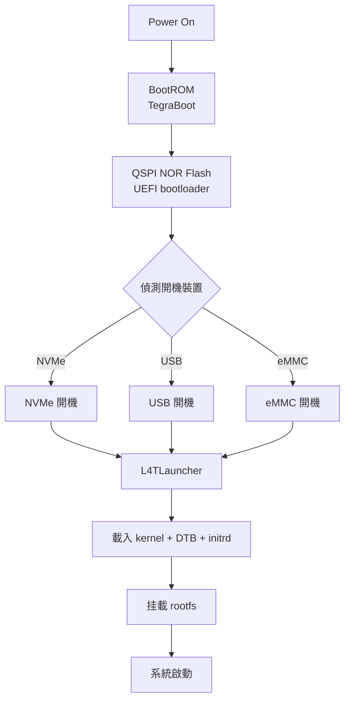
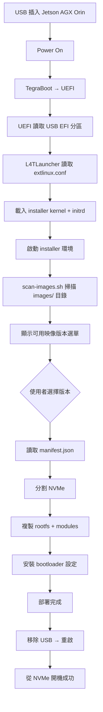

# Jetson AGX Orin 可重複使用 USB 安裝碟製作

## 1. 概述

本文件說明如何為 NVIDIA Jetson AGX Orin 製作一個**可重複使用**的 USB 安裝碟，用於部署自訂 kernel/rootfs 到 NVMe SSD。與一次性 ISO 不同，本方案的 USB 碟在更新安裝內容時**無需重新製作 ISO**，只需替換資料分割區中的檔案。

> [!TIP] 適用場景
> - 開發階段頻繁測試不同 kernel/rootfs 組合
> - 少量部署（2-10 台）需要快速更新安裝內容
> - 需要保留官方 NVIDIA ISO 的 boot loader 以確保相容性

此外，本方案支援 **Ventoy-like 多映像架構**，一個 USB 碟可存放多個映像版本，透過選單選擇要部署的版本，無需重建 USB。詳見 [[#3.3 Ventoy-like 多映像架構]]。

### 與既有方案比較

| 方案 | 更新安裝內容 | 重複使用性 | 多版本支援 | 官方 boot loader | 複雜度 |
|------|-------------|-----------|-----------|-----------------|--------|
| 官方 ISO（dd 寫入） | 需重新製作 ISO | 低 | ❌ | ✅ 完整 | 低 |
| jetson-live-iso | 需重新執行 build script | 中 | ❌ | ✅ 完整 | 中 |
| 本方案（分區式 USB） | 替換資料分割區檔案 | 高 | ❌ | ✅ 從 ISO 提取 | 中 |
| **本方案（Ventoy-like 模式）** | **替換 images/ 目錄檔案** | **高** | **✅ 多版本** | **✅ 從 ISO 提取** | **中** |

---

## 2. AGX Orin 開機流程

### 2.1 完整開機鏈



### 2.2 關鍵硬體資訊

| 項目 | 說明 |
|------|------|
| **UEFI 位置** | QSPI NOR Flash（非 NVMe，不可覆寫） |
| **NVMe 驅動** | JetPack 7 從 built-in 改為 loadable module |
| **initrd 必要性** | JetPack 7+ 必須有 initrd 才能載入 NVMe 驅動 |
| **NVIDIA ISO 安裝器** | 使用 minimal Ubuntu + subiquity-like 機制 |

### 2.3 NVMe 分區結構

NVMe 上的必要分區：

```
NVMe 分區佈局
├── ESP (EFI System Partition)    # FAT32, 512MB
│   ├── EFI/BOOT/BOOTAA64.EFI    # GRUB EFI bootloader
│   └── EFI/ubuntu/grub           # GRUB 設定
├── kernel+initrd 分區           # ext4, ~1GB
│   ├── boot/extlinux/extlinux.conf
│   ├── Image                     # kernel
│   ├── initrd                    # initramfs
│   └── dtb/                      # Device Tree Blobs
├── rootfs 分區                   # ext4, 剩餘空間
│   ├── bin, etc, lib, usr...    # Ubuntu rootfs
│   └── ...
└── (可選) data 分區              # ext4, 用於使用者資料
```

---

## 3. 方案架構：分區式 USB

### 3.1 USB 碟分區佈局

```
USB 碟分區佈局
├── Partition 1: EFI (FAT32, 512MB)
│   └── 從官方 ISO 提取的 boot loader
├── Partition 2: DATA (ext4, 剩餘空間)
│   ├── installer/               # 安裝腳本
│   │   ├── install.sh            # 主安裝腳本
│   │   ├── partition-nvme.sh     # NVMe 分區腳本
│   │   ├── copy-rootfs.sh        # rootfs 複製腳本
│   │   └── setup-bootloader.sh   # bootloader 設定腳本
│   ├── scripts/                  # 多映像掃描與選單腳本
│   │   ├── scan-images.sh        # 掃描可用映像
│   │   └── generate-menu.sh      # 產生選單
│   ├── images/                   # 多映像目錄（Ventoy-like）
│   │   ├── v1.0-jetpack6/
│   │   │   ├── manifest.json     # 映像 metadata
│   │   │   ├── rootfs.tar.gz     # rootfs 壓縮包
│   │   │   ├── modules/          # 核心模組
│   │   │   ├── kernel/           # Image, initrd, DTB
│   │   │   └── bootloader/       # extlinux.conf 範本
│   │   ├── v2.0-jetpack7/
│   │   │   └── ...
│   │   └── custom-build/
│   │       └── ...
│   └── config/                   # 設定檔
│       └── install.conf          # 安裝參數
└── (未使用空間)
```

### 3.2 更新流程

```
更新安裝內容（無需重建 USB）：
1. 掛載 USB 的 DATA 分區
2. 替換 images/ 目錄中對應版本的檔案
3. 確保每個映像目錄包含 manifest.json
4. 完成！下次開機自動掃描並顯示所有可用映像
```

### 3.3 Ventoy-like 多映像架構

本節說明如何將 USB 安裝碟升級為支援多映像版本的 Ventoy-like 架構。

#### 核心概念

與 Ventoy 在 PC 平台上的運作方式類似，本方案讓一個 USB 碟存放多個系統映像版本，使用者開機時可透過選單選擇要部署的版本。差異在於：

| 面向 | Ventoy (PC) | Jetson Installer USB |
|------|-------------|---------------------|
| Bootloader | 自訂 GRUB (安裝在 USB) | NVIDIA UEFI (QSPI) + USB extlinux.conf |
| 映像格式 | 直接掛載 ISO | rootfs 目錄/壓縮包 |
| 虛擬化方式 | Sector-level block device mapping | 檔案-level 複製到 NVMe |
| 開機方式 | USB → GRUB → 掛載 ISO → 開機 | USB → UEFI → Installer 環境 → 部署到 NVMe |
| 最終開機 | 從 USB 直接開機 ISO | 從 NVMe 開機 |
| 多版本支援 | ✅ 多個 ISO | ✅ 多個映像目錄 |
| 更新方式 | 替換 ISO 檔案 | 替換 images/ 目錄下的檔案 |

#### 映像目錄結構

每個映像版本在 `images/` 目錄下有獨立的子目錄，結構如下：

```
images/<version>/
├── manifest.json           # 映像 metadata（必填）
├── rootfs.tar.gz           # rootfs 壓縮包（必填）
├── modules/                # 核心模組（必填）
│   └── lib/modules/<version>/
├── kernel/                 # 核心相關檔案（必填）
│   ├── Image               # 核心映像
│   ├── initrd              # 初始 ramdisk
│   └── *.dtb               # Device Tree Blobs
└── bootloader/             # Bootloader 設定（選填）
    ├── extlinux.conf       # extlinux 設定檔
    └── ESP/                # EFI System Partition 內容
        └── EFI/BOOT/
```

#### manifest.json 格式

```json
{
  "name": "JetPack 7.2 - L4T R39.2",
  "version": "v2.0",
  "l4t_version": "R39.2",
  "target_board": "jetson-agx-orin-devkit",
  "created": "2026-07-12",
  "description": "標準 JetPack 7.2 安裝映像",
  "kernel_image": "kernel/Image",
  "initrd_image": "kernel/initrd",
  "dtb_file": "kernel/tegra234-p3701-0000+p3701-0000-nv.dtb",
  "rootfs_archive": "rootfs.tar.gz",
  "modules_dir": "modules/",
  "rootfs_size": "32GiB",
  "partition_config": {
    "esp_size": "512MiB",
    "boot_size": "1GiB",
    "rootfs_size": "remaining"
  }
}
```

#### 使用流程



---

## 4. 製作步驟

### 4.1 準備工作

**所需材料：**
- NVIDIA 官方 ISO：`jetsoninstaller-r39.2.0-2026-06-01-23-53-13-arm64.iso`
- USB 碟（建議 16GB 以上）
- AGX Orin 開發板（已安裝自訂 kernel/rootfs）
- 建置主機（arm64 架構）

**確認官方 ISO 結構：**

```bash
# 掛載 ISO 檢視內容
mkdir /tmp/iso
sudo mount -o loop jetsoninstaller-r39.2.0-*.iso /tmp/iso
ls -la /tmp/iso/

# 主要目錄結構：
# ├── boot/
# │   ├── grub/
# │   ├── EFI/
# │   └── kernel/           # Image, initrd, DTB
# ├── rootfs/               # Ubuntu rootfs
# ├── installer/            # 安裝腳本
# └── ...
```

### 4.2 分區 USB 碟

```bash
# 確認 USB 裝置名稱（⚠️ 請確認實際裝置）
sudo lsblk -p -d | grep sd
# 假設 USB 為 /dev/sdb

# 建立 GPT 分區表
sudo parted /dev/sdb --script mklabel gpt

# Partition 1: EFI (FAT32, 512MB)
sudo parted /dev/sdb --script mkpart primary fat32 1MiB 513MiB
sudo parted /dev/sdb --script set 1 esp on

# Partition 2: DATA (ext4, 剩餘空間)
sudo parted /dev/sdb --script mkpart primary ext4 513MiB 100%

# 格式化
sudo mkfs.fat -F 32 -n EFI /dev/sdb1
sudo mkfs.ext4 -L DATA /dev/sdb2
```

### 4.3 安裝 boot loader 到 EFI 分區

```bash
# 掛載 ISO 與 USB EFI 分區
sudo mount -o loop jetsoninstaller-r39.2.0-*.iso /tmp/iso
sudo mkdir -p /mnt/usb_efi
sudo mount /dev/sdb1 /mnt/usb_efi

# 複製 EFI boot 檔案
sudo cp -r /tmp/iso/boot/EFI /mnt/usb_efi/
sudo cp -r /tmp/iso/boot/grub /mnt/usb_efi/

# 複製 kernel 與 initrd（NVMe 開機所需）
sudo mkdir -p /mnt/usb_efi/boot/kernel
sudo cp /tmp/iso/boot/kernel/Image /mnt/usb_efi/boot/kernel/
sudo cp /tmp/iso/boot/kernel/initrd /mnt/usb_efi/boot/kernel/
sudo cp /tmp/iso/boot/kernel/*.dtb /mnt/usb_efi/boot/kernel/

# 建立 extlinux.conf（UEFI L4TLauncher 使用）
sudo mkdir -p /mnt/usb_efi/boot/extlinux
sudo tee /mnt/usb_efi/boot/extlinux/extlinux.conf > /dev/null << 'EOF'
TIMEOUT 30
DEFAULT primary

LABEL primary
    MENULABEL Primary Kernel
    LINUX /boot/kernel/Image
    INITRD /boot/kernel/initrd
    FDT /boot/kernel/tegra234-p3701-0000+p3701-0000-nv.dtb
    APPEND root=/dev/nvme0n1p1 rw rootwait rootfstype=ext4 console=ttyTCU0,115200n8 console=tty0 fbcon=map:0 nospectre_bhb firmware_class.path=/etc/firmware efi=runtime clk_ignore_unused pd_ignore_unused
EOF

# 清理
sudo umount /mnt/usb_efi
```

### 4.4 安裝安裝器與資料到 DATA 分區

```bash
# 掛載 USB DATA 分區
sudo mkdir -p /mnt/usb_data
sudo mount /dev/sdb2 /mnt/usb_data

# 建立目錄結構
sudo mkdir -p /mnt/usb_data/{installer,bsp/kernel,bsp/rootfs,bsp/modules,config}

# 從 ISO 複製安裝器腳本（可修改）
sudo cp -r /tmp/iso/installer/* /mnt/usb_data/installer/

# 複製自訂 BSP 檔案
# ⚠️ 以下路徑需替換為實際的自訂檔案位置
sudo cp ~/custom_bsp/kernel/Image /mnt/usb_data/bsp/kernel/
sudo cp ~/custom_bsp/kernel/initrd /mnt/usb_data/bsp/kernel/
sudo cp ~/custom_bsp/kernel/dtb/*.dtb /mnt/usb_data/bsp/kernel/

# 複製自訂 rootfs
sudo tar czf /mnt/usb_data/bsp/rootfs/rootfs.tar.gz -C ~/custom_bsp/rootfs .

# 複製核心模組
sudo cp -r ~/custom_bsp/modules/* /mnt/usb_data/bsp/modules/

# 建立安裝參數設定檔
sudo tee /mnt/usb_data/config/install.conf > /dev/null << 'EOF'
# Jetson AGX Orin 安裝參數
TARGET_BOARD="jetson-agx-orin-devkit"
L4T_VERSION="r39.2"
NVME_DEVICE="/dev/nvme0n1"
ROOTFS_PARTITION="1"
KERNEL_IMAGE="bsp/kernel/Image"
INITRD_IMAGE="bsp/kernel/initrd"
DTB_FILE="bsp/kernel/tegra234-p3701-0000+p3701-0000-nv.dtb"
ROOTFS_ARCHIVE="bsp/rootfs/rootfs.tar.gz"
MODULES_DIR="bsp/modules"
EOF

# 清理
sudo umount /mnt/usb_data
```

### 4.5 建立主安裝腳本

在 USB DATA 分區的 `installer/` 目錄下建立 `install.sh`：

```bash
#!/bin/bash
# install.sh — Jetson AGX Orin 主安裝腳本
set -euo pipefail

# 載入設定
SCRIPT_DIR="$(cd "$(dirname "$0")" && pwd)"
source "${SCRIPT_DIR}/../config/install.conf"

echo "=== Jetson AGX Orin 安裝工具 ==="
echo "目標板：${TARGET_BOARD}"
echo "L4T 版本：${L4T_VERSION}"
echo ""

# 確認 root 權限
if [ "$EUID" -ne 0 ]; then
  echo "錯誤：請以 root 權限執行（sudo）"
  exit 1
fi

# 確認 NVMe 裝置
if [ ! -b "${NVME_DEVICE}" ]; then
  echo "錯誤：未偵測到 NVMe 裝置 ${NVME_DEVICE}"
  echo "請確認 NVMe SSD 已正確安裝"
  exit 1
fi

echo "偵測到 NVMe 裝置："
lsblk -f ${NVME_DEVICE}
echo ""

read -p "確認要在 ${NVME_DEVICE} 上安裝？（輸入 yes 確認）：" confirm
if [ "$confirm" != "yes" ]; then
  echo "已取消安裝"
  exit 0
fi

# 執行分割
echo "[1/4] 分割 NVMe..."
"${SCRIPT_DIR}/partition-nvme.sh"

# 複製 rootfs
echo "[2/4] 複製 rootfs..."
"${SCRIPT_DIR}/copy-rootfs.sh"

# 安裝 bootloader
echo "[3/4] 安裝 bootloader..."
"${SCRIPT_DIR}/setup-bootloader.sh"

echo ""
echo "=== 安裝完成 ==="
echo "請移除 USB 碟，重啟系統"
```

### 4.6 多映像掃描與選單腳本

以下腳本用於掃描 USB DATA 分區上的可用映像並產生選單。

#### scan-images.sh

```bash
#!/bin/bash
# scan-images.sh — 掃描 USB DATA 分區上的可用映像
set -euo pipefail

IMAGES_DIR="${1:-/mnt/usb_data/images}"
MANIFEST_LIST=()

echo "=== 掃描可用映像 ==="
echo "掃描目錄：${IMAGES_DIR}"
echo ""

if [ ! -d "${IMAGES_DIR}" ]; then
  echo "錯誤：映像目錄不存在 ${IMAGES_DIR}"
  exit 1
fi

INDEX=1
for image_dir in "${IMAGES_DIR}"/*/; do
  [ -d "${image_dir}" ] || continue
  
  manifest="${image_dir}manifest.json"
  if [ ! -f "${manifest}" ]; then
    echo "[${INDEX}] $(basename "${image_dir}") — ⚠️ 缺少 manifest.json，已跳過"
    continue
  fi
  
  # 讀取 manifest
  name=$(jq -r '.name // "未命名"' "${manifest}")
  version=$(jq -r '.version // "unknown"' "${manifest}")
  l4t=$(jq -r '.l4t_version // "unknown"' "${manifest}")
  desc=$(jq -r '.description // ""' "${manifest}")
  
  echo "[${INDEX}] ${name}"
  echo "    版本：${version} | L4T：${l4t}"
  [ -n "${desc}" ] && echo "    說明：${desc}"
  echo "    路徑：${image_dir}"
  echo ""
  
  MANIFEST_LIST+=("${manifest}")
  INDEX=$((INDEX + 1))
done

if [ ${#MANIFEST_LIST[@]} -eq 0 ]; then
  echo "未找到任何可用映像"
  exit 1
fi

echo "共找到 ${#MANIFEST_LIST[@]} 個可用映像"
```

#### generate-menu.sh

```bash
#!/bin/bash
# generate-menu.sh — 根據掃描結果產生互動式選單
set -euo pipefail

SCRIPT_DIR="$(cd "$(dirname "$0")" && pwd)"
source "${SCRIPT_DIR}/../config/install.conf"

# 掃描映像
echo "正在掃描可用映像..."
mapfile -t manifests < <(find "${IMAGES_DIR}" -name "manifest.json" -type f | sort)

if [ ${#manifests[@]} -eq 0 ]; then
  echo "錯誤：未找到任何可用映像"
  echo "請將映像目錄放入 ${IMAGES_DIR}/"
  exit 1
fi

echo ""
echo "=========================================="
echo "  Jetson AGX Orin 映像部署工具"
echo "=========================================="
echo ""
echo "可用映像："
echo ""

for i in "${!manifests[@]}"; do
  manifest="${manifests[$i]}"
  name=$(jq -r '.name // "未命名"' "${manifest}")
  version=$(jq -r '.version // "unknown"' "${manifest}")
  l4t=$(jq -r '.l4t_version // "unknown"' "${manifest}")
  printf "  [%d] %s (v%s, L4T %s)\n" $((i+1)) "${name}" "${version}" "${l4t}"
done

echo ""
read -p "請選擇映像編號 [1-${#manifests[@]}]：" choice

if ! [[ "${choice}" =~ ^[0-9]+$ ]] || [ "${choice}" -lt 1 ] || [ "${choice}" -gt ${#manifests[@]} ]; then
  echo "無效的選擇"
  exit 1
fi

SELECTED_MANIFEST="${manifests[$((choice-1))]}"
echo ""
echo "已選擇：$(jq -r '.name' "${SELECTED_MANIFEST}")"
echo ""

read -p "確認要在 ${NVME_DEVICE} 上安裝此映像？（輸入 yes 確認）：" confirm
if [ "${confirm}" != "yes" ]; then
  echo "已取消安裝"
  exit 0
fi

# 執行安裝
echo ""
echo "[1/4] 分割 NVMe..."
"${SCRIPT_DIR}/partition-nvme.sh" "${SELECTED_MANIFEST}"

echo "[2/4] 複製 rootfs..."
"${SCRIPT_DIR}/copy-rootfs.sh" "${SELECTED_MANIFEST}"

echo "[3/4] 安裝核心模組..."
"${SCRIPT_DIR}/install-modules.sh" "${SELECTED_MANIFEST}"

echo "[4/4] 安裝 bootloader..."
"${SCRIPT_DIR}/setup-bootloader.sh" "${SELECTED_MANIFEST}"

echo ""
echo "=== 安裝完成 ==="
echo "請移除 USB 碟，重啟系統"
```

### 4.7 映像打包工具

以下腳本用於將客製化的 BSP 打包為標準映像格式，以便放入 USB 的 `images/` 目錄。

#### package-image.sh

```bash
#!/bin/bash
# package-image.sh — 將 BSP 打包為標準映像格式
set -euo pipefail

usage() {
  echo "用法：$0 -n <name> -v <version> -l <l4t_version> -s <source_bsp_dir> -o <output_dir>"
  echo ""
  echo "選項："
  echo "  -n  映像名稱（例：JetPack 7.2 Custom）"
  echo "  -v  版本號（例：v1.0）"
  echo "  -l  L4T 版本（例：R39.2）"
  echo "  -s  來源 BSP 目錄（Linux_for_Tegra 路徑）"
  echo "  -o  輸出目錄"
  exit 1
}

while getopts "n:v:l:s:o:" opt; do
  case ${opt} in
    n) IMAGE_NAME="${OPTARG}" ;;
    v) VERSION="${OPTARG}" ;;
    l) L4T_VERSION="${OPTARG}" ;;
    s) BSP_DIR="${OPTARG}" ;;
    o) OUTPUT_DIR="${OPTARG}" ;;
    *) usage ;;
  esac
done

[ -z "${IMAGE_NAME:-}" ] || [ -z "${VERSION:-}" ] || [ -z "${L4T_VERSION:-}" ] || \
[ -z "${BSP_DIR:-}" ] || [ -z "${OUTPUT_DIR:-}" ] && usage

echo "=== 映像打包工具 ==="
echo "映像名稱：${IMAGE_NAME}"
echo "版本：${VERSION}"
echo "L4T 版本：${L4T_VERSION}"
echo "來源 BSP：${BSP_DIR}"
echo "輸出目錄：${OUTPUT_DIR}"
echo ""

# 建立輸出目錄
IMAGE_DIR="${OUTPUT_DIR}/${VERSION}"
mkdir -p "${IMAGE_DIR}"/{kernel,modules,bootloader/ESP/EFI/BOOT}

# 1. 複製核心映像
echo "[1/5] 複製核心映像..."
cp "${BSP_DIR}/kernel/Image" "${IMAGE_DIR}/kernel/"
cp "${BSP_DIR}/kernel/dtb/"*.dtb "${IMAGE_DIR}/kernel/"

# 2. 複製 initrd
echo "[2/5] 複製 initrd..."
cp "${BSP_DIR}/bootloader/initrd"* "${IMAGE_DIR}/kernel/initrd" 2>/dev/null || \
cp "${BSP_DIR}/rootfs/boot/initrd"* "${IMAGE_DIR}/kernel/initrd" 2>/dev/null || \
echo "警告：未找到 initrd，請手動複製"

# 3. 複製核心模組
echo "[3/5] 複製核心模組..."
if [ -d "${BSP_DIR}/rootfs/lib/modules" ]; then
  cp -r "${BSP_DIR}/rootfs/lib/modules" "${IMAGE_DIR}/modules/"
else
  echo "警告：未找到核心模組目錄"
fi

# 4. 產生 rootfs 壓縮包
echo "[4/5] 產生 rootfs 壓縮包..."
tar czf "${IMAGE_DIR}/rootfs.tar.gz" -C "${BSP_DIR}/rootfs" .

# 5. 產生 manifest.json
echo "[5/5] 產生 manifest.json..."
KERNEL_VERSION=$(strings "${IMAGE_DIR}/kernel/Image" | grep -oP 'vermagic=\K[^ ]+' || echo "unknown")

cat > "${IMAGE_DIR}/manifest.json" << EOF
{
  "name": "${IMAGE_NAME}",
  "version": "${VERSION}",
  "l4t_version": "${L4T_VERSION}",
  "target_board": "jetson-agx-orin-devkit",
  "created": "$(date +%Y-%m-%d)",
  "kernel_version": "${KERNEL_VERSION}",
  "kernel_image": "kernel/Image",
  "initrd_image": "kernel/initrd",
  "dtb_file": "kernel/tegra234-p3701-0000+p3701-0000-nv.dtb",
  "rootfs_archive": "rootfs.tar.gz",
  "modules_dir": "modules/",
  "rootfs_size": "32GiB",
  "partition_config": {
    "esp_size": "512MiB",
    "boot_size": "1GiB",
    "rootfs_size": "remaining"
  }
}
EOF

echo ""
echo "=== 打包完成 ==="
echo "映像目錄：${IMAGE_DIR}"
echo "請將此目錄複製到 USB 的 images/ 目錄下"
```

---

## 5. 常見問題

### 5.1 為什麼不用官方 ISO 直接 dd？

官方 ISO 是一次性設計：
- 更新內容需重新製作 ISO
- ISO 內嵌完整 rootfs，體積大（通常 8-10GB）
- 無法在不重建的情况下更換 kernel/rootfs

### 5.2 為什麼不用 jetson-live-iso？

jetson-live-iso 的限制：
- 使用 squashfs，安裝器與資料混合在同一檔案系統
- 每次更新需重新執行 build script 重建 ISO
- 設計用於 Live USB，非持久化安裝碟

### 5.3 UEFI 與 GRUB 的關係？

- **UEFI (L4TLauncher)**：NVIDIA 自訂，從 QSPI 開機，讀取 extlinux.conf
- **GRUB**：備用方案，從 EFI 分區開機
- 建議同時提供兩種配置，確保相容性

### 5.4 必須有 initrd 嗎？

JetPack 7+ **必須**有 initrd，因為 NVMe 驅動從 built-in 改為 loadable module。沒有 initrd 將無法在開機時載入 NVMe 驅動，導致找不到 rootfs。

### 5.5 如何更新 USB 上的映像？

只需替換 USB DATA 分區中 `images/` 目錄下對應版本的檔案，無需重建 USB：

1. 掛載 USB DATA 分區：`sudo mount /dev/sdb2 /mnt/usb_data`
2. 刪除舊版本目錄：`sudo rm -rf /mnt/usb_data/images/v1.0`
3. 複製新版本目錄：`sudo cp -r /path/to/new/image /mnt/usb_data/images/v1.0`
4. 卸載：`sudo umount /mnt/usb_data`

### 5.6 如何新增映像版本？

直接將新的映像目錄放入 `images/` 目錄即可。每個映像目錄必須包含：
- `manifest.json`（metadata）
- `rootfs.tar.gz`（rootfs 壓縮包）
- `kernel/`（Image, initrd, DTB）
- `modules/`（核心模組）

可用 `package-image.sh` 工具自動產生標準格式的映像目錄。

### 5.7 Ventoy 能否直接用在 Jetson 上？

不能。Ventoy 的核心機制依賴 PC UEFI 的 GRUB chain-loading 和 sector-level block device mapping，這些在 Jetson 平台上不可用：
- Jetson 的 UEFI 在 QSPI NOR Flash（唯讀）
- Jetson 使用 extlinux.conf 而非 GRUB
- NVMe 開機需要特定的 initrd 和分區佈局

本方案透過「USB 開機進入 installer 環境 → 部署到 NVMe」的方式達成類似的使用者體驗。

---

## 6. 參考資料

- [Jetson AGX Orin 開發者指南](https://docs.nvidia.com/jetson/archives/r36.4/DeveloperGuide/)
- [Flashing Support for Jetson](https://docs.nvidia.com/jetson/archives/r36.4/DeveloperGuide/SD/FlashingSupport.html)
- [jetson-live-iso 專案](https://github.com/whitesscott/jetson-live-iso)
- [[Jetson 系統映像客製化與燒錄完整指南]]
- [[如何製作 Jetson Thor 平台的 USB 開機磁碟]]
- [[NVIDIA Jetson Device Tree Overlay (DTBO) 完整指南]]
