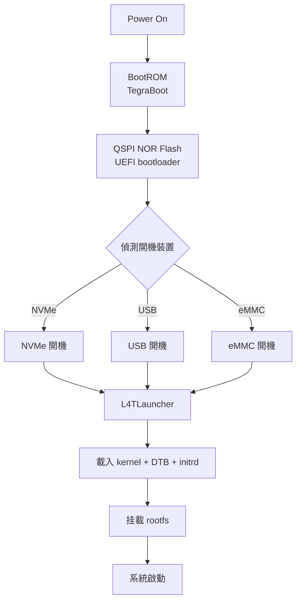

# Jetson AGX Orin 可重複使用 USB 安裝碟製作

## 1. 概述

本文件說明如何為 NVIDIA Jetson AGX Orin 製作一個**可重複使用**的 USB 安裝碟，用於部署自訂 kernel/rootfs 到 NVMe SSD。與一次性 ISO 不同，本方案的 USB 碟在更新安裝內容時**無需重新製作 ISO**，只需替換資料分割區中的檔案。

> [!TIP] 適用場景
> - 開發階段頻繁測試不同 kernel/rootfs 組合
> - 少量部署（2-10 台）需要快速更新安裝內容
> - 需要保留官方 NVIDIA ISO 的 boot loader 以確保相容性

### 與既有方案比較

| 方案 | 更新安裝內容 | 重複使用性 | 官方 boot loader | 複雜度 |
|------|-------------|-----------|-----------------|--------|
| 官方 ISO（dd 寫入） | 需重新製作 ISO | 低 | ✅ 完整 | 低 |
| jetson-live-iso | 需重新執行 build script | 中 | ✅ 完整 | 中 |
| **本方案（分區式 USB）** | **替換資料分割區檔案** | **高** | ✅ 從 ISO 提取 | 中 |

---

## 2. AGX Orin 開機流程

### 2.1 完整開機鏈



### 2.2 關鍵硬體資訊

| 項目 | 說明 |
|------|------|
| **UEFI 位置** | QSPI NOR Flash（非 NVMe，不可覆寫） |
| **NVMe 驅動** | JetPack 7 從 built-in 改為 loadable module |
| **initrd 必要性** | JetPack 7+ 必須有 initrd 才能載入 NVMe 驅動 |
| **NVIDIA ISO 安裝器** | 使用 minimal Ubuntu + subiquity-like 機制 |

### 2.3 NVMe 分區結構

NVMe 上的必要分區：

```
NVMe 分區佈局
├── ESP (EFI System Partition)    # FAT32, 512MB
│   ├── EFI/BOOT/BOOTAA64.EFI    # GRUB EFI bootloader
│   └── EFI/ubuntu/grub           # GRUB 設定
├── kernel+initrd 分區           # ext4, ~1GB
│   ├── boot/extlinux/extlinux.conf
│   ├── Image                     # kernel
│   ├── initrd                    # initramfs
│   └── dtb/                      # Device Tree Blobs
├── rootfs 分區                   # ext4, 剩餘空間
│   ├── bin, etc, lib, usr...    # Ubuntu rootfs
│   └── ...
└── (可選) data 分區              # ext4, 用於使用者資料
```

---

## 3. 方案架構：分區式 USB

### 3.1 USB 碟分區佈局

```
USB 碟分區佈局
├── Partition 1: EFI (FAT32, 512MB)
│   └── 從官方 ISO 提取的 boot loader
├── Partition 2: DATA (ext4, 剩餘空間)
│   ├── installer/               # 安裝腳本
│   │   ├── install.sh            # 主安裝腳本
│   │   ├── partition-nvme.sh     # NVMe 分區腳本
│   │   ├── copy-rootfs.sh        # rootfs 複製腳本
│   │   └── setup-bootloader.sh   # bootloader 設定腳本
│   ├── bsp/                     # BSP 檔案
│   │   ├── kernel/               # Image, initrd, DTB
│   │   ├── rootfs/               # rootfs 壓縮包或目錄
│   │   └── modules/              # 核心模組
│   └── config/                   # 設定檔
│       └── install.conf          # 安裝參數
└── (未使用空間)
```

### 3.2 更新流程

```
更新安裝內容（無需重建 USB）：
1. 掛載 USB 的 DATA 分區
2. 替換 bsp/kernel/ 中的 Image、initrd、DTB
3. 替換 bsp/rootfs/ 中的 rootfs
4. 更新 bsp/modules/ 中的核心模組
5. 完成！下次開機自動使用新版本
```

---

## 4. 製作步驟

### 4.1 準備工作

**所需材料：**
- NVIDIA 官方 ISO：`jetsoninstaller-r39.2.0-2026-06-01-23-53-13-arm64.iso`
- USB 碟（建議 16GB 以上）
- AGX Orin 開發板（已安裝自訂 kernel/rootfs）
- 建置主機（arm64 架構）

**確認官方 ISO 結構：**

```bash
# 掛載 ISO 檢視內容
mkdir /tmp/iso
sudo mount -o loop jetsoninstaller-r39.2.0-*.iso /tmp/iso
ls -la /tmp/iso/

# 主要目錄結構：
# ├── boot/
# │   ├── grub/
# │   ├── EFI/
# │   └── kernel/           # Image, initrd, DTB
# ├── rootfs/               # Ubuntu rootfs
# ├── installer/            # 安裝腳本
# └── ...
```

### 4.2 分區 USB 碟

```bash
# 確認 USB 裝置名稱（⚠️ 請確認實際裝置）
sudo lsblk -p -d | grep sd
# 假設 USB 為 /dev/sdb

# 建立 GPT 分區表
sudo parted /dev/sdb --script mklabel gpt

# Partition 1: EFI (FAT32, 512MB)
sudo parted /dev/sdb --script mkpart primary fat32 1MiB 513MiB
sudo parted /dev/sdb --script set 1 esp on

# Partition 2: DATA (ext4, 剩餘空間)
sudo parted /dev/sdb --script mkpart primary ext4 513MiB 100%

# 格式化
sudo mkfs.fat -F 32 -n EFI /dev/sdb1
sudo mkfs.ext4 -L DATA /dev/sdb2
```

### 4.3 安裝 boot loader 到 EFI 分區

```bash
# 掛載 ISO 與 USB EFI 分區
sudo mount -o loop jetsoninstaller-r39.2.0-*.iso /tmp/iso
sudo mkdir -p /mnt/usb_efi
sudo mount /dev/sdb1 /mnt/usb_efi

# 複製 EFI boot 檔案
sudo cp -r /tmp/iso/boot/EFI /mnt/usb_efi/
sudo cp -r /tmp/iso/boot/grub /mnt/usb_efi/

# 複製 kernel 與 initrd（NVMe 開機所需）
sudo mkdir -p /mnt/usb_efi/boot/kernel
sudo cp /tmp/iso/boot/kernel/Image /mnt/usb_efi/boot/kernel/
sudo cp /tmp/iso/boot/kernel/initrd /mnt/usb_efi/boot/kernel/
sudo cp /tmp/iso/boot/kernel/*.dtb /mnt/usb_efi/boot/kernel/

# 建立 extlinux.conf（UEFI L4TLauncher 使用）
sudo mkdir -p /mnt/usb_efi/boot/extlinux
sudo tee /mnt/usb_efi/boot/extlinux/extlinux.conf > /dev/null << 'EOF'
TIMEOUT 30
DEFAULT primary

LABEL primary
    MENULABEL Primary Kernel
    LINUX /boot/kernel/Image
    INITRD /boot/kernel/initrd
    FDT /boot/kernel/tegra234-p3701-0000+p3701-0000-nv.dtb
    APPEND root=/dev/nvme0n1p1 rw rootwait rootfstype=ext4 console=ttyTCU0,115200n8 console=tty0 fbcon=map:0 nospectre_bhb firmware_class.path=/etc/firmware efi=runtime clk_ignore_unused pd_ignore_unused
EOF

# 清理
sudo umount /mnt/usb_efi
```

### 4.4 安裝安裝器與資料到 DATA 分區

```bash
# 掛載 USB DATA 分區
sudo mkdir -p /mnt/usb_data
sudo mount /dev/sdb2 /mnt/usb_data

# 建立目錄結構
sudo mkdir -p /mnt/usb_data/{installer,bsp/kernel,bsp/rootfs,bsp/modules,config}

# 從 ISO 複製安裝器腳本（可修改）
sudo cp -r /tmp/iso/installer/* /mnt/usb_data/installer/

# 複製自訂 BSP 檔案
# ⚠️ 以下路徑需替換為實際的自訂檔案位置
sudo cp ~/custom_bsp/kernel/Image /mnt/usb_data/bsp/kernel/
sudo cp ~/custom_bsp/kernel/initrd /mnt/usb_data/bsp/kernel/
sudo cp ~/custom_bsp/kernel/dtb/*.dtb /mnt/usb_data/bsp/kernel/

# 複製自訂 rootfs
sudo tar czf /mnt/usb_data/bsp/rootfs/rootfs.tar.gz -C ~/custom_bsp/rootfs .

# 複製核心模組
sudo cp -r ~/custom_bsp/modules/* /mnt/usb_data/bsp/modules/

# 建立安裝參數設定檔
sudo tee /mnt/usb_data/config/install.conf > /dev/null << 'EOF'
# Jetson AGX Orin 安裝參數
TARGET_BOARD="jetson-agx-orin-devkit"
L4T_VERSION="r39.2"
NVME_DEVICE="/dev/nvme0n1"
ROOTFS_PARTITION="1"
KERNEL_IMAGE="bsp/kernel/Image"
INITRD_IMAGE="bsp/kernel/initrd"
DTB_FILE="bsp/kernel/tegra234-p3701-0000+p3701-0000-nv.dtb"
ROOTFS_ARCHIVE="bsp/rootfs/rootfs.tar.gz"
MODULES_DIR="bsp/modules"
EOF

# 清理
sudo umount /mnt/usb_data
```

### 4.5 建立主安裝腳本

在 USB DATA 分區的 `installer/` 目錄下建立 `install.sh`：

```bash
#!/bin/bash
# install.sh — Jetson AGX Orin 主安裝腳本
set -euo pipefail

# 載入設定
SCRIPT_DIR="$(cd "$(dirname "$0")" && pwd)"
source "${SCRIPT_DIR}/../config/install.conf"

echo "=== Jetson AGX Orin 安裝工具 ==="
echo "目標板：${TARGET_BOARD}"
echo "L4T 版本：${L4T_VERSION}"
echo ""

# 確認 root 權限
if [ "$EUID" -ne 0 ]; then
  echo "錯誤：請以 root 權限執行（sudo）"
  exit 1
fi

# 確認 NVMe 裝置
if [ ! -b "${NVME_DEVICE}" ]; then
  echo "錯誤：未偵測到 NVMe 裝置 ${NVME_DEVICE}"
  echo "請確認 NVMe SSD 已正確安裝"
  exit 1
fi

echo "偵測到 NVMe 裝置："
lsblk -f ${NVME_DEVICE}
echo ""

read -p "確認要在 ${NVME_DEVICE} 上安裝？（輸入 yes 確認）：" confirm
if [ "$confirm" != "yes" ]; then
  echo "已取消安裝"
  exit 0
fi

# 執行分割
echo "[1/4] 分割 NVMe..."
"${SCRIPT_DIR}/partition-nvme.sh"

# 複製 rootfs
echo "[2/4] 複製 rootfs..."
"${SCRIPT_DIR}/copy-rootfs.sh"

# 安裝 bootloader
echo "[3/4] 安裝 bootloader..."
"${SCRIPT_DIR}/setup-bootloader.sh"

echo ""
echo "=== 安裝完成 ==="
echo "請移除 USB 碟，重啟系統"
```

---

## 5. 常見問題

### 5.1 為什麼不用官方 ISO 直接 dd？

官方 ISO 是一次性設計：
- 更新內容需重新製作 ISO
- ISO 內嵌完整 rootfs，體積大（通常 8-10GB）
- 無法在不重建的情况下更換 kernel/rootfs

### 5.2 為什麼不用 jetson-live-iso？

jetson-live-iso 的限制：
- 使用 squashfs，安裝器與資料混合在同一檔案系統
- 每次更新需重新執行 build script 重建 ISO
- 設計用於 Live USB，非持久化安裝碟

### 5.3 UEFI 與 GRUB 的關係？

- **UEFI (L4TLauncher)**：NVIDIA 自訂，從 QSPI 開機，讀取 extlinux.conf
- **GRUB**：備用方案，從 EFI 分區開機
- 建議同時提供兩種配置，確保相容性

### 5.4 必須有 initrd 嗎？

JetPack 7+ **必須**有 initrd，因為 NVMe 驅動從 built-in 改為 loadable module。沒有 initrd 將無法在開機時載入 NVMe 驅動，導致找不到 rootfs。

---

## 6. 參考資料

- [Jetson AGX Orin 開發者指南](https://docs.nvidia.com/jetson/archives/r36.4/DeveloperGuide/)
- [Flashing Support for Jetson](https://docs.nvidia.com/jetson/archives/r36.4/DeveloperGuide/SD/FlashingSupport.html)
- [jetson-live-iso 專案](https://github.com/whitesscott/jetson-live-iso)
- [[Jetson 系統映像客製化與燒錄完整指南]]
- [[如何製作 Jetson Thor 平台的 USB 開機磁碟]]
- [[NVIDIA Jetson Device Tree Overlay (DTBO) 完整指南]]
