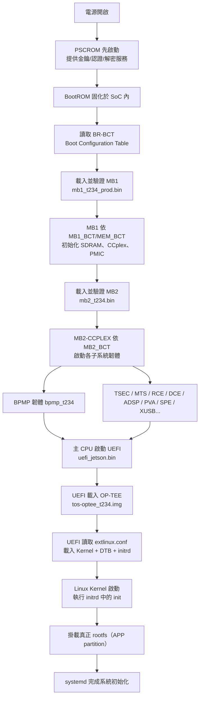
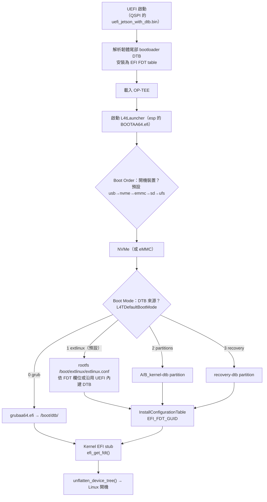

# Jetson AGX Orin 開機流程與客製化指南

> 本文件以 **Jetson AGX Orin（Tegra234）** 搭配 **L4T（Linux for Tegra）R36.x**（本機對應 `Linux_for_Tegra/` 目錄，版本 36.5.2）為例，說明完整的開機流程、每個模組的用途、設計背後的意義，並區分「Jetson 平台特有」與「Embedded Linux 通用」的組成，最後整理各模組的客製化可行性與實作步驟。

---

## 1. Tegra234 平台與 SoC 架構概覽

Jetson AGX Orin 使用的 Tegra234 SoC 是**異質多核心（Heterogeneous Multi-Processing）**架構。除了主要執行的 ARM CPU 之外，SoC 內部還內建了多顆獨立的小處理器（Co-processor），各自負責特定子系統。開機流程之所以複雜，正是因為需要讓這些不同用途的核心依序啟動。

### 1.1 主要處理器與子系統

| 處理器 / 子系統 | 代號 | 用途 |
|---|---|---|
| CPU 叢集 | Cortex-A78AE | 執行主作業系統（Linux/Ubuntu） |
| Boot and Power Management Processor | BPMP | 電源、時脈、熱管理、reset、中斷路由 |
| Memory/System Control Processor | MTS / MCE | 記憶體控制器、LPDDR5 記憶體管理 |
| Tegra Security Engine | TSEC | 安全開機、加密、防篡改 |
| Real-time Control Engine | RCE | 相機（Camera）即時控制 |
| Display Control Engine | DCE | 顯示控制器 |
| Audio DSP | ADSP | 音訊處理 |
| Programmable Vision Accelerator | PVA | 視覺運算加速 |
| Security Processing Engine | SPE | 安全處理、secure OS 相關 |
| System Memory Management | SMM | 記憶體管理 / 防火牆 |
| Video Decoder | NVDEC | 視訊解碼 |
| XUSB | XUSB | USB 控制器 |
| PSC（Power State Controller） | PSC | 電源狀態控制 |

> [!NOTE] 為何需要這麼多顆處理器？
> 這些子系統各自獨立運作，例如 BPMP 即使 CPU 掛掉仍能維持電源與散熱管理。開機時必須「先啟動負責電源的核心，再啟動主要 CPU」，形成一連串的依賴鏈，這是 Jetson boot chain 較一般 ARM SoC 複雜的主因。

### 1.2 儲存裝置與開機載體

AGX Orin DevKit 支援多種開機來源：

- **QSPI NOR Flash**（on-module，最早期 bootloader 的存放處）
- **eMMC**（on-module 或 carrier board）
- **NVMe SSD**（透過 PCIe）
- **SD 卡**（部分載板支援）
- **USB-C Recovery Mode**（透過 USB 與主機連線，走 RCM 協定）

分割區定義在 `bootloader/generic/cfg/flash_t234_qspi_sdmmc.xml`（由各 board `.conf` 檔指定，例如 AGX Orin DevKit 使用 `p3737-0000-p3701-0000.conf`）。

---

## 2. 開機流程總覽

以下為完整開機鏈路（Cold Boot 冷開機情境）：



> [!TIP] 一句話版本
> `PSCROM + BootROM → BR-BCT → MB1（on BPMP）→ MB2 → 子系統韌體（含 BPMP）→ UEFI → OP-TEE → Kernel → initrd → rootfs`

### 2.1 詳細開機流程（UEFI 之後的 DTB 判斷）

以下補足「UEFI 之後」的決策細節，聚焦 **DTB 從哪來、kernel 從哪拿**。完整機制與原始碼解析見 **[[Jetson AGX Orin DTB 載入機制與判斷邏輯]]**。



> [!NOTE] 重點
> - **UEFI 只從「開機裝置」讀取**：Boot Order（`DefaultBootPriority`，預設 `usb,nvme,emmc,sd,ufs`）決定 NVMe 或 eMMC，之後 kernel/kernel-dtb/rootfs 都在同一顆裝置上找。
> - **L4tLauncher 用 GPT partition 名稱**（如 `A_kernel-dtb`）找 dtb，不寫死編號，支援 A/B fallback。
> - **kernel 自己不去儲存裝置讀 dtb**：DTB 已由 L4tLauncher 放進記憶體並安裝成 EFI FDT configuration table（GUID `b1b621d5-f19c-41a5-830b-d9152c69aae7`），Linux EFI stub 的 `efi_get_fdt()` 查表取得。

---

## 3. Jetson 平台特有模組（NVIDIA 私有 boot chain）

以下模組是 **Tegra SoC 專屬**的設計，幾乎不會出現在一般 x86 或非 NVIDIA 的 ARM Linux 平台。這些大多以 NVIDIA 私有二進位檔（binary blob）形式存在，並經由簽章與 `fuse` 燒錄機制確保安全信任鏈。

### 3.1 BootROM（BR）

- 儲存在 SoC 內部 ROM，**不可修改、不可抹除**。
- 在 **BPMP 離開 reset 狀態**後開始執行（BR 本身在 BPMP 上跑），負責：
  - 初始化開機媒體（boot media）與最基礎的時脈/記憶體映射。
  - 從開機媒體載入 **BR-BCT、PSCBL1、MB1 與 MB1-BCT**，載完後即 halt（交棒給下一級）。
  - 依 **BR-BCT** 內記錄的 size、entry point、load address、hash 來**驗證並載入** MB1 等元件。
  - 支援 Recovery Mode（USB RCM）以利開發/燒錄。
- **BR-BCT 最多可有 4 份備份**，存放於開機媒體起始處，每份對齊「device erase sector size」邊界；BootROM 會依序嘗試，避免單一損毀導致無法開機。
- 對應檔案：無（內建於矽晶片中）。

> [!NOTE] PSCROM 是 BR 的「金鑰管家」
> 官方架構中 BootROM 並非單打獨鬥：SoC 內還有一個 **PSCROM（Platform Security Controller ROM）**，一上電（處理器 reset）就立即運行，持有所有 NVIDIA 與 OEM 認證/解密的金鑰，替 BootROM 提供**認證（authentication）與解密（decryption）服務**，並審計 BPMP 上的下一階段開機（MB1）與 PSC 上的 PSC-BL1。

### 3.2 BCT（Boot Configuration Table）

- 描述「如何開機」的設定表，記錄開機裝置、記憶體組態、MB1 載入位置等。
- 分為多種 BCT：
  - **BR-BCT**：供 BootROM 讀取，位於 SoC 內建儲存或 QSPI。
  - **MB1_BCT**：供 MB1 讀取的週邊設定（pinmux、PMC 電壓、GPIO、防火牆等）。
  - **MEM_BCT**：供 MB1 使用的記憶體（LPDDR5）training 參數。
- 對應檔案：`bootloader/generic/BCT/tegra234-mb1-bct-*.dts`、`tegra234-mb1-bct-pinmux-*.dtsi`、`tegra234-*-sdram.dtsi` 等。

> [!IMPORTANT] BCT 是可客製化重點
> BCT 的內容以 **Device Tree（DTS）** 格式撰寫，再經由 `tegraflash.py` 轉換成二進位。因此 pinmux、電源電壓、GPIO 組態都是可以修改並重新燒錄的。

### 3.3 MB1（Mini Bootloader 1）

- 由 BootROM 載入、**跑在 BPMP 上**的第一階段 bootloader（官方文件明確指出 MB1 是在 BPMP 執行，而非 CPU）。
- **由 NVIDIA 擁有的金鑰簽章與加密**，屬於 boot chain 中第二個被信任的元件。
- 任務：
  - **平台組態**：pinmux、GPIO、pad voltage、SCR、防火牆（firewall）。
  - 依 **MEM_BCT** 初始化 **SDRAM**（LPDDR5 training）。
  - 載入初始化 **CPU complex（CCplex）** 所需的韌體。
  - 程式化 **PMIC** 以啟用 `VDD_CPU` 電源軌（rail）。
  - 建立各子系統韌體的 **carveout 記憶體區**。
  - 載入並驗證下一階段 **MB2**。
- 對應檔案：`bootloader/mb1_t234_prod.bin`。
- 對應分割區：`A_mb1`、`B_mb1`。

### 3.4 MB2（Mini Bootloader 2）

- 第二階段 bootloader，負責「拉起整個 SoC」。
- **依執行的處理器不同，有兩種變體**：
  - **MB2 Applet（跑在 BPMP / R5）**：用於偵測裝置類型與取得裝置資訊（BR revision、SKU、RAM code 等 fuse 讀值、EEPROM 板卡資訊），供主機端的 `tegraflash` 選擇正確的燒錄設定檔。多用於 recovery/燒錄流程。
  - **MB2-CCPLEX（跑在 CPU complex）**：負責實際的開機與燒錄——
    - 冷開機（Cold boot）時讀取 **MB2_BCT**。
    - 依序把各子系統韌體（BPMP、TSEC、MTS/MCE、RCE、DCE、ADSP、PVA、SPE、XUSB…）載入到對應的 **carveout 記憶體區**並驗證啟動。
    - 支援 **RCM（USB recovery）boot** 與 **flashing（接收主機二進位檔並寫入裝置）**。
    - 準備環境給後續的 UEFI。
- 對應檔案：`bootloader/mb2_t234.bin`（另有 `mb2rf_t234.bin` 作為 runtime 用途、`mb2_applet` 用於 recovery）。
- 對應分割區：`A_mb2`、`A_mb2rf`。

### 3.5 BPMP 韌體（Boot and Power Management Processor）

- 啟動後負責所有 **電源管理、時脈管理、散熱、reset、interrupt 路由**。
- CPU 側 Linux 透過 TEGRA BPMP 框架與之通訊。
- 對應檔案：`bootloader/bpmp_t234-<SKU>_prod.bin`（例如 `bpmp_t234-TE990M-A1_prod.bin`，依 AGX Orin SKU 選用）。
- 對應 DTB：`bootloader/generic/tegra234-bpmp-3701-0000-3737-0000.dtb`（BPFDTB）。
- 對應分割區：`A_bpmp-fw`、`A_bpmp-fw-dtb`。

### 3.6 其他子系統韌體（TSEC / MTS / RCE / DCE / ADSP / PVA / SPE / XUSB / NVDEC / SMM）

| 子系統 | 對應檔案 | 對應分割區 | 用途 |
|---|---|---|---|
| TSEC | `tsec_t234.bin` | `A_tsec-fw` | 安全引擎，保護 boot chain 與金鑰 |
| MTS/MCE | `mce_c10_prod_cr.bin` | `A_mts-mce` | 記憶體控制器/記憶體管理 |
| RCE | `camera-rtcpu-t234-rce.img` | `A_rce-fw` | 相機即時控制 |
| DCE | `display-t234-dce.bin` | `A_dce-fw` | 顯示控制 |
| ADSP | `adsp-fw.bin` | `A_adsp-fw` | 音訊 DSP |
| PVA | `nvpva_020.fw` | `A_pva-fw` | 視覺加速 |
| SPE | `spe_t234.bin` | `A_spe-fw` | 安全處理引擎 |
| XUSB | `xusb_t234_prod.bin` | `A_xusb-fw` | USB 控制器 |
| NVDEC | `nvdec_t234_prod.fw` | `A_nvdec` | 視訊解碼 |
| SMM | （內嵌於 boot chain，無獨立檔案） | `A_smm-fw` | 系統記憶體管理/防火牆 |

> [!WARNING] 私有韌體限制
> 上述子系統韌體絕大多數是 NVIDIA 私有二進位檔（僅以授權方式散布），**沒有開放原始碼**，也無法直接簽署第三方版本。客製化空間主要在「替換 NVIDIA 提供的版本」或「調整載入參數」，而非改寫韌體本身。

### 3.7 CPU Bootloader：UEFI（`uefi_jetson.bin`）

- Tegra234 的 CPU 側主 bootloader 使用 **EDK2（UEFI）**，檔案為 `bootloader/uefi_jetson.bin`。
- 任務：
  - 初始化 CPU 週邊、PCIe、UART 等。
  - 提供 **UEFI 安全開機（Secure Boot）** 驗證。
  - 讀取 **extlinux.conf**（EFI Boot Manager / U-Boot 相容語法）決定開機項目。
  - 載入 **Kernel Image、DTB、initrd** 至記憶體。
  - 初始化 **OP-TEE**（secure world）。
- 對應檔案：`bootloader/uefi_jetson.bin`、`bootloader/BOOTAA64.efi`（UEFI 應用程式/啟動程式）。
- 對應分割區：`A_cpu-bootloader`、`esp`（EFI System Partition，存放 `BOOTAA64.efi`）。

> [!NOTE] UEFI 客製化
> NVIDIA 以 EDK2 fork 提供 UEFI 原始碼，官方 source 位於 <https://github.com/NVIDIA/edk2-nvidia>。與一般 x86 的 UEFI 相比，Jetson 的 UEFI 整合了大量 Tegra 平台專屬驅動與設定。UEFI 層的 Secure Boot（PK/KEK/db 金鑰）機制請見 [[Jetson AGX Orin Secure Boot 完整指南]]。

### 3.8 OP-TEE（Secure OS）

- 信任執行環境（Trusted Execution Environment）中的 secure world 作業系統，採用 **OP-TEE** 實作。
- 提供安全的密碼學、secure storage、fTPM 等功能。
- 對應檔案：`bootloader/tos-optee_t234.img`（`tos_t234.img` 為 symlink）。
- 對應分割區：`A_secure-os`。
- 附註：`bootloader/standalonemm_optee_t234.bin` 為獨立 memory management 的變體。

> [!TIP] OP-TEE 可客製
> NVIDIA 提供 OP-TEE 原始碼（例如本機 `source/tegra/optee-src`），可重新編譯 TA/OS 並簽章後替換。

### 3.9 EKS / FSKP（加密金鑰相關）

| 檔案 | 分割區 | 用途 |
|---|---|---|
| `eks_t234.img` | `A_eks` | Encryption Key Seed：磁碟加密（LUKS）所需的金鑰種子 |
| `fskp_t234.bin` | - | File System Key Pair：rootfs 加密（disk_encrypt）的金鑰對 |

- 與 [[Nvidia Jetson AB Partition 切換]] 提及的加密 rootfs（`*_enc_rfs.xml`、`*_enc_rootfs_ab.xml`）搭配使用。

### 3.10 其他 Tegra 特有元件

| 項目 | 檔案 | 用途 |
|---|---|---|
| Warmboot 代碼 | `nvtbootwb0.bin`（`WB0`） | 從 SC7（deep sleep）喚醒時重新初始化記憶體 |
| SC7 | `sc7_t234_prod.bin` | Deep Sleep 狀態支援 |
| PSC | `psc_bl1_t234_prod.bin`、`pscfw_t234_prod.bin`、`psc_rf_t234_prod.bin` | Platform Security Controller：PSCROM 持有認證/解密金鑰並審計下一階段開機；PSC-BL1 為其第一階段 bootloader |
| FSI | `fsi-lk.bin` | Factory Software Interface（維修/測試用） |
| applet | `applet_t234.bin` | Recovery 模式下的 USB 溝通 applet |

---

## 4. Embedded Linux 通用模組

以下組成是 **所有 Embedded Linux 平台（非 Jetson 專屬）** 共通的部分，僅在具體實作上有所不同。完整的「UEFI → Kernel → initrd → rootfs」開機機制（含 rootfs 辨認條件、initrd 載入與製作方式）請見 **[[UEFI 開機流程完整指南]]**。本節僅摘要 Jetson 的對應實作。

### 4.1 UEFI / EDK2

- Jetson 使用 EDK2 實作的 UEFI 韌體（`uefi_jetson.bin`），機制與一般 UEFI 相同，但整合大量 Tegra 專屬驅動（見 3.7）。

### 4.2 Device Tree（DTB / DTBO）

- 對應檔案：`kernel/Image`、`kernel/dtb/tegra234-p3737-0000+p3701-0000-nv.dtb`、`L4TConfiguration.dtbo` 等。
- 可透過 Device Tree Overlay（.dtbo）動態疊加組態（見 [[NVIDIA Jetson Device Tree Overlay (DTBO) 完整指南]]）。
- **開機時「哪一份 DTB、從哪裡讀取」的完整判斷機制（Boot Order / Boot Mode / GPT 名稱 / EFI FDT table）見 [[Jetson AGX Orin DTB 載入機制與判斷邏輯]]。**

### 4.3 extlinux.conf（bootloader 設定）

- UEFI 依 `extlinux.conf` 決定載入哪個 Kernel、initrd、以及 kernel command line。
- Jetson 特有寫法：`APPEND ${cbootargs}` 由 NVIDIA UEFI 在開機時**動態注入** boot 參數（root 裝置、console 等），取代一般平台寫死的 `root=`。

### 4.4 Linux Kernel Image

- 對應檔案：`kernel/Image`（ARM64 核心）與 `kernel/Image.gz`。
- 由 UEFI + extlinux 直接載入（一般 x86 多搭配 GRUB）。

### 4.5 initrd / initramfs

- 對應檔案：`bootloader/l4t_initrd.img`（NVIDIA 提供，非用一般工具鏈產生）。
- 角色與一般 initrd 相同：載入驅動、解密/掛載 rootfs，最後切換到真正 rootfs。
- **Jetson 專屬細節**：initrd 內含組裝 rootfs 的 `init` 腳本（LUKS 解密、A/B 切換、overlayfs `L4TOverlayFsMode`），更新方式為 `tools/l4t_update_initrd.sh`（chroot 內執行 `nv-update-initrd`）。

> [!NOTE] FAQ：既然 UEFI 能讀 rootfs，為什麼還需要 initrd？
> 關鍵在於「UEFI 能讀」不等於「Kernel 能讀」：UEFI 靠自身韌體驅動讀檔，但 kernel 開機時需重新初始化硬體，而驅動模組存放在 rootfs 的 `/lib/modules/`，形成「先有雞還是先有蛋」的死循環。initrd 正是打破此循環的橋樑。完整的載入機制與詳解請見 [[UEFI 開機流程完整指南]]。

### 4.6 systemd / 使用者空間初始化

- initrd 交出控制權後，由 rootfs 內的第一個 process（systemd）接手完成系統啟動。

> [!NOTE] 平台共通 vs 平台特有對照
> | 層級 | Jetson 特有 | Embedded Linux 通用 |
> |---|---|---|
> | 最底層 | BootROM、BCT、MB1、MB2 | UEFI 中的開機管理 |
> | 子系統 | BPMP、TSEC、MTS、RCE、DCE、ADSP… | - |
> | 系統韌體 | NVIDIA UEFI 韌體 | EDK2 UEFI 標準 |
> | 安全 OS | NVIDIA 整合 OP-TEE | OP-TEE（跨平台標準） |
> | 硬體描述 | Tegra DTB | Device Tree（標準） |
> | 開機設定 | extlinux.conf + `${cbootargs}` | GRUB / extlinux（U-Boot 系列） |
> | 核心 | `kernel/Image` | Linux Kernel（標準） |
> | 暫存 FS | `l4t_initrd.img` | initrd / initramfs（標準） |
> | 使用者空間 | systemd + NVIDIA 套件 | systemd（標準） |

---

## 5. 設計意義：為何這樣設計？

1. **安全信任鏈（Secure Boot Chain）**
   - 從不可竄改的 BootROM 開始，每一級都驗證下一級的簽章（透過 fuse 內嵌的 root key），確保只有受信任的韌體能執行。這對車用、工業、邊緣 AI 特別重要。
   - Secure Boot 分為兩層：**BootROM 信任鏈（PKC/SBK fuse）**與 **UEFI Secure Boot（PK/KEK/db）**，完整啟用與金鑰製作步驟見 [[Jetson AGX Orin Secure Boot 完整指南]]。

2. **異質核心分工**
   - 每個子系統有獨立處理器，各自管理自身的電源與中斷，不會因主 CPU 當機而整個系統失能。開機順序「先電源、後 CPU」是硬體上的依賴關係。

3. **可維護性與開發彈性**
   - BootROM/MB1 等固定部分極少變動；可重複更新的部分（BPMP、UEFI、Kernel、rootfs）分別放在獨立分割區，支援 **A/B Partition**（見 [[Nvidia Jetson AB Partition 切換]]）與 OTA（見 [[Jetson OTA Update]]）。

4. **標準化與移植性**
   - 上層採用 UEFI + Device Tree + extlinux + initrd + systemd 等 Linux 標準，讓開發者能以熟悉的方式（`chroot`、`systemd`、`overlay`、`dtbo`）客製化系統，而不必直接面對 NVIDIA 私有 bootloader 細節。

---

## 6. 客製化可行性總表

| 模組 | 可否客製化 | 客製化方式 | 難度 |
|---|---|---|---|
| BootROM | ❌ 不可 | 內建於 SoC，無法修改 | - |
| BCT / MB1_BCT / MEM_BCT | ✅ 可 | 修改 `bootloader/generic/BCT/*.dts` 後重新 flash | 中 |
| MB1 / MB2 | ⚠️ 有限 | 只能替換 NVIDIA 提供的版本，無原始碼 | 高 |
| BPMP 韌體 | ⚠️ 有限 | 僅能替換官方版本或調整 DTB（BPFDTB） | 高 |
| TSEC / RCE / DCE / ADSP / PVA / SPE 等 | ❌ 私有 | 一般不客製，僅替換官方版本 | 高 |
| UEFI（EDK2） | ⚠️ 有限 | NVIDIA 提供 EDK2 source（需官方管道），可改後重新編譯 | 高 |
| OP-TEE | ✅ 可 | 有 source（`source/tegra/optee-src`），可重編 TA/OS 並簽章 | 高 |
| Kernel | ✅ 完全 | 編譯自訂 kernel 並替換 `kernel/Image` | 中 |
| Device Tree / DTBO | ✅ 完全 | 修改 DTS 或新增 overlay | 低 |
| extlinux.conf | ✅ 完全 | 直接編輯 | 低 |
| initrd | ✅ 完全 | 用 `l4t_update_initrd.sh` 等工具重建 | 中 |
| rootfs | ✅ 完全 | `chroot` 安裝套件、自訂服務 | 中 |
| 磁碟加密金鑰（EKS/FSKP） | ⚠️ 有限 | 透過 `--disk-encrypt` 流程產生 | 中 |
| Secure Boot 金鑰（OEM fuse） | ⚠️ 有限 | 用 `odmfuse.sh` 燒入自訂 fuse 金鑰；UEFI 層則用 PK/KEK/db 金鑰（見 [[Jetson AGX Orin Secure Boot 完整指南]]） | 高 |

> [!CAUTION] 修改低階韌體風險
> 修改 BCT、MB1、UEFI 若簽章不符，可能導致裝置無法開機（變磚）。務必保留可重刷 Recovery 的能力，並在正式燒錄前以 `--no-flash` 產生映像測試。

---

## 7. 客製化實作步驟

以下以本機 `Linux_for_Tegra/` 目錄為基準（L4T R36.5.2）。完整刷機流程可參閱 [[Jetson 系統映像客製化與燒錄完整指南]]。

### 7.1 客製化 Kernel

```bash
# 1. 進入 kernel source（本機已同步 source/kernel）
cd source/kernel

# 2. 設定環境（依 l4t 提供的 build script 或手動）
export CROSS_COMPILE=aarch64-linux-gnu-
export ARCH=arm64
make tegra_defconfig

# 3. 編譯
make -j$(nproc) Image

# 4. 覆蓋 L4T 中的 kernel Image
cp arch/arm64/boot/Image ../../kernel/Image

# 5. 編譯核心模組並安裝到 rootfs
make modules_install INSTALL_MOD_PATH=../../rootfs

# 6. 重新產生 boot 映像（flash 時自動打包），或直接 flash
cd ../../.. && sudo ./flash.sh jetson-agx-orin-devkit.conf
```

### 7.2 客製化 Device Tree（DTB / DTBO）

```bash
# 方法 A：直接改 DTS 後用 dtc 編譯
./kernel/dtc -I dts -O dtb -o tegra234-custom.dtb my_board.dts

# 方法 B：建立 overlay .dtbo，加入 OVERLAY_DTB_FILE（見 p3737-*.conf）
./kernel/fdtoverlay -i base.dtb -o merged.dtb my_overlay.dtbo
```

> 詳見 [[NVIDIA Jetson Device Tree Overlay (DTBO) 完整指南]]。

### 7.3 客製化 initrd

> 一般 Linux 平台常用 `update-initramfs`、`dracut`、`mkinitcpio` 等工具鏈製作 initrd，但 **Jetson 不使用這些工具**，而是由 NVIDIA 提供的 `l4t_initrd.img` 搭配以下方式更新。兩者的完整機制對照見 [[UEFI 開機流程完整指南]]。

```bash
# L4T 提供工具更新 initrd（將 rootfs 中的 nv-update-initrd 套用到 l4t_initrd.img）
sudo ./tools/l4t_update_initrd.sh

# 若要完全自製 initramfs，可 unpack 現有 l4t_initrd.img 後重建
mkdir initrd_root && cd initrd_root
zcat ../bootloader/l4t_initrd.img | cpio -idmv
# ... 修改後重建
find . | cpio -o -H newc | gzip > ../bootloader/l4t_initrd.img
```

> [!WARNING] 自製 initrd 注意事項
> NVIDIA 的 `l4t_initrd.img` 內含開機時組裝 rootfs 的核心 `init` 腳本（解密 LUKS、掛載 root、overlayfs 判斷、最後 `chroot . /sbin/init`，見 4.5）。自行重建時務必保留這些必要邏輯，否則會開機失敗。

### 7.4 客製化 BCT（pinmux / 電源 / GPIO）

```bash
# 1. 編輯 bootloader/generic/BCT 下的 dtsi（例如 pinmux、pmic、gpio）
# 2. 重新 flash（會自動用 dtc 編譯並打包 BCT）
sudo ./flash.sh jetson-agx-orin-devkit.conf
```

### 7.5 客製化 rootfs

```bash
# 1. 以既存 rootfs 為基礎做 chroot
sudo mount --bind /dev ./rootfs/dev
sudo mount --bind /proc ./rootfs/proc
sudo mount --bind /sys ./rootfs/sys
sudo chroot ./rootfs

# 2. 在 chroot 內安裝套件、設定服務
apt-get install ...
systemctl enable my-service

# 3. 退出後 flash
sudo ./flash.sh jetson-agx-orin-devkit.conf
```

### 7.6 客製化 Secure Boot 金鑰（OEM fuse）

```bash
# 產生 UEFI keys dts（預設金鑰）
./tools/gen_uefi_keys_dts.sh

# 或使用 odmfuse 燒入自訂金鑰到 fuse
sudo ./odmfuse.sh -i 0x23 --soctype 3737 jetson-agx-orin-devkit
```

> 燒錄 fuse 為**一次性、不可逆**操作，請務必先備份並確認金鑰無誤。

---

## 8. 驗證與除錯

- **開機 log**：透過 UART（`/dev/ttyUSBx`）或 `dmesg` 查看 bootloader 輸出。
- **確認 boot 順序**：
  ```bash
  # 在目標機上查看開機訊息
  dmesg | grep -i "tegra\|bpmp\|tsec"
  ```
- **檢查分割區**：
  ```bash
  sudo parted -l /dev/mmcblk0
  lsblk
  ```
- **A/B 切換**：見 [[Nvidia Jetson AB Partition 切換]]。

---

## 9. 參考與相關連結

- NVIDIA 官方文件：Jetson AGX Orin Developer Guide / Linux for Tegra Release Notes（Boot Architecture → Jetson AGX Orin Boot Flow）
- 本機 BSP：`Linux_for_Tegra/`（`README_Autoflash.txt`、`flash.sh`、`bootloader/generic/cfg/*.xml`、`bootloader/generic/BCT/*.dts`）
- 相關知識庫文章：
  - [[Jetson AGX Orin DTB 載入機制與判斷邏輯]]（DTB 從哪讀、kernel 從哪拿的深入解析）
  - [[UEFI 開機流程完整指南]]（一般平台通用的 UEFI + initrd 開機機制）
  - [[Jetson AGX Orin Secure Boot 完整指南]]
  - [[Jetson 系統映像客製化與燒錄完整指南]]
  - [[NVIDIA Jetson Device Tree Overlay (DTBO) 完整指南]]
  - [[Nvidia Jetson AB Partition 切換]]
  - [[Jetson OTA Update]]
  - [[Jetson 平台第三方核心模組編譯與部署指南]]
  - [[Jetson AGX Orin 可重複使用 USB 安裝碟製作]]
  - [[SDKManager Docker 刷機指南]]
