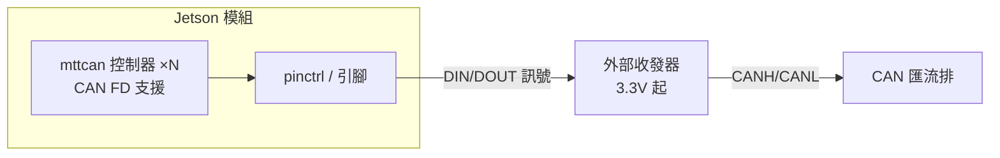
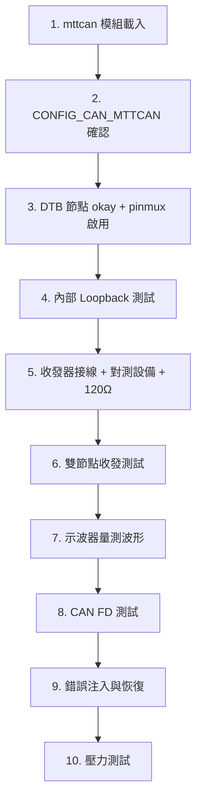

# Jetson mttcan CAN 驗證指南

> [!NOTE] 本文件定位
> 本文件僅涵蓋 **NVIDIA Jetson 平台特定**的 CAN 知識（mttcan 驅動、Device Tree、pinmux/Jetson-IO、硬體接線、平台注意事項）。
> **CAN 協定、SocketCAN 工具、實體測試方法等通用知識請見 [[CAN 協定與 SocketCAN 完整指南]]**，本文件不重複撰寫。

---

## 1. Jetson CAN 控制器概覽

NVIDIA Jetson 模組（AGX Xavier、AGX Orin、AGX Thor 等）內建 **M_CAN**（Bosch M_CAN IP）控制器，NVIDIA 的 Tegra 專用 Linux 驅動模組名為 **mttcan**。

官方文件指出 Orin 系列的控制器位於 **Always-On 區塊**，屬 Time Triggered CAN（TTCAN）。



| 特性 | 說明 |
|------|------|
| 控制器數量 | 依平台不同：Orin NX/Nano 1 個、AGX Orin 2 個（實際啟用以 DTB/pinmux 為準） |
| 協定支援 | CAN 2.0A/B 與 **CAN FD** |
| 位元率範圍 | 10 kbps – 1 Mbps |
| FD 資料速率 | 最高 15 Mbps（一般收發器 5 Mbps；更高需設定 TDCR，見 6.4） |
| CAN 時脈 | Orin 家族預設 50 MHz，可於驅動客製，見 6.5 |
| 驅動模組 | `mttcan`（內建於 NVIDIA 官方核心） |
| SocketCAN 整合 | 標準 `PF_CAN` 介面，`can0`、`can1`… 以 `can` 開頭命名 |

> [!WARNING] 控制器 ≠ 收發器
> Jetson 模組只提供 CAN 控制器的**數位訊號**（DIN/DOUT），**實體層必須外接 CAN 收發器**（如 TJA1044、SN65HVD230）。載板設計時需預留收發器電路，這與一般 MCU 開發板（如 STM32 板載收發器）不同。

---

## 2. 驅動與核心配置檢查

### 2.1 模組載入與介面存在

```bash
# 官方建議載入順序：can → can_raw → mttcan
sudo modprobe can
sudo modprobe can_raw
sudo modprobe mttcan

# 檢查 mttcan 是否已載入
lsmod | grep mttcan

# 查看 dmesg 中的 mttcan 訊息
dmesg | grep -i mttcan

# 列出已存在的 CAN 網路介面
ls /sys/class/net/ | grep can     # 預期 can0、can1 …
ip link show
```

> [!WARNING] 客製化核心（如 PREEMPT_RT）必須自行確認
> 若 Jetson 使用**自編核心**（例如 RT 核心），mttcan 可能未被編入。需以 [[Jetson 平台第三方核心模組編譯與部署指南]] 的方式重編 mttcan 模組，且需注意 [[Linux 模組版本校驗]] 的 vermagic 一致性，否則載入會出現 `Invalid module format`。

### 2.2 核心配置

```bash
# 平台關鍵：確認 mttcan 驅動已編入核心（=y 或 =m）
zcat /proc/config.gz | grep CAN_MTTCAN
# 預期：CONFIG_CAN_MTTCAN=m（或 =y）

# 其他 CAN 子系統通用項目（CONFIG_CAN、CAN_RAW、CAN_DEV 等）
# 見 [[CAN 協定與 SocketCAN 完整指南]] 4.2 節
```

### 2.3 介面啟動

平台特定建議參數（官方文件以 `berr-reporting on` 示範，FD 模式）：

```bash
# 官方範例：500k 仲裁 / 1M 資料段 + 錯誤報告
sudo ip link set can0 up type can bitrate 500000 dbitrate 1000000 berr-reporting on fd on
```

> 一般啟動、loopback、狀態查看（`ip -details link show can0`）等操作，見 [[CAN 協定與 SocketCAN 完整指南]] 4.4、5.2、7.3 節。

---

## 3. Device Tree：啟用 CAN 節點

Jetson 使用 **UEFI + Device Tree Overlay（DTBO）** 機制在開機階段合併硬體配置，與一般 Linux 的執行階段動態載入不同。完整機制請見 [[NVIDIA Jetson Device Tree Overlay (DTBO) 完整指南]]。

### 3.1 檢查目前啟用狀態

```bash
# 列出 device tree 中的 CAN 節點
ls /proc/device-tree/ | grep -i can
# 或轉出整棵 DTB 查看
sudo dtc -I fs -O dts /proc/device-tree 2>/dev/null | grep -A 20 "mttcan\|can@"
```

### 3.2 官方 DTB 啟用方式

控制器節點預設可能 `status = "disabled"`，官方文件中直接以 DTB 節點啟用（Orin 系列位址見 4.1 表）：

```dts
mttcan@c310000 {
    status = "okay";
};
mttcan@c320000 {
    status = "okay";
};
```

以 overlay 啟用（節點路徑依平台版本而異）：

```dts
/* can-overlay.dts：啟用 can0（示意，實際節點路徑依平台版本而異） */
/dts-v1/;
/plugin/;

/ {
    overlay-name = "Enable CAN0";
    compatible = "nvidia,p3737-0000", "nvidia,tegra234";  /* AGX Orin 範例 */

    fragment@0 {
        target-path = "/mttcan@c310000";   /* 實際位址以官方 DTS 為準 */
        __overlay__ {
            status = "okay";
            pinctrl-names = "default";
            pinctrl-0 = <&can0_pins>;
        };
    };
};
```

> [!TIP] 快速確認路徑
> 到 NVIDIA 官方 BSP 的 `hardware/nvidia/` 或 `kernel-devicetree/` 下搜尋 `mttcan`，即可找到各平台的完整 CAN 節點定義與 pinctrl 名稱。

---

## 4. Pinmux：腳位功能檢查與啟用

CAN 腳位（TX/RX）在被 mux 到 CAN 功能之前不會運作。Jetson 可用三種方式處理，依情境選擇。

### 4.1 平台引腳對照（R36.x，Orin 系列）

> [!IMPORTANT] J17 vs 40-pin header
> - **Orin NX / Nano**：CAN 腳位在 **J17 接頭**（CAN_TX、CAN_RX），預設 pinmux 即為 **SFIO：CAN 功能**
> - **AGX Orin DevKit**：CAN 腳位在 **40-pin header**，預設為 **GPIO**，必須用 Jetson-IO 啟用（見 4.2 節）

| 屬性 | Orin NX / Nano | AGX Orin |
|------|----------------|----------|
| 控制器數 | 1 | 2 |
| 控制器位址 | `mttcan@c310000` | `mttcan@c310000`、`mttcan@c320000` |
| CAN 腳位 | J17：CAN_RX[1]、CAN_TX[2] | 40-pin：CAN0_DIN[29]、CAN0_DOUT[31]、CAN1_DIN[37]、CAN1_DOUT[33] |
| 預設 pinmux | **SFIO：CAN 功能** | **GPIO（需啟用）** |
| pinmux 暫存器 | `can0_din` @ `0x0c303018` = `0xc458`<br/>`can0_dout` @ `0x0c303010` = `0xc400` | 左列兩組 +<br/>`can1_din` @ `0x0c303008` = `0xc458`<br/>`can1_dout` @ `0x0c303000` = `0xc400` |

> [!WARNING] 以你的載板為準
> 硬體腳位位置由載板決定：**第三方載板可能完全不同**，務必查閱載板文件，不要依賴 DevKit 的 pinout。
> **AGX Thor** 屬 R39 平台，引腳配置不同，請查詢對應版本官方文件。

### 4.2 Jetson-IO 工具（官方推薦，開發板適用）

Jetson Expansion Header Tool（`/opt/nvidia/jetson-io/jetson-io.py`）以選單方式更改 pinmux，產生新 DTB 寫入 `/boot/` 並更新 `extlinux.conf`：

```bash
# 互動式選單：選 header → 啟用功能 → Save and reboot
sudo /opt/nvidia/jetson-io/jetson-io.py
```

等價的指令行工具：

```bash
# 查看目前 pin 配置
sudo /opt/nvidia/jetson-io/config-by-pin.py            # 顯示全部
sudo /opt/nvidia/jetson-io/config-by-pin.py -l          # 列出支援的 header
sudo /opt/nvidia/jetson-io/config-by-pin.py -p 29       # 檢視特定 pin

# 列出可啟用的功能（all 全部 / enabled 目前已啟用）
sudo /opt/nvidia/jetson-io/config-by-function.py -l all
sudo /opt/nvidia/jetson-io/config-by-function.py -l enabled

# 啟用功能並產生新 DTB（-o dt）或 overlay（-o dtbo）
# 函數名稱以 `-l all` 輸出清單為準，例如 can1
sudo /opt/nvidia/jetson-io/config-by-function.py -o dt can1
sudo /opt/nvidia/jetson-io/config-by-function.py -o dtbo can1
```

> [!IMPORTANT] Jetson-IO 注意事項
> - 完成後可選 **Save and reboot to reconfigure pins**（儲存並立即重啟）或 **Save and exit without rebooting**（儲存後自行重啟）
> - 所有已儲存的 pin 配置都保留在 extlinux 開機選單中，隨時可用舊配置開機回到先前狀態
> - 啟用 pinmux 後，**仍須確認 DTB 中對應 `mttcan@…` 節點 `status = "okay"`**（見第 3 章）
> - 官方限制：`config-by-hardware.py` 與 `config-by-function.py` 不可同時用於同一 session 的兩種需求，請統一用 `jetson-io.py` 選單一次設定

### 4.3 其他 pinmux 方式

```bash
# devmem 直接寫暫存器（重啟即失效，僅供驗證快速評估）
sudo apt-get install busybox
sudo busybox devmem 0x0c303020 w 0x458
```

- **正式方法**：修改平台 pinmux 設定檔後重新 flash（適用於量產設定）
- 通用檢查方式（`/sys/kernel/debug/pinctrl/*/pinmux-pins`）見 [[CAN 協定與 SocketCAN 完整指南]] 4.4.2 節

> [!NOTE] devmem 範例說明
> 官方文件以 `busybox devmem 0x0c303020 w 0x458` 示範暫存器寫法。各 CAN 暫存器的正確位址與 bitfield 以 4.1 表與 SoC TRM 為準，不要套用裸值。

---

## 5. 硬體接線（收發器與載板）

### 5.1 收發器連接（官方推薦）

官方要求收發器至少支援 3.3V，並推薦 WaveShare SN65HVD230 開發板；生產應用依需求選型。

| 收發器腳位 | 接到 Jetson | 備註 |
|-----------|-------------|------|
| **Rx** | CAN_RX（控制器輸入） | 對應 CANx_DIN |
| **Tx** | CAN_TX（控制器輸出） | 對應 CANx_DOUT（TXD） |
| VCC | 3.3V pin | 依型號與電平匹配 |
| **GND** | GND pin | 務必共地 |
| CANH / CANL | 匯流排（雙絞線） | 終端電阻見 5.2 節 |

> [!CAUTION] 電平匹配
> Jetson 的 CAN 控制器引腳為 **3.3V TTL**。選用收發器時確認其 TXD/RXD 相容 3.3V（TJA1044、TJA1051、SN65HVD230 皆相容）；**MCP2551 的邏輯腳不完全是 3.3V 相容**，需注意電平轉換。

### 5.2 終端電阻與共地

- 匯流排兩端各需 120Ω；**載板若已內建終端電阻**（常有跳線或焊盤開關），外接時勿重複並聯
- **共地**：Jetson 的 GND 與對測設備（PCAN-USB、另一塊板）的 GND 必須相連
- 完整實體層知識（差動訊號、阻抗量測、接線檢查清單）見 [[CAN 協定與 SocketCAN 完整指南]] 第 3 章與 6.2 節

---

## 6. 平台特定進階議題

### 6.1 JetPack / L4T 版本對應

| 平台 | 常見 JetPack | L4T 版本 | 核心 |
|------|-------------|---------|------|
| AGX Orin | 6.x | R36.x | 5.15 |
| AGX Thor | 8.x | R39.x | 6.6 |

> 不同版本的 DTB 節點路徑與 pinctrl 名稱可能不同，查資料時務必對應你的版本。

### 6.2 客製化核心（RT / 自編核心）

- 自編核心若未編入 mttcan，CAN 介面不會出現 → 見 2.2 節
- RT 核心與官方 GPU 模組（nvgpu）的關係請見 [[Linux kernel 標頭檔處理方案]]
- 換核心後務必驗證 `ip -details link show can0` 的驅動資訊仍是 mttcan

### 6.3 電源與干擾

- Jetson 功耗高（AGX 級別），供電不足會導致 CAN 收發器電壓漂移、錯誤幀暴增
- 高頻負載（GPU 運算）可能造成 EMI，實測時若 CAN 在 GPU 滿載時出現錯誤幀，先檢查接地與遮蔽

### 6.4 TDCR：提高 FD 資料速率（官方功能）

CAN FD 要跑高於 5 Mbps 的資料段時，設定 TDCR（Transmission Delay Compensation Register）：

```bash
# 需以 root 執行；路徑中的 c320000 為控制器位址字串，依平台與介面而異
echo 0x600 > /sys/devices/c320000.mttcan/net/can1/tdcr
```

> 設定前先確認收發器支援目標資料速率，且必須實際量測驗證。一般收發器可達 5 Mbps，更高速率請參考官方文件。

### 6.5 CAN 時脈修改

mttcan 驅動客製時可調整 CAN 時脈（Orin 家族預設 50 MHz）：

```c
.set_can_core_clk = true,
.can_core_clk_rate = 50000000, // 修改此處 (Hz)
.can_clk_rate = 200000000,     // 四倍核心時脈
```

### 6.6 「No buffer space available」錯誤

送出忙碌導致「No buffer space available」時，改用 polling 模式產生流量（官方建議）：

```bash
cangen -L 8 can0 -p 1000
```

---

## 7. Jetson 端完整驗證檢查清單

依序執行；前 3 步為平台層檢查（本文件），後續為通用驗證（指令細節見 [[CAN 協定與 SocketCAN 完整指南]] 對應章節）：



| 步驟 | 檢查項目 | 平台特定方式 | 詳細說明 |
|------|----------|--------------|----------|
| 1 | mttcan 載入、can0 出現 | `modprobe mttcan`、`ls /sys/class/net/ \| grep can` | 2.1 節 |
| 2 | 核心含 mttcan | `zcat /proc/config.gz \| grep CAN_MTTCAN` | 2.2 節 |
| 3 | CAN 節點啟用、腳位 mux 正確 | DTB `status = "okay"`、jetson-io.py 啟用 | 第 3–4 章 |
| 4 | 內部 Loopback | `canfdtest can0` | 通用指南 5.2 |
| 5 | 實體接線 | 3.3V 收發器、共地、阻抗 ≈60Ω | 見 5 節；通用指南 6.2 |
| 6 | 雙節點 `cansend` / `candump` | 兩端互見、無錯誤幀 | 通用指南 6.3 |
| 7 | 示波器差動波形 | dominant ≈2V、bit 寬度正確 | 通用指南 6.6 |
| 8 | CAN FD | bitrate + dbitrate + `fd on` | 通用指南 6.8 |
| 9 | 錯誤注入 | 拔終端 / 反接 / 錯 bitrate | 通用指南 6.7 |
| 10 | 壓力測試 | `cangen` 高流量比對 | 通用指南 6.9 |

---

## 8. 參考資源

- NVIDIA Jetson Linux Developer Guide — Controller Area Network (CAN) 章節（R36.x）：<https://docs.nvidia.com/jetson/archives/r36.5/DeveloperGuide/HR/ControllerAreaNetworkCan.html>
- NVIDIA Jetson Linux Developer Guide — Configuring the Jetson Expansion Headers（Jetson-IO）：<https://docs.nvidia.com/jetson/archives/r36.5/DeveloperGuide/HR/ConfiguringTheJetsonExpansionHeaders.html>
- NVIDIA Jetson 各載板 Pinmux 表格（Jetson-IO 工具輸出）
- Linux 核心文件：`Documentation/networking/can.rst`

## 9. 相關文件

- [[CAN 協定與 SocketCAN 完整指南]] — 通用 CAN 協定/SocketCAN 知識與實體測試完整教學
- [[NVIDIA Jetson Device Tree Overlay (DTBO) 完整指南]] — Jetson 專屬 DTBO 機制
- [[Jetson 平台第三方核心模組編譯與部署指南]] — 自編核心/模組的建置方式
- [[Linux 模組版本校驗]] — 模組載入錯誤（Invalid module format）排查
- [[Linux kernel 標頭檔處理方案]] — RT 核心標頭檔衝突處理
