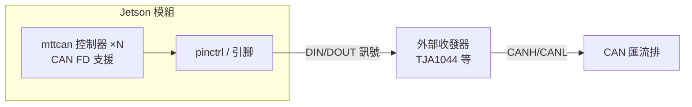
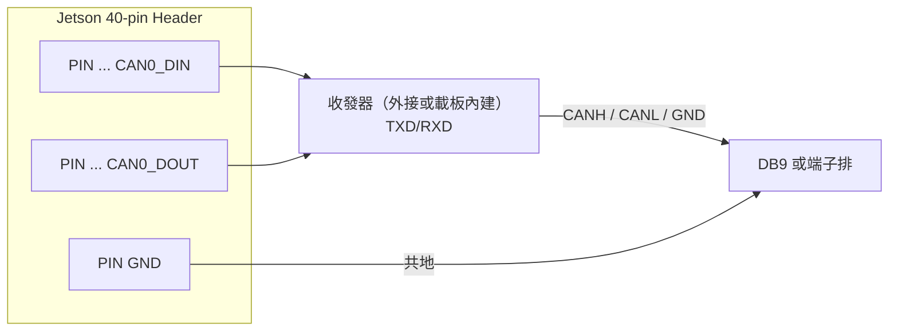
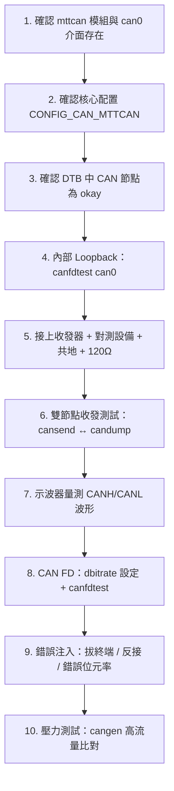

# Jetson mttcan CAN 驗證指南

> [!NOTE] 本文件定位
> 本文件僅涵蓋 **NVIDIA Jetson 平台特定**的 CAN 驗證知識（mttcan 驅動、Device Tree、硬體接線、平台注意事項）。
> **CAN 協定、SocketCAN 工具、實體測試方法等通用知識請見 [[CAN 協定與 SocketCAN 完整指南]]**，本文件不重複撰寫。

---

## 1. Jetson CAN 控制器概覽

NVIDIA Jetson 模組（AGX Xavier、AGX Orin、AGX Thor 等）內建 **M_CAN**（Bosch M_CAN IP）控制器，NVIDIA 的 Tegra 專用 Linux 驅動模組名為 **mttcan**。



| 特性 | 說明 |
|------|------|
| 控制器數量 | 依平台不同（AGX Orin 提供多組，實際可用的以 DTB/pinmux 為準） |
| 協定支援 | CAN 2.0A/B 與 **CAN FD** |
| 驅動模組 | `mttcan`（內建於 NVIDIA 官方核心） |
| SocketCAN 整合 | 標準 `PF_CAN` 介面，`can0`、`can1`… 以 `can` 開頭命名 |

> [!WARNING] 控制器 ≠ 收發器
> Jetson 模組只提供 CAN 控制器的**數位訊號**（DIN/DOUT），**實體層必須外接 CAN 收發器**（如 TJA1044、TJA1051）。載板設計時需預留收發器電路，這與一般 MCU 開發板（如 STM32 板載收發器）不同。

---

## 2. 驅動與核心配置檢查

### 2.1 確認驅動與介面存在

```bash
# 檢查核心是否載入 mttcan 模組
lsmod | grep mttcan

# 查看 dmesg 中的 mttcan 訊息
dmesg | grep -i mttcan

# 列出已存在的 CAN 網路介面
ls /sys/class/net/ | grep can     # 預期 can0、can1 …
ip link show
```

### 2.2 核心配置檢查

```bash
# 確認核心支援 CAN 子系統與 mttcan 驅動
zcat /proc/config.gz | grep -i "CAN"

# 重點項目
# CONFIG_CAN=y                    # CAN 子系統
# CONFIG_CAN_DEV=y                # 驅動框架
# CONFIG_CAN_MTTCAN=y (或 =m)     # NVIDIA mttcan 驅動（關鍵！）
```

> [!WARNING] 客製化核心（如 PREEMPT_RT）必須自行確認
> 若 Jetson 使用**自編核心**（例如 RT 核心），mttcan 可能未被編入。需以 [[Jetson 平台第三方核心模組編譯與部署指南]] 的方式重編 mttcan 模組，且需注意 [[Linux 模組版本校驗]] 的 vermagic 一致性，否則載入會出現 `Invalid module format`。

### 2.3 介面啟動

```bash
# 標準 CAN
sudo ip link set can0 up type can bitrate 500000

# CAN FD
sudo ip link set can0 up type can bitrate 500000 dbitrate 2000000 fd on

# 內部回環測試（驗證控制器，無實體訊號輸出）
sudo ip link set can0 up type can bitrate 500000 loopback on
canfdtest can0

# 查看詳細狀態
ip -details link show can0
```

---

## 3. Device Tree：啟用 CAN 節點

Jetson 使用 **UEFI + Device Tree Overlay（DTBO）** 機制在開機階段合併硬體配置，與一般 Linux 的執行階段動態載入不同。完整機制請見 [[NVIDIA Jetson Device Tree Overlay (DTBO) 完整指南]]。

### 3.1 檢查目前啟用狀態

```bash
# 列出 device tree 中的 CAN 節點
ls /proc/device-tree/ | grep -i can
# 或轉出整棵 DTB 查看
sudo dtc -I fs -O dts /proc/device-tree 2>/dev/null | grep -A 20 "mttcan\|can@"
```

### 3.2 啟用方式（以 overlay 為例）

CAN 節點預設可能 `status = "disabled"`，需透過 overlay 啟用（`status = "okay"`）並指定對應引腳的 pinctrl：

```dts
/* can-overlay.dts：啟用 can0（示意，實際節點路徑依平台版本而異） */
/dts-v1/;
/plugin/;

/ {
    overlay-name = "Enable CAN0";
    compatible = "nvidia,p3737-0000", "nvidia,tegra234";  /* AGX Orin 範例 */

    fragment@0 {
        target-path = "/can@3100000";       /* 實際位址以官方 DTS 為準 */
        __overlay__ {
            status = "okay";
            pinctrl-names = "default";
            pinctrl-0 = <&can0_pins>;
        };
    };
};
```

> [!TIP] 快速確認路徑
> 到 NVIDIA 官方 BSP 的 `hardware/nvidia/` 或 `kernel-devicetree/` 下搜尋 `mttcan`，即可找到各平台的完整 CAN 節點定義與 pinctrl 名稱。

---

## 4. 硬體接線（40-pin Header 與載板）

### 4.1 引腳位置（重點：以你的載板為準！）

- **NVIDIA 原廠載板（AGX Orin Developer Kit）**：40-pin header 上有 **CAN0** 相關引腳（如 GPIO12 = CAN0_DIN、GPIO13 = CAN0_DOUT 等），請查閱官方 **Jetson-IO / Pinmux 表格**確認實際腳位。
- **第三方載板**：引腳分配可能完全不同，**務必查閱載板文件**，不要依賴 DevKit 的 pinout。
- **AGX Thor**：引腳配置與 Orin 不同，需查詢對應 R39 平台的載板文件。



### 4.2 外接收發器接線範例（TJA1044）

| 收發器腳位 | 接到 |
|-----------|------|
| TXD | Jetson CAN0_DOUT（控制器輸出） |
| RXD | Jetson CAN0_DIN（控制器輸入） |
| VCC | 3.3V / 5V（依型號與電平匹配） |
| GND | 與 Jetson 共地 |
| CANH / CANL | 匯流排（雙絞線） |
| STB（待機） | 拉低啟用（依型號） |

> [!CAUTION] 電平匹配
> Jetson 的 CAN 控制器引腳為 **3.3V TTL**。選用收發器時確認其 TXD/RXD 相容 3.3V（TJA1044、TJA1051、SN65HVD230 皆相容）；**MCP2551 的邏輯腳不完全是 3.3V 相容**，需注意電平轉換。

### 4.3 終端電阻與共地

- 匯流排兩端各需 120Ω；**載板若已內建終端電阻**（常有跳線或焊盤開關），外接時勿重複並聯
- **共地**：Jetson 的 GND 與對測設備（PCAN-USB、另一塊板）的 GND 必須相連

---

## 5. 平台特定注意事項

### 5.1 JetPack / L4T 版本對應

| 平台 | 常見 JetPack | L4T 版本 | 核心 |
|------|-------------|---------|------|
| AGX Orin | 6.x | R36.x | 5.15 |
| AGX Thor | 8.x | R39.x | 6.6 |

> 不同版本的 DTB 節點路徑與 pinctrl 名稱可能不同，查資料時務必對應你的版本。

### 5.2 客製化核心（RT / 自編核心）

- 自編核心若未編入 mttcan，CAN 介面不會出現 → 見第 2.2 節
- RT 核心與官方 GPU 模組（nvgpu）的關係請見 [[Linux kernel 標頭檔處理方案]]
- 換核心後務必驗證 `ip -details link show can0` 的驅動資訊仍是 mttcan

### 5.3 電源與干擾

- Jetson 功耗高（AGX 級別），供電不足會導致 CAN 收發器電壓漂移、錯誤幀暴增
- 高頻負載（GPU 運算）可能造成 EMI，實測時若 CAN 在 GPU 滿載時出現錯誤幀，先檢查接地與遮蔽

---

## 6. Jetson 端完整驗證檢查清單

依序執行，每一階段通過再進入下一階段（通用指令細節見 [[CAN 協定與 SocketCAN 完整指南]]）：



| 步驟 | 指令 / 檢查 | 通過標準 |
|------|-----------|---------|
| 1 | `ls /sys/class/net/ \| grep can`、`dmesg \| grep mttcan` | 出現 can0（或 canN） |
| 2 | `zcat /proc/config.gz \| grep CAN` | `CONFIG_CAN_MTTCAN` 存在 |
| 3 | `ls /proc/device-tree/ \| grep can` | 節點存在且啟用 |
| 4 | `ip link set can0 up type can bitrate 500000 loopback on; canfdtest can0` | `0 frames lost` |
| 5 | 阻抗量測 CANH–CANL | ≈60Ω（含雙端 120Ω） |
| 6 | 雙向 `cansend` / `candump` | 兩端互見幀、無錯誤幀 |
| 7 | 示波器差動波形 | dominant ≈2V、1 bit 寬度正確 |
| 8 | `fd on` + `canfdtest` | 無遺失幀 |
| 9 | 對照除錯表 | 能正確呈現並恢復 |
| 10 | `cangen -n 100000` + 記錄比對 | 遺失率 ≈ 0 |

---

## 7. 參考資源

- NVIDIA Jetson Linux Developer Guide — CAN 章節（`https://docs.nvidia.com/jetson/` 依版本查詢）
- NVIDIA Jetson 各載板 Pinmux 表格（Jetson-IO 工具輸出）
- Linux 核心文件：`Documentation/networking/can.rst`

## 8. 相關文件

- [[CAN 協定與 SocketCAN 完整指南]] — 通用 CAN/SocketCAN 知識與實體測試完整教學
- [[NVIDIA Jetson Device Tree Overlay (DTBO) 完整指南]] — Jetson 專屬 DTBO 機制
- [[Jetson 平台第三方核心模組編譯與部署指南]] — 自編核心/模組的建置方式
- [[Linux 模組版本校驗]] — 模組載入錯誤（Invalid module format）排查
- [[Linux kernel 標頭檔處理方案]] — RT 核心標頭檔衝突處理
