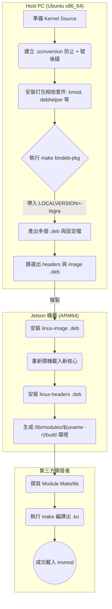

---
title: Jetson 平台第三方核心模組編譯與部署指南
tags:
  - NVIDIA
  - Jetson
  - kernel-module
  - bindeb-pkg
  - embedded
created: 2026-07-10
modified: 2026-08-30
aliases:
  - Jetson 核心模組編譯
  - Jetson 第三方模組
  - kernel module 打包
---

# Jetson 平台第三方核心模組編譯與部署指南

## 1. 核心目標

本指南旨在說明如何在不提供完整核心原始碼（Kernel Source）的前提下，為 NVIDIA Jetson 平台建立獨立的建置環境。透過此環境，第三方開發者可以直接在 Jetson 機器上編譯並載入核心模組（`.ko` 檔），同時徹底避免 `symbol version mismatch`（符號版本不匹配）等載入錯誤。

## 2. 整體部署流程圖



## 3. Host PC 端：環境準備與依賴安裝

在 Host PC 上使用 Debian 打包系統（`bindeb-pkg`）是最穩妥的做法，這能避免手動複製檔案時遺漏 `Module.symvers` 或架構相依腳本（如 `x86_64` vs `ARM64` 二進位檔衝突）的問題。

**安裝打包所需相依套件：**

編譯過程中若遇到 `dpkg-checkbuilddeps: error: Unmet build dependencies: kmod` 等錯誤，需補齊相關工具：

```bash
sudo apt-get update
sudo apt-get install build-essential debhelper rsync kmod bison flex libssl-dev libelf-dev bc
```

## 4. Host PC 端：版本號控制與打包編譯

**⚠️ 關鍵陷阱：版本號不匹配 (Version Mismatch)**

NVIDIA 官方運行的核心通常帶有 `-tegra` 後綴（如 `5.15.185-tegra`）。若直接執行 `bindeb-pkg`，預設會遺失 `-tegra` 並可能因 Git 狀態附加 `+` 號（變成 `5.15.185+`）。這會導致第三方編譯出的 `.ko` 無法載入原系統。

### 步驟 4.1：消除未提交變更的 `+` 號後綴

在 Kernel 原始碼根目錄下建立空白的 `.scmversion` 檔案，欺騙建置腳本略過 Git 狀態檢查：

```bash
touch .scmversion
```

### 步驟 4.2：強制指定後綴並執行打包

編譯時必須透過 `LOCALVERSION` 參數明確宣告 `-tegra` 後綴：

```bash
make ARCH=arm64 CROSS_COMPILE=aarch64-linux-gnu- LOCALVERSION="-tegra" bindeb-pkg -j$(nproc)
```

## 5. 產出檔案篩選

編譯完成後會於上層目錄產生多個檔案。**第三方編譯環境只需 Headers，而 Jetson 本機需要安裝與 Headers 完全同版本的 Image 才能對應。**

|**檔案名稱格式**|**處理方式**|**說明**|
|---|---|---|
|`linux-headers-*-tegra_*_arm64.deb`|**【核心必備】佈署至 Jetson**|包含編譯 `.ko` 所需的標頭檔、`.config`、`Module.symvers` 與 Kbuild 腳本，**不含**原始碼。|
|`linux-image-*-tegra_*_arm64.deb`|**【本機必備】佈署至 Jetson**|核心本體與基礎驅動。Jetson 必須換上此核心開機，版本號才會與 Headers 一致。|
|`linux-image-*-dbg_*.deb`|拋棄 / 略過|核心除錯符號檔，檔案極大，一般編譯不需要。|
|`linux-libc-dev_*.deb`|拋棄 / 略過|提供 User-space 應用的 API 標頭檔，編譯核心模組不需要。|
|`*.buildinfo`, `*.changes`, `Makefile`|拋棄 / 略過|Debian 打包過程的紀錄檔與本機設定檔，完全不需要。|

## 6. Jetson 端部署與驗證

### 部署方法 A：直接於 Jetson 機器上安裝（推薦）

將篩選出的兩個 `.deb` 檔案傳送至 Jetson：

1. **更新核心：** `sudo dpkg -i linux-image-*-tegra_*.deb`
    
2. **重啟系統：** 確保開機後 `uname -r` 顯示新的核心版本。
    
3. **安裝建置環境：** `sudo dpkg -i linux-headers-*-tegra_*.deb`
    

_(系統會自動將環境建立於 `/usr/src/linux-headers-*-tegra`，並軟連結至 `/lib/modules/$(uname -r)/build`)_

### 部署方法 B：預先封裝至 Jetson BSP Rootfs

若需在燒錄前就將環境整合進系統：

- **Chroot 法：** 將 `.deb` 放入 `Linux_for_Tegra/rootfs/tmp`，並利用 `sudo chroot Linux_for_Tegra/rootfs /bin/bash -c "dpkg -i /tmp/linux-headers-*.deb"` 進行安裝。
    
- **NVIDIA 內建法：** 將 headers 目錄內容打包為 `kernel_headers.tbz2`，覆蓋 BSP `kernel/` 目錄下同名檔案，接著執行 `apply_binaries.sh`。
    

## 7. 第三方開發者編譯指南

環境建置完成後，第三方開發者在 Jetson 上編譯 `.ko`，不需任何額外設定或再次編譯 scripts。

**標準 Module Makefile 範例：**

```Makefile
obj-m += third_party_driver.o

# 自動取得當前核心版本的 Build Tree 路徑
KDIR ?= /lib/modules/$(shell uname -r)/build

all:
	make -C $(KDIR) M=$(PWD) modules

clean:
	make -C $(KDIR) M=$(PWD) clean
```

開發者僅需在原始碼目錄執行 `make`，即可順利產出 `.ko`，並透過 `sudo insmod third_party_driver.ko` 成功載入系統。