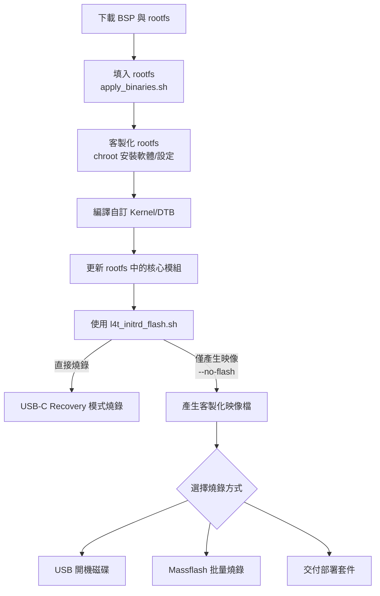
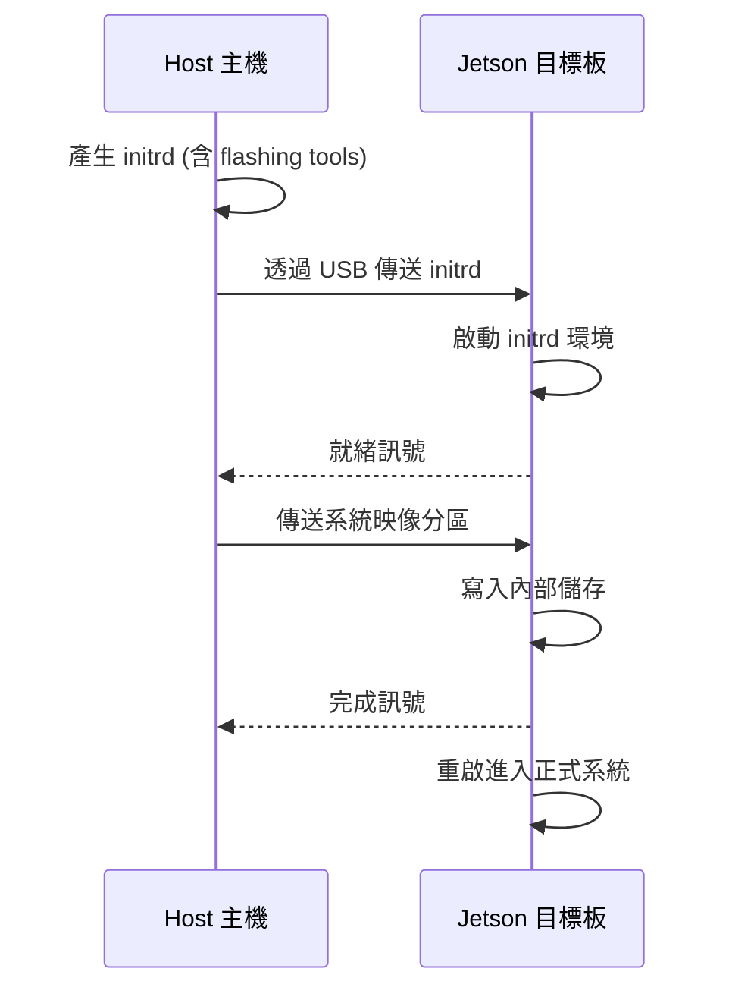
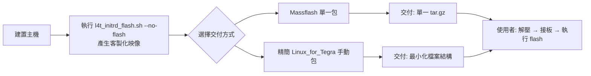

# Jetson 系統映像客製化與燒錄完整指南

## 1. 概述與適用平台

本指南涵蓋 NVIDIA Jetson 平台（AGX Thor、AGX Orin）的系統映像客製化流程與多種燒錄方式，目標是讓開發者能夠建立包含自訂軟體、核心、Device Tree 的系統映像，並選擇最適合的量產或部署方式進行燒錄。

### 適用平台

| 平台 | L4T 版本 | SoC 代號 | 主要儲存 |
|------|----------|----------|----------|
| Jetson AGX Thor | R39 | T264 | NVMe / eMMC |
| Jetson AGX Orin | R36 | T234 | NVMe / eMMC |

### 完整流程概覽



> [!TIP] 工具選擇
> 本文件側重 **BSP 手動客製化** 流程。若只需標準系統，建議使用 SDK Manager（參見 [[SDKManager Docker 刷機指南]]），可自動下載與燒錄標準映像。

---

## 2. 環境準備與 BSP 初始化

### 2.1 下載 BSP

從 NVIDIA 開發者網站下載對應平台的 BSP 與 rootfs。所需檔案：

- `Jetson_Linux_R<version>_aarch64.tbz2` — Linux 核心、驅動、toolchain
- `Tegra_Linux_Sample-Root-Filesystem_R<version>_aarch64.tbz2` — 根檔案系統

> **Thor 下載：** <https://developer.nvidia.com/embedded/jetson-agx-thor-devkit>
> **Orin 下載：** <https://developer.nvidia.com/embedded/jetson-agx-orin-devkit>

### 2.2 解壓與填入 rootfs

```bash
# 建立工作目錄
mkdir ~/jetson_bsp && cd ~/jetson_bsp

# 解壓 BSP（產生 Linux_for_Tegra/）
tar xpf Jetson_Linux_R<version>_aarch64.tbz2

# 解壓 sample rootfs 到 rootfs/ 目錄
sudo tar xpf Tegra_Linux_Sample-Root-Filesystem_R<version>_aarch64.tbz2 \
  -C Linux_for_Tegra/rootfs/

# 填入驅動與 NVIDIA 使用者空間函式庫
cd Linux_for_Tegra
sudo ./apply_binaries.sh
```

> [!NOTE] apply_binaries.sh 的作用
> 此腳本將驅動、韌體、NVIDIA 使用者空間函式庫安裝到 `rootfs/` 中，產生可開機的完整根檔案系統。執行後 `rootfs/` 即成為一個可開機的 Ubuntu 系統。

### 2.3 安裝宿主機依賴

```bash
sudo tools/l4t_flash_prerequisites.sh
```

---

## 3. 客製化 Rootfs

本節說明如何在封裝映像前，透過 chroot 進入 rootfs 進行客製化。

### 3.1 掛載 chroot 環境

```bash
# 掛載必要虛擬檔案系統
sudo mount --bind /dev Linux_for_Tegra/rootfs/dev
sudo mount --bind /proc Linux_for_Tegra/rootfs/proc
sudo mount --bind /sys Linux_for_Tegra/rootfs/sys

# 複製 DNS 設定使 chroot 內可上網
sudo cp /etc/resolv.conf Linux_for_Tegra/rootfs/etc/resolv.conf
```

### 3.2 進入 chroot 進行客製化

```bash
sudo chroot Linux_for_Tegra/rootfs /bin/bash

# --- 以下指令在 chroot 環境內執行 ---

# 更新套件清單
apt-get update

# 安裝自訂套件
apt-get install -y <your-packages>

# 設定開機啟動服務
systemctl enable <your-service>

# 建立使用者、修改密碼、調整權限
# useradd -m -s /bin/bash <username>

# 修改網路設定、防火牆規則等
# ...

# 清除套件快取（縮小映像體積）
apt-get clean

# 退出 chroot
exit
```

### 3.3 清理掛載

```bash
sudo umount Linux_for_Tegra/rootfs/dev
sudo umount Linux_for_Tegra/rootfs/proc
sudo umount Linux_for_Tegra/rootfs/sys
sudo rm Linux_for_Tegra/rootfs/etc/resolv.conf
```

> [!TIP] 可重現性建議
> 建議將 chroot 內的所有客製化步驟編寫為 Shell Script，放入 rootfs 後一次性執行，確保流程可重現且可版本控制。

---

## 4. 核心與 Device Tree 編譯

若需修改核心參數、加入新驅動或調整 Device Tree，需編譯自訂核心。

### 4.1 取得核心原始碼

從 NVIDIA BSP 下載頁面取得核心原始碼：

```bash
cd Linux_for_Tegra/sources
tar xpf kernel_src-<version>.tbz2
```

### 4.2 編譯核心與 DTB

```bash
export ARCH=arm64
export CROSS_COMPILE=aarch64-linux-gnu-

# 載入 NVIDIA 預設配置
make tegra_defconfig

# 選單方式修改核心參數
make menuconfig

# 編譯核心映像與 DTB
make -j$(nproc) Image
make -j$(nproc) dtbs

# 編譯核心模組
make -j$(nproc) modules
```

### 4.3 部署編譯成果

```bash
# 複製核心映像到 BSP 目錄
cp arch/arm64/boot/Image ../Linux_for_Tegra/kernel/

# 複製 DTB
cp arch/arm64/boot/dts/nvidia/*.dtb ../Linux_for_Tegra/kernel/dtb/

# 安裝核心模組到 rootfs
make ARCH=arm64 INSTALL_MOD_PATH=../../rootfs modules_install
```

> [!IMPORTANT] 核心版本一致性
> 核心映像（Image）、DTB、核心模組（.ko）三者的版本字串（vermagic）必須完全一致，否則開機時可能出現 `Invalid module format` 或核心恐慌。詳見 [[Jetson 平台第三方核心模組編譯與部署指南]]。

關於 Device Tree Overlay 的客製化，參見 [[NVIDIA Jetson Device Tree Overlay (DTBO) 完整指南]]。

---

## 5. 使用 l4t_initrd_flash.sh 產生映像

`l4t_initrd_flash.sh` 是 NVIDIA 提供的統一燒錄工具，支援直接燒錄與產生映像檔兩種模式。

### 5.1 運作原理



### 5.2 直接燒錄模式

適用於單台裝置的開發階段。目標板需先進入 **Force Recovery Mode**：

```bash
# 確認裝置被主機偵測
lsusb | grep NVIDIA
```

**Thor 直接燒錄：**
```bash
sudo ./l4t_initrd_flash.sh \
  -c tools/kernel_flash/flash_l4t_t264_nvme.xml \
  jetson-agx-thor-devkit internal
```

**Orin 直接燒錄：**
```bash
sudo ./l4t_initrd_flash.sh \
  -c tools/kernel_flash/flash_l4t_t234_nvme.xml \
  jetson-agx-orin-devkit internal
```

### 5.3 僅產生映像檔（--no-flash）

適用於量產部署，先產生完整映像再選擇燒錄方式：

**Thor：**
```bash
sudo ./l4t_initrd_flash.sh \
  -c tools/kernel_flash/flash_l4t_t264_nvme.xml \
  --no-flash \
  jetson-agx-thor-devkit internal
```

**Orin：**
```bash
sudo ./l4t_initrd_flash.sh \
  -c tools/kernel_flash/flash_l4t_t234_nvme.xml \
  --no-flash \
  jetson-agx-orin-devkit internal
```

### 5.4 映像檔產出結構

執行成功後，映像檔位於 `bootloader/<target_board>/`：

```
bootloader/jetson-agx-thor-devkit/
├── boot.img             # 開機映像（kernel + DTBs + initrd）
├── system.img           # 系統分區映像
├── dtb.img              # Device Tree Blob
├── tegraboot_v2.bin     # 第一階段 Bootloader
└── ...                  # 其他分區映像
```

---

## 6. 燒錄方式

### 6.1 USB-C Recovery 直接燒錄

適合開發階段快速迭代：

1. 將目標板進入 Recovery Mode（按住 RECOVERY + 按 RESET 後放開 RESET，再放開 RECOVERY）
2. 確認 `lsusb` 顯示 `NVIDIA Corp.`
3. 執行 `l4t_initrd_flash.sh`（不加 `--no-flash`）
4. 等待燒錄完成，目標板自動重啟

> [!CAUTION] USB 傳輸穩定度
> 大量資料傳輸時建議加大 USB 緩衝區，避免超時中斷：
> ```bash
> echo 2048 | sudo tee /sys/module/usbcore/parameters/usbfs_memory_mb
> echo -1 | sudo tee /sys/module/usbcore/parameters/autosuspend
> ```
> 詳見 [[SDKManager Docker 刷機指南#1.3 前置作業：解除 USB 寫入瓶頸與休眠限制]]。

### 6.2 USB 開機磁碟

將系統安裝到 USB 隨身碟，可用於測試或現場更新：

```bash
# 確認 USB 裝置名稱
sudo lsblk -p -d | grep sd

# Thor 範例（假設 USB 為 /dev/sdb）
sudo ./l4t_initrd_flash.sh \
  -c tools/kernel_flash/flash_l4t_t264_nvme.xml \
  --external-device sda1 \
  --direct sdb \
  jetson-agx-thor-devkit external
```

詳細步驟（含 32GB USB 的調整方式）請見 [[如何製作 Jetson Thor 平台的 USB 開機磁碟]]。

### 6.3 Massflash 批量燒錄

適用於量產產線，可一次燒錄多台裝置。

**步驟 1：產生 Massflash 映像包**

```bash
sudo ./l4t_initrd_flash.sh \
  --no-flash \
  --massflash 1 \
  jetson-agx-thor-devkit internal
```

產出檔案：`bootloader/jetson-agx-thor-devkit/jetson-agx-thor-devkit_<version>_massflash_1.tar.gz`

**步驟 2：部署到產線主機**

將上述壓縮包複製到量產主機，使用 `flash_net.sh` 或 `flash.sh` 搭配產線工具進行批量燒錄。

---

## 7. Jetson ISO 方式

Jetson ISO 是 NVIDIA 提供的**預先建置安裝映像**，類似 Ubuntu 安裝 ISO，讓終端使用者無需主機即可將 BSP 安裝到 Jetson 裝置。

> [!IMPORTANT] ISO 是預建映像，非客製化工具
> Jetson ISO 由 NVIDIA 官方提供下載（如 `jetsoninstaller-r39.2.0-*.iso`），**不是**從客製化 BSP 產生的工具。BSP 中**沒有** `create_iso.sh` 腳本。若需交付客製化映像，請使用 Massflash 方式（參見 8.2）或 USB 開機碟方式（參見 6.2）。

### 7.1 下載 Jetson ISO

從 NVIDIA 開發者網站下載對應版本的 ISO：

- **Thor (R39.2)**：`jetsoninstaller-r39.2.0-*.iso`
- **Orin (R36.5+)**：對應版本的 `jetsoninstaller-*.iso`

下載頁面：[JetPack Downloads](https://developer.nvidia.com/embedded/jetpack/downloads)

### 7.2 製作安裝 USB

> [!CAUTION] 不可直接複製 ISO 到 USB
> 必須使用 Etcher 等工具製作可開機 USB，直接複製 ISO 檔案無法開機。

1. 下載 [Balena Etcher](https://etcher.balena.io/)
2. 選擇下載的 ISO 映像檔
3. 選擇 USB 隨身碟（建議 16GB 以上）
4. 點擊 Flash 寫入

### 7.3 使用 ISO 安裝

1. 將 Jetson 目標板接上顯示器、鍵盤、滑鼠
2. 插入安裝 USB
3. 開機後自動從 USB 啟動
4. 依照安裝介面引導完成 BSP 安裝

### 7.4 各部署方式比較

| 方式 | 適合場景 | 門檻 | 彈性 |
|------|----------|------|------|
| USB-C Recovery | 開發階段單台燒錄 | 低 | 高 |
| USB 開機碟 | 少量部署、現場測試 | 中 | 中 |
| Massflash | 量產產線 | 高 | 低 |
| Jetson ISO | 終端使用者自行安裝 | 低 | 中 |

---

## 8. 映像檔交付與部署套件

本節說明在完成客製化映像產生後，如何將映像檔打包交付給其他人（同事、客戶、產線），使其能直接燒錄而不需重新執行客製化流程。



### 8.1 整體策略選擇

| 方式 | 適合對象 | 檔案大小 | 準備難度 | 使用者操作難度 |
|------|----------|----------|----------|---------------|
| Massflash 單一包 | 產線、客戶 | 中等（壓縮） | 低 | 最低 |
| 精簡 Linux_for_Tegra | 開發團隊內部 | 較大 | 中 | 低 |

### 8.2 方法一：Massflash 批量燒錄包（推薦）

這是 NVIDIA 官方設計用來交付映像檔的方式，在建置主機上將所有必要檔案打包成單一 tarball。

**建置主機上產生：**

```bash
sudo ./l4t_initrd_flash.sh \
  -c tools/kernel_flash/flash_l4t_t264_nvme.xml \
  --no-flash \
  --massflash 1 \
  jetson-agx-thor-devkit internal
```

產出檔案：`bootloader/jetson-agx-thor-devkit/jetson-agx-thor-devkit_<version>_massflash_1.tar.gz`

**交付給使用者：**

| 檔案 | 說明 |
|------|------|
| `jetson-agx-thor-devkit_<version>_massflash_1.tar.gz` | 完整燒錄包（含所有必要檔案） |
| `flash_instructions.md` | 燒錄操作說明 |

**使用者在燒錄主機上執行：**

```bash
# 1. 解壓縮（會產生 Linux_for_Tegra/ 目錄）
tar xpf jetson-agx-thor-devkit_<version>_massflash_1.tar.gz

# 2. 安裝宿主機依賴
cd Linux_for_Tegra
sudo tools/l4t_flash_prerequisites.sh

# 3. 將 Jetson 目標板進入 Recovery Mode 並連接至主機
lsusb | grep NVIDIA

# 4. 執行燒錄（無需任何客製化步驟）
sudo ./l4t_initrd_flash.sh jetson-agx-thor-devkit internal
```

> [!NOTE] Massflash 包的內容
> Massflash 包已完整包含 `l4t_initrd_flash.sh`、XML 分區配置、bootloader 二進位檔、以及所有客製化映像（`boot.img`、`system.img`、`dtb.img` 等）。使用者**無需**下載 BSP、執行 `apply_binaries.sh`、或接觸任何客製化流程。

### 8.3 方法二：精簡 Linux_for_Tegra 手動包

若無法使用 Massflash，或有自訂交付需求，可手動打包最小必要檔案集合。

**建置主機上準備：**

```bash
# 建立交付目錄
mkdir -p deploy/Linux_for_Tegra

# 複製必要目錄與檔案
cp -r bootloader deploy/Linux_for_Tegra/
cp -r tools/kernel_flash deploy/Linux_for_Tegra/tools/
cp l4t_initrd_flash.sh deploy/Linux_for_Tegra/
cp tools/l4t_flash_prerequisites.sh deploy/Linux_for_Tegra/tools/

# 移除中間產物（選擇性，節省空間）
rm -f deploy/Linux_for_Tegra/bootloader/<target_board>/*.raw

# 壓縮交付
tar czf jetson-thor-custom-flash-kit.tar.gz -C deploy Linux_for_Tegra
```

**可保留與可移除的項目對照：**

| 目錄 / 檔案 | 保留？ | 說明 |
|-------------|--------|------|
| `bootloader/` | ✅ 必要 | 包含所有 bootloader 二進位檔與產生的客製化映像 |
| `bootloader/<target_board>/` | ✅ 必要 | `boot.img`、`system.img`、`dtb.img` 等客製化系統映像 |
| `tools/kernel_flash/` | ✅ 必要 | 燒錄腳本依賴的工具與 XML 分區配置 |
| `l4t_initrd_flash.sh` | ✅ 必要 | 主要燒錄入口腳本 |
| `tools/l4t_flash_prerequisites.sh` | ✅ 建議 | 自動安裝宿主機依賴套件 |
| `rootfs/` | ❌ 不需要 | 已內建於 `system.img` |
| `kernel/` | ❌ 不需要 | 已內建於 `boot.img` |
| `sources/` | ❌ 不需要 | 原始碼，燒錄不需要 |
| `nv_tegra/` | ❌ 不需要 | runtime 套件，已內建於 rootfs |
| `apply_binaries.sh` | ❌ 不需要 | 僅用於建置 rootfs，已執行完畢 |

### 8.4 方法三：自解壓縮一鍵燒錄腳本

為降低使用者的操作門檻，可在交付套件中加入自動化腳本：

```bash
#!/bin/bash
# flash.sh — Jetson 一鍵燒錄腳本
# 用法：將目標板進入 Recovery Mode 後執行本腳本
set -euo pipefail

echo "=== Jetson 系統燒錄工具 ==="
echo "確認目標板已進入 Recovery Mode："
lsusb | grep -q NVIDIA || { echo "錯誤：未偵測到 NVIDIA 裝置"; exit 1; }

# 安裝依賴
sudo ./tools/l4t_flash_prerequisites.sh

# 執行燒錄
sudo ./l4t_initrd_flash.sh \
  -c tools/kernel_flash/flash_l4t_t264_nvme.xml \
  jetson-agx-thor-devkit internal

echo "=== 燒錄完成，目標板將自動重啟 ==="
```

### 8.5 交付套件結構範例

以下是完整的交付套件建議結構：

```
jetson-thor-custom-image-v1.0/
├── Linux_for_Tegra/
│   ├── bootloader/
│   │   ├── jetson-agx-thor-devkit/    # 客製化映像目錄
│   │   │   ├── boot.img               # 開機映像（kernel + DTBs + initrd）
│   │   │   ├── system.img             # 系統分區映像
│   │   │   ├── dtb.img                # Device Tree Blob
│   │   │   ├── tegraboot_v2.bin       # 第一階段 Bootloader
│   │   │   └── ...                    # 其他分割區
│   │   ├── BCT/                       # Boot Configuration Table
│   │   └── ...                        # 其他 bootloader binary
│   ├── tools/
│   │   ├── kernel_flash/
│   │   │   ├── l4t_initrd_flash.sh -> ../../l4t_initrd_flash.sh
│   │   │   └── flash_l4t_t264_nvme.xml
│   │   └── l4t_flash_prerequisites.sh
│   └── l4t_initrd_flash.sh
├── flash.sh                    # 一鍵燒錄腳本
└── README.md                   # 使用說明（含 Recovery Mode 進入方式）
```

### 8.6 各交付方式對照

| 考量 | Massflash | 手動精簡包 |
|------|-----------|------------|
| 準備難度 | 低（單一指令） | 中（需手動篩選檔案） |
| 交付大小 | 最小（壓縮） | 中等 |
| 使用者操作步驟 | 3 步 | 3-4 步 |
| 適用對象 | 產線、客戶 | 開發團隊 |
| 可重複使用性 | 高 | 高 |

> [!TIP] 建議
> - **對外交付（客戶/產線）**：使用 Massflash，最簡潔可靠
> - **團隊內部共享**：使用手動精簡包，保留調整彈性
> - **終端使用者安裝標準 BSP**：使用 NVIDIA 官方 Jetson ISO（非客製化，參見第 7 節）

---

## 9. Thor vs Orin 差異對照

| 項目 | Jetson AGX Thor (T264) | Jetson AGX Orin (T234) |
|------|------------------------|------------------------|
| **L4T 版本** | R39 | R36 |
| **分區配置檔** | `flash_l4t_t264_nvme.xml` | `flash_l4t_t234_nvme.xml` |
| **目標板名稱** | `jetson-agx-thor-devkit` | `jetson-agx-orin-devkit` |
| **Bootloader** | T264 TegraBoot + UEFI | T234 TegraBoot + UEFI |
| **Jetson ISO** | 官方預建安裝映像下載 | 官方預建安裝映像下載 |
| **開機流程** | BCT → TegraBoot → UEFI → Kernel | 同左 |
| **A/B Rootfs** | 支援 | 支援 |

### 9.1 命令對照範例

```bash
# Thor：產生映像
sudo ./l4t_initrd_flash.sh -c tools/kernel_flash/flash_l4t_t264_nvme.xml --no-flash jetson-agx-thor-devkit internal

# Orin：產生映像
sudo ./l4t_initrd_flash.sh -c tools/kernel_flash/flash_l4t_t234_nvme.xml --no-flash jetson-agx-orin-devkit internal
```

### 9.2 重要注意事項

- **XML 配置不可混用**：T264 與 T234 的分區配置完全不相容
- **核心原始碼不同**：兩個平台的核心版本與配置各自獨立
- **裝置樹不相容**：GPIO、PCIe、I2C 等週邊配置不同，DTB 不可共用
- **燒錄腳本版本**：請使用對應 L4T 版本的 `l4t_initrd_flash.sh`，跨版本可能不相容

---

## 10. 常見問題

### 10.1 USB 連線不穩定

```bash
# 加大 USB 緩衝區並關閉自動休眠
echo 2048 | sudo tee /sys/module/usbcore/parameters/usbfs_memory_mb
echo -1 | sudo tee /sys/module/usbcore/parameters/autosuspend
```

### 10.2 核心模組載入失敗（Invalid module format）

核心映像與模組版本不一致。確認 `vermagic` 字串相符：

```bash
strings Linux_for_Tegra/kernel/Image | grep vermagic
modinfo <module.ko> | grep vermagic
```

詳見 [[Jetson 平台第三方核心模組編譯與部署指南]]。

### 10.3 A/B 分區相關

若需切換開機槽位或啟用 Rootfs 冗餘，參見 [[Nvidia Jetson AB Partition 切換]]。

### 10.4 OTA 更新

已部署的裝置需要遠端更新系統時，參見 [[Jetson OTA Update]]。

### 10.5 可重複使用 USB 安裝碟

若需要製作一個可重複使用的 USB 安裝碟（更新內容時無需重建 ISO），參見 [[Jetson AGX Orin 可重複使用 USB 安裝碟製作]]。

該方案支援 **Ventoy-like 多映像架構**，一個 USB 碟可存放多個映像版本，透過選單選擇要部署的版本。

---

## 11. 參考資料

- [Jetson AGX Thor BSP 設定](https://docs.nvidia.com/jetson/agx-thor-devkit/user-guide/latest/setup_bsp.html)
- [Flashing Support for Jetson Thor](https://docs.nvidia.com/jetson/archives/r39.2/DeveloperGuide/SD/FlashingSupportJetsonThor.html)
- [Jetson Linux Flashing Support (Orin)](https://docs.nvidia.com/jetson/archives/r36.4/DeveloperGuide/SD/FlashingSupport.html)
- [Root File System 說明](https://docs.nvidia.com/jetson/archives/r36.4/DeveloperGuide/SD/RootFileSystem.html)
- [Jetson Linux Developer Guide](https://docs.nvidia.com/jetson/archives/)
