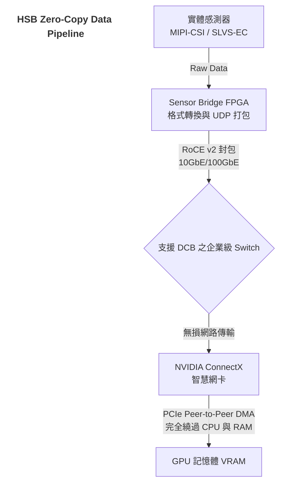
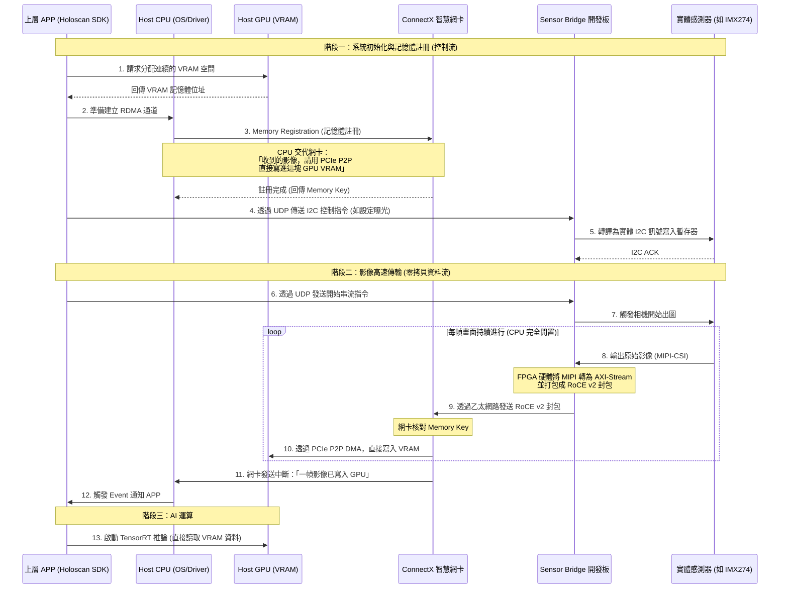
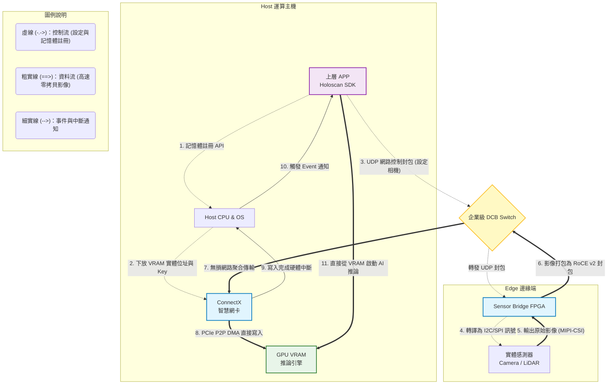
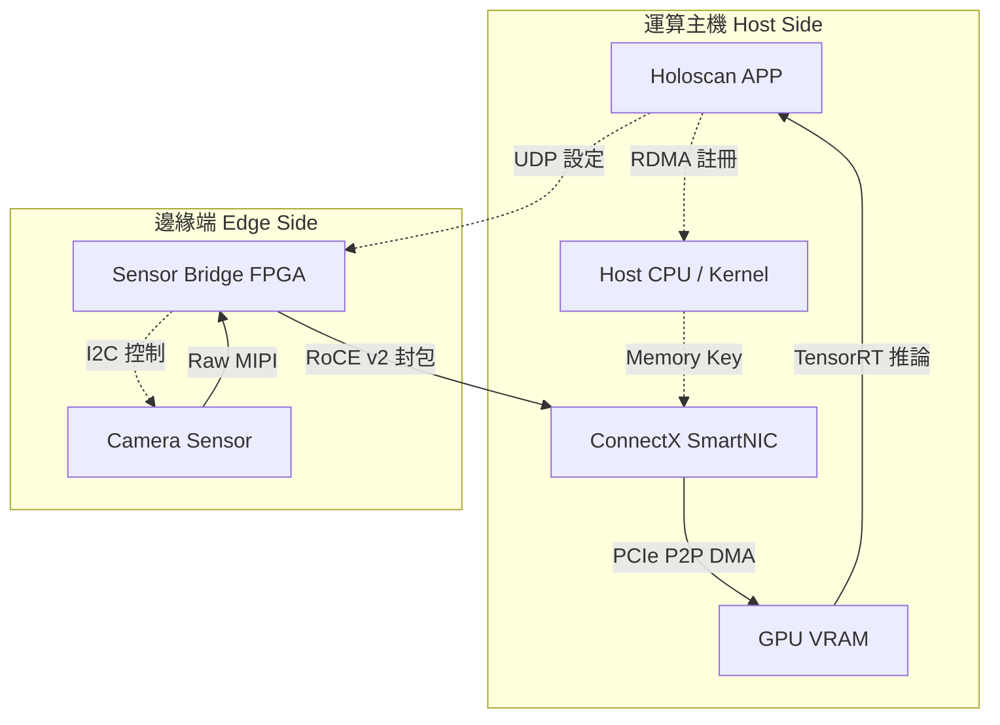

# NVIDIA Holoscan Sensor Bridge 系統架構完整指南

本文件整合 NVIDIA Holoscan Sensor Bridge (HSB) 的系統架構、技術原理與實作細節，提供從硬體底層到軟體堆疊的完整參考。

---

## 1. 系統設計初衷與核心理念 (BYOS)

NVIDIA Holoscan Sensor Bridge (HSB) 是一套專為高頻寬、極低延遲邊緣運算（Edge AI、自主機器人、醫療影像）設計的軟硬體橋接方案。

其核心理念為 **BYOS (Bring Your Own Sensor)**。在傳統嵌入式系統中，整合非標準的高解析度感測器（如特規 MIPI-CSI 攝影機、光達）往往伴隨著巨大的系統開銷與複雜的驅動程式開發。HSB 透過分散式硬體架構與先進網路協定，將感測器的資料擷取與運算主機解耦，並透過乙太網路實現實體隔離與高速傳輸。

---

## 2. 核心架構對比：傳統資料流 vs 零拷貝 (Zero-Copy) 架構

資料在硬體間的搬移路徑（Data Path），直接決定了系統的底層延遲與吞吐量上限。

### 2.1 傳統架構的效能瓶頸

當感測器透過 USB 或一般網路介面進入系統時，資料的流動高度依賴 CPU 的介入：

1. 網卡 / USB 控制器接收到實體訊號後，觸發硬體中斷 (Hardware Interrupt) 喚醒 CPU。
    
2. CPU 進行 Context Switch，在系統主記憶體 (System RAM) 中配置 Bounce Buffer。
    
3. CPU 透過匯流排將資料從接收端控制器複製到 RAM。
    
4. CPU 再下達指令，將資料從 RAM 複製到 GPU 的顯示記憶體 (VRAM) 以供 CUDA / TensorRT 進行推論。
    

**痛點**：這會導致 CPU 使用率滿載、記憶體頻寬被雙倍消耗，且帶來數十毫秒級、不可預測的延遲 (Jitter)。

### 2.2 HSB 零拷貝架構 (RoCE v2 + GPUDirect RDMA)

HSB 徹底移除了 CPU 在資料層 (Data Plane) 的參與：

1. **邊緣預處理**：感測器的原始訊號（如 MIPI 訊號）先進入特製的 FPGA 開發板。FPGA 會將影像訊號轉換為 AXI4-Stream，接著硬體打包成 UDP 網路封包。
    
2. **無損傳輸**：封包透過 10GbE / 100GbE 乙太網路，以 **RoCE v2** (RDMA over Converged Ethernet) 協定傳送。
    
3. **GPUDirect RDMA**：主機端的智慧網卡（如 ConnectX 系列）硬體解析 RoCE v2 封包後，透過 **PCIe P2P (Peer-to-Peer) DMA** 機制，將影像資料**直接寫入 GPU 的物理記憶體位址**。
    

在這個過程中，CPU 完全不參與資料搬移，實現真正的 Zero-Copy。

---

## 3. 匯流排架構深探：為什麼必須是 PCIe？USB 的瓶頸在哪？

能否實現 GPUDirect RDMA，完全取決於底層匯流排是否支援**硬體層級的記憶體直接存取與控制權下放**。

### 3.1 USB 的架構原罪：主機中心 (Host-Centric)

USB 協定在矽智財 (IP) 設計上是嚴格的 Master-Slave 關係。CPU (Host Controller) 永遠是唯一的 Master。

- USB 設備之間無法互相溝通，所有的資料傳輸請求、頻寬分配、記憶體映射，都必須由 CPU 發起與中轉。
    
- 因此，使用 USB 網卡或 USB 擷取盒，資料一定得進出系統記憶體 (RAM)，無法繞過 CPU，**在硬體物理層面就宣告無法支援 RDMA**。
    

### 3.2 PCIe 的技術優勢：點對點傳輸 (Peer-to-Peer DMA)

PCIe 是一套基於封包交換 (Packet-switched) 的高速序列拓樸。它支援 **P2P DMA**：

- 只要在系統初始化時，由 CPU (作業系統) 幫忙設定好 **MMIO (Memory-Mapped I/O)**，讓網卡知道 GPU 記憶體在 PCIe 位址空間中的位置。
    
- 後續網卡接收到網路封包時，便能直接對該 PCIe 位址發起 `Memory Write` 事務 (Transaction)。資料透過主機板上的 PCIe Switch 直接流入 GPU，CPU 只需在整批傳輸完成後接收一次中斷通知即可。
    
- **關鍵硬體條件**：網卡晶片本身必須支援 **RDMA 硬體卸載 (Hardware Offload)**（如 NVIDIA ConnectX 晶片），它才有能力將網路層的 IP/UDP 封包解開，並精準轉換成 PCIe 底層的記憶體寫入指令。一般商用 Realtek / Intel PCIe 網卡並不具備此晶片級能力。
    

---

## 4. 網路通訊協定與 Switch 拓樸限制

HSB 的資料流透過乙太網路傳輸，這意味著你可以加入 Switch 進行網路擴充（例如將多顆感測器透過 Switch 匯聚到單一主機），但 **絕不能使用一般的家用或無網管型 Switch**。

### 4.1 RoCE v2 與掉包危機

HSB 使用的 **RoCE v2** 將 RDMA 封裝在 UDP/IP 之中。RDMA 的特性是針對「無損網路 (Lossless Network)」設計的。一般乙太網路是 Best-Effort（盡力而為），遇到多個感測器瞬間同時發送資料（Microburst 流量突發）導致 Switch 緩衝區滿載時，標準 Switch 的作法是**直接丟棄封包 (Drop)**。

一旦發生掉包，RDMA 會觸發高昂的軟硬體重傳機制，導致延遲從微秒級暴增至毫秒甚至秒級，系統將直接卡頓或斷線。

### 4.2 企業級 Switch 的必備規格：DCB (Data Center Bridging)

要讓 RDMA 在乙太網路上穩定運作，網路交換器必須支援以下流量控制標準：

1. **PFC (Priority Flow Control, IEEE 802.1Qbb)**：
    
    允許 Switch 針對特定的流量優先權（Traffic Class）發送暫停訊號 (Pause Frame)。當 Switch 某個連接埠快塞滿時，它會通知 FPGA「暫停發送」，而不是把封包丟掉，從而避免緩衝區溢位。
    
2. **ECN (Explicit Congestion Notification)**：
    
    當網路開始出現壅塞徵兆時，Switch 會在 IP 標頭中標記 ECN 位元，接收端網卡看到後，會主動通知發送端降速，做到端到端的壅塞控制。
    

---

## 5. 控制層 (Control Plane)：告別 Linux Kernel / Device Tree 開發

在傳統嵌入式系統（如 Jetson 平台）中整合新感測器，最讓系統工程師頭痛的就是**驅動程式開發**。通常需要修改 Device Tree 路由、處理 I2C 總線衝突，並編譯專屬的 V4L2 (Video for Linux 2) 核心模組，過程極度繁瑣且容易遇到 Kernel Symbol 版本不匹配等問題。

HSB 巧妙地避開了這個泥淖：

- **網路化暫存器控制**：感測器的實體控制線（I2C, SPI, GPIO）是接在 FPGA 上。
    
- **User-Space 驅動**：開發者只需在主機端的 Python 或 C++ 應用程式中，呼叫 Holoscan SDK。SDK 會將讀寫暫存器的指令透過 UDP 網路封包發送給 FPGA，FPGA 再轉譯成硬體電氣訊號去設定感測器。
    
- **效益**：完全不需要碰觸作業系統底層。即使切換主機硬體（例如從 AGX Orin 升級到 AGX Thor），只要網路能通，感測器驅動程式碼就可以完全無縫轉移，無需重新編譯 Kernel。
    

---

## 6. GitHub 原始碼解析 (`nvidia-holoscan/holoscan-sensor-bridge`)

這份 GitHub 專案提供的是安裝在運算主機 (Host) 上的**軟體堆疊**。由於資料完全繞過了 Linux Kernel，系統中不會有標準的 `/dev/video0` 節點，因此上層 APP 不能使用標準的 V4L2 或 OpenCV API 讀取畫面，必須依賴這份代碼提供的特殊元件。

### 6.1 代碼的三大用途

1. **網路化硬體控制 (Control Plane)**：
    
    提供 Python/C++ 類別。開發者呼叫 `set_exposure()` 時，代碼會在 User-space 將 I2C 指令打包成 UDP 封包，發送給 FPGA，由 FPGA 轉譯為實體電氣訊號控制相機。**完全免除撰寫 Linux Kernel 驅動的麻煩**。
    
2. **Holoscan Operator (Data Plane)**：
    
    提供如 `RoceReceiverOp` 的接收節點。它負責在背景處理 RDMA 記憶體，並將直接寫入 GPU 的影像封裝為 Tensor（張量），直接對接給 TensorRT 等 AI 推論節點。
    
3. **提供開發範本**：
    
    由於沒有通用的 API 規則，APP 能控制什麼完全取決於感測器的 Datasheet。代碼中的 `examples/` 與 `hololink_module/` 提供了如 IMX274 等相機的封裝範例，供開發者參考並打造自訂感測器 (BYOS) 的軟體驅動。
    

---

## 7. 系統架構與互動序列圖

以下序列圖完整展示了從系統初始化（告訴 GPU 位置）、設定硬體，到影像高速零拷貝傳輸的完整互動過程：

---

## 8. 資料流程與控制流程拓樸圖

本流程圖以實體硬體架構為基礎，清楚拆分了「控制流（指令與記憶體設定）」與「資料流（高速影像傳輸）」的實際走向：

### 流程圖重點解析

- **左側虛線 (控制流)**：展示了 CPU 的主要用途。CPU 只負責在開機時告訴網卡 GPU 的記憶體位址 (步驟 1-2)。而 APP 則是透過一般的 UDP 封包，經由網路去調整感測器的曝光與參數 (步驟 3-4)。
    
- **右側粗線 (資料流)**：這是系統運作時的主力路線。影像資料從相機出發後，完全沒有經過 CPU，也沒有進入主機的系統記憶體，而是經由網卡直接「射入」GPU (步驟 5-8)。
    
- **細線 (事件通知)**：只有在整張畫面寫入 GPU 完成後，網卡才會發送中斷通知 CPU (步驟 9-10)，APP 隨即呼叫 TensorRT 進行推論。
    

### 8.1 簡化架構圖：主機端與邊緣端分工

以下流程圖以更簡潔的方式呈現 Host Side 與 Edge Side 的內部元件，以及控制平面與資料平面的連線：

此圖強調了兩點：
1. **控制平面**（虛線）：由 Host CPU 與 APP 負責記憶體註冊與參數設定。
2. **資料平面**（實線）：影像資料從 Sensor 經由 FPGA 與 NIC 直接寫入 GPU，完全繞過 CPU。

---

## 9. 系統落地實作清單

若要建置一套完整的 Holoscan Sensor Bridge 開發環境，需具備以下元素：

- **運算主機 (Host Node)**：
    
    - 具備高速 PCIe 擴充槽與 NVIDIA GPU 的平台（例如：Jetson AGX Orin 模組載板、NVIDIA IGX，或高階 x86 工作站）。
        
- **網路基礎設施 (Networking)**：
    
    - **網卡**：NVIDIA ConnectX-6, ConnectX-7 或更新世代的智慧網卡（必須支援 RoCE v2）。
        
    - **Switch (選配)**：若不採直連 (Direct Attach)，則必須配備支援 PFC/ECN (Data Center Bridging) 的企業級 10G/100G 網路交換器。
        
- **邊緣橋接硬體 (Edge Node)**：
    
    - NVIDIA 合作夥伴推出的 FPGA 開發板（例如基於 Lattice CrossLink-NX 或 Microchip PolarFire 架構的產品），並燒錄對應的 HSB IP 韌體。
        
- **軟體堆疊 (Software Stack)**：
    
    - Ubuntu 作業系統與 NVIDIA OFED (OpenFabrics Enterprise Distribution) 網卡驅動。
        
    - **NVIDIA Holoscan SDK**：做為整體應用程式的執行框架。
        
    - 自訂的 Sensor Class (C++/Python)：實作 `initialize`, `configure`, `start`, `stop` 等生命週期方法來控制特定的終端感測器。
