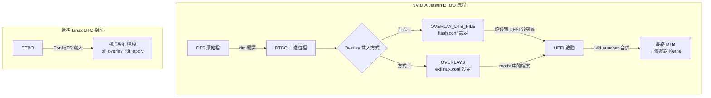
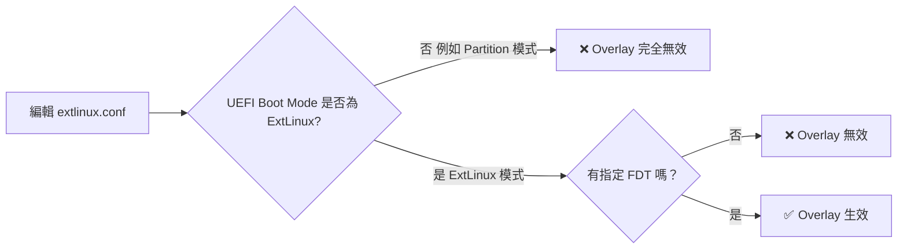

## 概述

NVIDIA Jetson 平台的 Device Tree Overlay 機制與標準 Linux 有所不同。Jetson 使用 **UEFI (L4tLauncher)** 作為 bootloader，在開機階段就將 overlay 合併到 DTB 中，而非像標準 Linux 可在執行階段透過 ConfigFS 動態載入。



> **延伸閱讀：** 關於 Device Tree Overlay 的通用原理、DTS 語法、以及 `dtbocfg.ko` 等動態載入方式，請參閱 [[01-開發技術/嵌入式開發/Linux核心/Device Tree Override 完整指南]]。

---

## 兩種 Overlay 載入方式

NVIDIA 提供兩種方式來套用 DTBO，兩者的差異如下：

| 特性 | `OVERLAY_DTB_FILE` | `OVERLAYS` |
|------|-------------------|------------|
| **設定位置** | board flash config (`.conf`) | `/boot/extlinux/extlinux.conf` |
| **套用時機** | 燒錄時寫入 UEFI 分割區 | 開機時由 UEFI 讀取 rootfs |
| **影響範圍** | UEFI DTB + Kernel DTB | **僅 Kernel DTB** |
| **修改方式** | 需重新燒錄 | 直接編輯檔案後重開機 |
| **條件式套用** | 支援 `board_config` (ids/odm-data/fuse-info) | 無條件全部套用 |

---

## 方式一：OVERLAY_DTB_FILE（完整方案，UEFI + Kernel）

這是最正規的方式，Overlay 會在燒錄時被寫入 UEFI 分割區，同時作用於 UEFI 自身與 Kernel 的 DTB。

### 步驟 1：取得 Kernel 原始碼

```bash
cd <L4T>/Linux_for_Tegra/source
./source_sync.sh -k -t <release-tag>
```

### 步驟 2：了解 Device Tree 結構

```
Linux_for_Tegra/source/hardware/nvidia/t23x/nv-public/
├── tegra234-p3737-0000+p3701-0000.dts         ← 底層（與 upstream 對齊）
└── nv-platform/
    └── tegra234-p3737-0000+p3701-0000-nv.dts  ← 頂層（NVIDIA 客製化）
```

底層檔案由上游 kernel 維護，頂層 `-nv.dts` `#include` 底層並加入修改。

### 步驟 3：撰寫 Overlay DTS

建立一個 `.dts` 檔案，使用 fragment 結構（Jetson UEFI 支援此格式）：

```dts
// my-overlay.dts
/dts-v1/;
/plugin/;

/ {
    overlay-name = "My Custom Device Overlay";
    compatible = "nvidia,p3737-0000+p3701-0000";

    fragment@0 {
        target-path = "/bus@0/spi@xyz";
        __overlay__ {
            status = "okay";
            my_device@0 {
                compatible = "my,spi-device";
                reg = <0x0>;
                spi-max-frequency = <10000000>;
            };
        };
    };
};
```

如果需要條件式套用（根據硬體版本），可加入 `board_config`：

```dts
fragment@0 {
    target-path = "/bus@0/i2c@3180000/tca9546@70/i2c@0/imx274_a@1a";
    board_config {
        ids = "LPRD-dual-imx274-002";
        sw-modules = "kernel";   // "kernel" 僅套用於 Kernel, "uefi" 僅套用於 UEFI, 不指定則兩者皆套用
    };
    __overlay__ {
        status = "okay";
    };
};
```

### 步驟 4：編譯 DTBO

```bash
export CROSS_COMPILE=<toolchain>/bin/aarch64-buildroot-linux-gnu-
export KERNEL_HEADERS=$PWD/kernel/kernel-jammy-src

# 先建立 scripts（首次需要）
make -C kernel ARCH=arm64 defconfig scripts

# 編譯 DTBO
./kernel/kernel-jammy-src/scripts/dtc/dtc -@ -I dts -O dtb \
  -o hardware/nvidia/t23x/nv-public/nv-platform/my-overlay.dtbo \
  hardware/nvidia/t23x/nv-public/nv-platform/my-overlay.dts
```

### 步驟 5：設定 Flash 設定檔

在您的 board 設定檔（如 `myboard.conf`）中加入：

```bash
source "${LDK_DIR}/p3737.conf.common";

OVERLAY_DTB_FILE="my-overlay.dtbo";
```

支援多個 overlay：

```bash
OVERLAY_DTB_FILE="${OVERLAY_DTB_FILE},my-overlay.dtbo,another-overlay.dtbo";
```

### 步驟 6：複製 DTBO 並重新編譯 DTB

```bash
make dtbs
cp kernel-devicetree/generic-dts/dtbs/* <L4T>/Linux_for_Tegra/kernel/dtb/
# 也確保 .dtbo 一併複製
cp hardware/nvidia/t23x/nv-public/nv-platform/*.dtbo <L4T>/Linux_for_Tegra/kernel/dtb/
```

### 步驟 7：刷寫裝置

```bash
cd <L4T>/Linux_for_Tegra
sudo ./flash.sh <options> <board> internal
```

### 步驟 8：驗證

在目標版上執行：

```bash
# 檢查最終 DTB 內容
fdtdump /sys/firmware/fdt | grep my_device

# 或反編譯後搜尋
dtc -I dtb -O dts /sys/firmware/fdt | grep -A10 my_device

# 檢查驅動是否載入
dmesg | grep my_device
ls /dev/my_device*
```

---

## 方式二：extlinux.conf OVERLAYS（快速方案，僅 Kernel）

此方式透過編輯 `/boot/extlinux/extlinux.conf` 來指定 Overlay，**僅影響 Kernel DTB**，修改後重開機即可，不需重新燒錄。

### 必要條件（非常重要！）



#### 條件 1：UEFI Boot Mode 必須為 ExtLinux

UEFI 的 `L4TDefaultBootMode` 必須設為 `[01 00 00 00]`（ExtLinux 模式），否則 **UEFI 完全不會讀取 extlinux.conf**。

| 值 | 模式 | 說明 |
|---|---|---|
| `[00 00 00 00]` | GRUB | 使用 GRUB 開機 |
| `[01 00 00 00]` | **ExtLinux** | **從 rootfs 載入 kernel + DTB ← 必要** |
| `[02 00 00 00]` | Partition | 從分割區載入（跳過 extlinux.conf） |
| `[03 00 00 00]` | Recovery | 復原模式 |

**檢查當前 Boot Mode：**

```bash
# 在 Jetson 目標版上執行
mount -t efivarfs none /sys/firmware/efi/efivars/
xxd /sys/firmware/efi/efivars/L4TDefaultBootMode-781e084c-a330-417c-b678-38e696380cb9
```

如果看到 `02 00 00 00`，表示目前是 partition mode，extlinux.conf **不會被讀取**。

**修改方式（三選一）：**
1. **開機時按 ESCAPE** → Device Manager → NVIDIA Configuration → L4T Configuration → L4T Boot Mode → 改為 **ExtLinux**
2. 修改 `L4TConfiguration.dtbo` 後重新燒錄
3. 使用 `efibootmgr` 指令

#### 條件 2：必須同時指定 FDT

`OVERLAYS` 必須與 `FDT` 搭配使用，否則沒有 base DTB 可供疊加。

### extlinux.conf 正確格式

```
TIMEOUT 30
DEFAULT primary

LABEL primary
  LINUX /boot/Image
  FDT /boot/dtb/kernel_tegra234-p3737-0000+p3701-0000-nv.dtb
  OVERLAYS /boot/my-overlay.dtbo
  APPEND ${cbootargs} root=PARTUUID=xxx rootfstype=ext4 rw
```

多個 Overlay 以逗號分隔：

```
  OVERLAYS /boot/overlay-a.dtbo,/boot/overlay-b.dtbo
```

### 注意事項

- `.dtbo` 檔案路徑是相對於 rootfs 的絕對路徑
- 確保檔案確實存在：`ls -la /boot/my-overlay.dtbo`
- 若啟用 Secure Boot，`.dtbo` 需要對應的 `.sig` 簽章檔案
- 修改後需**重新開機**才能生效

---

## 進階：UEFI 條件式 Overlay（board_config）

NVIDIA UEFI 的 `OVERLAY_DTB_FILE` 支援根據硬體參數條件式套用 Overlay。Overlay DTS 中的 `board_config` 節點可指定匹配規則：

```dts
fragment@0 {
    target = "<&uartc>";
    board_config {
        ids = "2888-0001-400", "3360-1099-100";  // 比對 EEPROM board ID
        odm-data = "enable-high-speed-uart";       // 比對 /chosen/odm-data
        fuse-info = "fuse-disable-nvenc";          // 比對 fuse 設定
        sw-modules = "kernel";                     // "kernel" / "uefi" / 不指定（兩者皆套）
    };
    __overlay__ {
        compatible = "nvidia,tegra186-hsuart";
        status = "okay";
    };
};
```

| board_config 屬性 | 說明 |
|---|---|
| `ids` | 比對平台 EEPROM 中的 board ID，符合任一即套用 |
| `odm-data` | 比對 base DTB `/chosen/odm-data` 中的字串 |
| `fuse-info` | 比對 fuse 設定（用於 floor sweeping） |
| `sw-modules` | 指定套用目標：`"kernel"`、`"uefi"`、或不指定（兩者皆套） |

---

## 除錯與排錯

### 常見問題

| 症狀 | 可能原因 | 解決方案 |
|---|---|---|
| `OVERLAYS` 完全無效 | Boot Mode 不是 ExtLinux | 檢查 `L4TDefaultBootMode`，改為 `[01 00 00 00]` |
| `OVERLAYS` 無效 | 缺少 `FDT` 條目 | 新增 `FDT` 指向正確的 DTB |
| 找不到 DTBO 檔案 | 路徑錯誤或檔案不存在 | 用 `ls -la` 確認路徑 |
| Secure Boot 錯誤 | DTBO 未簽章 | 產生對應的 `.sig` 檔案 |
| Probe 失敗 | Pinmux 衝突/Clock 未啟用 | 檢查 GPIO、clock 狀態 |

### 快速檢查流程

```bash
# 1. 確認 Boot Mode
mount -t efivarfs none /sys/firmware/efi/efivars/
xxd /sys/firmware/efi/efivars/L4TDefaultBootMode-781e084c-a330-417c-b678-38e696380cb9

# 2. 確認 extlinux.conf 內容
cat /boot/extlinux/extlinux.conf

# 3. 確認 DTBO 檔案存在
ls -la /boot/*.dtbo

# 4. 確認最終 DTB 是否包含 overlay 內容
dtc -I dtb -O dts /sys/firmware/fdt | grep -A5 "my_device"

# 5. 檢查 dmesg
dmesg | grep -i "overlay\|dtbo"
```

---

## 與通用 Linux DTO 機制對照

| 項目 | NVIDIA Jetson 方式 | 通用 Linux DTO（參見完整指南） |
|------|-------------------|-------------------------------|
| 載入時機 | **Bootloader (UEFI) 階段** | 核心運行後（ConfigFS / Kernel API） |
| 操作方式 | Flash 設定 + 重開機 | Shell 指令即時載入/卸載 |
| 影響範圍 | UEFI + Kernel 或僅 Kernel | 僅 Kernel |
| 動態性 | 需重開機 | 可執行階段動態切換 |
| 設定檔案 | `board.conf` / `extlinux.conf` | `cat .dtbo > .../dtbo` |
| 卸載方式 | 需修改設定並重開機 | `rmdir` ConfigFS 目錄 |
| 適用情境 | 產品量產、固定硬體配置 | 開發偵錯、FPGA 熱插拔 |

> **更多細節請參閱：** [[01-開發技術/嵌入式開發/Linux核心/Device Tree Override 完整指南]]，該文件涵蓋了 DTS 語法、編譯器選項、`dtbocfg.ko` 外掛模組、以及透過 Kernel API 直接載入等完整主題。

---

## 學習路線建議

1. **先從 `extlinux.conf` OVERLAYS 入門** — 不需重新燒錄，快速驗證 Overlay 是否正確
2. 確保 **UEFI Boot Mode 設為 ExtLinux** — 這是新手最常忽略的關鍵步驟
3. 確認 Overlay 正確後，改為 **`OVERLAY_DTB_FILE` 方式整合進產品建置流程**
4. 若需動態載入偵錯，可參考完整指南使用 `dtbocfg.ko` 或撰寫核心模組
