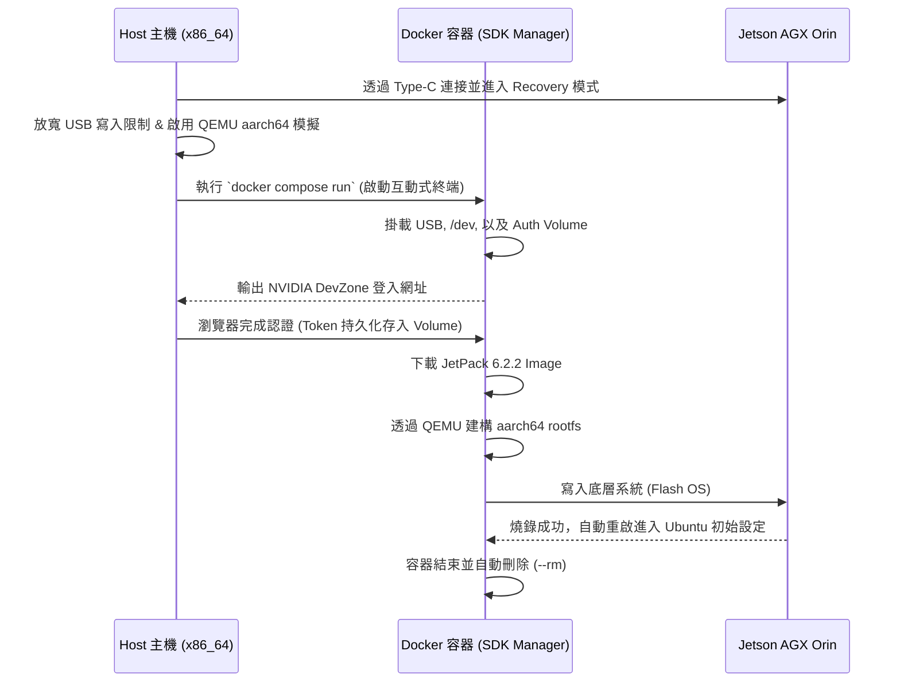

# SDK Manager Docker 刷機指南

本文件彙整「使用 Docker 執行 NVIDIA SDK Manager 為 Jetson 平台刷機」的完整方案，包含兩種做法：

| 方案 | 映像來源 | 使用模式 | 適用場景 |
|------|---------|---------|---------|
| **方案一：官方映像 CLI 刷機** | NVIDIA 官方 `sdkmanager` Docker 映像 | CLI（互動式登入） | 純文字終端快速燒錄 Jetson OS / L4T，無需自建環境 |
| **方案二：自建映像 GUI/CLI** | 自行以 `Dockerfile.sdkmanager` 建置 | GUI（X11）與 CLI 並行 | 需要圖形介面操作 SDK Manager、或需同時安裝舊版 SDK |

> [!NOTE] 本文件位置
> 本文合併自原本散落在 `01-開發技術/嵌入式開發/平台/NVIDIA/` 與 `02-開發工具與流程/Docker/` 兩處的 SDK Manager Docker 文件。因主題皆為「用 Docker 跑 SDK Manager 刷 Jetson」，統一彙整於此；Docker 目錄下的環境建置說明已併入本文第 2 章。

---

## 1. 方案一：官方 sdkmanager 映像（CLI 刷機）

此方案使用 NVIDIA 官方 `sdkmanager` Docker 映像檔，透過 CLI 與 Docker Compose，為 Jetson AGX Orin 進行底層系統 (Jetson OS / L4T) 燒錄。

此方案經過底層參數最佳化，可確保互動式登入 (TTY) 正常顯示、自動記憶開發者帳號憑證，並避開常見的 USB 傳輸瓶頸與跨架構編譯錯誤。

### 1.1 核心概念與系統互動流程

刷機過程中，Host 主機、Docker 容器與 Jetson 硬體之間的互動流程如下：



### 1.2 前置作業：安裝跨架構模擬器

Docker 運行在 x86_64 主機上，但在打包 Jetson 系統時需要模擬 aarch64 環境來生成 rootfs。若未安裝，會在 File System 階段崩潰（`Exec format error`）。

```bash
sudo apt-get update
sudo apt-get install qemu-user-static binfmt-support
sudo update-binfmts --enable
```

### 1.3 前置作業：解除 USB 寫入瓶頸與休眠限制

在傳送大型 rootfs/blob 鏡像時，Linux 主機常會因預設緩衝區過小而引發斷線（`timeout in USB write`）。請強制拉高緩衝區並關閉 USB 休眠：

```bash
# 1. 將 USB 檔案系統的記憶體緩衝區從預設的 16MB 加大至 2GB
echo 2048 | sudo tee /sys/module/usbcore/parameters/usbfs_memory_mb

# 2. 停用 USB 自動休眠機制
echo -1 | sudo tee /sys/module/usbcore/parameters/autosuspend
```

> [!CAUTION] USB 傳輸穩定度
> 大量資料傳輸時建議加大 USB 緩衝區，避免超時中斷。此設定亦適用於一般 USB-C Recovery 直接燒錄（參見 [[Jetson 系統映像客製化與燒錄完整指南#6.1 USB-C Recovery 直接燒錄]]）。

### 1.4 Docker Compose 完整配置

請在工作目錄下建立 `docker-compose.yml`。

**架構設計重點說明：**
1. **摒棄 ipc: host**：遵從 NVIDIA 官方最新手冊，標準刷機不需要開啟 IPC 直通，確保環境隔離。
2. **獨立 Volume 儲存認證**：透過 `sdkm_auth_data` 保存 Token，搭配 `--stay-logged-in true`，實現未來刷機免登入。
3. **正確的版本號映射**：CLI 要求的 `--version` 為 JetPack 版本 (6.2.2)，而非底層 L4T 版本 (36.5)。

```yaml
version: '3.8'

services:
  jetson-flasher:
    image: sdkmanager:latest  # 請確保此名稱與你 docker images 中的官方鏡像一致
    network_mode: host
    privileged: true          # 允許容器進行核心層級操作 (必備)
    stdin_open: true          # 對應 -i，開啟標準輸入以接收互動
    tty: true                 # 對應 -t，分配虛擬終端機顯示網址
    volumes:
      # --- 硬體與設備掛載區 ---
      - /dev/bus/usb:/dev/bus/usb/           # 處理 Recovery 模式下 USB 的頻繁斷連與重抓
      - /dev:/dev                            # 解決 flash.sh 執行 losetup 建立 loop 裝置時的權限報錯
      - /media/${USER}:/media/nvidia:slave   # 官方強制要求，處理主機端媒體層級掛載
      
      # --- 檔案與設定保留區 ---
      - ./sdkm_downloads:/home/nvidia/Downloads # 快取目錄，避免刷機失敗時需重新下載數 GB 檔案
      - sdkm_auth_data:/home/nvidia/.nvsdkm     # 獨立 Volume：保留登入 Token，免去反覆認證
      
    # --- 執行指令與刷機參數 ---
    command: >
      --cli
      --action install
      --login-type devzone
      --product Jetson
      --version 6.2.2                  # 指定的 JetPack 版本 (對應 L4T 36.x 最新版)
      --target-os Linux
      --target JETSON_AGX_ORIN_TARGETS # 指定硬體目標 (若為 Xavier 則改為 JETSON_AGX_XAVIER_TARGETS)
      --select 'Jetson OS'             # 僅燒錄系統，將 SDK 留在開機後透過 apt 安裝最為穩定
      --deselect 'Jetson SDK Components'
      --flash all
      --license accept
      --stay-logged-in true            # 搭配獨立 Volume，實現二次啟動自動登入
      --exit-on-finish

# 宣告獨立的 Docker Volume 以保存 NVIDIA 開發者帳號認證資料
volumes:
  sdkm_auth_data:
```

### 1.5 執行與燒錄步驟

#### 步驟 1：進入 Recovery 模式
1. 使用 Type-C 線連接 Jetson 的 Recovery 燒錄孔與 Host 主機。
2. 按住 Jetson 上的 **Recovery 鍵** 不放。
3. 接著按下 **Power 鍵** (或直接插上電源)，隨後放開 Recovery 鍵。
4. 在 Host 端輸入 `lsusb`，確認是否有看到 `NVIDIA Corp.` 的裝置。

#### 步驟 2：啟動互動式容器（絕不可用 up）
> ⚠️ **致命錯誤預警**：絕對不能使用 `docker compose up`，因為 `up` 會多路復用 stdout/stderr，導致 TTY 互動失效，你會完全看不到登入網址。

請在 `docker-compose.yml` 所在目錄，執行以下指令：
```bash
docker compose run --rm jetson-flasher
```
*(加上 `--rm` 可確保刷機結束後容器自動回收，不殘留垃圾，因重要資料已由 Volume 保存)*

#### 步驟 3：完成開發者帳號認證
第一次啟動時，終端機會暫停並輸出如下提示：
```text
Please open the following URL in a browser to complete your login:
[https://developer.nvidia.com/device-login](https://developer.nvidia.com/device-login)?...
```
請複製該網址至瀏覽器完成登入。驗證成功後，回到終端機，SDK Manager 就會自動接手後續的下載、rootfs 建構與硬體寫入流程。
*(註：未來若再次執行此環境，由於 Token 已存於 Volume，此步驟會自動跳過。)*

#### 步驟 4：後續 SDK 安裝 (本機端處理)
當系統燒錄完成（顯示 Flash Process Successfully）且 Jetson 重新開機後：
1. 接上螢幕與鍵盤，完成 Ubuntu 的首次開機 OEM 設定（建立帳號密碼）。
2. 連上網路，打開 Jetson 本機終端機。
3. 直接透過 `apt` 安裝 CUDA、TensorRT 等完整套件（此作法最不易出錯）：
```bash
sudo apt update
sudo apt install nvidia-jetpack
```

---

## 2. 方案二：自建映像（GUI/CLI 環境）

此方案自行以 `Dockerfile.sdkmanager` 建立基於 Ubuntu 20.04 的 SDK Manager 環境，提供 GUI（X11 轉發）與 CLI 兩種操作模式，並以非 root 使用者執行以避免污染主機檔案權限。

### 2.1 專案檔案結構

```plaintext
.
├── Dockerfile.sdkmanager    # 建立 Ubuntu 20.04 + SDK Manager 基底映像
├── docker-compose.yml       # 定義服務、掛載與使用者 UID/GID
├── .env                     # 主機使用者與環境變數
└── entrypoint.sh            # 啟動容器時調整權限並切換使用者
```

### 2.2 Dockerfile.sdkmanager

```dockerfile
# 以 Ubuntu 20.04 為基底
ARG UBUNTU_TAG=20.04
FROM ubuntu:${UBUNTU_TAG}

ENV DEBIAN_FRONTEND=noninteractive

# 安裝必要工具與 X11 測試套件
RUN apt-get update && apt-get install -y \
    ca-certificates gnupg wget sudo locales x11-apps \
    && rm -rf /var/lib/apt/lists/*

# Locale 設定
RUN sed -i 's/# en_US.UTF-8/en_US.UTF-8/' /etc/locale.gen && locale-gen
ENV LANG=en_US.UTF-8 LC_ALL=en_US.UTF-8

# 安裝 NVIDIA SDK Manager
RUN wget https://developer.download.nvidia.com/compute/cuda/repos/ubuntu2004/x86_64/cuda-keyring_1.1-1_all.deb && \
    dpkg -i cuda-keyring_1.1-1_all.deb && \
    rm cuda-keyring_1.1-1_all.deb && \
    apt-get update && \
    apt-get install -y sdkmanager && \
    rm -rf /var/lib/apt/lists/*

# 建立與主機相同 UID/GID 的一般使用者
ARG USERNAME
ARG UID
ARG GID
RUN groupadd -g ${GID} ${USERNAME} && \
    useradd -m -u ${UID} -g ${GID} -s /bin/bash ${USERNAME} && \
    usermod -aG sudo ${USERNAME} && \
    echo "${USERNAME} ALL=(ALL) NOPASSWD:ALL" >> /etc/sudoers.d/99-${USERNAME}

# 工作目錄
WORKDIR /workspace
RUN chown -R ${UID}:${GID} /workspace

# 複製 entrypoint
COPY entrypoint.sh /entrypoint.sh
RUN chmod +x /entrypoint.sh

ENTRYPOINT ["/entrypoint.sh"]
CMD ["sdkmanager"]
```

### 2.3 docker-compose.yml

```yaml
version: "3.9"

services:
  sdkmanager:
    build:
      context: .
      dockerfile: Dockerfile.sdkmanager
      args:
        - USERNAME=${USER}
        - UID=${UID}
        - GID=${GID}
        - UBUNTU_TAG=20.04
    image: nvidia-sdkmanager:20.04
    container_name: sdkmanager
    environment:
      - DISPLAY=${DISPLAY}
      - XAUTHORITY=/home/${USER}/.Xauthority
      - TZ=${TZ}
      - UID=${UID}
      - GID=${GID}
    # 保持 root 權限的掛載
    volumes:
      - /tmp/.X11-unix:/tmp/.X11-unix:rw
      - ${XAUTHORITY:-$HOME/.Xauthority}:/home/${USER}/.Xauthority:ro
      - /etc/localtime:/etc/localtime:ro
      # 一般使用者可讀寫的掛載
      - sdkm-cache:/home/${USER}/.nvsdkm
      - ${HOME}/Downloads:/home/${USER}/Downloads
      - ${HOME}/nvidia:/home/${USER}/nvidia
    network_mode: host
    ipc: host
    privileged: true
    devices:
      - "/dev/bus/usb:/dev/bus/usb"

volumes:
  sdkm-cache:
```

### 2.4 .env 環境變數範例

```bash
USER=$(id -un)
UID=$(id -u)
GID=$(id -g)
DISPLAY=${DISPLAY}
XAUTHORITY=${XAUTHORITY:-$HOME/.Xauthority}
TZ=Asia/Taipei
```

### 2.5 entrypoint.sh

```bash
#!/bin/bash
set -e

# 調整需要一般使用者的目錄權限
chown -R ${UID}:${GID} /home/${USERNAME}/.nvsdkm \
                       /home/${USERNAME}/Downloads \
                       /home/${USERNAME}/nvidia \
                       /workspace

# 切換成一般使用者執行
exec sudo -u ${USERNAME} "$@"
```

### 2.6 檔案用途

- **Dockerfile.sdkmanager**
    - 建立基於 Ubuntu 20.04 的 SDK Manager 環境，並建立與主機相同的非 root 使用者。
    - 安裝 `x11-apps` 以測試 X11 轉發。
- **docker-compose.yml**
    - 定義容器服務與掛載路徑，分別處理需要 root 與一般使用者的掛載。
- **.env**
    - 儲存主機使用者名稱、UID、GID、時區與 X11 相關環境變數，方便跨平台啟動。
- **entrypoint.sh**
    - 在容器啟動時修正目錄權限，並切換成一般使用者執行 SDK Manager。

### 2.7 使用方法

1. **準備環境變數**
    
    ```bash
    export USER=$(id -un)
    export UID=$(id -u)
    export GID=$(id -g)
    export DISPLAY=${DISPLAY:-:0}
    export XAUTHORITY=${XAUTHORITY:-$HOME/.Xauthority}
    export TZ=Asia/Taipei
    ```
    
2. **允許 X11 存取**
    
    ```bash
    xhost +SI:localuser:$USER
    ```
    
3. **建立必要目錄**
    
    ```bash
    mkdir -p ~/.nvsdkm ~/Downloads ~/nvidia
    ```
    
4. **建置映像**
    
    ```bash
    docker compose build
    ```
    
5. **啟動 GUI 模式**
    
    ```bash
    docker compose up
    ```
    
6. **測試 X11**
    
    ```bash
    docker exec -it sdkmanager xeyes
    ```
    
7. **CLI 模式 (安裝舊版 SDK)**
    
    ```bash
    docker compose run --rm sdkmanager sdkmanager --archived-versions
    ```
    

### 2.8 注意事項

- **X11 轉發**
    - 必須在主機允許對應使用者訪問 X Server（`xhost` 設定）。
- **權限問題**
    - 若 volume 初次建立時為 root 擁有，需要 `entrypoint.sh` 調整權限。
- **USB 裝置刷機**
    - 保留 `/dev/bus/usb` 掛載與 `privileged: true` 以支援 Jetson 相關刷機流程。
- **時區同步**
    - `TZ` 參數與 `/etc/localtime` 掛載確保容器內外顯示一致時間。
- **資料持久化**
    - `sdkm-cache` 保存 SDK Manager 快取，`Downloads` 與 `nvidia` 用於交換檔案。

> [!NOTE] 兩方案的 Docker 設定差異
> - 方案一使用官方映像，強調 `network_mode: host` 且**不需要** `ipc: host`；方案二自建映像保留 `ipc: host` 以配合 GUI 需求。
> - 方案一專注 CLI（`--cli`）與互動式登入；方案二同時支援 GUI 與 CLI。
> - 依需求擇一使用，兩者的 USB/裝置掛載與 `privileged: true` 原則一致。

---

## 3. 參考資料

- 相關知識庫文章：
  - [[Jetson 系統映像客製化與燒錄完整指南]]（BSP 手動客製化與其他燒錄方式）
  - [[Jetson AGX Orin 可重複使用 USB 安裝碟製作]]
  - [[Docker 硬體裝置存取指南]]（容器內存取 `/dev/gpiochip*` 等硬體裝置）
- 官方文件：[SDK Manager Documentation](https://developer.nvidia.com/sdk-manager)
