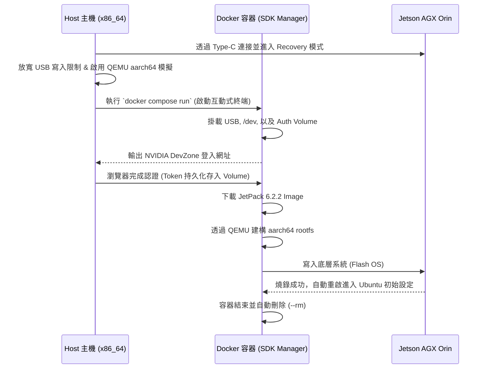

# Jetson AGX Orin (JetPack 6.2.2) 終極 Docker 刷機指南

本文件紀錄如何使用 NVIDIA 官方 `sdkmanager` Docker 映像檔，透過 CLI 與 Docker Compose，為 Jetson AGX Orin 進行底層系統 (Jetson OS / L4T) 燒錄。

此方案經過底層參數最佳化，可確保互動式登入 (TTY) 正常顯示、自動記憶開發者帳號憑證，並避開常見的 USB 傳輸瓶頸與跨架構編譯錯誤。

---

## 1. 核心概念與系統互動流程

刷機過程中，Host 主機、Docker 容器與 Jetson 硬體之間的互動流程如下：



---

## 2. 刷機前置作業：Host 端必做設定

在啟動 Docker 容器前，Host 主機必須完成以下環境設定，否則必定會在建構檔案系統或寫入硬體時報錯。

### 2.1 安裝跨架構模擬器 (解決 Exec format error)
Docker 運行在 x86_64 主機上，但在打包 Jetson 系統時需要模擬 aarch64 環境來生成 rootfs。若未安裝，會在 File System 階段崩潰。
```bash
sudo apt-get update
sudo apt-get install qemu-user-static binfmt-support
sudo update-binfmts --enable
```

### 2.2 解除 USB 寫入瓶頸與休眠限制 (解決 timeout in USB write)
在傳送大型 rootfs/blob 鏡像時，Linux 主機常會因預設緩衝區過小而引發斷線。請強制拉高緩衝區並關閉 USB 休眠：
```bash
# 1. 將 USB 檔案系統的記憶體緩衝區從預設的 16MB 加大至 2GB
echo 2048 | sudo tee /sys/module/usbcore/parameters/usbfs_memory_mb

# 2. 停用 USB 自動休眠機制
echo -1 | sudo tee /sys/module/usbcore/parameters/autosuspend
```

---

## 3. Docker Compose 完整配置

請在工作目錄下建立 `docker-compose.yml`。

**架構設計重點說明：**
1. **摒棄 ipc: host**：遵從 NVIDIA 官方最新手冊，標準刷機不需要開啟 IPC 直通，確保環境隔離。
2. **獨立 Volume 儲存認證**：透過 `sdkm_auth_data` 保存 Token，搭配 `--stay-logged-in true`，實現未來刷機免登入。
3. **正確的版本號映射**：CLI 要求的 `--version` 為 JetPack 版本 (6.2.2)，而非底層 L4T 版本 (36.5)。

```yaml
version: '3.8'

services:
  jetson-flasher:
    image: sdkmanager:latest  # 請確保此名稱與你 docker images 中的官方鏡像一致
    network_mode: host
    privileged: true          # 允許容器進行核心層級操作 (必備)
    stdin_open: true          # 對應 -i，開啟標準輸入以接收互動
    tty: true                 # 對應 -t，分配虛擬終端機顯示網址
    volumes:
      # --- 硬體與設備掛載區 ---
      - /dev/bus/usb:/dev/bus/usb/           # 處理 Recovery 模式下 USB 的頻繁斷連與重抓
      - /dev:/dev                            # 解決 flash.sh 執行 losetup 建立 loop 裝置時的權限報錯
      - /media/${USER}:/media/nvidia:slave   # 官方強制要求，處理主機端媒體層級掛載
      
      # --- 檔案與設定保留區 ---
      - ./sdkm_downloads:/home/nvidia/Downloads # 快取目錄，避免刷機失敗時需重新下載數 GB 檔案
      - sdkm_auth_data:/home/nvidia/.nvsdkm     # 獨立 Volume：保留登入 Token，免去反覆認證
      
    # --- 執行指令與刷機參數 ---
    command: >
      --cli
      --action install
      --login-type devzone
      --product Jetson
      --version 6.2.2                  # 指定的 JetPack 版本 (對應 L4T 36.x 最新版)
      --target-os Linux
      --target JETSON_AGX_ORIN_TARGETS # 指定硬體目標 (若為 Xavier 則改為 JETSON_AGX_XAVIER_TARGETS)
      --select 'Jetson OS'             # 僅燒錄系統，將 SDK 留在開機後透過 apt 安裝最為穩定
      --deselect 'Jetson SDK Components'
      --flash all
      --license accept
      --stay-logged-in true            # 搭配獨立 Volume，實現二次啟動自動登入
      --exit-on-finish

# 宣告獨立的 Docker Volume 以保存 NVIDIA 開發者帳號認證資料
volumes:
  sdkm_auth_data:
```

---

## 4. 執行與燒錄步驟

### 步驟 1：進入 Recovery 模式
1. 使用 Type-C 線連接 Jetson 的 Recovery 燒錄孔與 Host 主機。
2. 按住 Jetson 上的 **Recovery 鍵** 不放。
3. 接著按下 **Power 鍵** (或直接插上電源)，隨後放開 Recovery 鍵。
4. 在 Host 端輸入 `lsusb`，確認是否有看到 `NVIDIA Corp.` 的裝置。

### 步驟 2：啟動互動式容器 (絕不可用 up)
> ⚠️ **致命錯誤預警**：絕對不能使用 `docker compose up`，因為 `up` 會多路復用 stdout/stderr，導致 TTY 互動失效，你會完全看不到登入網址。

請在 `docker-compose.yml` 所在目錄，執行以下指令：
```bash
docker compose run --rm jetson-flasher
```
*(加上 `--rm` 可確保刷機結束後容器自動回收，不殘留垃圾，因重要資料已由 Volume 保存)*

### 步驟 3：完成開發者帳號認證
第一次啟動時，終端機會暫停並輸出如下提示：
```text
Please open the following URL in a browser to complete your login:
[https://developer.nvidia.com/device-login](https://developer.nvidia.com/device-login)?...
```
請複製該網址至瀏覽器完成登入。驗證成功後，回到終端機，SDK Manager 就會自動接手後續的下載、rootfs 建構與硬體寫入流程。
*(註：未來若再次執行此環境，由於 Token 已存於 Volume，此步驟會自動跳過。)*

### 步驟 4：後續 SDK 安裝 (本機端處理)
當系統燒錄完成（顯示 Flash Process Successfully）且 Jetson 重新開機後：
1. 接上螢幕與鍵盤，完成 Ubuntu 的首次開機 OEM 設定（建立帳號密碼）。
2. 連上網路，打開 Jetson 本機終端機。
3. 直接透過 `apt` 安裝 CUDA、TensorRT 等完整套件（此作法最不易出錯）：
```bash
sudo apt update
sudo apt install nvidia-jetpack
```