# CAN 協定與 SocketCAN 完整指南

> [!NOTE] 適用範圍
> 本指南內容為**平台無關**的通用知識，適用於任何 Linux 系統（x86 PC、樹莓派、Jetson、Rockchip 等嵌入式平台）。
> 若你在 **NVIDIA Jetson** 平台上驗證 CAN，請搭配閱讀 [[Jetson mttcan CAN 驗證指南]]，該文件涵蓋 mttcan 驅動、Device Tree 與平台特定注意事項。

---

## 1. CAN 是什麼？

CAN（**Controller Area Network**，控制器區域網路）是 Robert Bosch 於 1980 年代為汽車內部通訊所設計的**多主機差動式序列匯流排**。如今已廣泛應用於汽車、工業自動化、醫療設備、機器人等領域。

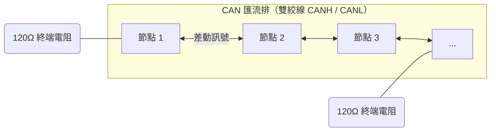

### 1.1 CAN 的關鍵特性

| 特性 | 說明 |
|------|------|
| **多主機（Multi-master）** | 任何節點都能主動發送，沒有主從之分 |
| **差動訊號** | 抗雜訊能力強，適合車載/工業環境 |
| **非破壞性仲裁** | ID 小的優先，仲裁過程不中斷任何幀 |
| **內建錯誤偵測** | CRC、ACK、位元監聽，故障節點自動隔離 |
| **傳輸距離長** | 1Mbps 可達 40m，10kbps 可達 1km 以上 |
| **成本低** | 兩條絞線即可組成匯流排 |

### 1.2 CAN 的版本與演進

| 版本 | 識別碼長度 | 資料長度 | 資料速率 | 說明 |
|------|-----------|---------|---------|------|
| **CAN 2.0A**（標準幀） | 11-bit | 0–8 bytes | 最高 1 Mbps | 最常見的基礎協定 |
| **CAN 2.0B**（擴充幀） | 29-bit | 0–8 bytes | 最高 1 Mbps | 用於 J1939、CANopen 等工業協定 |
| **CAN FD**（ISO 11898-1:2015） | 11 或 29-bit | 0–64 bytes | 資料段最高 8 Mbps | Flexible Data-rate，仲裁段仍為經典速率 |

> [!WARNING] 相容性
> CAN 2.0 節點無法理解 CAN FD 幀，但 **CAN FD 控制器都向下相容 CAN 2.0**。混用時需注意實體層位元率（仲裁段）必須一致。

---

## 2. 協定基礎：幀格式、仲裁與位元時序

### 2.1 資料幀（Data Frame）結構

標準資料幀（CAN 2.0A）的結構如下：

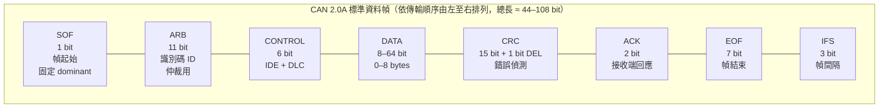

| 欄位                        | 位元數   | 說明                              |
| ------------------------- | ----- | ------------------------------- |
| **SOF**（Start of Frame）   | 1     | 幀起始，固定 dominant（0）              |
| **ARB**（Arbitration）      | 11/29 | 識別碼（ID），決定優先權                   |
| **DLC**（Data Length Code） | 4     | 資料長度（0–8，CAN FD 為 0–64）         |
| **DATA**                  | 0–64  | 資料內容                            |
| **CRC**                   | 15/17 | 循環冗餘檢查，偵測傳輸錯誤                   |
| **ACK**                   | 2     | 接收端必須回應（ACK slot），這是驗證「有人收到」的關鍵 |
| **EOF / IFS**             | 7/3   | 幀結束與間隔                          |

### 2.2 仲裁機制（Arbitration）

CAN 是**非破壞性仲裁**：所有節點同時發送時，ID 最小的節點獲勝。

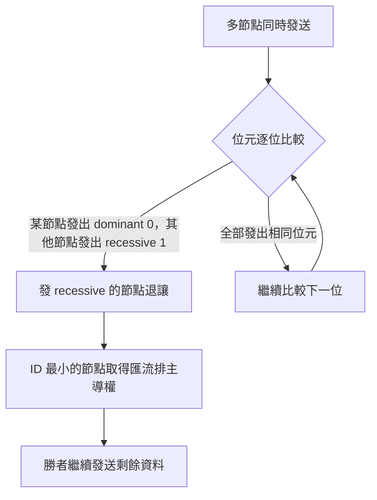

> [!TIP] 實用意義
> ID 不只是位址，更是**優先權**。數值越小，優先權越高。車載系統常將煞車、安全氣囊等關鍵訊息放在低 ID。

### 2.3 位元率與位元時序（Bit Timing）

CAN 的時序以「時間量子（Time Quantum, Tq）」為單位，一個位元由四個區段組成：

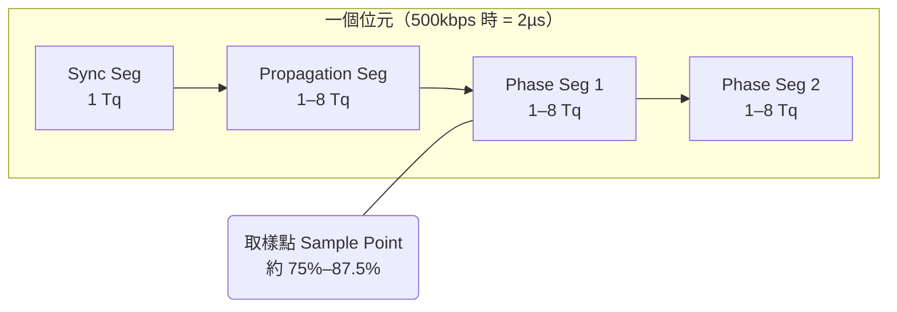

- **Sync Seg**：同步起點
- **Propagation Seg**：補償線路傳播延遲
- **Phase Seg 1 + Phase Seg 2**：取樣點落在兩者之間
- **取樣點（Sample Point）**：最常見配置為 **80%（如 500kbps：Sync 1 + Prop 1 + PS1 6 + PS2 2 = 10 Tq）**

> [!WARNING] 同網段所有節點位元率必須完全一致
> 位元率或取樣點不一致是最常見的實體連接失敗原因，症狀是「全部是錯誤幀、收不到任何有效資料」。

### 2.4 上層協定簡介

CAN 只定義底層傳輸，實際應用由上層協定定義訊號語意：

| 協定 | 應用領域 | 特點 |
|------|---------|------|
| **J1939**（SAE J1939） | 重型車輛、農機、船舶 | 29-bit ID，PGN（參數群編號）+ SA（源位址） |
| **CANopen**（CiA 301/402） | 工業自動化 | 物件字典、SDO/PDO、NMT 狀態機 |
| **UDS**（ISO 14229） | 車載診斷 | 診斷服務（讀故障碼、韌體更新），搭配 ISO-TP |
| **XCP** | 量測與標定 | ECU 開發時的量測/校準協定 |
| **UAVCAN / DroneCAN** | 無人機 | 輕量、支援節點即插即用 |

> [!NOTE] SocketCAN 支援
> Linux 核心已內建 `can-j1939` 與 `can-isotp` 模組，可直接用 socket 開發 J1939 與 ISO-TP 應用，無需第三方套件。

---

## 3. 實體層（Physical Layer）

### 3.1 差動訊號

CAN 使用兩條線（CANH / CANL）傳送**差動電壓**：

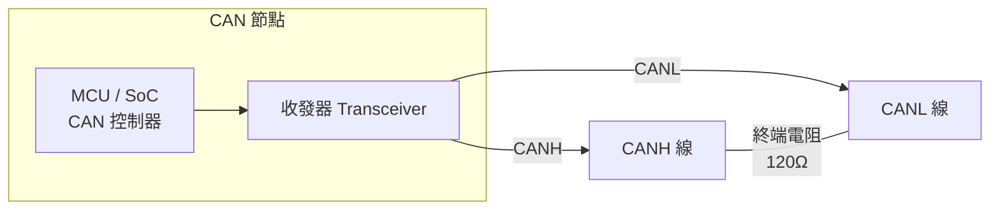

| 狀態 | CANH | CANL | 差動電壓（CANH−CANL） |
|------|------|------|----------------------|
| **Recessive（隱性，邏輯 1）** | ≈2.5V | ≈2.5V | ≈0V |
| **Dominant（顯性，邏輯 0）** | ≈3.5V | ≈1.5V | ≈2V |

- **隱性**是「沒有人驅動」的狀態；**顯性**是「有人驅動」的狀態
- 任何節點都能把匯流排拉成顯性，這正是仲裁與 ACK 的基礎

### 3.2 終端電阻（Termination）

**匯流排兩端**各需一個 **120Ω** 電阻（總等效 60Ω）：

> [!CAUTION] 終端電阻錯誤的後果
> - **沒有終端電阻**：訊號反射導致位元錯誤，短距離可能仍可運作但不可靠
> - **過多終端電阻**：總阻抗過低，驅動電流不足，無法正確傳輸
> - 設計好的載板常已內建 120Ω（可跳線啟用），**外接前務必確認是否重複並聯**

### 3.3 收發器（Transceiver）

控制器輸出的是 TTL 數位訊號，**必須透過收發器**轉為差動訊號：

| 型號 | 速率 | 電源 | 備註 |
|------|------|------|------|
| TJA1044 | 5 Mbps（CAN FD） | 3.3V/5V | 現代設計首選 |
| TJA1051 | 5 Mbps（CAN FD） | 3.3V/5V | 效能近似 1044 |
| MCP2551 | 1 Mbps（僅 CAN 2.0） | 5V | 老牌、便宜，不支援 CAN FD |
| SN65HVD230 | 1 Mbps（CAN 2.0） | 3.3V | 常見於 Arduino/STM32 模組 |

### 3.4 接線規範

- 使用**雙絞線**（Twisted Pair），絞距越密抗干擾越好
- 拓樸：**菊花鏈（Daisy-chain）**，避免星形/樹狀分支
- **共地**：所有節點 GND 必須相連，否則差動訊號漂移（最常被忽略！）
- 速率與線長關係：1Mbps ≤ 40m、500kbps ≤ 100m、250kbps ≤ 250m、125kbps ≤ 500m

---

## 4. Linux SocketCAN 架構

### 4.1 架構總覽

SocketCAN 是 Linux 核心的標準 CAN 子系統，把 CAN 當成「第二個網路」來使用：

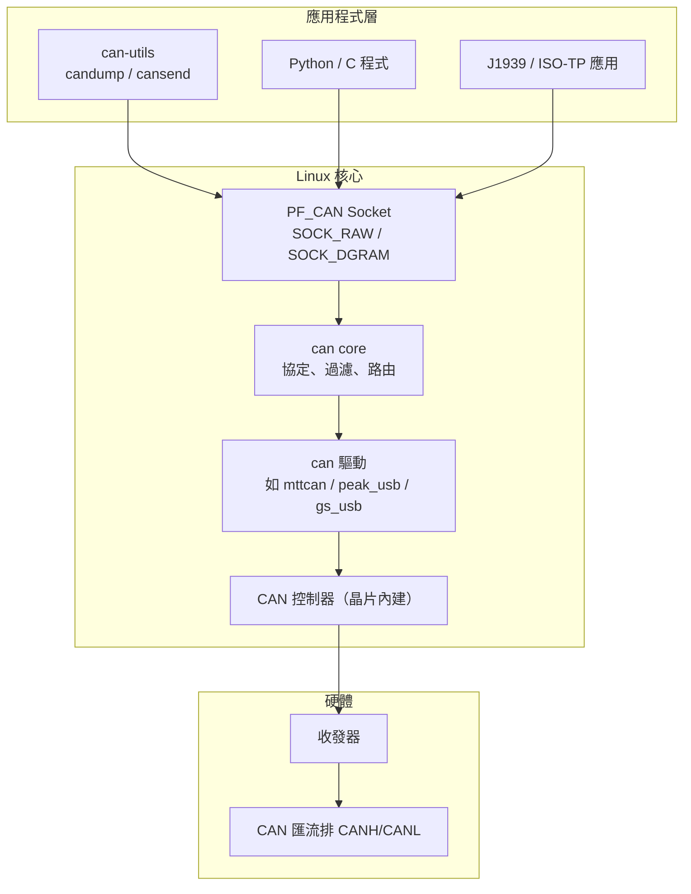

### 4.2 核心模組與配置

```bash
# 確認核心支援 CAN 子系統（Jetson / 一般 Linux 皆適用）
zcat /proc/config.gz | grep -i "^CONFIG_CAN"

# 預期至少看到：
# CONFIG_CAN=y              # CAN 子系統
# CONFIG_CAN_RAW=y          # raw socket
# CONFIG_CAN_BCM=y          # broadcast manager
# CONFIG_CAN_DEV=y          # 驅動框架
```

常見可選模組：

| 模組 | 功能 | 載入指令 |
|------|------|---------|
| `can-isotp` | ISO-TP（UDS 傳輸層） | `sudo modprobe can-isotp` |
| `can-j1939` | J1939 協定 | `sudo modprobe can-j1939` |
| `can-gw` | CAN 閘道（封包轉發） | `sudo modprobe can-gw` |
| `vcan` | 虛擬 CAN（無硬體測試） | `sudo modprobe vcan` |
| `slcan` | 序列埠 CAN 轉接 | `sudo modprobe slcan` |

### 4.3 安裝工具（can-utils）

```bash
# Ubuntu / Debian（Jetson L4T 亦同）
sudo apt update
sudo apt install can-utils
```

> [!NOTE] can-utils 常用工具一覽
> `candump`（監聽）、`cansend`（單次發送）、`cangen`（亂數產生）、`canfdtest`（回環測試）、`cangw`（閘道）、`candump -l`（記錄到檔案）、`canbusload`（匯流排使用率）

### 4.4 介面啟動與基本操作

```bash
# 啟動 CAN 介面（標準速率 500kbps）
sudo ip link set can0 up type can bitrate 500000

# 啟動 CAN FD 介面（仲裁段 500k、資料段 2M）
sudo ip link set can0 up type can bitrate 500000 dbitrate 2000000 fd on

# 查看介面狀態（含位元率、錯誤計數）
ip -details -statistics link show can0

# 關閉介面
sudo ip link set can0 down
```

#### 4.4.1 自動復原（restart-ms）

```bash
# 啟動介面並設定「進入 bus-off 後每 100ms 自動嘗試重啟」
sudo ip link set can0 up type can bitrate 500000 restart-ms 100

# 確認方式（輸出中可看到 restart-ms 100）
ip -details -statistics link show can0
```

> [!IMPORTANT] 防止「一次錯誤就進 BUS-OFF 站不起來」
> 未設定 restart-ms 時，bus-off 後必須等匯流排上出現 128 次連續 recessive 才能自復原；若故障一直存在（短路、拔線、網路上只有單一節點收不到 ACK 等），節點會**從此退出匯流排**。`restart-ms` 讓驅動主動重啟控制器，是降低「神秘斷線」的關鍵設定。完整狀態機說明見第 7 章。

#### 4.4.2 啟動前檢查 pinmux 腳位功能

```bash
# 檢查 CAN 腳位是否已被 pinmux 分配到 CAN 功能（需 root）
cat /sys/kernel/debug/pinctrl/*/pinmux-pins | grep -i can
```

- **有輸出**：腳位已配置為 CAN 功能（行動格式因 SoC 而異，搜尋到的行含 function/group 資訊），可正常啟動介面
- **無輸出**：CAN 功能未啟用，可能原因：
  - Device Tree 未啟用 CAN 節點或未配置 pinctrl group → 檢查 DTB（見 [[Device Tree Override 完整指南]]，NVIDIA 平台見 [[Jetson mttcan CAN 驗證指南]]）
  - debugfs 未掛載或核心未編譯 `CONFIG_DEBUG_FS`（先確認 `/sys/kernel/debug/` 存在）
  - 腳位被其他功能佔用 → 見 [[如何利用 pinctrl 動態變更 gpio alternative function]]

> [!NOTE] 輸出格式隨 SoC 不同
> `pinmux-pins` 的行格式與 function 命名由各 SoC 的 pinctrl 驅動決定，`grep -i can` 也可能撈到其他含 "can" 字串的名稱，請依輸出內容判斷實際配置。

```bash
# 發送一幀：ID 0x123，資料 DE AD BE EF
cansend can0 123#DEADBEEF

# 發送 CAN FD 幀（超過 8 bytes 即為 FD 幀）
cansend can0 123##0DEADBEEF010203040506070809

# 監聽所有封包
candump can0

# 監聽並過濾：只收 ID 0x123（遮罩全比較）
candump can0,123:7FF

# 只收擴充 ID（29-bit）
candump can0 -x
```

> [!TIP] cansend / candump 語法速記
> - `can_id#data`：如 `123#DEADBEEF`
> - `can_id##0data` 或 `can_id##1data`：CAN FD 幀（`##0` 為 BRS 開、`##1` 為 BRS 關）
> - `candump can0,ID:mask`：mask 中 1 的位元才比較；`123:7FF` 代表 11-bit ID 全比較

### 4.5 虛擬 CAN（VCAN）— 沒有硬體也能測

```bash
# 建立虛擬 CAN 介面（完全繞過硬體）
sudo modprobe vcan
sudo ip link add dev vcan0 type vcan
sudo ip link set vcan0 up

# 之後所有 can-utils 指令都能用在 vcan0 上
cansend vcan0 123#DEADBEEF
candump vcan0
```

> [!TIP] 使用場景
> VCAN 適合驗證**應用程式邏輯**（過濾、解析、記錄），但**不能驗證硬體與實體層**。開發 CAN 應用時先跑 VCAN 是最高效的做法。

---

## 5. 驗證方法一：Loopback 測試

### 5.1 內部回環 vs 外部回環（先讀這個！）

SocketCAN 的 `loopback on` 是**控制器內部回環（Internal Loopback）**：

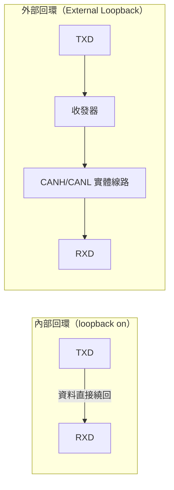

> [!IMPORTANT] 關鍵結論
> **內部回環時，實體線路上完全沒有訊號！** 示波器量不到任何波形，因為資料在控制器內部就繞回 RX 了。內部回環只驗證「控制器 + 驅動 + SocketCAN 軟體層」是否正常。
> 若要量測實體波形，請使用**實體直接測試**（第 6 章）。

### 5.2 內部回環測試指令

```bash
# 啟動 loopback 模式（mttcan / 大部分控制器支援）
sudo ip link set can0 up type can bitrate 500000 loopback on

# 確認狀態（應顯示 loopback on）
ip -details link show can0

# 發送與接收一體：canfdtest 自動發送並檢查回環幀
canfdtest can0

# 或手動：開兩個終端
# 終端 1
candump can0
# 終端 2
cansend can0 123#DEADBEEF
# 終端 1 應看到 123#DEADBEEF

# 壓力回環測試
canfdtest can0 -g       # 產生器模式，連續發送並比對
```

> [!NOTE] canfdtest 回報「0 frames lost」代表回環正常
> canfdtest 會產生序號幀並驗證，任何一幀丟失都會回報 lost，是快速確認控制器健康度的好工具。

---

## 6. 驗證方法二：實體直接測試（完整教學）

這是**真正驗證實體層**的測試：訊號實際走上 CANH/CANL，可用示波器量測，也是與其他 ECU/設備對接前的必做流程。

### 6.1 硬體準備

你的 Jetson（或任何 Linux 板）需要**一個實體對測對象**，常見選項：

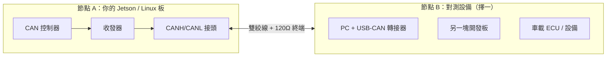

| 對測設備 | 優點 | Linux 驅動 |
|---------|------|-----------|
| **PCAN-USB**（Peak 系列） | 品質穩定、文件齊全 | 內建 `peak_usb`，即插即用 |
| **canable / candlelight / CANtact**（GS-USB 相容） | 便宜（幾百元）、開放源碼 | 內建 `gs_usb` |
| **周立功 USB-CAN**（CANalyst-II） | 台灣/中國市場常見 | 需廠商驅動，內建無支援 |
| **另一塊 Linux 開發板** | 兩端都用 can-utils，最對稱 | 視晶片而定 |

```bash
# PCAN-USB 接上後
sudo modprobe peak_usb
dmesg | grep -i peak       # 應看到 peak_usb 註冊 can0/can1

# canable / GS-USB 相容設備接上後
sudo modprobe gs_usb
dmesg | grep -i gs_usb

# 確認介面出現
ip link show                # 應看到 can0（PCAN 通常給 can0，GS-USB 給 can0/can1）
```

> [!TIP] PCAN-USB 注意
> 多數 PCAN-USB 裝置在 Linux 上會顯示為 **兩個介面（can0、can1）**，其中一個是實體通道、一個是記錄通道。確認實體通道可看 `ip -details link show can0` 是否含 `peak_pci`/`peak_usb` 資訊。

### 6.2 接線與共地

| 接線項目 | 做法 |
|---------|------|
| CANH | 節點 A 的 CANH ↔ 節點 B 的 CANH |
| CANL | 節點 A 的 CANL ↔ 節點 B 的 CANL |
| **GND** | **兩邊必須共地**（差動訊號仍需要參考電位，不接地會漂移） |
| 120Ω 終端 | 匯流排兩端各一個（若轉接器或載板已內建則不需再加） |

> [!CAUTION] 檢查清單
> 1. 兩端位元率設定一致
> 2. GND 已相連
> 3. 終端電阻正確（量測 CANH-CANL 直流阻抗應約 60Ω，包含兩端各 120Ω 並聯）
> 4. CANH/CANL **沒有對調**

### 6.3 雙節點收發測試（最基礎）

```bash
# ==== 節點 A（例如 Jetson）====
sudo ip link set can0 up type can bitrate 500000
candump can0                  # 監聽模式

# ==== 節點 B（例如 PC + PCAN-USB）====
sudo ip link set can0 up type can bitrate 500000
cansend can0 123#DEADBEEF     # 發送一幀

# 節點 A 終端應看到：can0  123   [8]  DE AD BE EF 00 00 00 00

# 反方向驗證
# 節點 A 發送
cansend can0 456#01020304
# 節點 B 終端應看到：can0  456   [4]  01 02 03 04
```

> [!TIP] 確認「真的有人收到」的關鍵
> CAN 的 ACK slot 由接收端回應。若**沒有其他節點**在網路上，發送端會看到 **ACK error**（錯誤幀）。若 `cansend` 後 `candump` 卻看不到幀，或 `ip -s link show can0` 的 TX error 遞增，代表對端根本沒收到。

### 6.4 自動化對測（流量 + 記錄 + 比對）

手動測試不夠，用 `cangen` 產生大量流量做完整性驗證：

```bash
# ==== 節點 B：產生 1000 幀流量（每 10ms 一幀）====
cangen can0 -g 10 -n 1000 -I 123# -L 8

# ==== 節點 A：接收並統計 ====
candump can0 | wc -l                 # 應等於 1000
```

進階：帶序號的連續幀，接收端檢查有無漏幀：

```bash
# 節點 B：產生序號幀（-i 讓資料含遞增計數器）
cangen can0 -g 5 -n 5000 -I 321# -L 8 -i -v

# 節點 A：記錄到檔案後比對
candump can0 -l -f /tmp/rx.log -n 5000
grep -c "321" /tmp/rx.log            # 應為 5000
```

> [!NOTE] `-i` 說明
> `cangen -i` 會把資料區填入**遞增計數器**，接收端可用 `candump -T`（hex 顯示）檢查序號是否連續，藉此判斷有無丟幀。

### 6.5 位元率一致性驗證

```bash
# 兩端各執行一次，比對輸出
ip -details link show can0

# 重點欄位：
#   bitrate 500000                  ← 兩端必須相同
#   sample-point 0.800              ← 建議一致
#   tq 100, prop-seg 1, phase-seg1 6, phase-seg2 2, sjw 1   ← 可對照
```

### 6.6 示波器量測（驗證實體訊號）

這是唯一能**親眼確認實體層**的方法：

**量測點設置**

| 探棒 | 接法 |
|------|------|
| 通道 1 | CANH 對 GND |
| 通道 2 | CANL 對 GND |
| 數學通道（CH1−CH2） | 差動波形（最推薦） |
| 或差動探棒 | CANH–CANL |

**參數設定**（以 500kbps 為例）

- 時基：**1 µs/div**（1 bit = 2 µs，一格可看 10 bits）
- 觸發：通道 1 上升緣，電平 2.5V
- 單次觸發，同時讓對端 `cansend can0 123#DEADBEEF`

**預期波形**

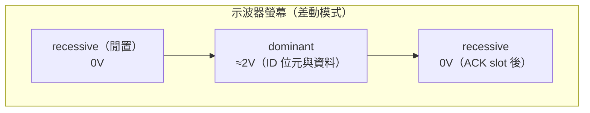

| 訊號 | 預期值 |
|------|--------|
| 閒置（recessive）差動 | ≈0V |
| 顯性（dominant）差動 | ≈2V（實務上 1.5–3V 皆可） |
| 單一 bit 寬度 | 500kbps → 2µs；1Mbps → 1µs |
| ACK slot | 發送節點在 ACK slot 前的位元是 recessive，收到對端 ACK（dominant）後才完成 |

> [!TIP] 波形判讀要點
> - 看 SOF（第一個下降緣）之前是否乾淨無雜訊
> - 量 10 bit 寬度推算實際位元率（與設定值誤差應 <1%）
> - ACK slot 之後若沒有出現錯誤幀（多餘脈波），代表對端有回應

### 6.7 錯誤與故障注入測試

驗證「壞情況」能正常偵測與恢復，才是完整驗證：

**測試 A：拔掉一端終端電阻**

```bash
# 監看錯誤計數
watch -n 1 'ip -s -d link show can0'

# 對端持續發送
cangen can0 -g 50

# 觀察：RX error / TX error 遞增，並出現錯誤幀（candump 的 -t d 可顯示）
candump can0 -t d can0,0~0,#FFFFFFFF
```

**測試 B：位元率不匹配**

```bash
# 節點 A：500k；節點 B：改為 250k 再發送
# 結果：A 端出現大量錯誤幀、正確幀幾乎為零 → 驗證位元率敏感度
```

**測試 C：CANH / CANL 反接**

```bash
# 對調兩條線後再發送
# 結果：完全收不到任何幀 → 確認接線正確性
```

**測試 D：Bus-off 觀察與恢復**

```bash
# 造成大量錯誤（例如拔線後對端持續發送）後：
ip -details link show can0     # state 若為 bus-off
# 手動恢復
sudo ip link set can0 down
sudo ip link set can0 up type can bitrate 500000
```

> [!IMPORTANT] Bus-off 知識
> 控制器連續錯誤超過 256 次會進入 **bus-off**，此時該節點完全退出匯流排（不參與任何訊號）。多數控制器需「監聽匯流排上 128 次連續 11-bit recessive」才自動恢復，或由驅動/使用者手動重啟。這是車載系統中最常見的「神秘斷線」原因。
> 完整狀態轉換（ERROR-ACTIVE / ERROR-PASSIVE / BUS-OFF / STOPPED）與自動恢復設定，見第 7 章「CAN 錯誤狀態機與應對方式」。

### 6.8 CAN FD 實體測試

```bash
# 兩端都需支援 CAN FD 並設定 fd on
sudo ip link set can0 up type can bitrate 500000 dbitrate 2000000 fd on

# 檢查狀態
ip -details link show can0      # 應顯示 "fd on"

# canfdtest 支援 FD 模式：發送 FD 幀（64 bytes）做完整回環驗證
canfdtest can0
```

> [!NOTE] 若不支援 CAN FD
> 任一端僅支援 CAN 2.0 時，混合網路上 CAN FD 幀會被視為錯誤。實務上車載混網會使用 `fd off` 並統一 1Mbps 以下。

### 6.9 壓力測試

```bash
# 節點 B：最大速率持續產生流量（100ms 間隔的 100k 幀）
cangen can0 -g 0 -n 100000      # -g 0 = 盡量快（受驅動限制）

# 節點 A：接收記錄並比對數量
candump can0 -l -n 100000
# 完成後：
grep -c "can0" /tmp/ 記錄檔       # 應接近 100000（CAN 本身不丟幀，若有遺漏要查實體層）
```

### 6.10 ISO-TP / 上層協定測試

如果需要與 ECU 做 UDS 診斷或 J1939 通訊：

```bash
# ISO-TP（UDS 用）
sudo modprobe can-isotp
ip link set can0 up type can bitrate 500000

# 建立 ISO-TP 連線（source:destination 皆為 11-bit ID）
sudo ip link add link can0 type can_isotp tx-id 0x7E0 rx-id 0x7E8

# 用 socket 發送多幀診斷請求（此處以 Python 範例說明，見第 9 章）
```

---

## 7. CAN 錯誤狀態機與應對方式

CAN 節點內部由**兩組錯誤計數器（TEC / REC）**驅動狀態機，計數值隨錯誤自動增減，狀態決定節點是否還能參與匯流排。理解這個狀態機，才能正確診斷「為什麼突然收不到資料」。

### 7.1 五種狀態定義

| 狀態 | 觸發條件 | 節點行為 | 對開發者的意義 |
|------|----------|----------|----------------|
| **ERROR-ACTIVE** | 預設狀態 | 完全參與匯流排，可發出**主動錯誤幀** | 正常運作 |
| **ERROR-WARNING** | TEC 或 REC ≥ 96 | 核心標記警示（`CAN_STATE_ERROR_WARNING`） | 開始留意錯誤 |
| **ERROR-PASSIVE** | TEC > 127 或 REC > 127 | 只能發送**被動錯誤幀**，不能干擾匯流排 | 實體層已有問題 |
| **BUS-OFF** | TEC > 255 | 完全退出匯流排，不發送也不監聽 | 節點「消失」 |
| **STOPPED** | `ip link set can0 down` | 控制器停止運作（link down） | 介面未啟動 |

> [!NOTE] 計數器口徑
> - **TEC**：傳送錯誤計數（Transmit Error Counter）
> - **REC**：接收錯誤計數（Receive Error Counter）
> - **bus-off 只由 TEC 觸發**（> 255）；REC 高只會達到 ERROR-PASSIVE，不會造成 bus-off
> - 計數器會隨成功傳輸/接收**自動遞減**，因此電氣問題若能解決，狀態可自行退回前級（如 ERROR-PASSIVE → ERROR-ACTIVE）

### 7.2 狀態轉換（mermaid）

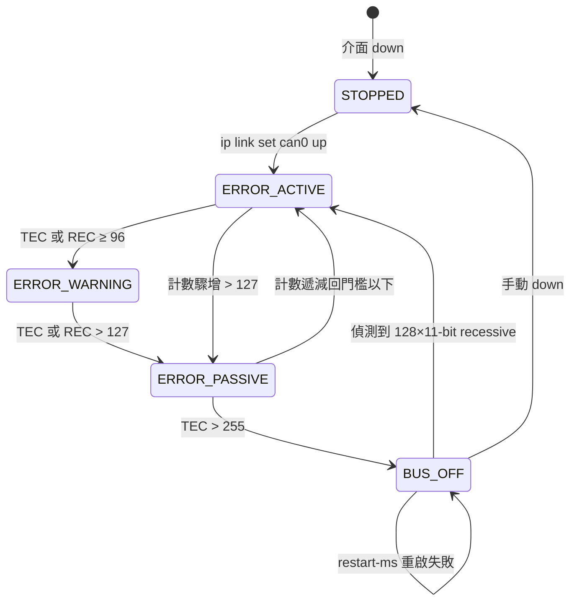

### 7.3 觀察工具

```bash
# 即時觀察：can state、錯誤計數器、restart-ms、bus-off 累積次數
ip -details -statistics link show can0

# 重點欄位示意：
# can state BUS-OFF (berr-counter tx 0 rx 0) restart-ms 100
# 下方 statistics 區含 bus-off: 1（已發生的累積次數）
```

### 7.4 應對方式

| 情境 | 應對方式 |
|------|----------|
| **預防（啟動時）** | up 時指定 `restart-ms 100`，bus-off 後自動重啟（見 4.4.1 節） |
| **自動恢復** | restart-ms 生效時，驅動每指定毫秒嘗試重啟控制器，無需人工介入 |
| **手動恢復** | `sudo ip link set can0 down && sudo ip link set can0 up type can bitrate 500000` |
| **狀態卡在 ERROR-PASSIVE / 反覆 BUS-OFF** | 實體層持續有問題 → 檢查位元率一致性、終端電阻、共地、線材與 pinmux（見第 8 章除錯對照表） |

> [!WARNING] 為何一定要設定 restart-ms
> 未設定時，節點進 bus-off 後必須等匯流排上出現 **128 次連續 11-bit recessive** 才能自我恢復。若線路短路、斷線或對端持續送上錯誤，該條件永遠不成立，節點就**永久消失**在匯流排上——這是車載系統最常見的「神秘斷線」原因。設定 `restart-ms` 後，驅動會直接嘗試重啟控制器，而非坐等匯流排恢復乾淨。

> [!TIP] 關聯知識
> - 實體故障注入與 bus-off 觀察實作：見 6.7 節「錯誤與故障注入測試」
> - NVIDIA Jetson 平台驗證：[[Jetson mttcan CAN 驗證指南]]

---

## 8. 除錯知識：症狀與原因對照

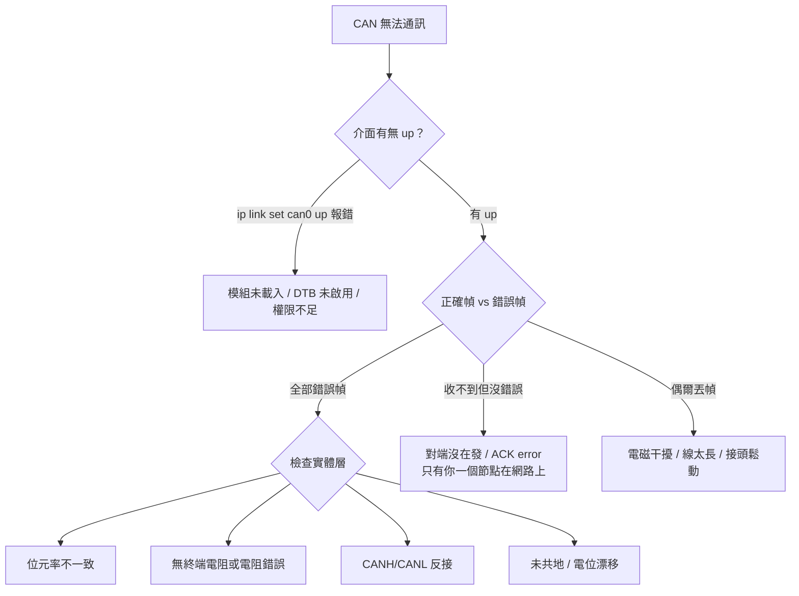

| 症狀 | 可能原因 | 確認方式 |
|------|---------|---------|
| `ip link set can0 up` 顯示 `Operation not permitted` | 無 root / SELinux | 加 `sudo`、`sudo dmesg` |
| `ip link set can0 up` 顯示 `No such device` | 驅動未載入、DTB 未啟用 | `dmesg \| grep -i can`、`ls /sys/class/net/` |
| 發送成功但 `candump` 看不到 | 只有自己一個節點（無 ACK） | 接上對端節點即可 |
| 全部是錯誤幀 | 位元率不一致 | 兩端 `ip -d link show` 比對 |
| 錯誤幀 + TX/RX error 遞增 | 無終端電阻 / 反接 / 未共地 | 量 CANH-CANL 阻抗約 60Ω |
| 偶發丟幀 | 干擾、線長、接頭 | 降低位元率、換遮蔽雙絞線 |
| `state bus-off` | 錯誤計數爆表；故障未解決會反覆進入 | 檢查實體層後 `down/up` 重啟（或用 restart-ms 自動恢復，見第 7 章） |
| 對端有設備卻收不到 | 對端沒 up 或不在發送 | `candump` 對端確認 |

---

## 9. 程式開發基礎

### 9.1 C 語言（原始 Socket 方式）

```c
#include <stdio.h>
#include <string.h>
#include <unistd.h>
#include <sys/socket.h>
#include <linux/can.h>
#include <linux/can/raw.h>
#include <net/if.h>
#include <sys/ioctl.h>

int main(void) {
    int s = socket(PF_CAN, SOCK_RAW, CAN_RAW);
    struct ifreq ifr = {0};
    strcpy(ifr.ifr_name, "can0");
    ioctl(s, SIOCGIFINDEX, &ifr);

    struct sockaddr_can addr = {0};
    addr.can_family = AF_CAN;
    addr.can_ifindex = ifr.ifr_ifindex;
    bind(s, (struct sockaddr *)&addr, sizeof(addr));

    struct can_frame frame = {0};
    frame.can_id = 0x123;               /* 11-bit ID */
    frame.can_dlc = 4;                  /* 資料長度 */
    frame.data[0] = 0xDE;
    frame.data[1] = 0xAD;
    frame.data[2] = 0xBE;
    frame.data[3] = 0xEF;
    write(s, &frame, sizeof(frame));    /* 發送 */

    read(s, &frame, sizeof(frame));     /* 接收 */
    printf("Received: ID=0x%03X len=%d\n", frame.can_id & CAN_EFF_MASK, frame.can_dlc);
    close(s);
    return 0;
}
```

### 9.2 Python（python-can，開發速度最快）

```bash
sudo pip install python-can
```

```python
import can

# 建立介面（Jetson / Linux 一般平台）
bus = can.Bus(interface='socketcan', channel='can0', bitrate=500000)

# 發送
msg = can.Message(arbitration_id=0x123, data=[0xDE, 0xAD, 0xBE, 0xEF], is_extended_id=False)
bus.send(msg)

# 接收（阻塞）
msg = bus.recv(timeout=1.0)
print(f"ID={hex(msg.arbitration_id)} data={msg.data.hex()}")

# 週期發送
task = bus.send_periodic(can.Message(arbitration_id=0x456, data=[1, 2, 3, 4]), period=0.1)
```

> [!TIP] python-can 除錯技巧
> `bus.recv(timeout=...)` 回傳 `None` 代表超時。搭配 `candump can0` 對照，可快速判斷是應用層問題還是實體層問題。

---

## 10. 驗證流程總覽（速查）

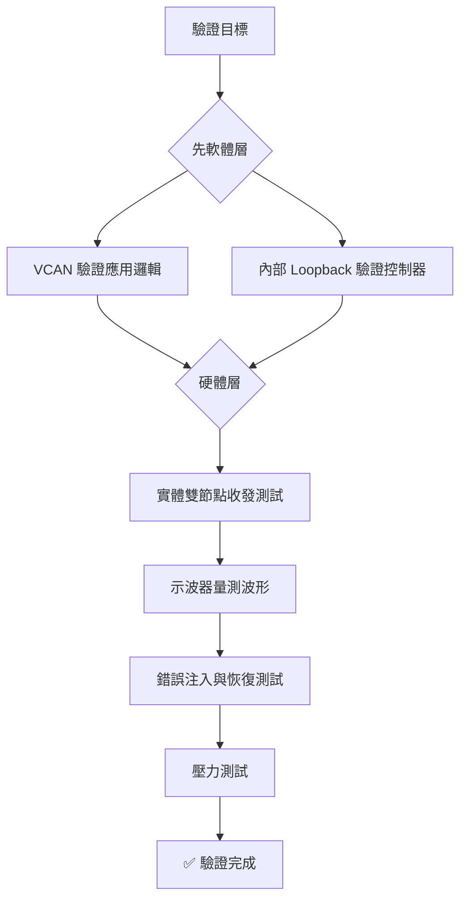

---

## 11. 相關文件

- [[Jetson mttcan CAN 驗證指南]] — NVIDIA Jetson 平台特定內容（mttcan 驅動、DTB、pinmux/Jetson-IO、收發器接線、平台注意事項）
- [[如何利用 pinctrl 動態變更 gpio alternative function]] — pinctrl / pinmux 腳位功能檢查與切換
- [[NVIDIA Jetson Device Tree Overlay (DTBO) 完整指南]] — Jetson 平台啟用硬體節點的方式
- [[Linux 系統 Serial Port (UART) 命名與綁定指南]] — 另一種常見序列介面的對照知識
- [[I3C-匯流排技術與Linux驅動架構]] — 嵌入式匯流排家族的其他成員
