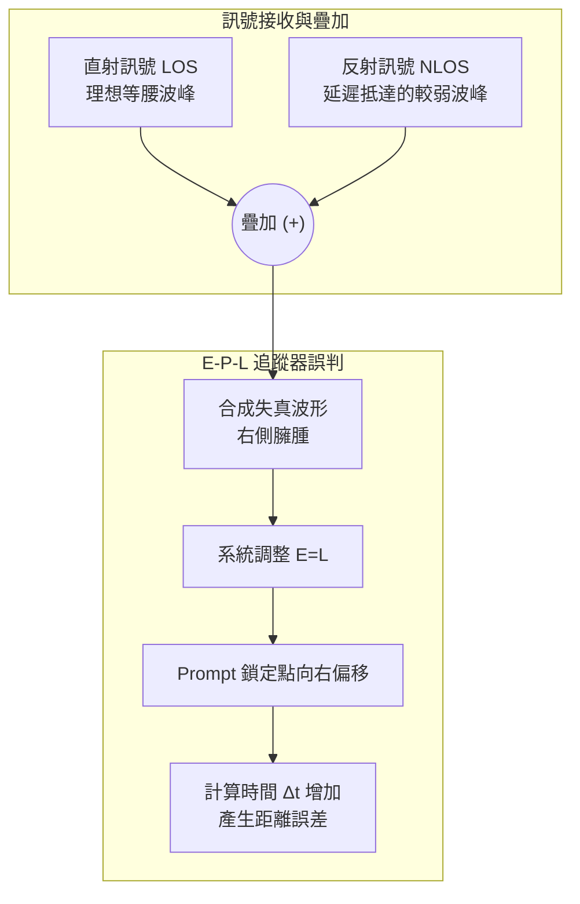

## 1. 核心測距原理：時間與偽距 (Pseudorange)

GPS 的本質並非測量角度（如傳統雷達），而是純粹的**時間與距離測量 (Trilateration)**。

### 1.1 飛行時間測量 ($\Delta t$)

GPS 衛星會持續廣播**偽隨機雜訊碼 (PRN, Pseudo-Random Noise)** 與包含極精確軌道參數的**星曆資料 (Ephemeris)**。

接收器（如手機或嵌入式模組）的底層 DSP 晶片會執行以下步驟：

1. **本地生成**：產生對應特定衛星的 PRN 碼。
    
2. **波形對齊 (Correlation)**：將本地 PRN 碼在時間軸上平移，直到與天線接收到的微弱衛星訊號達到最大相關性 (Correlation Peak)。
    
3. **計算時間**：平移的時間量即為訊號的飛行時間 $\Delta t$。
    

### 1.2 偽距方程式

由於電波以光速 ($c \approx 3 \times 10^8$ m/s) 傳遞，距離理論上為 $d = c \times \Delta t$。

但終端設備使用的是會產生溫度飄移的**石英震盪器**，與衛星的**原子鐘**存在**時脈誤差 ($\delta t_u$)**。1 微秒 ($10^{-6}$ s) 的誤差會放大成 300 公尺的距離誤差。

因此，接收器測得的距離稱為**偽距 (Pseudorange, $\rho$)**，其物理意義為真實距離加上時鐘偏差造成的虛擬距離：

$$\rho = c \times \Delta t_{measured} = d + c \cdot \delta t_u + \epsilon$$

_(其中 $\epsilon$ 代表電離層延遲、對流層延遲等其他環境雜訊)_

## 2. 三維定位數學模型：四星聯立方程式

為了在三維空間中定位，系統必須同時解出 4 個未知數：

- 接收器真實座標：$x_u, y_u, z_u$
    
- 接收器時鐘誤差：$\delta t_u$
    

假設鎖定 4 顆衛星 ($i = 1, 2, 3, 4$)，其座標 $(x_i, y_i, z_i)$ 已從星曆中解析取得。我們可以建立 4 條非線性方程式：

$$\rho_1 = \sqrt{(x_1 - x_u)^2 + (y_1 - y_u)^2 + (z_1 - z_u)^2} + c \cdot \delta t_u$$

$$\rho_2 = \sqrt{(x_2 - x_u)^2 + (y_2 - y_u)^2 + (z_2 - z_u)^2} + c \cdot \delta t_u$$

$$\rho_3 = \sqrt{(x_3 - x_u)^2 + (y_3 - y_u)^2 + (z_3 - z_u)^2} + c \cdot \delta t_u$$

$$\rho_4 = \sqrt{(x_4 - x_u)^2 + (y_4 - y_u)^2 + (z_4 - z_u)^2} + c \cdot \delta t_u$$

### 底層演算法實作：線性化與最小平方法

在工程實作上，DSP 晶片無法直接硬解上述非線性方程式。標準的解法流程如下：

1. **初始猜測**：系統先假設一個概略位置與時間誤差 (通常取上一秒的定位結果或地球中心)。
    
2. **泰勒展開 (Taylor Series)**：在初始猜測點附近，對方程式進行一階泰勒展開，將非線性問題轉化為線性矩陣形式 $\Delta \rho = H \cdot \Delta x$（$H$ 為幾何矩陣，$\Delta x$ 為座標與時間的修正量）。
    
3. **迭代求解**：利用**最小平方法 (Ordinary Least Squares, OLS)** 或 **卡爾曼濾波 (Kalman Filter)** 求解 $\Delta x = (H^T H)^{-1} H^T \Delta \rho$。
    
4. **收斂**：不斷更新猜測值，直到修正量 $\Delta x$ 趨近於零，即得到精確的 $x_u, y_u, z_u$ 與 $\delta t_u$。
    

## 3. 系統核心：時間誤差補償的雙重意義

將 $\delta t_u$ 列為第 4 個未知數，是 GPS 系統最巧妙的工程設計。這不僅解決了定位問題，更帶來了強大的副產品：

1. **消除硬體不對稱**：允許廉價終端設備使用低精度石英鐘，卻能達到精準測距。系統會自動利用算出的 $\delta t_u$ 從偽距中扣除誤差，還原真實距離。
    
2. **口袋裡的原子鐘**：當解出 $\delta t_u$ 的那一刻，設備就能將內部系統時間加上這個補償值。這使得設備瞬間獲得與太空原子鐘同等精度的時間同步（通常會透過硬體腳位輸出 1PPS - Pulse Per Second 訊號）。這也是全球金融交易、電信網路與電網同步高度依賴 GPS 的原因。
    

## 4. 訊號降維：3 顆衛星的 2D 定位 (2D Fix)

當環境遮蔽導致只能收到 3 顆衛星訊號時，方程式少於未知數，數學上無解。晶片會啟動降維的退避策略：

- **強行固定高度**：系統會強行將高度 $z_u$ 設為已知常數（通常是預設的海平面 $z_u = 0$，或上一次成功定位的海拔高度）。
    
- **降維求解**：4 個未知數變成 3 個 $(x_u, y_u, \delta t_u)$，即可用 3 條方程式解出水平座標。
    
- **誤差風險**：如果實際高度與假設的常數高度落差甚大（例如人在高山上），這個錯誤的 $z$ 值會污染整個矩陣運算，導致算出的平面座標 $(x_u, y_u)$ 產生數十公尺以上的連帶偏差。
    

## 5. 實體層干擾：多路徑效應 (Multipath) 與濾除技術

在都市峽谷中，直射訊號 (Line-of-Sight, LOS) 與打到建築物反射的延遲訊號 (Non-Line-of-Sight, NLOS) 會同時進入天線，導致波形疊加與失真。

### 5.1 DSP 追蹤環路與波形失真

接收器依靠 **E-P-L 追蹤環路 (Early-Prompt-Late Correlator)** 來鎖定訊號：

- **Early (早) / Late (晚)**：取樣波峰兩側能量。
    
- **Prompt (中)**：當 E = L 時，P 即鎖定等腰三角形波峰的最高點。
    

反射訊號因繞遠路，抵達時間較晚，會與原本的波形疊加，造成波峰**右側變得臃腫**。這會欺騙 E-P-L 系統，使其為了平衡能量而將 Prompt 點向右移，導致算出的 $\Delta t$ 變長，定位產生飄移。

### 5.2 現代工程的濾波解法

1. **窄相關器 (Narrow Correlator)**：
    
    在 DSP 內部，將 Early 與 Late 的取樣間距極度拉近，只鎖定波峰最頂端的極小範圍。這能大幅避開波形右側因反射造成的干擾區。
    
2. **L5 雙頻硬體降維打擊 (Chipping Rate)**：
    
    - 傳統 L1 頻段：碼率為 $1.023$ MHz，一個碼片 (Chip) 長度約 $300$ 公尺。
        
    - 新世代 L5 頻段：碼率提升至 $10.23$ MHz，碼片長度縮短為 $30$ 公尺。
        
    - **物理優勢**：更高的頻率讓相關性波峰變得**極度尖銳狹窄 (銳利 10 倍)**。大部分延遲超過 $30$ 公尺的反射訊號會直接落在波峰範圍外，在底層硬體解碼時就會被自然濾除。
        
3. **感測器融合 (Sensor Fusion)**：
    
    若處於全遮蔽狀態（僅有反射訊號），系統會將 GPS 數據與 IMU（慣性測量單元：陀螺儀/加速度計）進行卡爾曼濾波運算。若 GPS 算出的位移瞬間不符合物理慣性，演算法會自動調降該 GPS 訊號的權重。