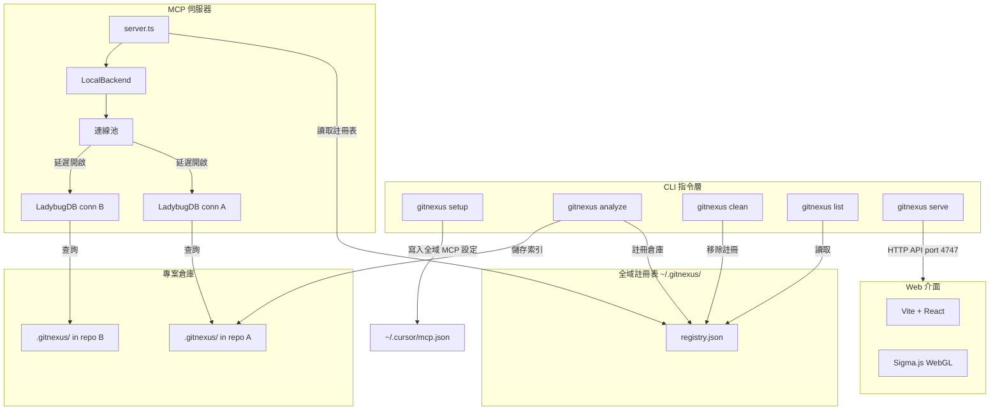
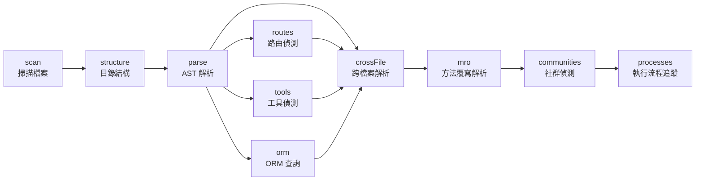
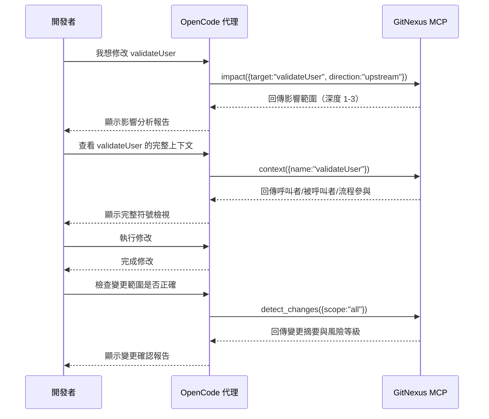
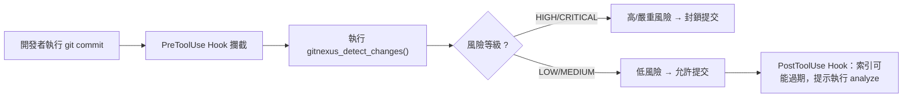

# GitNexus 完整使用指南

> **GitNexus: The Zero-Server Code Intelligence Engine**
>
> GitNexus 是一個用戶端的知識圖譜建立工具，可將任何程式碼倉庫索引為知識圖譜，並透過 MCP（Model Context Protocol）讓 AI 代理工具（如 Claude Code、Cursor、OpenCode 等）獲得深層的程式碼結構理解。

---

## 目錄

1. [架構說明](#1-架構說明)
2. [安裝與環境設定](#2-安裝與環境設定)
3. [與 OpenCode 等工具整合](#3-與-OpenCode-等工具整合)
4. [完整功能與指令參數說明](#4-完整功能與指令參數說明)
5. [MCP 工具與資源](#5-MCP 工具與資源)
6. [完整使用範例](#6-完整使用範例)
7. [常見問題與故障排除](#7-常見問題與故障排除)

---

## 1 架構說明

### 1.1 整體架構



### 1.2 索引管線（Indexing Pipeline）



### 1.3 儲存結構

```
<repo>/.gitnexus/
  ├── lbug           # LadybugDB 圖形資料庫
  ├── lbug.wal       # 寫入前日誌
  ├── lbug.lock      # 單寫入者鎖
  └── meta.json      # lastCommit, indexedAt, stats

~/.gitnexus/
  └── registry.json  # 全域倉庫註冊表（MCP 發現用）
```

### 1.4 技術棧

| 層級 | CLI | Web |
|------|-----|-----|
| **執行環境** | Node.js（原生） | 瀏覽器（WASM） |
| **語法解析** | Tree-sitter 原生綁定 | Tree-sitter WASM |
| **資料庫** | LadybugDB 原生 | LadybugDB WASM |
| **嵌入向量** | HuggingFace transformers.js（GPU/CPU） | transformers.js（WebGPU/WASM） |
| **搜尋** | BM25 + 語義向量 + RRF | BM25 + 語義向量 + RRF |
| **代理介面** | MCP（stdio） | LangChain ReAct agent |
| **視覺化** | — | Sigma.js + Graphology（WebGL） |
| **前端** | — | React 18, TypeScript, Vite, Tailwind v4 |
| **叢集演算法** | Graphology（Leiden） | Graphology（Leiden） |

---

## 2 安裝與環境設定

### 2.1 系統需求

- **Node.js** ≥ 20
- **Git**（analyze 需要 git 倉庫）
- **npm**（隨 Node.js 附帶）

### 2.2 安裝方式

#### 方式一：全域安裝（建議）

```bash
npm install -g gitnexus
```

#### 方式二：使用 npx（免安裝）

```bash
npx gitnexus
```

#### 方式三：從原始碼建置

```bash
git clone https://github.com/abhigyanpatwari/gitnexus.git
cd gitnexus/gitnexus
npm install
npm run build
```

#### 加速安裝（跳過非必要語法解析器）

若不需要 Dart 或 Proto 語言的解析支援，可跳過原生 C++ 編譯：

```bash
GITNEXUS_SKIP_OPTIONAL_GRAMMARS=1 npm install -g gitnexus
```

### 2.3 Docker 部署

```yaml
# docker-compose.yaml
services:
  gitnexus-server:
    image: ghcr.io/abhigyanpatwari/gitnexus:latest
    ports:
      - "4747:4747"
    volumes:
      - gitnexus-data:/data/gitnexus
      - ${WORKSPACE_DIR:-./workspace}:/workspace:ro

  gitnexus-web:
    image: ghcr.io/abhigyanpatwari/gitnexus-web:latest
    ports:
      - "4173:4173"
```

啟動：

```bash
docker compose up -d
```

---

## 3 與 OpenCode 等工具整合

### 3.1 編輯器支援總覽

| 編輯器 | MCP | Skills | Hooks（自動擴充） | 支援程度 |
|--------|-----|--------|-------------------|----------|
| **Claude Code** | ✅ | ✅ | ✅ PreToolUse + PostToolUse | **完整** |
| **Cursor** | ✅ | ✅ | ✅ postToolUse（需手動安裝） | **完整** |
| **Codex** | ✅ | ✅ | — | MCP + Skills |
| **Windsurf** | ✅ | — | — | MCP |
| **OpenCode** | ✅ | ✅ | — | MCP + Skills |

### 3.2 與 OpenCode 整合

#### 設定 MCP

編輯 `~/.config/opencode/config.json`，加入 GitNexus 的 MCP 設定：

```json
{
  "mcp": {
    "gitnexus": {
      "type": "local",
      "command": ["gitnexus", "mcp"]
    }
  }
}
```

若尚未全域安裝 gitnexus，可使用 npx：

```json
{
  "mcp": {
    "gitnexus": {
      "type": "local",
      "command": ["npx", "-y", "gitnexus@latest", "mcp"]
    }
  }
}
```

#### 代理工具 Skills 設定

GitNexus 會自動安裝 4 個代理技能到 `.claude/skills/gitnexus/`。OpenCode 支援讀取這些技能檔案，讓代理在特定任務中自動取得最佳工具使用方式：

- **Exploring**（探索）— 使用知識圖譜導航不熟悉的程式碼
- **Debugging**（除錯）— 透過呼叫鏈追蹤錯誤
- **Impact Analysis**（影響分析）— 變更前分析影響範圍
- **Refactoring**（重構）— 使用依賴對映規劃安全重構

### 3.3 與 Claude Code 整合

```bash
# macOS / Linux
claude mcp add gitnexus -- npx -y gitnexus@latest mcp

# Windows
claude mcp add gitnexus -- cmd /c npx -y gitnexus@latest mcp
```

### 3.4 與 Cursor 整合

編輯 `~/.cursor/mcp.json`（全域設定）：

```json
{
  "mcpServers": {
    "gitnexus": {
      "command": "npx",
      "args": ["-y", "gitnexus@latest", "mcp"]
    }
  }
}
```

### 3.5 與 Codex 整合

編輯 `~/.codex/config.toml`（系統層級）或 `.codex/config.toml`（專案層級）：

```toml
[mcp_servers.gitnexus]
command = "npx"
args = ["-y", "gitnexus@latest", "mcp"]
```

### 3.6 自動設定（懶人包）

```bash
gitnexus setup
```

此指令會自動偵測已安裝的編輯器並寫入對應的 MCP 設定，只需執行一次。

---

## 4 完整功能與指令參數說明

### 4.1 CLI 指令一覽

```bash
gitnexus setup                   # 設定 MCP（一次性）
gitnexus analyze [path]          # 索引倉庫（或更新過期索引）
gitnexus analyze --force         # 強制完整重新索引
gitnexus analyze --skills        # 產生倉庫特定技能檔案
gitnexus analyze --skip-embeddings   # 跳過嵌入向量產生（較快）
gitnexus analyze --skip-agents-md    # 保留自訂 AGENTS.md/CLAUDE.md
gitnexus analyze --skip-git         # 索引非 Git 資料夾
gitnexus analyze --embeddings    # 啟用嵌入向量產生（較慢，搜尋更準確）
gitnexus analyze --verbose       # 記錄解析器無法處理的檔案
gitnexus analyze --worker-timeout 60  # 增加 worker 逾時時間
gitnexus mcp                     # 啟動 MCP 伺服器（stdio）
gitnexus serve                   # 啟動本機 HTTP 伺服器
gitnexus list                    # 列出所有已索引倉庫
gitnexus status                  # 顯示目前倉庫的索引狀態
gitnexus clean                   # 刪除目前倉庫的索引
gitnexus clean --all --force     # 刪除所有索引（跳過確認）
gitnexus wiki [path]             # 從知識圖譜產生倉庫 Wiki
gitnexus wiki --model <model>    # 使用自訂 LLM 模型
gitnexus wiki --base-url <url>   # 使用自訂 LLM API 位址
gitnexus publish                 # 通知 understand-quickly 註冊表
```

### 4.2 倉庫群組指令（多倉庫/微服務）

```bash
gitnexus group create <name>                                # 建立倉庫群組
gitnexus group add <group> <groupPath> <registryName>       # 加入倉庫到群組
gitnexus group remove <group> <groupPath>                   # 從群組移除倉庫
gitnexus group list [name]                                  # 列出群組或檢視群組設定
gitnexus group sync <name>                                  # 提取契約並跨服務比對
gitnexus group contracts <name>                             # 檢視提取的契約與跨連結
gitnexus group query <name> <q>                             # 跨群組搜尋執行流程
gitnexus group status <name>                                # 檢查群組中倉庫的過期狀態
```

### 4.3 完整選項說明

#### `gitnexus analyze`

| 選項 | 類型 | 說明 |
|------|------|------|
| `[path]` | 字串 | 要索引的倉庫路徑（預設為目前目錄） |
| `--force` | 布林 | 跳過快取檢查，強制完整重新索引 |
| `--skills` | 布林 | 啟用社群偵測並產生倉庫特定技能檔案 |
| `--skip-embeddings` | 布林 | 跳過嵌入向量產生（加快索引速度） |
| `--skip-agents-md` | 布林 | 保留 `AGENTS.md`/`CLAUDE.md` 中的自訂內容 |
| `--skip-git` | 布林 | 索引非 Git 管理的資料夾 |
| `--embeddings` | 布林 | 啟用嵌入向量產生（提升搜尋品質） |
| `--verbose` | 布林 | 顯示跳過檔案的詳細日誌 |
| `--worker-timeout` | 數字 | Worker 閒置逾時秒數（預設 30） |

#### `gitnexus group add`

| 參數 | 說明 |
|------|------|
| `<group>` | 群組名稱 |
| `<groupPath>` | 層級路徑（如 `hr/hiring/backend`） |
| `<registryName>` | 來自 `gitnexus list` 的倉庫名稱 |

#### 環境變數

| 變數 | 說明 |
|------|------|
| `GITNEXUS_SKIP_OPTIONAL_GRAMMARS=1` | 跳過 Dart/Proto 語法解析器建置 |
| `GITNEXUS_WORKER_SUB_BATCH_TIMEOUT_MS` | Worker 子批次逾時毫秒數 |
| `GITNEXUS_WORKER_SUB_BATCH_MAX_BYTES` | Worker 子批次最大位元組數 |
| `UNDERSTAND_QUICKLY_TOKEN` | understand-quickly 註冊表用的 GitHub PAT |

---

## 5 MCP 工具與資源

### 5.1 MCP 工具

GitNexus 透過 MCP 暴露 **16 個工具**（11 個一般 + 5 個群組）：

| 工具 | 功能 | `repo` 參數 |
|------|------|-------------|
| `list_repos` | 列出所有已索引倉庫 | — |
| `query` | 混合搜尋（BM25 + 語義 + RRF） | 可選 |
| `context` | 360 度符號檢視 | 可選 |
| `impact` | 爆炸半徑分析（深度分組 + 信心度） | 可選 |
| `detect_changes` | Git diff 影響分析 | 可選 |
| `rename` | 多檔案協調重新命名 | 可選 |
| `cypher` | 原始 Cypher 圖查詢 | 可選 |
| `api_impact` | API 路由處理器的變更前影響報告 | 可選 |
| `route_map` | API 路由 → 處理器 → 消費者對映 | 可選 |
| `tool_map` | MCP/RPC 工具定義與處理器 | 可選 |
| `shape_check` | 回應形狀 vs 消費者屬性存取比對 | 可選 |
| `group_list` | 列出設定的倉庫群組 | — |
| `group_sync` | 提取契約並跨服務比對 | — |
| `group_contracts` | 檢視提取的契約與跨連結 | — |
| `group_query` | 跨群組搜尋執行流程 | — |
| `group_status` | 檢查群組中倉庫的過期狀態 | — |

> 當只索引一個倉庫時，`repo` 參數為可選。多個倉庫時需指定：`query({query: "auth", repo: "my-app"})`。

### 5.2 MCP 資源（Resources）

| 資源 URI | 用途 |
|----------|------|
| `gitnexus://repos` | 列出所有已索引倉庫（優先讀取） |
| `gitnexus://repo/{name}/context` | 程式碼統計、過期檢查、可用工具 |
| `gitnexus://repo/{name}/clusters` | 所有功能叢集與凝聚分數 |
| `gitnexus://repo/{name}/cluster/{name}` | 叢集成員與詳細資訊 |
| `gitnexus://repo/{name}/processes` | 所有執行流程 |
| `gitnexus://repo/{name}/process/{name}` | 完整流程追蹤與步驟 |
| `gitnexus://repo/{name}/schema` | 圖表綱要用於 Cypher 查詢 |

### 5.3 MCP 提示（Prompts）

| 提示 | 功能 |
|------|------|
| `detect_impact` | 提交前變更分析 — 範圍、受影響流程、風險等級 |
| `generate_map` | 從知識圖譜產生含 mermaid 圖表的架構文件 |

### 5.4 群組模式資源

| 資源 URI | 用途 |
|----------|------|
| `gitnexus://group/{name}/contracts` | 契約註冊表（提供者/消費者行 + 跨連結） |
| `gitnexus://group/{name}/status` | 各成員索引 + 契約註冊表過期狀態 |

### 5.5 工具使用範例

#### 影響分析（Impact Analysis）

```json
{
  "target": "UserService",
  "direction": "upstream",
  "minConfidence": 0.8
}
```

回應範例：

```
TARGET: Class UserService (src/services/user.ts)

UPSTREAM（誰依賴此項目）:
  Depth 1（WILL BREAK）:
    handleLogin [CALLS 90%] -> src/api/auth.ts:45
    UserController [CALLS 85%] -> src/controllers/user.ts:12
  Depth 2（LIKELY AFFECTED）:
    authRouter [IMPORTS] -> src/routes/auth.ts
```

#### 流程分組搜尋（Process-Grouped Search）

```json
{
  "query": "authentication middleware"
}
```

回應包含流程摘要、流程中的符號、以及符號定義等結構化資訊。

#### 360 度符號檢視（Context）

```json
{
  "name": "validateUser"
}
```

回應包含符號資訊、傳入參考（誰呼叫、誰匯入）、傳出參考（呼叫誰）、以及參與的流程。

---

## 6 完整使用範例

### 6.1 情境：從零開始為一個新專案設定 GitNexus

#### 步驟 1：安裝 GitNexus

```bash
npm install -g gitnexus
```

#### 步驟 2：進入專案目錄並建立索引

```bash
cd /path/to/my-project
gitnexus analyze
```

此指令會：
1. 掃描目錄結構
2. 使用 Tree-sitter 解析所有支援語言的 AST
3. 解析跨檔案匯入、函式呼叫、類別繼承
4. 執行社群偵測（Leiden 演算法）找出功能區域
5. 追蹤執行流程
6. 建立 BM25 全文檢索索引
7. 將所有資料存入 `.gitnexus/` 目錄
8. 將倉庫註冊到 `~/.gitnexus/registry.json`
9. 自動產生 `AGENTS.md` 和 `CLAUDE.md` 內容檔案
10. 安裝代理技能（Skills）

#### 步驟 3：設定 OpenCode 整合

編輯 `~/.config/opencode/config.json`：

```json
{
  "mcp": {
    "gitnexus": {
      "type": "local",
      "command": ["gitnexus", "mcp"]
    }
  }
}
```

#### 步驟 4：重新啟動 OpenCode

此時 OpenCode 會自動載入 GitNexus MCP，代理即可使用 `query`、`context`、`impact` 等工具。

#### 步驟 5：試用基本查詢

在 OpenCode 中輸入：

> 搜尋專案中有關使用者驗證的程式碼

代理會呼叫 `gitnexus_query({query: "user authentication"})`，並從知識圖譜中取得相關符號、流程和定義。

### 6.2 情境：修改程式碼後更新索引

當你修改了程式碼，需要讓 GitNexus 重新索引以反映最新狀態：

```bash
cd /path/to/my-project
gitnexus analyze
```

GitNexus 會自動比對目前的 `HEAD` 與上次索引時的 `lastCommit`，若不同則增量更新。若要強制完整重建：

```bash
gitnexus analyze --force
```

若同時需要更新嵌入向量（提升語義搜尋品質）：

```bash
gitnexus analyze --embeddings
```

### 6.3 情境：使用 OpenCode 進行影響分析

當你想修改一個函式，但不確定哪些程式碼會受到影響：

1. 在 OpenCode 中提出需求：

   > 我想修改 `validateUser` 函式，請幫我分析影響範圍

2. 代理會自動呼叫：

   ```json
   gitnexus_impact({target: "validateUser", direction: "upstream"})
   ```

3. 代理取得結果後，會回報哪些程式碼「一定會壞掉」（深度 1）、「可能受影響」（深度 2），以及建議的處理方式。

完整工作流程：



### 6.4 情境：重新命名符號

安全地重新命名一個跨多個檔案的函式：

在 OpenCode 中：

> 將 `validateUser` 重新命名為 `verifyUser`，先幫我預覽影響

代理會先呼叫乾執行（dry run）：

```json
gitnexus_rename({symbol_name: "validateUser", new_name: "verifyUser", dry_run: true})
```

確認後再執行實際重新命名：

```json
gitnexus_rename({symbol_name: "validateUser", new_name: "verifyUser", dry_run: false})
```

### 6.5 情境：產生專案 Wiki

```bash
cd /path/to/my-project
gitnexus wiki
```

此指令會：
1. 從知識圖譜讀取索引結構
2. 使用 LLM（需設定 `OPENAI_API_KEY` 等）將檔案分組為模組
3. 產生每個模組的文件頁面
4. 產生總覽頁面
5. 所有頁面包含知識圖譜的交叉參照

可使用自訂模型：

```bash
gitnexus wiki --model gpt-4o
gitnexus wiki --base-url https://api.anthropic.com/v1
```

### 6.6 情境：移除索引

當不再需要某個專案的索引：

```bash
cd /path/to/my-project
gitnexus clean
```

會提示確認，刪除 `.gitnexus/` 目錄並從 `~/.gitnexus/registry.json` 中移除此倉庫。

若要清除所有索引：

```bash
gitnexus clean --all --force
```

### 6.7 情境：專案路徑變更後的處理

當你將專案目錄移動到新位置（例如從 `~/old-path/my-project` 搬到 `~/new-path/my-project`）：

#### 方法一：重新索引（建議）

```bash
cd /new-path/my-project
gitnexus analyze --force
```

這會在全新位置建立索引，並自動更新 `~/.gitnexus/registry.json` 中的路徑。

#### 方法二：先清除舊索引再重新索引

```bash
# 先到舊路徑清除
cd /old-path/my-project
gitnexus clean

# 再到新路徑重新索引
cd /new-path/my-project
gitnexus analyze
```

### 6.8 情境：搭配 Docker 使用 GitNexus

```bash
# 設定工作區目錄
export WORKSPACE_DIR=/home/user/projects

# 啟動 Docker 環境
docker compose up -d

# 在容器中索引倉庫
docker compose exec gitnexus-server gitnexus index /workspace/my-repo

# 開啟瀏覽器連線到 Web UI
# http://localhost:4173
```

### 6.9 情境：倉庫群組與微服務追蹤

#### 建立群組

```bash
# 假設你已經索引了三個微服務倉庫
gitnexus list
# 輸出：user-service, order-service, payment-service

# 建立群組
gitnexus group create ecommerce

# 加入微服務
gitnexus group add ecommerce hr/hiring/user-service user-service
gitnexus group add ecommerce hr/hiring/order-service order-service
gitnexus group add ecommerce hr/hiring/payment-service payment-service

# 同步契約（跨服務比對）
gitnexus group sync ecommerce

# 跨服務搜尋
gitnexus group query ecommerce "checkout flow"
```

#### 跨服務影響分析

在 OpenCode 中，群組模式可讓代理跨多個倉庫進行影響分析：

```json
gitnexus_impact({
  repo: "@ecommerce",
  target: "processPayment",
  direction: "upstream"
})
```

這會在使用者服務中執行區域分析，並透過契約橋接（Contract Bridge）擴散到其他服務。

### 6.10 情境：提交前自動檢查

GitNexus 提供了 `detect_changes` 工具，可在提交前驗證變更範圍：

在 OpenCode 中：

> 幫我檢查即將提交的變更，確認影響範圍是否如預期

代理會呼叫：

```json
gitnexus_detect_changes({scope: "staged"})
```

Claude Code 的 **PreToolUse hooks** 甚至可以自動攔截 `git commit` 指令，強制先執行測試和影響分析：



---

## 7 常見問題與故障排除

### 7.1 索引過期（Stale Index）

**症狀**：MCP 工具警告索引落後於 `HEAD`

**解決方法**：

```bash
gitnexus analyze
```

### 7.2 MCP 沒有已索引的倉庫

**症狀**：啟動 MCP 時顯示 `"GitNexus: No indexed repos yet"`

**解決方法**：在每個需要索引的專案中執行：

```bash
cd /path/to/repo
gitnexus analyze
```

然後重啟編輯器的 MCP 連線。

### 7.3 多個倉庫時工具操作到錯誤的倉庫

**解決方法**：在所有工具呼叫中明確指定 `repo` 參數，或先使用 `list_repos` 確認。

### 7.4 LadybugDB 鎖定錯誤

**症狀**：執行 analyze 時出現資料庫鎖定錯誤

**原因**：一個倉庫的 `.gitnexus/lbug` 同時只能被一個程序開啟

**解決方法**：關閉其他使用 GitNexus 的程序（如編輯器的 MCP 伺服器），然後重試。

### 7.5 大型倉庫記憶體不足

**解決方法**：

1. 關閉其他應用程式釋放記憶體
2. 第一次索引時避免使用 `--embeddings`
3. 指定較小的子路徑進行索引

### 7.6 Worker 解析逾時

**症狀**：`analyze` 報告 worker parse timeout

**解決方法**：

```bash
gitnexus analyze --worker-timeout 60
```

或設定環境變數：

```bash
export GITNEXUS_WORKER_SUB_BATCH_TIMEOUT_MS=60000
```

### 7.7 支援的語言

| 語言 | 匯入 | 命名綁定 | 匯出 | 繼承 | 型別註記 | 建構式推論 | 設定檔 | 框架 | 進入點 |
|------|------|----------|------|------|----------|------------|--------|------|--------|
| TypeScript | ✅ | ✅ | ✅ | ✅ | ✅ | ✅ | ✅ | ✅ | ✅ |
| JavaScript | ✅ | ✅ | ✅ | ✅ | — | ✅ | ✅ | ✅ | ✅ |
| Python | ✅ | ✅ | ✅ | ✅ | ✅ | ✅ | ✅ | ✅ | ✅ |
| Java | ✅ | ✅ | ✅ | ✅ | ✅ | ✅ | — | ✅ | ✅ |
| Kotlin | ✅ | ✅ | ✅ | ✅ | ✅ | ✅ | — | ✅ | ✅ |
| C# | ✅ | ✅ | ✅ | ✅ | ✅ | ✅ | ✅ | ✅ | ✅ |
| Go | ✅ | — | ✅ | ✅ | ✅ | ✅ | ✅ | ✅ | ✅ |
| Rust | ✅ | ✅ | ✅ | ✅ | ✅ | ✅ | — | ✅ | ✅ |
| PHP | ✅ | ✅ | ✅ | — | ✅ | ✅ | ✅ | ✅ | ✅ |
| Ruby | ✅ | — | ✅ | ✅ | — | ✅ | — | ✅ | ✅ |
| Swift | — | — | ✅ | ✅ | ✅ | ✅ | ✅ | ✅ | ✅ |
| C | — | — | ✅ | — | ✅ | ✅ | — | ✅ | ✅ |
| C++ | — | — | ✅ | ✅ | ✅ | ✅ | — | ✅ | ✅ |
| Dart | ✅ | — | ✅ | ✅ | ✅ | ✅ | — | ✅ | ✅ |

---

> **參考資源**
>
> - 官方 GitHub：[https://github.com/abhigyanpatwari/GitNexus](https://github.com/abhigyanpatwari/GitNexus)
> - Web UI：[https://gitnexus.vercel.app](https://gitnexus.vercel.app)
> - Discord：[https://discord.gg/MgJrmsqr62](https://discord.gg/MgJrmsqr62)
> - 授權：PolyForm Noncommercial 1.0.0
