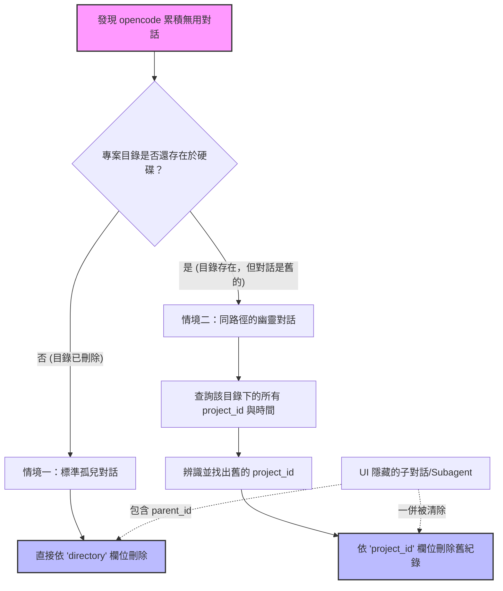

## 📝 問題背景

在使用 `opencode` 時，所有的對話（Sessions）紀錄都是 **全域儲存** 在底層的 SQLite 資料庫中。這會導致以下幾個常見痛點：

1. **孤兒對話：** 當你在硬碟上刪除了一個專案目錄，該目錄下的 `opencode` 對話並不會自動刪除，默默佔用空間。
    
2. **隱藏子對話 (Subagents)：** 像 `@explore` 這種 Agent 產生的對話，在 UI 列表 (`ctrl+x l`) 中會被隱藏，但依然存在於資料庫中。
    
3. **同路徑的幽靈對話：** 若你刪除某個目錄後，又在**相同的路徑**建立同名目錄，舊的對話在 UI 上會消失，但資料庫裡卻混雜了新舊兩代專案的紀錄。
    

本指南將教你如何透過 Linux 原生的 `sqlite3` 工具，精準找出並消滅這些無用對話。

## 🗺️ 清理決策流程圖




## 🛠️ 事前準備：安裝與定位

`opencode` 的資料庫預設存放路徑為：`~/.local/share/opencode/opencode.db`。

請確保你的系統已安裝 `sqlite3` 工具（Ubuntu 環境下可使用 `sudo apt install sqlite3` 安裝）。

## 🚀 實戰清理方案

### 情境一：目錄已經完全刪除（清理標準孤兒對話）

如果你確定某個專案目錄已經從硬碟上移除了，你可以直接針對該路徑進行刪除。這個操作會連同那些在 UI 上看不見的子對話（Subagents）一起拔除。

**1. 查詢所有曾建立過對話的目錄：**

```bash
sqlite3 ~/.local/share/opencode/opencode.db "SELECT DISTINCT directory FROM session;"
```

**2. 刪除特定已刪除目錄下的所有對話：**

_(請將路徑替換為你實際要刪除的目錄)_

```bash
sqlite3 ~/.local/share/opencode/opencode.db "DELETE FROM session WHERE directory = '/你的/舊目錄/路徑';"
```

**💡 全自動清理腳本 (Bash):**

如果你想自動比對資料庫與硬碟，把「硬碟上已經不存在的目錄」相關對話一次清空，可執行以下腳本：

```bash
sqlite3 ~/.local/share/opencode/opencode.db "SELECT DISTINCT directory FROM session;" | while read -r dir; do
  if [ ! -d "$dir" ]; then
    echo "發現已刪除目錄，正在清理相關對話: $dir"
    sqlite3 ~/.local/share/opencode/opencode.db "DELETE FROM session WHERE directory = '$dir';"
  fi
done
```

### 情境二：目錄仍存在，但混雜了上一代專案的對話（清理幽靈對話）

當你刪除了目錄又在原地重建時，路徑（`directory`）一樣，但專案 ID（`project_id`）已經不同了。我們必須透過「時間」和「Project ID」來進行精準打擊。

**1. 依時間序列印出該目錄下的所有對話與 Project ID：**

```bash
sqlite3 ~/.local/share/opencode/opencode.db "
SELECT 
  id, 
  project_id, 
  datetime(time_updated/1000, 'unixepoch', 'localtime') AS time, 
  title 
FROM session 
WHERE directory = '/你的/現存目錄/路徑' 
ORDER BY time_updated DESC;"
```

_觀察輸出結果：你會發現清單被切成兩截。時間較舊、且屬於另一個 `project_id` 的，就是上一代遺留的幽靈對話。_

**2. 殺掉舊的專案生命週期 (Project ID)：**

_(請將 `proj_old12345` 替換為你在上一步查到的舊 Project ID)_

```bash
sqlite3 ~/.local/share/opencode/opencode.db "DELETE FROM session WHERE project_id = 'proj_old12345';"
```

這樣就能完美清除舊專案的殘留，且絕對不會誤傷你現在正在進行的新對話。

### 進階查詢：揪出全系統的隱藏子對話 (Subagents)

如果你想知道系統裡到底藏了多少像是 `@explore` 這類在 UI 上看不見的子對話（它們的特徵是 `parent_id` 欄位有值）：

```bash
sqlite3 ~/.local/share/opencode/opencode.db "SELECT id, title, directory FROM session WHERE parent_id IS NOT NULL;"
```

_(註：只要透過上述的情境一或情境二進行刪除，這些子對話都會因為符合 `directory` 或 `project_id` 的條件而被一併乾淨清除，通常不需要獨立針對 `parent_id` 刪除。)_

**⚠️ 警告：** 直接操作 SQLite 資料庫具有破壞性，若擔心誤刪重要對話，建議在操作前先備份資料庫檔案：`cp ~/.local/share/opencode/opencode.db ~/.local/share/opencode/opencode.db.bak`