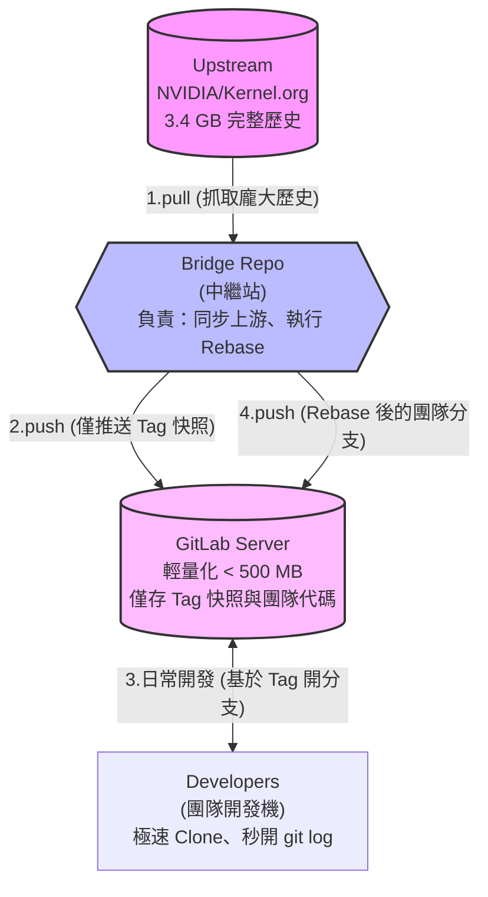
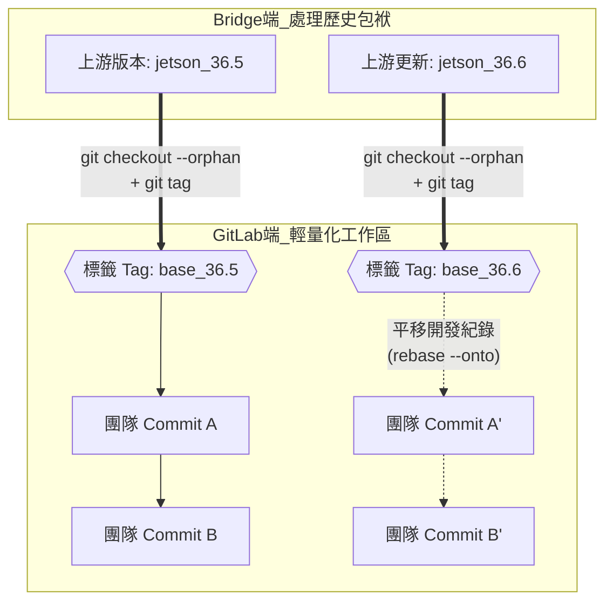

# Linux Kernel 輕量化架構：基於 Tag 的 Vendor Drop (快照切割) 模式

為解決 GitLab 伺服器禁止 `shallow push` 且完整 Kernel 歷史過度龐大 (> 3.4 GB) 的問題，本方案採用 **Vendor Drop** 模式，並使用 **Tag (標籤)** 取代 Branch 來標記快照基底。

Tag 具備**不可變 (Immutable)** 的特性，能確保「測量基準點」不會因為團隊的誤操作 (如錯誤的 commit 或 merge) 而發生漂移，從而保障未來升級時 `git rebase --onto` 的絕對穩定性。

## 1. 系統架構與流程圖




### 版本升級與 Rebase 邏輯




## 2. 實作步驟與指令詳解

### 階段一：建立輕量快照並打上 Tag (在 Bridge 端操作)

此階段的目標是將龐大的上游代碼剝離歷史，轉換為一個乾淨的 Tag 基準點推送到 GitLab。

```bash
# 1. 僅抓取需要的單一上游分支，減少不必要的下載
git clone --single-branch --branch jetson_36.5 <NVIDIA_KERNEL_URL> linux-bridge
cd linux-bridge

# 2. 建立孤立分支 (清除所有歷史)
git checkout --orphan temp_base_36.5

# 3. 提交當前狀態為創世 Commit
git commit -m "Vendor Drop: NVIDIA Jetson 36.5 Base Snapshot"

# 4. 建立唯讀標籤 (Tag)
git tag base_36.5

# 5. 加入 GitLab 遠端並只推送該標籤
git remote add gitlab git@192.168.13.62:nvidia_bsp/linux-jammy.git
git push gitlab base_36.5
```

**指令原理解析：**

- `git clone --single-branch`: 避免下載其他架構或其他版本的歷史，將下載量從完整的 5GB+ 縮減至該分支所需的 3.4GB。
    
- `git checkout --orphan <暫存分支名>`: 這是核心魔法。它會建立一個全新的分支，**保留工作目錄中所有的實體檔案，但清空所有的 Git Commit 歷史**。這個分支的第一個 Commit 將成為一個沒有父節點的「根節點 (Root Commit)」。
    
- `git tag <標籤名>`: 在剛剛建立的無歷史 Commit 上貼上一個固定的標籤。這確保了這個節點未來不會被意外修改。
    
- `git push gitlab base_36.5`: 我們**不推送**任何 Branch，只推送這個 Tag。GitLab 伺服器只會接收到這單一個 Commit 的檔案內容，佔用空間極小。
    

### 階段二：團隊日常開發流程 (在 Developer 開發機操作)

團隊成員不需要面對龐大的 Bridge，直接從輕量的 GitLab 進行開發。

```bash
# 1. 從 GitLab Clone 輕量專案 (速度極快)
git clone git@192.168.13.62:nvidia_bsp/linux-jammy.git
cd linux-jammy

# 2. 基於基準點 Tag 建立自己的開發分支
git checkout -b feature-driver base_36.5

# 3. 日常開發與推送
git add .
git commit -m "Add new audio driver for custom board"
git push -u origin feature-driver
```

**指令原理解析：**

- `git checkout -b <新分支名> <Tag名稱>`: Git 允許直接從任何一個 Tag 切割出新的 Branch。這確保了團隊的所有開發紀錄，都是穩穩地建立在 `base_36.5` 這個快照起點之上。
    

### 階段三：未來上游更新時的 Rebase 平移 (在 Bridge 端操作)

當 NVIDIA 釋出新版本 (例如 `jetson_36.6`)，需要將團隊的代碼遷移至新版本時執行。

```bash
# 1. 在 Bridge 端抓取上游的新版本
git fetch origin jetson_36.6

# 2. 基於新版本建立新的孤立分支與創世 Commit
git checkout --orphan temp_base_36.6 origin/jetson_36.6
git commit -m "Vendor Drop: NVIDIA Jetson 36.6 Base Snapshot"

# 3. 建立新版本的 Tag 並推送到 GitLab
git tag base_36.6
git push gitlab base_36.6

# 4. 同步 GitLab 上團隊最新的開發進度
git fetch gitlab

# 5. 執行強行嫁接 (平移代碼)
git rebase --onto base_36.6 base_36.5 gitlab/feature-driver

# 6. 強制更新 GitLab 上的團隊分支
git push gitlab HEAD:feature-driver -f
```

**指令原理解析：**

- `git checkout --orphan <暫存分支> <起點>`: 直接以上游最新的 `origin/jetson_36.6` 狀態為起點，建立一個沒有歷史的全新快照。
    
- `git rebase --onto <新Tag> <舊Tag> <目標分支>`: 這是整個架構的靈魂指令。
    
    - **參數 1 (`base_36.6`) - 目的地：** 告訴 Git，重新生成的 Commit 最終要降落並連接在哪個節點上。
        
    - **參數 2 (`base_36.5`) - 切割線/舊基底：** 告訴 Git，去比較 `<目標分支>` 和 `<舊Tag>`。在這兩個點之間「多出來的」Commit，就是團隊自己寫的心血。
        
    - **參數 3 (`gitlab/feature-driver`) - 操作對象：** 指定要被搬移的團隊分支。
        
    - **整體運作：** Git 會把 `base_36.5` 到 `feature-driver` 之間的團隊 Commit 複製下來，然後像蓋積木一樣，一個一個疊加到 `base_36.6` 之上。
        
- `git push gitlab HEAD:feature-driver -f`: 因為 rebase 改變了 Commit Hash，必須使用 `-f` (force) 覆寫 GitLab 上的舊分支。使用 `HEAD:feature-driver` 是為了確保將當前 rebase 完成的狀態，準確推送到遠端的該分支上。

### 補充：如何`git log` 速度？

Kernel 的 `git log` 會卡，通常是因為 Git 每次都在動態遍歷龐大的 Commit Graph。請在你的本地 Repository 執行以下指令：

```bash
# 1. 執行完整的垃圾回收與物件打包 (這會花一點時間，但能壓縮體積)
git gc --prune=now --aggressive

# 2. 建立 Commit 圖形快取 (關鍵！)
# 這會預先計算好 commit 的祖宗八代關係，讓 git log 速度提升 10 倍以上
git commit-graph write --reachable
```

執行完這兩行後，你再敲一次 `git log`，速度應該會有肉眼可見的巨大改善。